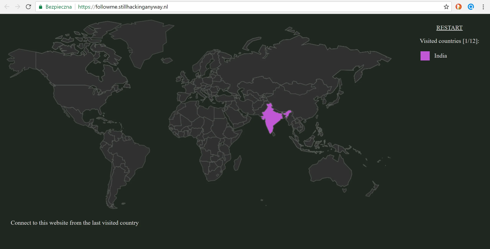
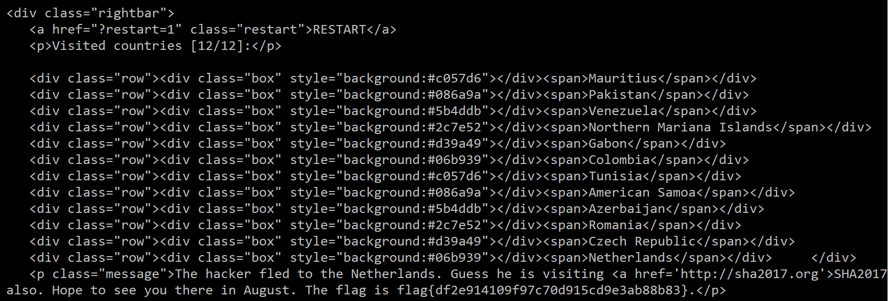

# SHA2017 Teaser

On last Saturday there was a SHA2017 teaser and here are some tasks solutions.

I'll skip the 'Are you safe?' task as it was a simple provide a domain with SSL certificate that would score A/A+ on [SSL Labs](https://www.ssllabs.com/ssltest/)!

### Follow Me (Web 100)

The task has simple instruction.

> We are tracking a hacker, can you help us track the hacker down and bring him to justice?

And we are taken to the page where we see a World Map and an instruction to:

> Connect to this website from the last visited country

There's also a counter that informs us that probably we will need to do it 12 times.

Ok, probably we don't need to use actual proxies so how can we spoof that we are in a different country that we actually are? Let's see the list of standard HTTP headers - maybe something will pop-up.

Wikipedia gives us the [list](https://en.wikipedia.org/wiki/List_of_HTTP_header_fields) and if we search for `IP address` it looks like `X-Forwarded-For` header might be what we need. Let's give it a quick try with curl

`C:\tools\curl\bin>curl -v https://followme.stillhackinganyway.nl/ -c cookies`

with storing the cookies and we check the Country that is displayed in the source. Now let's try to spoof our IP address.

Next curl command:

`C:\tools\curl\bin>curl -v <https://followme.stillhackinganyway.nl/> -b cookies -H "X-Forwarded-For: 5.30.0.0"

and in the result we see this:
`United Arab Emirates Seychelles You just missed the hacker, he moved to: sc`

We've jumped to the second country. During the CTF I've took and approach to convert Country name to IP address and for the first attempt I've tried [ip2location.com](https://lite.ip2location.com/). I has nice URL that I could create easily by reading the country from the source. But with some checking it turned out that the IPs were detected as wrong so I've needed another IP db.

I've found one at <http://www.nirsoft.net/>. I've missed the info on the page that I ve the two-letter code of the country and I've took a longer approach by finding the link to the page by Country name and then accessing it to find IP.

The code is ugly and error-prone but it worked during the game. And "whatever works, works".

[View Gist](https://gist.github.com/pawlos/faee704642cc4dab4de06fb110144359)

After few tries it produces the correct path:

