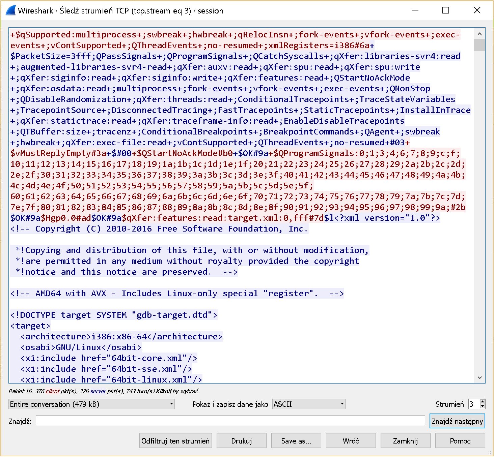

# GynvaelEN - Mission 13 - Solution

> “Never stop dreaming,
>  never stop believing,
>  never give up,
>  never stop trying, and
>  never stop learning.”
>  ― Roy T. Bennett, The Light in the Heart

Boy, that was a hard one but also very challenging task.

In this [mission](http://goo.gl/yEBeVh) we're given a [PCAP file](goo.gl/JSyinL) and an information that we've intercepted a remote GDB session.

When I saw that info I've immediately got a flashback from the [Pwnium CTF](https://github.com/ctfs/write-ups-2014/tree/master/pwnium-ctf-2014/remote-kg) where a similar task was given. I've even [started](https://github.com/pawlos/gdb-remote-protocol) writing a parser for that but probably due to lack of time haven't finished much.

So we've got a PCAP file but what's next? The obvious of course is to extract the data. The nice thing here is that we can do the 'Follow TCP stream' in [Wireshark](https://www.wireshark.org) and we will get the whole GDB remote session data.

So we save that data to a file and we can exchange Wireshark to python.

If you don't know (or were not aware about) GDB remote protocol just check the [docs](https://sourceware.org/gdb/onlinedocs/gdb/Remote-Protocol.html). For the start it's good to read [Overview](https://sourceware.org/gdb/onlinedocs/gdb/Overview.html#Overview) & [Packets](https://sourceware.org/gdb/onlinedocs/gdb/Packets.html#Packets) sections. The most important lesson is that it's a textual protocol where packets are generally divided with `$`. Also an important info is that data can be RLE encoded.

We can start writing the parser[1]. My gut feeling told me that we should focus on `m` command - `reading memory` so I've focused on that but in fact we needed a bit more that that.

After spending like 2h on writing the parser I've got something more or less working (don't judge the code - it's crappy I know). What we get from running it is a log that could be more or less analyzed by a human.

Reading it reveals some interesting data. We can see maps (there's a read operation on `/proc/<pid>/maps`), data reads with the actual data content (dumping the memory) and some paths (part of the environment variables) and much more.
[code]
    File: open: /proc/5979/maps ,0,0#ed
    Unk: F7
    ÷
    File: vFile:pread:7,3fff,0#9a
    Unk: F364;555555554000-555555555000 r-xp 00000000 00:2a 5868                       /media/sf_B_DRIVE/stream-livecoding/missions/mission013_files/a.out
    555555754000-555555756000 rw-p 00000000 00:2a 5868                       /media/sf_B_DRIVE/stream-livecoding/missions/mission013_files/a.out
    7ffff7dd7000-7ffff7dfc000 r-xp 00000000 08:01 14942250                   /lib/x86_64-linux-gnu/ld-2.24.so
    7ffff7ff8000-7ffff7ffa000 r--p 00000000 00:00 0                          [vvar]
    7ffff7ffa000-7ffff7ffc000 r-xp 00000000 00:00 0                          [vdso]
    7ffff7ffc000-7ffff7ffe000 rw-p 00025000 08:01 14942250                   /lib/x86_64-linux-gnu/ld-2.24.so
    7ffff7ffe000-7ffff7fff000 rw-p 00000000 00:00 0
    7ffffffde000-7ffffffff000 rw-p 00000000 00:00 0                          [stack]
    ffffffffff600000-ffffffffff601000 r-xp 00000000 00:00 0                  [vsyscall]
[/code]

That was a great source of intel. Our target is probably `a.out` and it was mapped `@0x555555554000`, but in our output we also saw lines like this one.
`Reading memory at: 0x555555554000 of 0x40 bytes` and the returning data even starts with `ELF`. Does it mean that we have the whole binary in the log and we should search for the flag there? Let's add an "extractor" to our script and save the binary data to a file. Next run and we've got a file but running a `file` on it gives us this

`0x555555554000.out: ERROR: ELF 64-bit LSB shared object, x86-64, version 1 (SYSV), dynamically linked, interpreter *empty* error reading (Inappropriate file type or format)`

Error? Hmm. Did we missed something out? Checking the content of the file we see that a lot of data is missing (0s). Some parts of it are present though.

After a bit of more checking the log, it looks there's no more data for our binary. Let's work with what we have.

Before we go further one note here. It looks like it took like minutes to get to the conclusion that we should move to analyze the binary but in fact I think it took around 3h. A lot of extracting data (like libs - yup!) and checking my parser to be sure that there's no issue with extracting the content and/or decoding the strings.

Since I don't own (yet!) IDA Pro and the Free version doesn't allow to analyze 64bit I needed to resort to something else.

Lets try Relyze[2].

Opening the binary in the tool we can specify the Image Base so let's do that.

What we see there only the `0s` encoded as `add byte ptr [rax],al` but Relyze only decompile the code that it can reach and since our binary is not complete it might not decompile it correctly. But checking the binary showed us that there's a lot of non-zero data at the end of the file @ 0x780. Let's go there and see if this is something we can use. Just switch to FLAT and see what's there.

At that offset there's some code but 0x10 bytes father we see only `dup`. Let's press `C` to convert it to code. Magic happened & we get something that looks like some actual code.

Even though we see the code we still miss the imports and parts of the methods. But maybe we can use a bit of deduction.
[code]
     code_0x5555555547E5:
        488D3D31030000       lea rdi, [rip+0x331]
        E83FFEFFFF           call func_0x555555554630; void __unknown func_0x555555554630( void )
        B801000000           mov eax, 0x1
        E971020000           jmp code_0x555555554A6C
[/code]

If we check the `[rip+0x331]` we could actually calculate the right offset. We are at: 0x7ec + 0x331 = 0xb1d(2845). But in our binary we miss that offset. Maybe there's a bit more info elsewhere? Maybe in the GDB log?

If we check carefully we can spot lines like that in there:

> File: open: /media/sf_B_DRIVE/stream-livecoding/missions/mission013_files/a.out ,0,0#23
>  Unk: F7
>  ÷
>  File: vFile:pread:7,3fff,0#9a
>  Unk: F2170;.ELF..........

We can't use the data to reconstruct the file (non-printable characters are represented with `.`) but we can extract some info. If we copy enough data (at least 2854 bytes) to a new file and check the 2854 offset we get... a `NOPE`. So it looks like we pass a string here and then call some function - we can safely assume that function is `printf`. By the same deduction process we can quickly found out where we print `NOPE` in few more places as well as `YUP`. Clearly we are in the right place. We also discovered `scanf`, `strlen` and usage of stack canary.

Analyzing the function a bit more we discover this piece of code:

The part on left looks like encryption and the one on the right something we should end up with after the encryption that we will compare to.

Focusing first on the algo first. It doesn't look complex - on the first look it looks like there are some unused instructions that we could get rid of and if we follow the asm it boils down to this.
[code]
    temp = (c ^ 0x5A + 0x63) & 255 ;byte limit
    v = (temp ^ 0x5A + 0x63) & 255 ;byte limit

[/code]

Okay - we know the algo. Let's try to reverse it on first two chars.
[code]
    v = ((c - 0x63) ^ 0x5a) & 255
    v = ((v - 0x63) ^ 0x5a) & 255

[/code]

Running a quick in python reveals that it might be actually working! We got a `Th`.

Quick & dirty python script reveals that it actually works!
[code]
    import sys
    bytes = [0x8e, 0x32, 0x2f, 0x39, 0xea, 0x2d, 0x27, 0x39, 0xea, 0x27, 0xea, 0x88, 0x25, 0x94, 0x3b, 0x30, 0x39, 0x2f, 0x29, 0x39, 0xea, 0x2e,0x27, 0x39, 0x31,0xea,0x8f, 0xea, 0x5d, 0x2b,0x5b,0x39,0x39,0xf0]

    for c in bytes:
    	v = ((c-0x63) ^ 0x5a) & 255
    	v = ((v-0x63) ^ 0x5a) & 255
    	sys.stdout.write(chr(v))
[/code]

> λ python mission13.py

> This was a FoREnsics task I guess.

Yup. It was. Thanks Gynvael for a great task!

* * *

  1. The parser script is [here](https://gist.github.com/pawlos/e8d963fb05e0041001e319e9e2bf0a31) ↩︎

  2. it took more than 30 minutes to analyze the binary so I even had to buy the full license - talking about dedication to solve the mission ;) ↩︎

