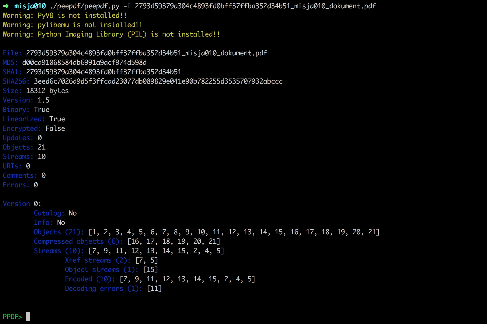
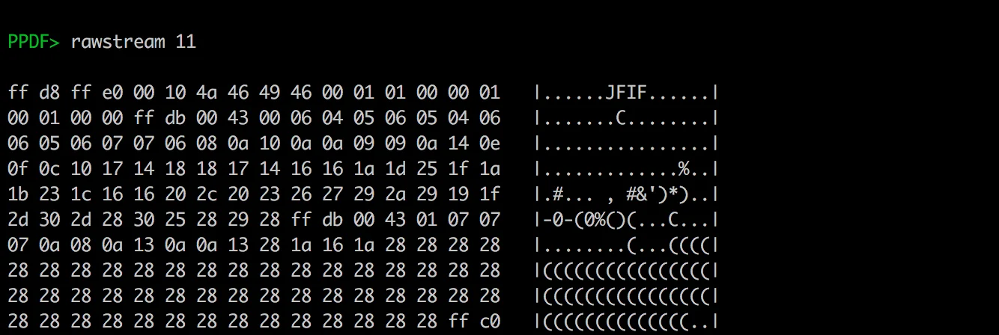

# Gynvael - Mission 010 - Solution

[This mission](http://goo.gl/oAdvWe) is actually published on the [Polish stream](https://www.youtube.com/watch?v=UpGB9Ka6-Ps) but I've decided to write the solution here, in English. So what's this mission is about?

We are given the [PDF file](https://goo.gl/wgt94W) with the instructions to retrieve the hidden message.

If you didn't know it already, PDF is quite an interesting file format and then contain a lot of information.

The approach in such tasks can vary. We could look at the file in some hex editor and spot something but there's a bunch of good tools for PDF reading, and I'm not talking about Adobe Acrobat Reader of Foxit.

What I like to use is [peepdf](https://github.com/jesparza/peepdf) a python based cmd line tool for inspecting PDFs. It can be used in a interactive or non-interactive way so it's good for both manual work with PDFs as well as to be used in scripts.

Ok, we clone the repo and open the file in interactive mode (`-i`).

and we see a lot of information, plus some warning at the top (we will get to those later).

An important concept in PDF files are streams - which are complex beasts so I'll not go into the full details here.
This is where the information(usually), that we see on screen, is kept so let's analyze those. peepdf allows to check streams with two commands:

> stream $stream_id - show the decoded stream
>  rawstream $stream_id - show the raw stream before it was decoded

By going through the streams with the `stream` command we notice that on stream 11. We don't get any data. Let's then use `rawstream` and try to get some insights.

With that we should immediately recognize the JFIF magic value. It's a JPEG file. Let's save it to file by executing the

> rawstream 11 > rawstream_11.jpg

And voilà

The solution thus is "ANGE STYLE SECRET". Which is, I guess, a tribute to [Ange Albertini](https://twitter.com/angealbertini), who does with the files what that kid from the Matrix did with the spoon. I guess for him there's is no file ;)
