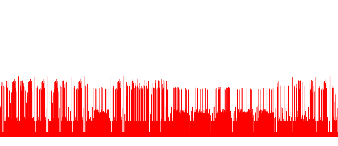
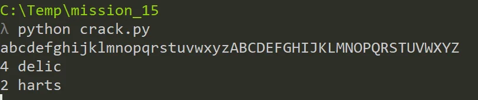

# GynvaelEN - Mission 15 - Solution

Another Wednesday, another mission. This time we've got a vulnerability that allows leaking any via as a image - [link](http://gynvael.vexillium.org/ext/315b8f1b6995d1d67244c04d4da9e5421dfc708a_mission015.txt) :)

So we download the attached image and got this:

The immediate conclusion is that the bars represent chars in the file and the ascii value are represented by the bar height. Let's verify this with a short python script
[code]
    #mission_15.py
    import png

    f = png.Reader("mission_15_leak.png").asDirect()
    sc = open('sc.php',"w")
    width = f[0]
    height = f[1]
    print f[3]
    bytesPerPixel = 3
    for i in range(0, width*bytesPerPixel, bytesPerPixel):
    	for j in range(0,height):
    		r = f[2][j][i]
    		g = f[2][j][i+1]
    		b = f[2][j][i+2]
    		if g != 255:
    			value = 300 - j - 19
    			sc.write(chr(value))
    			print 'OK',chr(value), i/bytesPerPixel,j, r,g,b
    			break

[/code]

What we do hear we get the height of each bar in a very naive approach - but it's enough here. We don't need anything fancy. After running the script we get the mentioned script.
[code]
     'e6d9fe6df8fd2a07ca6636729d4a615a',
      5 => '273e97dc41693b152c71715d099a1049',
      10 => 'bd014fafb6f235929c73a6e9d5f1e458',
      15 => 'ab892a96d92d434432d23429483c0a39',
      20 => 'b56a807858d5948a4e4604c117a62c2d'
    );

    for ($i = 0; $i < 25; $i += 5) {
      if (md5(substr($p, $i, 5)) !== $values[$i]) {
        die("bad password");
      }
    }

    die("GW!");

[/code]

So the password we are looking for is a 25 char that we have a md5 hash for. It would be impossible to find it without helps in the file. In the script we see that there's additional check for every 5 characters in the pass. We can use that. Quick search in google does not result in any hashes found so we are forced to crack them on our own.
Probably here we could write something fancy but the most important part is to select a correct charset.

Our script is like this:
[code]
    #crack
    import string
    import md5

    print string.lowercase+string.uppercase
    r = string.lowercase+string.uppercase

    for i in r:
    	for j in r:
    		for k in r:
    			for l in r:
    				for m in r:
    					digest = md5.new(i+j+k+l+m).digest().encode('hex')

    					if digest =="e6d9fe6df8fd2a07ca6636729d4a615a":
    						print "1", i+j+k+l+m
    					if digest == "273e97dc41693b152c71715d099a1049":
    						print "2", i+j+k+l+m
    					if digest == "bd014fafb6f235929c73a6e9d5f1e458":
    						print "3",  i+j+k+l+m
    					if digest == "ab892a96d92d434432d23429483c0a39":
    						print "4",  i+j+k+l+m
    					if digest == "b56a807858d5948a4e4604c117a62c2d":
    						print "5", i+j+k+l+m

[/code]

My initial approach was to select only lower & upper case letters and I've quickly got some parts of the password but the others were missing.

After running outside the range I was sure that clearly the charset was selected the wrong way. Later I've extended it by whitespace & punctuation - and that was good approach. Running the script again revealed the rest of the pass:

> Pie charts are delicious!
