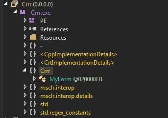
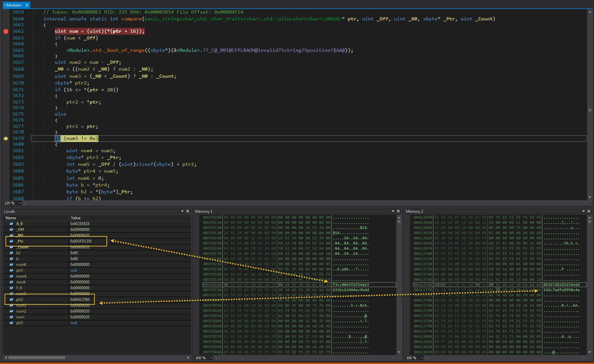

# Reverse engineering of Managed C++/C# CrackMe - solution

A nice question was posted on Reverse Engineering at Stack Exchange and since it was a an interesting one I've decided to give a bit of lengthy description here (apart from my answer [there](https://reverseengineering.stackexchange.com/a/16395/18014)).

The question can be found [here](https://reverseengineering.stackexchange.com/questions/16394/reverse-engineering-of-managed-c-c-crackme) and the OP asks about a bit different things there.

Anyway...

It all started with OP wrongly identifying it as a C# CrackMe. The first look at code like this, and if you had any experience with Managed C++, it was obvious that it was Managed C++. But I was surprised that it could be checked with dnSpy so it got my attention.

After initial investigation from the question & provided screenshots I could not figure out more, but thankfully a binary was provided. Now I can explore.

And in fact it is a Managed C++/.NET solution. The first interesting fact is that was where to look for `Main` it wasn't found in som obvious locations like `Program` class.

But searching for it reveals that namespace `-` is packed with types and one of them, named `<Module>` has our `Main` in it. Methods names that are interested to us where mentioned by the OP so we could focus on them, but my eye was caught by all those other methods that `<Module>` was full of.

# button2_click

If you inspect this method w/o any filtering then I must admit it's horrible.

[View Gist](https://gist.github.com/pawlos/7fcac1b323b596b23081c2a8076eae91)

but if a bit of unmangling is done, it's quite understandable piece of code. Firstly, this `basic_string<char,std::char_traits<char>,std::allocator<char>\u0020>` it's just a C++ way of writing std::string so let's do it manually. Also this `\u0020` is this ' '. So let's changed that too. Now it looks much more readable - all we did is replace. Ok, that's not entirely true - on [line 4](https://gist.github.com/pawlos/6d44cec95ca3d1f5bbf2a3d676128000#file-button2_click_unmangled-cs-L4) I've added a 1 to `string` so the original line was `string string;` and I've changed it to be `string string1;` (also were it was used too).

[View Gist](https://gist.github.com/pawlos/6d44cec95ca3d1f5bbf2a3d676128000)

I did the analysis of this method on the picture, but now you can easily see that copy content from textBoxes into a native memory and continue working on them. This is what makes this a bit more harder then usual .net assemblies.

Even though we can see that on [line 14](https://gist.github.com/pawlos/6d44cec95ca3d1f5bbf2a3d676128000#file-button2_click_unmangled-cs-L14) & [17](https://gist.github.com/pawlos/6d44cec95ca3d1f5bbf2a3d676128000#file-button2_click_unmangled-cs-L17) we check if `string1` contains '@' (64) and '.' (46). So we assume that `string1` contains our entered e-mail - also the name of one of the variables - `email` indicates that this might be the case. The it's moved around few times and we ended up on [line 32](https://gist.github.com/pawlos/6d44cec95ca3d1f5bbf2a3d676128000#file-button2_click_unmangled-cs-L32) were we pass `md` and `email` to the method `Check()`. Let's focus on it now.

# Check

Also here it looks awful but after the same tricks as before it's bearable.

[View Gist](https://gist.github.com/pawlos/2f2dae97566965fcba7845cc0b5af228)

Now it's clear. We generate a string and pass it through MD5 and in the end we compare it with, what we've entered.

As I've mentioned before the difficulty here is that we don't see real value of variable, and we see addresses instead. but is this an issues at all? In the end it has to access the value so even if they are not visible at first we will get to them eventually - for example when we compare the results on [line 71](https://gist.github.com/pawlos/2f2dae97566965fcba7845cc0b5af228#file-check-cs-L71). If we get into that method we can easily spot values:

It was obvious that they have to be somewhere in the memory, maybe it was a bit hard to get to them as I had to press CTRL+G on the Memory window and type the address but nonetheless it was doable.

The other thing is how the CrackMe calculates the value. It looks like there's some degree of randomness in it. But that's another entry...
