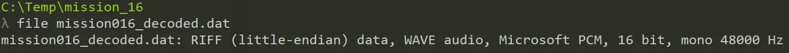
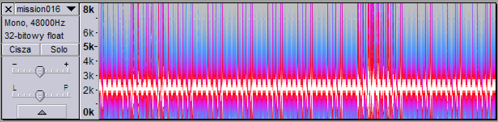
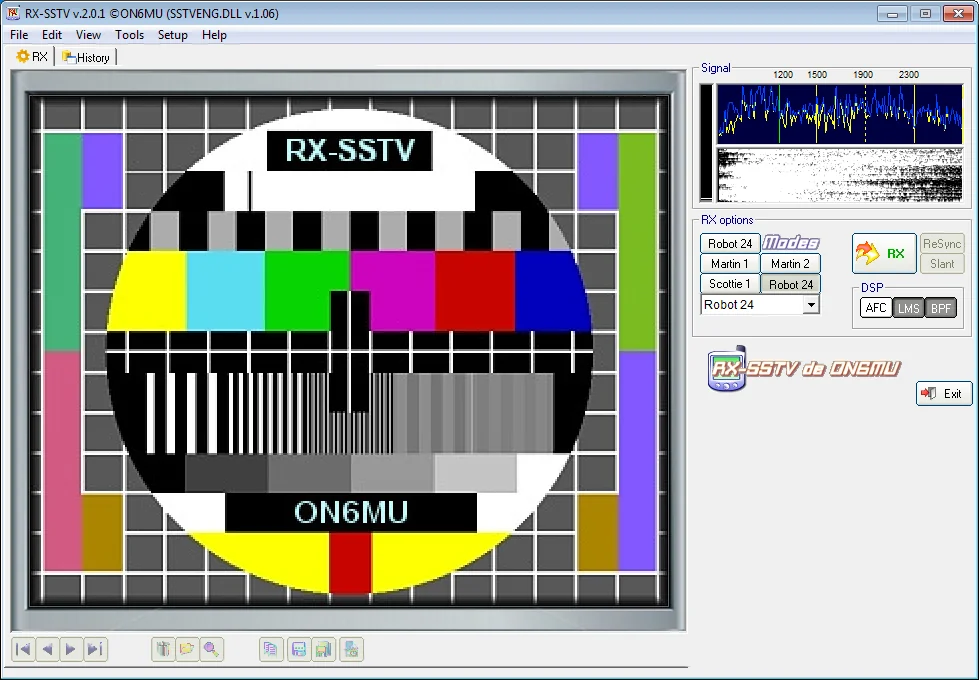
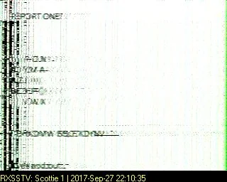
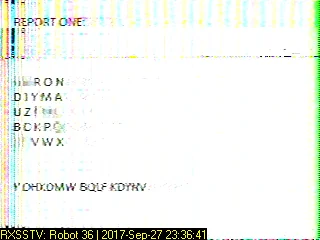

# GynvaelEN - Mission 16 - solution

Another week another mission on English side of the youtube channel. This time we are given an info that the transmission was intercepted. You can read more info [here](http://gynvael.vexillium.org/ext/edd3c47b8db1c4c04751095f1e30cd66302eec31_mission016.txt).

After inspecting the link we are given a [huge file](http://gynvael.vexillium.org/ext/cc167766ac04150b014df5e52d51c4bd603affc8_mission016_comm.txt) of ascii printable characters that looks like base64 string. So we run this through simple `.decode('base64')` in Python and we get a binary data file which upon checking with `file` looks like to be a WAV file.

So it was clear what to do next -> Audacity.

## Audacity

Opening file in audacity revealed that there's only one track and there's no obvious info when switching to Spectrum type.

When played, there was only some pitches - nothing really that could contain any additional info, but the pattern of those was kinda familiar (watch this episode of [The Modern Rogue](https://www.youtube.com/watch?v=5o1UiXl0Npc)). After few tries of listening to it I hit me. [SSTV - Slow Scan Television](https://en.wikipedia.org/wiki/SSTV). Not to bring a lot of technical details here but it allows to transfer images over sound - neat idea. Though we need some software to decode it - either 3rd party or our own.

I've tried one from the wikipage to see if it actually works. The first choice was RX-SSTV.

We can see that we are on the right track as available modes are the ones used in the message (Martin/Scotie).

And when played the file.... we got a result!

Well...kinda, sorta. We can see REPORT ONE, then some letters, some more letters and something at the bottom of the page.

And believe me that was one of the better ones. If I would get some of the other screenshots as the first one I would probably ditch this method (well maybe not - I was like 99% sure it was SSTV).

I guess, now comes the "difficult" part of the "bruteforcing" the parameters that was mentioned in the task.

I've tried multiple configurations and either it was part of the task or the tool is not right but I couldn't get a clear message. I've tried different tools but actually non matched the result of this one. After like 1h our trying out different setups I've got what was I think the best output I have this.

Here we see a bit more clear - at this moment I've assumed that this is part of the task. So let's note what we have:
[code]
    ? ? R O N
    D I Y M A
    U Z ? ? ?
    B C K P ?
    ? ? V W X

[/code]

And what is probable encoded message: `Y DHXDMW BQLF KDYNV`.

## Playfair

Ok, we can clearly see a 5x5 matrix in the middle and there's not much ciphers that uses such construct. If you have ever had any interest in ciphers than you are probably familiar with Playfair cipher. How it works is that you type a secret password into the 5x5 grid (skipping letters that are already there) and finish up with the rest of the letters. It's common to put I/J in one cell so that gives 25 letters total.

To cipher/decipher first the text needs to be split into two and then need to find the letters in the grid. To code is to get the letters on the corresponding corners (top-down, left-right manner). To decode - do the revers. There's so corner cases when the column or row is the same but we'll not describe that here (check wiki).

Ok, so what might be the password? We don't know but we can do some fill-up based on the description how the Playfair matrix is constructed.

We can clearly see that the last two rows letters are in ascending order so we can assume it's already the filling part. There are 3 slots left between `P` and `V` and if we check how many letters there are in the alphabet in between those there are only: "R, S, T, U" \- 4, but R is already used on the first row in 'RON' so we can cross that out. So we have the filling for the last two rows
[code]
    B C K P S
    T U V W X

[/code]

What about the top? Well that's a bit trickier but maybe from those two rows we can get something out?

Playfair uses pairs so let's do this for our cipher text: `YD HX DM WB QL FK DY NV`

`NV` is given so we can decode that - it's `RX`. It's not uncommon to see X in decoded Playfair as it's used as a filling when i.e. length is odd, or to use for spaces. Also `DY` is clear - it's `AI`. So it's `AIRX`.

What about the beginning of the string? We have there `YD` which according to our translation table is: `IA`.

So.. `I A????? ???? ?AIRX`. Maybe the last part is `FAIR`, `PLAYFAIR`? Here I've tried (manually) checking different combinations but all of them failed. It's time to use a tool.

I've found out an [online tool](http://www.dcode.fr/playfair-cipher) to check some combinations of matrix & cipher.

At first I got the wrong decoding as `MISSIONPLAYFAIRX`. I know it's different in those two first letters but I was doing a lot of changes as I was unclear to some of the letters in the matrix and in the cipher text too. And I've tried different combinations and this one looked right. But it was not :(.

Some more checks and tries and I've managed to put the letters in place:
[code]
    E G R O N
    D I Y M A
    U Z F H L
    B C K P Q
    S T V W X

[/code]

and the cipher text was: `Y DHXDMW BQLF KDYNV`=`I ALWAYS PLAY FAIRX`.

Anyway, I still don't know what was the password chosen & whether not the problems with the decoded image were planned. Anyway, a fun task to play - thx, Gynvael & Foxtrot Charlie.
