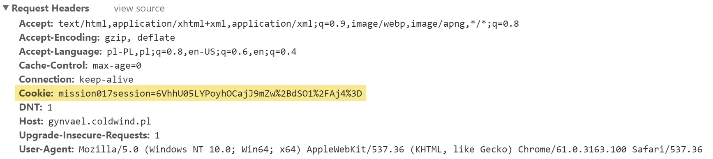
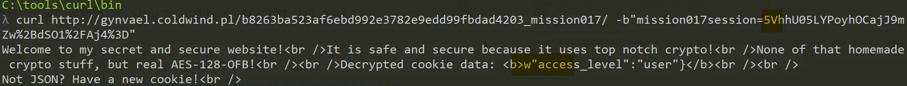
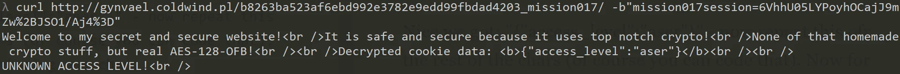
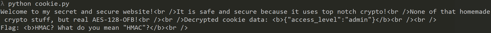

# GynvaelEN - Mission 17 - Solution

Another stream from Gynvael - another [mission](http://gynvael.vexillium.org/ext/05d08b59a5d818c05c711223ef0b701abcc33b40_mission017.txt). This time we need to extract a message from a restricted admin panel.

What we see on the page is a welcome message, and an info that the cookie was stored and a request to reload the page. So he "Hit Refresh" (;)) and we get this.

> Decrypted cookie data: {"access_level":"user"}

> ACCESS TO THE FLAG DENIED!
>  Only admin has access!

Ok, so it gives us more info. We can see that we should have some cookie attached to our request and we can actually see what is being decrypted. Let's see.

If we we can find the cookie in Developers Tools. And in fact yes, we can see the cookie:

If we decode that with a short python script we get:
[code]
    import urllib
    urllib.unquote("6VhhU05LYPoyhOCajJ9mZw%2BdSO1%2FAj4%3D").decode('base64').encode('hex')
[/code]

We can see that the amount of bytes is equal to the decoded JSON object so we can assume that this is what is stored in this cookie. Now, let's think how we can attack & exploit.

If we change one byte in the cookie (and encode it correctly), after we send the bytes we can see it's begin decoded and invalid result is presented.

So we for sure can influence what the server receives but how to do it correctly? What we want to do is to exchange `"user"}` with `"admin"}`. But we face two issues here. First is how to change the characters, and the second one is that they are of different length. Let's deal with those separately.

So let's look how this is encrypted. Not going into much details (if you want to learn I recommend - [Cryptography I](https://www.coursera.org/learn/crypto) on Coursera!) each plaintext char is xored with a key. So if we encrypt 'u' (0x75) with some byte of the key, we get:
[code]
    0x75 ^ k = 0x9d

[/code]

Let's see what would happen if we xor different letter but on the same position:
[code]
    0x61 ^ k = ??

[/code]

From the first one we can get `k = 0x9d ^ 0x75` and if we apply this to the second one we get a formula to calculate the char:
[code]
    0x61 ^ 0x9d ^ 0x75 = 0x89

[/code]

Let's test that:

Nice we got: "{"access_level":"aser"}" \- now repeat this for the rest of the chars (of course you can code that) so after doing this we should be able to send a {"access_level":"admin" to the server. Now for the problem of missing the one char.

Actually this is even simpler than this. There's only 256 combinations that's needed to be tested so we brute-force it.
[code]
    decoded_hex ="e95861534e4b60fa3284e09a8c9f66670f895fe5644e61"
    from urllib import quote
    import requests
    for i in range(0,0xff):
    	cookie = decoded_hex + format(i, '02x')
    	#print cookie
    	cookie = quote(cookie.decode('hex').encode('base64'))
    	cookies = dict(mission017session=cookie)
    	content = requests.get("http://gynvael.coldwind.pl/b8263ba523af6ebd992e3782e9edd99fbdad4203_mission017/", cookies=cookies)
    	text = content.text
    	if "Not JSON?" in text:
    		continue
    	else:
    		print text
[/code]

Solved.
