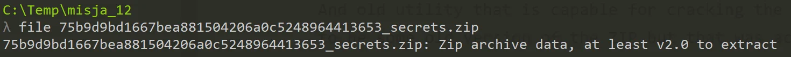
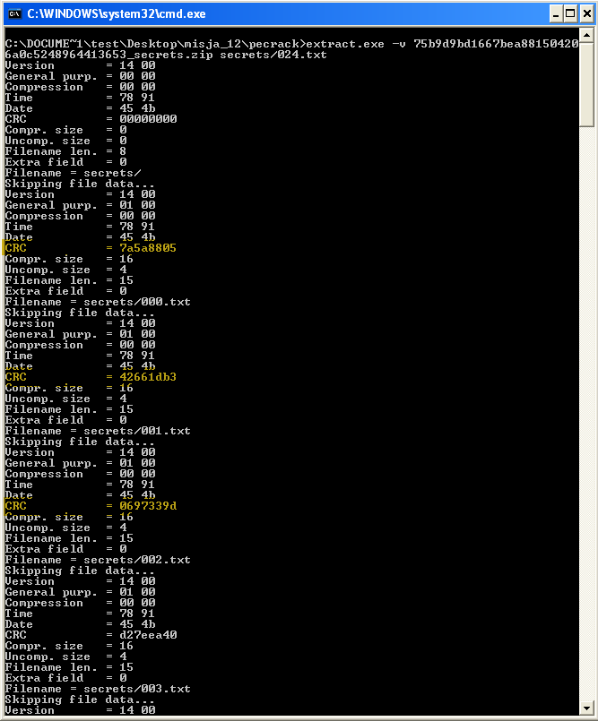
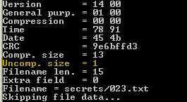

# Gynvael - Mission 012 - Solution

[This mission](http://gynvael.vexillium.org/ext/020ed17f3fb2ccda168a6eefe9d47e1a0c1abd60_misja012.txt) was on the Polish stream, but it's a nice one so I've decided to describe it anyway. If you don't understand the language let me quickly bring you up to speed - you are given a ZIP file in order to extract a data from it. Of course ZIP is created with a password and the info that's given informs us that the password is of very good quality.

The very first what comes to my mind when it comes to ZIP with passwords is PKCrack. And old utility that is capable for cracking the passwords in the ZIP files. It has to be some old version of the ZIP but that was actually the case here.

So I've went to a mission ;) and tried to locate the tool. I was surpried that I was able to [find it](https://www.unix-ag.uni-kl.de/~conrad/krypto/pkcrack.html) and it was still available to download. Unfortunatelly it did not work under some recent Win OS (even Win7 with Compatiblity mode) so I had to use a Win95 VM - fortunatelly I got a VM already installed so I could run it there.

It did run there but browsing though the options and the tools (PkCrack is not one but couple of them) got me nowehere. In order to use it I would have to have at least one already decrypted file.

That was a dead end and almost complete wast of time :(

I needed another approch. What struct me a bit was the fact that the files are so small - 4 bytes each (in exception of the last one - which I did not noticed until very, very end!). Maybe we can extract the data by calculating all possible CRC32 sums and find out what produces the ones that are of interest to us?

Let's try this idea out.

First I've came across this SO post - <https://stackoverflow.com/a/2387880/4832634> that shows how to calculate CRC32 in python. Small convert to not to read the file but use the data and we're good to go:
[code]
    def crc(d):
        prev = 0
        prev = zlib.crc32(d, prev)
        return prev & 0xFFFFFFFF

[/code]

And quick try on one of the CRCs resulted in a hit. Now how to get all of them in a nice manner. I did not one (at least in the time that I've wanted to spend on this) so I've just copy - paste them to a script from PkCrack's tool - `extract` output.

Having those I could write a script that would run throuh all 4 char printable range, calculate CRC32 and compare.
[code]
    import zlib
    import itertools
    import string

    def crc(d):
    	prev = 0
    	prev = zlib.crc32(d, prev)
    	return prev & 0xFFFFFFFF

    crcs = [0x7a5a8805, 0x42661db3, 0x0697339d,0xd27eea40,0x79e36fca,0x4b1587fd,0xa65fa2d1,
    		0x339f6b3c, 0x04cc23db, 0xede6bb0f, 0xe3039df9,0xb64d1cb7, 0xb961c051, 0xb7829373,
    		0xb7829373,0x5ae5c062,0x1dde116c, 0xed5af2eb,0x3f1ad5da,
    		0x3b14214c, 0xb66f8037, 0x8ebd47de, 0x50810704, 0x0e201f1c, 0x9e6bffd3]

    results = [""]*len(crcs)
    for c in itertools.product(string.printable, repeat=4):
    	v = "".join(c)
    	r = crc(v)

    	if r in crcs:
    		print crcs.index(r), v
    		results[crcs.index(r)] = v

    print "".join(results)
    print "End!"
[/code]

We got almost all the files content, all but the last one. And there's a reason for that. If I would look closely at extract output or just check the files I would have noticed that all of them are of 4 bytes. All but the last one! It's only one char so our script can't find it.

A short addedntum to the script that would additionally computes one-length char CRC32 and we find the last one "!".

> And I would have gotten away with it too, if it weren't for you meddling kids and your CRC32!

Scooby Dooby Doo....
