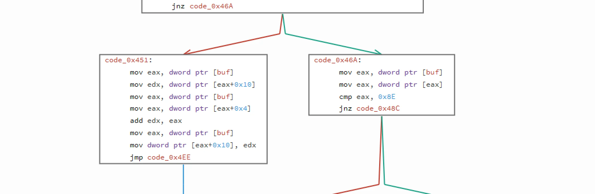

# How do I approach this ctf debugging program - step by step

Another good question from RE on Stack Exchange. I've already posted an [answer](https://reverseengineering.stackexchange.com/a/16387/18014) there, but here let's put a bit more explanation and answer the question in the title.

So how do you approach this CTF challenge? Well basically the sam way you would do with all the other ones. You analyze it and analyze it until you are familiar with it you can make a educated guess on how it works (even if it's a partial guess). But how to do it...

In case of this program or for any other we open it in a debugger - I'm using either [radare2](http://rada.re/r/) or [Relyze](https://www.relyze.com/). For this one it was Relyze. So when you open it and try to locate a `main`. There's nothing obfuscated in this binary so we can locate it at 0x00000F19 pretty quickly. From there it's obvious to see that there should be one parameter to be passed to it as a flag.

and then we call `setup()`.

## setup()

By the first look at its size, one might be scared a lot.

That's a big function! But let's not jump to conclusions yet. Lengthy doesn't mean difficult and hard to understand. So let's try to check what's is being done there.

If you look closely you can see a pattern

and it is repeated during the whole `setup()` method. So if we understand that one block is doing, we will understand the whole method. So let's start:

What the block does it first allocates 0x14 (5*4) bytes of space. And then puts some "random" (we will later see they are not random) values in the indexes (0,1,2,3,4). So after the first block executes we do have:
[code]
    tab[0] = 0x01
    tab[1] = 0x81
    tab[2] = 0x65
    tab[3] = 0x0C
    tab[4] = 0x5A

[/code]

And we repeat that pattern 31 times - with different values. And that's all - this is this scary setup function. Now let's analyze

## check()

This is the second part of the puzzle. We pretty much know what's going on in the setup, so now let's try to understand what's going one with the data that's being prepared there.

This part is easy - it gets the first char of the flag and stores it in [char] and get the same first char from the one of the known buffers that were generated in the setup method and compares it with `0x65`. If we check the check method correctly - some of the generated data had 0x65 as a first element. So let's focus what is being done if the first element is equal to this.

So on the above example we see that if the first element is `0x65`, then we take value from offset (`0x10`) - we add to it a value from offset 0x4 and everything is stored again under `0x10`. On the other hand - if the first element is not equal to `0x65` then it's being compared with `0x8E`. If we have a match - we do the same but not the operation is different - it's subtraction. If we move further - `0x01` is division, `0x73` \- multiplication, and lastly - `0xFA` \- xor. Ok, that part is easy. What's next? Next we do the same - again we check the first byte of the buffer and based on it we perform an operation. What's difference is that we use different operands - this time we do it on parameters from offsets `0x10` and `0xC`. Results is stored again in `0x10`.

To sum up, this is what we do:
[code]
    *(buf+0x10) = *(buf+0x10) (op) *(buf+0x04) (op) *(buf+0x0C)

[/code]

And op - operation is based on *buf. Easy. Now's the difficult part - the problem with this code is that this calculated value is not at all compared with the flag. Only in case when we do not get the match with the first byte in the buf, we get to compare - I think this is a flaw in this CTF challenge.

But that should not stop us form being able to decode the flag.

To solve this I will use radare's r2pipe tool that allows to hook up to radare2 engine from scripting languages like for example python.
[code]
    import r2pipe

    r2 = r2pipe.open("./smoothie")

    r2.cmd('doo AAAAAAAAAAAAAAAAAAAAAAAAAAAAAAAA')

    r2.cmd('db 0x80485bb')
    flag = ''
    for i in range(31):
        r2.cmd('dc')
        dl = r2.cmd('dr? dl')
        flag += chr(int(dl,16))
        r2.cmd('dr eax = 0x0')

    print flag

[/code]

What we do here is we connect to the debugee target via r2pipe, we open it for debug (`doo`) with a fake flag. We set a breakpoint at the last `leave` instruction.

Then in a loop we deal with one flag char at a time. First we run the execution (`dc`) and after that we are stopped in our breakpoint so we can read the `dl` value which will hold the correct flag char and we add it to our flag variable to print it later. In order to continue execution of the crackme, we need to set `eax` to 0 so that the `test` instruction can return the correct result - we do it by executing `dr eax = 0x`. If we run this script we will get this:

> flag{HereBeDaFlagForYoDebug�h}

Almost, there's still one char off. It's 2nd character for the end - so let's try to see if the problem is in the binary or in our analysis. If we check the values assigned to this char we get this:
[code]
    [0x8E, 0xBD, 0x1, 0x85, 0x14]

[/code]

Lets try to write a script that would try to get what's the correct character for this spot.
[code]
    # -*- coding: utf-8 -*-
    import itertools

    ops = [0x65, 0x8e, 0x01, 0x73, 0xFA]

    flag = "flag{HereBeDaFlagForYoDebug?h}"
    inp = [0xBD, 0x85, 0x14]

    for op1,op2 in itertools.permutations(ops,2):
    	for c in itertools.permutations(inp, 3):
    		if op1 == 0x65:
    			temp = c[2] + c[0]
    		elif op1 == 0x8E:
    			temp = c[2] - c[0]
    		elif op1 == 0x01:
    			temp = c[2] / c[0]
    		elif op1 == 0x73:
    			temp = c[2] * c[0]
    		else:
    			temp = c[2] ^ c[0]

    		if op2 == 0x65:
    			temp = temp + c[1]
    		elif op2 == 0x8E:
    			temp = temp - c[1]
    		elif op2 == 0x01:
    			temp = temp / c[1]
    		elif op2 == 0x73:
    			temp = temp * c[1]
    		else:
    			temp = temp ^ c[1]

    	print "{:02X}, {:02X}, {}, {}".format(op1, op2, chr(temp & 255), c)
    	print flag[:-3]+chr(temp & 255)+flag[-2:]

[/code]

After running this we get some solutions:
[code]
    λ python smoothie_solution.py
    65, 8E, L, (20, 133, 189)
    flag{HereBeDaFlagForYoDebugLh}
    65, 01, ☺, (20, 133, 189)
    flag{HereBeDaFlagForYoDebug☺h}
    65, 73, Ľ, (20, 133, 189)
    flag{HereBeDaFlagForYoDebugĽh}
    65, FA, T, (20, 133, 189)
    flag{HereBeDaFlagForYoDebugTh}
    8E, 65, ., (20, 133, 189)
    flag{HereBeDaFlagForYoDebug.h}
    8E, 01, ☺, (20, 133, 189)
    flag{HereBeDaFlagForYoDebug☺h}
    8E, 73, ═, (20, 133, 189)
    flag{HereBeDaFlagForYoDebug═h}
    8E, FA, ,, (20, 133, 189)
    flag{HereBeDaFlagForYoDebug,h}
    01, 65, Ä, (20, 133, 189)
    flag{HereBeDaFlagForYoDebugÄh}
    01, 8E, ä, (20, 133, 189)
    flag{HereBeDaFlagForYoDebugäh}
    01, 73, ş, (20, 133, 189)
    flag{HereBeDaFlagForYoDebugşh}
    01, FA, î, (20, 133, 189)
    flag{HereBeDaFlagForYoDebugîh}
    73, 65, I, (20, 133, 189)
    flag{HereBeDaFlagForYoDebugIh}
    73, 8E, ?, (20, 133, 189)
    flag{HereBeDaFlagForYoDebug?h}
    73, 01, ∟, (20, 133, 189)
    flag{HereBeDaFlagForYoDebug∟h}
    73, FA, A, (20, 133, 189)
    flag{HereBeDaFlagForYoDebugAh}
    FA, 65, ., (20, 133, 189)
    flag{HereBeDaFlagForYoDebug.h}
    FA, 8E, $, (20, 133, 189)
    flag{HereBeDaFlagForYoDebug$h}
    FA, 01, ☺, (20, 133, 189)
    flag{HereBeDaFlagForYoDebug☺h}
    FA, 73, ═, (20, 133, 189)
    flag{HereBeDaFlagForYoDebug═h}
[/code]

Nothing really stands out here, if I would have to pick one I would get a `flag{HereBeDaFlagForYoDebug.h}`.

To sum up - nice challenge and not so difficult. Probably it was wrongly created and taken down during CTF as there's no mention of it on the CTF webpage. Even though we were able to produce correct flag and solve it.
