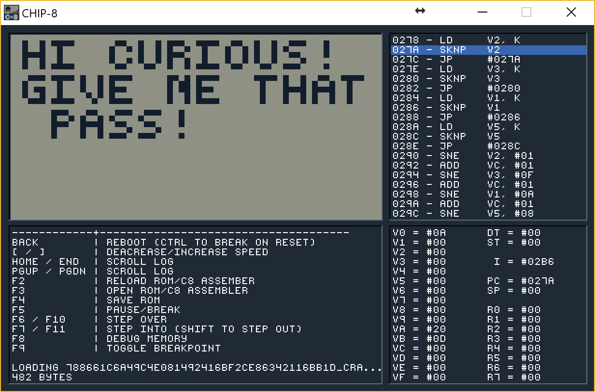
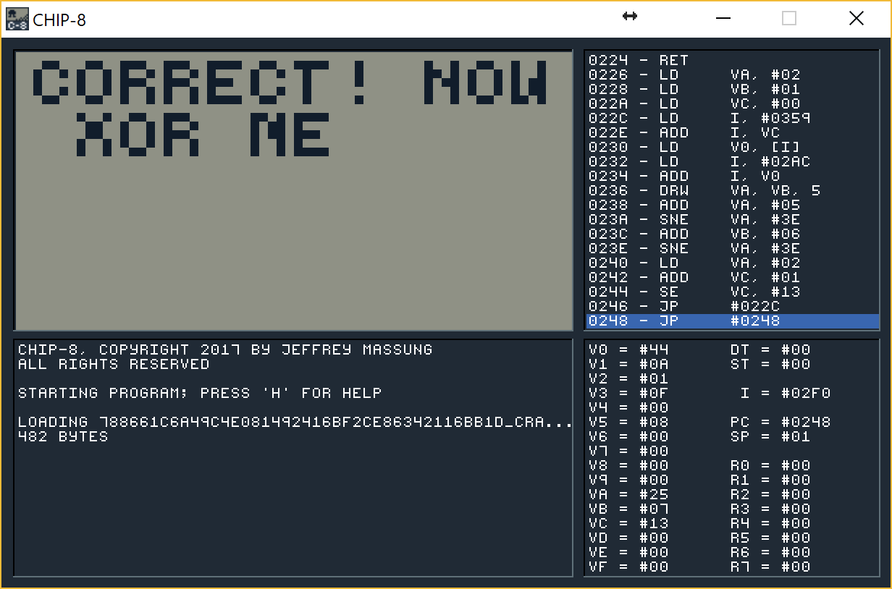
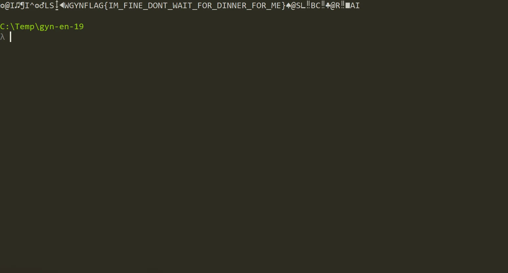

# GynvaelEN - Mission 19 - Solution

Gynvael is back with streams and with missions. The [39th stream](https://www.youtube.com/watch?v=ZUXP9ZbPv9s) contains mission no 19 that can be found [here](http://goo.gl/56PLi4).

In this mission we are given a CHIP-8 ROM image. This is clearly a reference to the latest streams about this topic ([#34](https://www.youtube.com/watch?v=BQRX3owv2JI), [#35](https://www.youtube.com/watch?v=locDS3uHv_E), [#36](https://www.youtube.com/watch?v=9xGgZUMNl2Y), [#37](https://www.youtube.com/watch?v=adHOlKKbFXM), [#38](https://www.youtube.com/watch?v=0sphPKO8QTs)). If you don't know what Chip-8 is I recommented watching those.

To be able to solve this challenge what we needs is a debugger or at least a decompiler. What my first though was, was to check r2 for a pluging that would support Chip8. Unfortunatelly there was none.

What I found at first was a [Chip-8 decompiler](https://github.com/bloody76/Chip8-Disassembler). It worked ok, and I got a dissasebly for the crack me.

[View Gist](https://gist.github.com/pawlos/1f70ed123bfd1ca1a05f3fa82cbad596)

I've tried analyzing it a bit but gave up pretty quickly as it was to difficult to do manually.

What I need is debugger! And there is one. Written in Go. [Chip-8 Emulator](https://github.com/massung/CHIP-8).

After downloading it I've loaded the image and was presented with this image.

What is good about this tool is that it shows the disassbely as well as the output and registers. Everything what's needed.

If you don't know Chip-8 assembler you can read a bit of intro on the Chip-8 Emulator page. What's needed for this part is to know what does `LD Vx,K` and `SKNP Vx` do.

What we see here is that we load keyboard input to `V2`, `V3`, `V1` and `V5`. Later (at offset 290) we check those entries with `#01`, `#0F`, `#0A` and `#08`. If the input is correct we will increment `VC` register. At first I've tried just typing those as a Pass but it did not work for some reason. Only later I've checked that Chip-8 has it's own keyboard layout that is mapped to a physical keyboard so what we want to press on our keyboard is `1vzs`. When we do it viola:

That's interesting. What should we xor? The first assumption was to xor the crackme name (`788661c6a49c4e081492416bf2ce86342116bb1d`) with they but it did not yield anything. Let's see what was written on the mission page

> In the final phase use a string, not a number. Try different offsets.

Hmm, the only way this message is valid would be if we use `1fa8` as the key as this is the valid hex number. Also the offseting might indicate that we have a bit longer data input. Let's try with the whole file data.
[code]
    data = open('788661c6a49c4e081492416bf2ce86342116bb1d_crackme.chip8','rb').read()
    pwd = "1fa8"

    wyn = ''

    for i in range(len(data)):
    	wyn += chr(ord(data[i]) ^ ord(pwd[(i+2) % len(pwd)]))

    print wyn
[/code]

Running the script gives us the pass:

Flag: `GYNFLAG{IM_FINE_DONT_WAIT_FOR_DINNER_FOR_ME}`.
