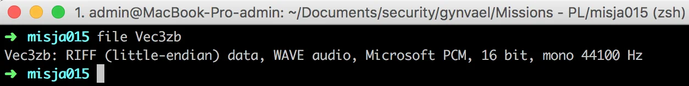
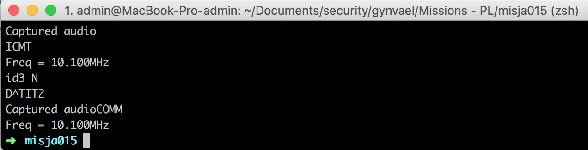

# Gynvael - Mission 015 - Solution

Last time, there was no mission on EN stream, so I've decided to describe the one from [PL stream](https://www.youtube.com/watch?v=FN_TyVAK0Hw) sice it was also quite a nice one.

The mission is located under <https://goo.gl/rs1A2f> and the most important part there is that it points to another download which appears to be WAVE file.

So the obvious next step would be Audacity. It sounded familliar but I've coudn't get my head around what was it. I was pretty sure it wasn't SSTV as in [MissionEN 16](https://ctfs.ghost.io/gynvaelen-mission-16-solution/). It's good to check if there's anything on the spectrogram but nothing showed up this time.

My next step was to check if there's any strings that might raise the attention. And actuallt there was. At the very end to the output it was this:

So let's check what DuckDuckGo says about this frequency. The first link is [this](https://www.youtube.com/watch?v=mSWkE8LKiQg) and it's clear that we hit the jackpot. The same sounds. So it's DDK9. Now it's also clear what are those additional info about whether in the mission description (in Polish). So do we need to decode it? Let's try some tools on that. Similar to the SSTV case, almost all the tools were on sime webpages from the '90s :).

This time I did not made the mistake and played the file from the speakers but used the virtual cable but still there was some problems with the decoded transmission.

Clearly there are some readable texts (apart from JVComm32 demo) but nothing of the flag itself.

I've played a bit with different tools only to discover (actually by accident) that the flag was visible all the time. On the spectrum chart in one of the programs. This is how it was shown

FLAG ZABY SPIA NA FALOCHRONIE

Difficulty: 5/10
Solution time: ~3h
