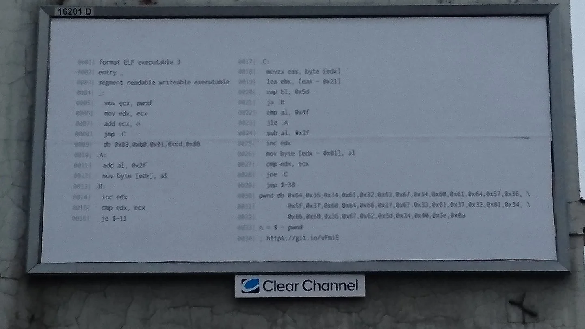

# Assembly job offer... "Follow the white rabbit" solution

In a cold November night I was standing at a bus stop and saw and advertisement on the streets of Wrocław. What was odd about it it was written purely in assembly.

Ok, to tell you the truth I was nothing like that. In reality I was just browsing through my Facebook wall and see this on my screen.

Immediately I wanted to have a look at it but since the quality wasn't that good it might be a bit of a problem. Fortunately the URL page was clearly visible at the bottom so we could get the code and not to retype it. So let's visit the url: <https://git.io/vFmiE>

There's not that much assembly going there so what I did was to analyze it an write a short python script to revers it. What Might ba a problem is only those 5 bytes just before `.A`.

The assembly is not complex, we can identify a loop over the bytes, defined at the bottom. 0x21 is subtracted from each character and then based on the value we do one of two things:

  * if value is greater than 0x5d then we jump to `.B` where we move to the next char and jump 11 bytes back (we will analyze later what that is)
  * if value is less than `0x4f` we jump to `.A`, where we add `0x2f` and fall through the `.B`.

Ok, now what is with this jumping back 11 bytes. If we try to translate those bytes to the instruction(s) we will get an error but from the use of `$-11` we can deduct that we will be jumping in the middle of the instruction and if we drop the first byte and decompile we get what's probably there:
[code]
    mov al,1
    int 0x80

[/code]

so simply exit. Knowing this we can write a solution script. It would look like like that
[code]
    # follow the white rabbit solution

    data = [0x64,0x35,0x34,0x61,0x32,0x63,0x67,0x34,0x60,0x61,0x64,0x37,0x36, \
            0x5f,0x37,0x60,0x64,0x66,0x37,0x67,0x33,0x61,0x37,0x32,0x61,0x34, \
            0x66,0x60,0x36,0x67,0x62,0x5d,0x34,0x40,0x3e,0x0a]

    wyn = ''

    def a(d):
            return d+0x2f

    for al in data:
            d = al - 0x21
            if d > 0x5d:
                    #.B
                    continue
            if al <= 0x4f:
                    #.A
                    d = a(al)
                    wyn += chr(d)
                    continue
            d = al - 0x2f
            wyn += chr(d)

    print wyn

[/code]

Running it we get:

### [5dc2a48c125fe0f157f8b2fa2c71e83.com](5dc2a48c125fe0f157f8b2fa2c71e83.com)

So it looks like it might be more fun. After landing on the page we see a bit of a C++ code with the request to find the mistake in code and send the correct result.

From reading the code we can identify what might be as a Fourier transform (name of the method suggests that).

My assumption was that the error would be there as the code compile and calculated some results. After checking on the internet how Fourier was supposed to be calculated it was obvious that `even` and `odd` values are mixed. What was left was to change the '+' for '-' and calculate the new result.

The correct algorithm is here:
[code]
    #include
    #include
    #include
    #include

    void fourier(std::valarray >& input) {
     if (input.size() > 1) {
       const size_t half = input.size() / 2U;
       std::valarray > even = input[std::slice(0, half, 2)];
       std::valarray > odd = input[std::slice(1, half, 2)];

       fourier(even);
       fourier(odd);

       for (size_t k = 0; k < half; ++k) {
         std::complex t = std::polar(1.0, -2.0 * M_PI * k / input.size()) * odd[k];
         input[k] = even[k] + t;
         input[k + half] = even[k] - t;
       }
     }
    }

    template struct power { enum { result = X * power::result }; };
    template struct power{ enum { result = 1 }; };
    template struct power { enum { result = X }; };

    template
    double rounded(double f) {
       const int temp = power<10, PRECISION>::result;
       return round(f * temp) / temp;
    }

    int main() {
       const std::complex data[] = {  -0.75, -1.75, 1.25, -3.25, 4.00, -1.75, 2.75, 3.75 };
       enum { SIZE = sizeof(data) / sizeof(std::complex) };
       std::valarray > test_data(data, SIZE);

       fourier(test_data);

       for (size_t i = 0; i < SIZE; ++i) {
           std::cout << '(' << rounded<4>(test_data[i].real()) << ',' << rounded<4>(test_data[i].imag()) << ") ";
       }

       std::cout << std::endl;
       return 0;
    }

[/code]

Run it, paste the output in the form on the page and...error. Solution not correct. Information about spaces? Should I remove them? Hmm...WTF? I've struggle a bit here but in the end managed to figured it out.

My first mistake was that I did not noticed that the input is changed every time the page refreshed, so I've needed to update my script each time.

The second mistake was that I've missed one space at the end of the output.

Done.
