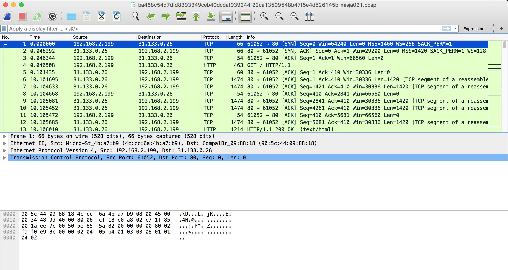
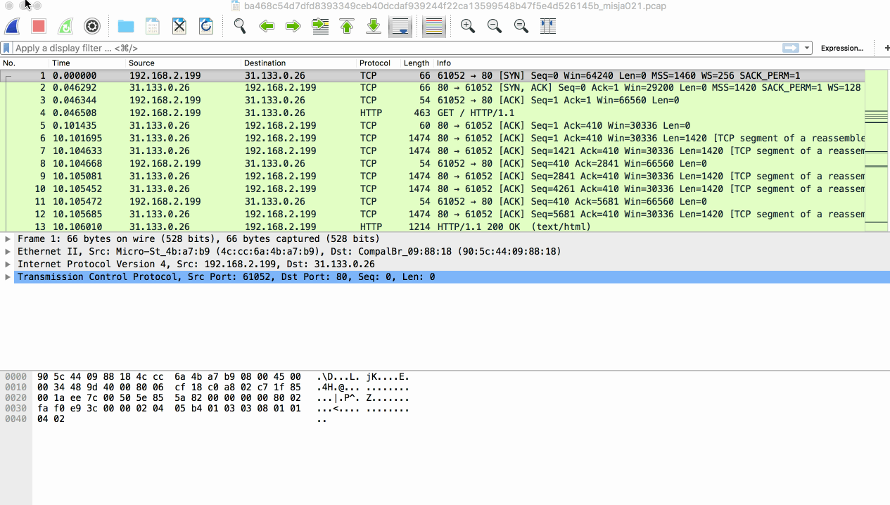
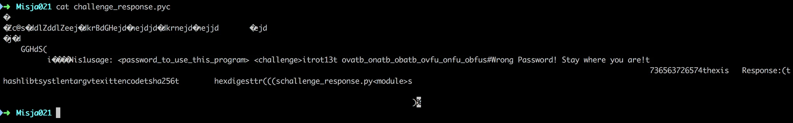

# Gynvael - Mission 021 - Solution

The [source](goo.gl/uk8RZB) for this mission can be found in stream [63](https://www.youtube.com/watch?v=4OmK-7ULYd4). It is in Polish but it can be easily spotted that the main source is a PCAP file that can be downloaded from [here](goo.gl/p1Pwgm).

# Wireshark(ing)

Hacing this file on our disk, there isn't much more to do just to open it in Wireshark. This is probably a go-to tool when it comes to analyzing PCAP-files.

We can see there's some HTTP communication so, let's check what are files being transmitted in this file.

Browsing through the list and my attention was immediately caught by 3 items:

  * /misja021_secret_area/ GET & POST
  * something_suspicious.png
  * something with `application/zip` Content Type.

Quickly checked the `/misja021_secret_area` and I was certain that this is the right place but we've needed a response reply. Thre was a `POST` request that was showing sending a `asdf` reply to the form but this didin't work.

I've donloaded all off them and began next stage - outside Wireshark.

# Wild-goose chase

Zip was password protected and having seen the "something_suspicious.png" I've immediately jump into the conclusion that this is the next step that I need to solve (it will contain the password for zip). I was even more sure that this is the thing when I saw this

> xxd something_suspicious.png | more
[code]
    00000060: 1f13 3b37 5690 de20 0000 0023 7445 5874  ..;7V.. ...#tEXt
    00000070: 436f 6d6d 656e 7400 2d2d 2d3e 2075 6e61  Comment.---> una
    00000080: 6c70 6861 206d 7920 616c 7068 6120 3c2d  lpha my alpha <-

[/code]

And for sure there was something with alpha when this image was displayed. So I went on a chase to remove the alpha transparency from this image. After few quick trials with Photoshop and searching for an online tool I've switched to Python & stackoverflow. With few backs and forth managed to get something working:
[code]
    from PIL import Image

    png = Image.open('something_suspicious.png')
    background = Image.new("RGB", png.size, (0, 0, 0))
    background.paste(png)
    background.save('foo.png')
[/code]

Running this script gave me this:

LOL. But even at this point I was still under the impression that there's a password somewhere. Well spending another fruitless 15 minutes and I gave up. We need another approch.

# Back to the drawing table

Being unsuccessful with obtaining the password from the image I got back to the description (which at first I only skimmed - never, ever do that again!) and noticed that there is an info about usage of short passwords - so maybe the password protected ZIP can be brutforced?

Here are probably more than those two tools but the most common ones that could be used here are: John The Ripper & fcrackzip.

Fcrackzip is easy. Just type:

> fcrackzip -b -l1-6 -p a -u zip.zip

and in a matter of seconds you will get:

> PASSWORD FOUND!!!!: pw == cdo

For john it's a bit trickier.
first we need to optain the hashes by using zip2john utility.

> zip2john zip.zip > zip.hash

then crack them with John the Ripper.

> ../Tools/JtR/run/john zip.hash
>
>  Using default input encoding: UTF-8
>  Loaded 1 password hash (PKZIP [32/64])
>  Will run 2 OpenMP threads
>  Press 'q' or Ctrl-C to abort, almost any other key for status
>  0g 0:00:00:05 3/3 0g/s 2273Kp/s 2273Kc/s 2273KC/s 24jjds..261m32
>  cdo (zip.zip)
>  1g 0:00:00:06 DONE 3/3 (2018-03-30 23:48) 0.1547g/s 3286Kp/s 3286Kc/s 3286KC/s samandrear..shicks102
>  Use the "\--show" option to display all of the cracked passwords reliably
>  Session completed

# .pyc

After unzipping the file we're given the `challenge_response.pyc`, I was thinking of going with `dis` here but first I've just typed

> cat challenge_response.pyc

hoping that something interesting will be visible. At it was.

We could clearly see the usage (that we needed a password for), rot13(!) and a long string that was looking strange. So let's try to rot13 it and see waht we will get:

> echo 'ovatb_onatb_obatb_ovfu_onfu_obfus' | tr 'A-Za-z' 'N-ZA-Mn-za-m'
>
>  bingo_bango_bongo_bish_bash_boshf

but using it gives us a 'no-no'. Looking a bit closer to this 'bingo_bango...' and we can see that the last 'f' is a bit odd. Probably it shoudn't be there, so let's try without it and...

> python challenge_response.pyc bingo_bango_bongo_bish_bash_bosh 20589149961826172157662607405
>
>  Response: 1d37dcd249fcb8dbaea3ca6805cfa2c1efea66f9e157f3da30e15edc8f132f1f

Using that on page gives us the flag:

> Secret: Chwila chwila! To miało być bezpieczne!

Lessons learned:

  * read the descirption cerefully!
  * addded fcrackzip & john tools to the [Ubuntu post-install script](https://gist.github.com/pawlos/3d53885d484bfb6108543150b2a51a8f)

