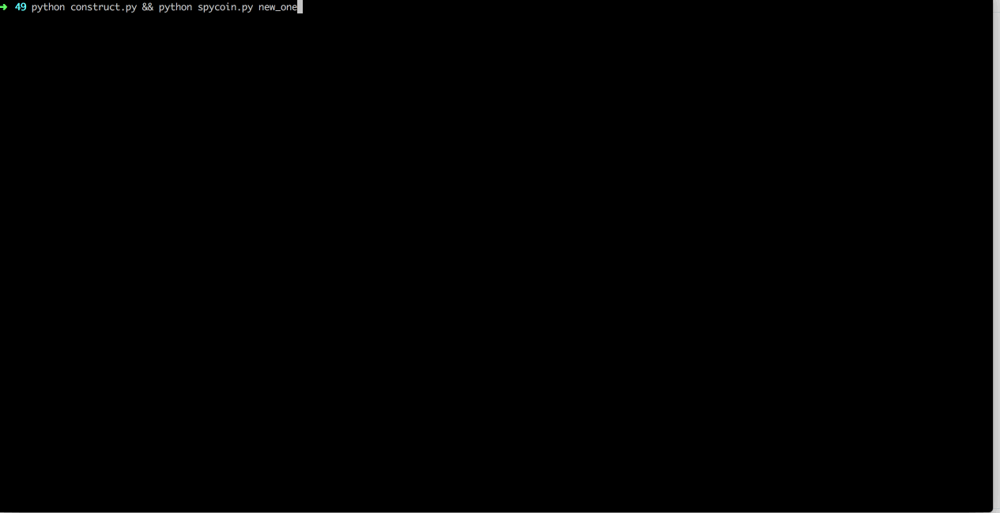

# GynvaelEN - Mission 022 - Solution

Blokchain. *Coin. Hot topis for today. The [22nd mission](http://gynvael.vexillium.org/ext/180da8f7c52ec8b4de96b26168cbc6374fc5fad33ad8b1a48b7230de22f491c9_mission022.txt) is about blokchain and about coins. SpyCoins. The mission can be found on [Stream #49](https://www.youtube.com/watch?v=LzypD_NaWAs). The SpyCoin center is here: <http://gynvael.coldwind.pl/mission022_spycoin/>

# First failed attempt

I've tried to main SpyCoin. That would be an obvious solution to the challenge. Add a next block with a chunk that would transfer all the coind to the "Secret" account and find bytes that would give the md5-squred a valid "Spy" beginning. That failed miserably. Since it was a block above 138 I meeded to match the begining of the block with "SpyCoinXoXo". Tried to do some scripts like this one:
[code]
    #!/usr/bin/python
    import struct
    import hashlib
    import itertools

    def verify_block(hash):
    	# Difficulty history:
    	# We increased difficulty starting from block 52, have to match "Spy".
    	# We increased difficulty starting from block 138, have to match "SpyCoinXoXo".

    	#if self.block_num < 52:
    	#return hash.startswith("Sp")

    	#if self.block_num < 138:
    	#  return hash.startswith("Spy")

    	return hash.startswith("SpyCoinXoXo")

    def block_hash(block):
       step1 = hashlib.md5(block).digest()
       step2 = hashlib.md5(step1).digest()
       return step2

    data = bytearray("0253707927c4f79853d74aef754374a86d03627269736f74770053656372657432305c2c020003626973686f7000005365637265743230e6810100036b6179000000000053656372657432301e650100036167656e743939005365637265743230c660010003646f6e706564726f5365637265743230e1af0000036e617461736861005365637265743230197d0000".decode('hex'))

    #print len(data)
    #print block_hash(data).encode('hex')
    for k in range(1,10):
    	print 'Testing: ',k
    	for i in itertools.product(range(255), repeat=k):
    		#print i
    		b = data + (''.join(map(chr,i)))
    		#print b
    		if verify_block(block_hash(b)):
    			print 'Found!',i
[/code]

But after some hours for fruitless searching gave up this approch. I needed a new one..

# A brand new chain

What if we could construct a new chain? The script only validaes that the root is the same. And our chain has to be only longer in terms of bytes, it doesn't have to be longer in terms of actual blocks in it. Maybe we can trick it into the beliveing that have have one?

What would would need to do is this:

  1. Copy the root block into the new one, this is to trick the script that our is a continuation of the current one
  2. Create a block that will transfer enough (500k) SpyCoins
  3. Create filler blocks. Blocks that are meaningless for us and ther soil purpose is to create a file big enough so the the script will accept it as a new chain
  4. ?
  5. Profit?

## 1 Copy the root block

This part is easy just copy over first `0x65` bytes:
[code]
    current = open('current_blockchain','rb').read()
    current = bytearray(current)

    newone = current[0:0x64+1]

[/code]

## 2 Transfer the funds

A bit trickier part. Let's create a helper function that will return a transfer block to the "Secret20" account:
[code]
    def add_funds(src, amount):
      secret = struct.pack("8s","Secret20")
      #add transffers
      transfer = bytearray()
      transfer.append(0x03) #type
      transfer += src.decode('hex') #from
      transfer += secret #to
      transfer += struct.pack("I", amount) #amount
      return transfer

[/code]

What we do here is creating a bytes that will encode a transfer chunk (type = `0x03`) then we specify a source wallet, destination wallet and of course the amount. Having that we can just type:
[code]
    tr = bytearray()
    tr += add_funds("626973686f700000", 98830)
    tr += add_funds("6b61790000000000", 91400)
    tr += add_funds("627269736f747700", 142487)
    tr += add_funds("6167656e74393900", 90210)
    tr += add_funds("646f6e706564726f", 45032)
    tr += add_funds("6e61746173686100", 500000-98830-91400-142487-90210-45032)

[/code]

And we have 6 operations that will, if everything is right, transfer 500k SpyCoins to "Secret20" wallet.

What we're missing is a signature of a block. How they are constructed? We're taking a `0x02` chunk with a previous block hash we concatenate it with this block and the md5-squared of that needs to start with "Sp", "Spy" or "SpyCoinXoXo" depending on the block number. So let's do that.

First a useful function:
[code]
    def find_bytes(block, block_num):
      found = None

      for k in range(1,10):
    	if found is not None:
    		break
    	for i in itertools.product(range(255), repeat=k):
    		b = block + (''.join(map(chr,i)))
    		h = block_hash(b)
    		if verify_block(h, block_num):
    			found = (''.join(map(chr,i)),h)
    			break
      return found

[/code]

`verify_block` is taken from the original script. This function is testing all the combinations of bytes (by using `itertools.product`) until it find such combination that md5-squared will start with the apprioriate prefix.

With that we just write:
[code]
    block_num = 1
    confirm = current[0x65:0x65+0x12]

    found = find_bytes(confirm[1:]+tr, block_num)
    block_num += 1

[/code]

Append it to the chain we're builing
[code]
    tr += found[0]
    confirm[0] = 0x11+len(tr)

    hash = found[1]
    newone += confirm
    newone += tr

[/code]

Ok, so at this point we have the same root and we have transfer all the necessary funds to the "Secret20" account. What's left? Well now we need to prove our chain is later than the current one but having the size bigger than the size of existing SpyCoin chain.

## 3 Creating filler blocks

To have the bigger size, we will use the chunk type `0x00`.
[code]
    while len(newone) < len(current):
      print 'Newone size: ',len(newone), 'Current: ', len(current)
      filler = bytearray()
      filler += '\xff' #size
      filler += '\x02'+hash
      filler += '\x00'
      filler += '\xff'*230
      found = find_bytes(filler[1:], block_num)
      filler += found[0]
      filler[0] = len(filler)-1
      block_num += 1
      hash = found[1]
      newone += filler

[/code]

No magic here. We add blocks until we know we are bigger. And in each loop we create a block with a given size (starting with `0xff`) then we provide a chunk type `0x02` (previous hash) with a hash. After that a chunk type `0x00` with some "random data" and of course some needed bytes so that the hash is correct. After bytes being added, we need to correct the size (`filler[0] = len(filler)-1`) and we're done. Rinse & repeat.

Save all the bytes to the new file:
[code]
    open('new_one','wb').write(newone)

[/code]

And voilà.

## 4 ?

## 5 Profit?

The full script can be found here:

[View Gist](https://gist.github.com/pawlos/e92cbce83b367aa90ea867f894492154)

Have fun. I hope this will not have impact on SpyCoin price ;)
