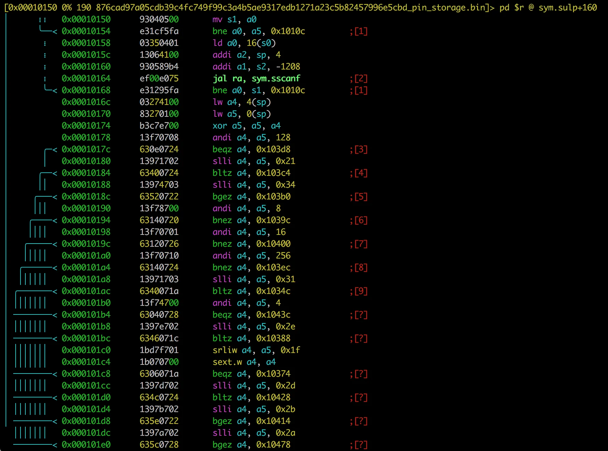
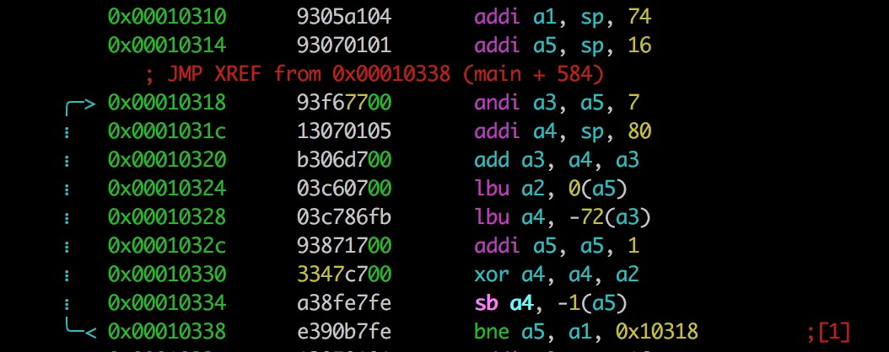
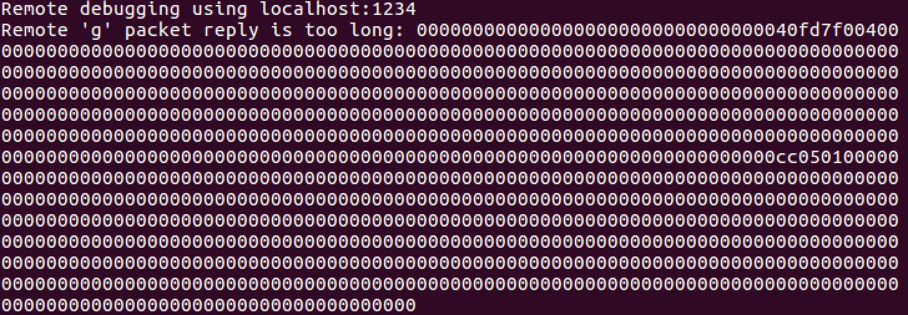
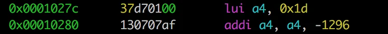
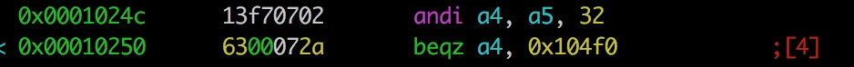
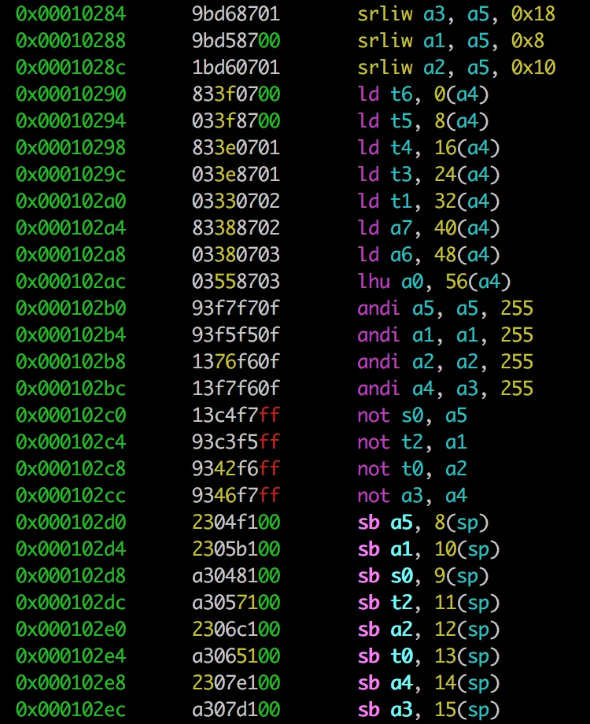
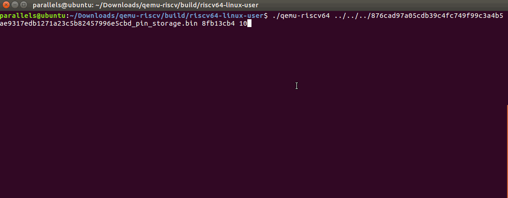

# Gynvael - Mission 22 - Solution

This was a hard one. Information about this mission can be found in [stream #64](https://www.youtube.com/watch?v=NXxxvt80T6o) and the mission itself is [here](http://gynvael.vexillium.org/ext/876cad97a05cdb39c4fc749f99c3a4b5ae9317edb1271a23c5b82457996e5cbd_misja022.txt). It's in Polish but the most relevant information here is that there's a RISC-V firmware that needs to be analyzed and password to be extracted.

## Analyze with R2.

Since this was a RISC-V architecture we needed to start with an disassembler that knows it. My obvious choice was to use radare since it knows this one and a lot of other.

Just type

> r2 -e asm.arch=riscv 876cad97a05cdb39c4fc749f99c3a4b5ae9317edb1271a23c5b82457996e5cbd_pin_storage.bin

and we're good to go. I think I've haven't had any experience with this architecure before so I did some reading [here](https://riscv.org/specifications/) and [there](https://rv8.io/asm) to get the basic understanding of the assembly. Although (almost) everything was new to me, it was pretty clear from the beginning where the algorith was. `sscanf`, `xor` and a lot of operations that looked like checking the input gave me an idea that this is what I was looking for.

By looking at those `sscanf` it was obvious that the application expects 2 input but I couldn't figure out how to check what that supposed to be (more on that later). But since it was `xor`ing them I assumed those should be numbers. A bit later, some checks are being made (`andi` and `slli`) to verify that the provided value is correct. If we pass those checks, then the main decryption function is being executed:

And from the above we see it's just a `xor` \- but we don't know the key.

At that moment I've decided that the best approch would be to have the ability to run the damn thing. Or better - to debug it.

## QEMU+RISC-V

QEmu is an emulator that can emulate a lot of weird* architectures. One of them being RISC-V. You just need to download a Qemu that supports it from [here].(<https://github.com/riscv/riscv-qemu>).

It took like a gazilion hours to compile but after that I was able to actually run the code. Yet the password and the correct values were unknown. Now what we need is a debugger.

## Failed attempts to debug with GDB

GDB is also a pretty cool tool as it also can be used to debug weird* things. It is also supported by QEmu. You can easily put you app in a state that it will wait for GDB to attach to it. One just need to specify it correctly and connect. Well, at least that's the theory of it. Maybe it works for x86 but for the RISC-V I coudn't get it running. Every time I connected to it via

> target remote localhost:1234

I got an error stating the output was reply was too big.

So much for my plan to debug it.

At that time I've almost got enough of those non working tools but found out that there's supposed to be a complete solution for RISC-V called [rv8](http://rv8.io) so gave it a go. It turned out this is using the same repos I did installed manually so there was no point in trying them again. Anyway they failed on me also.

Well then, I guess there's nothing else left than to understand the code.

## Back to the R2

This time I did spend a bit more time reading what the specific instructions are doing than just assuming I know them from the opcodes.

I've got my 'aha/eureka' moment when I got to the documentation and fully understand this construct:

First I translated this like a normal load, but `lui` is different. It is supposted to be written as: `a4 = 0x1d << 12`. So the above instruction actually is equal to `a4 = 0x1CAF0 (0x1d000-0x510)`. For me it was a breakthrough. By doing this calculation I was also able to locate the encoded data in the binary (this was the exact location) and also find out that those `sscanf` were expecting a hexadecimal input (format was `'%x'`).

What we also can get from the code, as we know how `andi` works, is the 0/1 value for bits from `0` to `10` as that are used in conjunction with `andi`. Just needed to check what jumps are used we can get that the lowest byte of the number to pass the cheks needs to be `0xa4`.

For example this piece of code tells us that 5th bit should be `1` or else we will end up in 'bad-boy' part.

We're getting somewhere.

Going further, we can see that the key for xoring is extracted from the value we've entered:

If we follow the code more it is obivious that the xor key is:

sp+8| sp+9| sp+10| sp+11| sp+12| sp+13| sp+14| sp+15
---|---|---|---|---|---|---|---
a5| ~a5| a1| ~a1| a2| ~a2| a4| ~a4
So every byte of the number constitutes to 2 bytes of the key. First being the original byte, second one is negated. What we also know is the last byte. Hmm, one byte of the key probably wouldn't give us much as there might be a lot of false-possitives. But two might actually give us some decoded text. Let's try that.
[code]
    import sys
    import string

    data = 'e7225ea6c31ec63e843f53e3da21e104c5611c80c82cea02e7225ea6c31dea13d12955b7c819e604cc165da0d927e115e83e5db1df27e117855b'.decode('hex')

    data = bytearray(data)

    chrset = string.ascii_lowercase+string.digits+string.ascii_uppercase+'!'+'\x00'+':'+' '+'_'+'@'
    ofs = 0
    i = 0xa4
    r = ''
    n = ~i
    for k in range(0,len(data)-ofs,8):
    	r += chr((data[k+ofs] ^ i) & 255)
    	r += chr((data[k+ofs+1] ^ n) & 255)
    	r += '    '
    if all(c in chrset for c in r):
    	print hex(i), r#, r.encode('hex')

[/code]

Running it gives:
[code]
    0xa4 Cy     d    a:    Cy    ur    hM    Le    !
[/code]

Wow. That's something readable. We're sure we on the right track! But how to get the rest of the chars? We can try bruteforcing as for every byte we get a 2 bytes of the deciphered text.
[code]
    import sys
    import string

    data = 'e7225ea6c31ec63e843f53e3da21e104c5611c80c82cea02e7225ea6c31dea13d12955b7c819e604cc165da0d927e115e83e5db1df27e117855b'.decode('hex')

    data = bytearray(data)

    deciphered = ['Cy',' d','a:','Cy','ur','hM','Le','!\x00']

    chrset = string.ascii_lowercase+string.digits+string.ascii_uppercase+'!'+'\x00'+':'+' '+'_'+'@'
    print chrset
    ofs = 2
    for i in range(255):
    	r = ''
    	n = ~i
    	for k in range(0,len(data)-ofs,8):
    		r += deciphered[k/8]
    		r += chr((data[k+ofs] ^ i) & 255)
    		r += chr((data[k+ofs+1] ^ n) & 255)
    		r += '    '
    	r += deciphered[7]
    	if all(c in chrset for c in r):
    		print hex(i), r#, r.encode('hex')

[/code]
[code]
    0x1c CyBE     dO    a:c    CyBE    urIT    hMAC    LeAR    !
    0x3c Cybe     do     a: C    Cybe    urit    hMac    Lear    !
[/code]

Wow. It only gave two potential results! We're almost there. By adjusting the offset we can find the rest of the values of the key.

Having `ofs=4`:
[code]
    0x89 Cy  Jh   d  SW  a:  AZ  Cy  Jk  ur  Ao  hM  PQ  Le  VQ  !
    0x8a Cy  Ik   d  PT  a:  BY  Cy  Ih  ur  Bl  hM  SR  Le  UR  !
    0x8b Cy  Hj   d  QU  a:  CX  Cy  Hi  ur  Cm  hM  RS  Le  TS  !
    0x8c Cy  Om   d  VR  a:  D_  Cy  On  ur  Dj  hM  UT  Le  ST  !
    0x90 Cy  Sq   d  JN  a:  XC  Cy  Sr  ur  Xv  hM  IH  Le  OH  !
    0x91 Cy  Rp   d  KO  a:  YB  Cy  Rs  ur  Yw  hM  HI  Le  NI  !
    0x92 Cy  Qs   d  HL  a:  ZA  Cy  Qp  ur  Zt  hM  KJ  Le  MJ  !
    0x97 Cy  Tv   d  MI  a:  _D  Cy  Tu  ur  _q  hM  NO  Le  HO  !
    0xa9 Cy  jH   d  sw  a:  az  Cy  jK  ur  aO  hM  pq  Le  vq  !
    0xaa Cy  iK   d  pt  a:  by  Cy  iH  ur  bL  hM  sr  Le  ur  !
    0xab Cy  hJ   d  qu  a:  cx  Cy  hI  ur  cM  hM  rs  Le  ts  !
    0xb0 Cy  sQ   d  jn  a:  xc  Cy  sR  ur  xV  hM  ih  Le  oh  !
    0xb1 Cy  rP   d  ko  a:  yb  Cy  rS  ur  yW  hM  hi  Le  ni  !
    0xb2 Cy  qS   d  hl  a:  za  Cy  qP  ur  zT  hM  kj  Le  mj  !
[/code]

Wow. This time a bit more results, but from the previous two it was almost 100% certain that the first word would be Cyber so I was looking at rows that had r as the first letter in the first group. That elimiates potential solutions to just two cases: `0xb1` and `0x91`.

And `ofs=6`:
[code]
    0x89 Cy    OH d    hra:    ctCy    ceur    orhM    hcLe    ha!
    0x8b Cy    MJ d    jpa:    avCy    agur    mphM    jaLe    jc!
    0x8d Cy    KL d    lva:    gpCy    gaur    kvhM    lgLe    le!
    0x8e Cy    HO d    oua:    dsCy    dbur    huhM    odLe    of!
    0x8f Cy    IN d    nta:    erCy    ecur    ithM    neLe    ng!
    0xa2 Cy    dc d    CYa:    H_Cy    HNur    DYhM    CHLe    CJ!
    0xa4 Cy    be d    E_a:    NYCy    NHur    B_hM    ENLe    EL!
    0xa8 Cy    ni d    ISa:    BUCy    BDur    NShM    IBLe    I@!
    0xa9 Cy    oh d    HRa:    CTCy    CEur    ORhM    HCLe    HA!
    0xaa Cy    lk d    KQa:    @WCy    @Fur    LQhM    K@Le    KB!
    0xab Cy    mj d    JPa:    AVCy    AGur    MPhM    JALe    JC!
    0xac Cy    jm d    MWa:    FQCy    F@ur    JWhM    MFLe    MD!
    0xad Cy    kl d    LVa:    GPCy    GAur    KVhM    LGLe    LE!
    0xae Cy    ho d    OUa:    DSCy    DBur    HUhM    ODLe    OF!
    0xaf Cy    in d    NTa:    ERCy    ECur    IThM    NELe    NG!
[/code]

A lot of results also for this one. Combining it with the previous results gave a bit more clarity and allowed to pic the potential results to be either `0xaf` or `0x8f`.

So after running those script we were left with (LSB):

0xa4, [0x1c, 0x3c], [0x91, 0xb1], [0x8f, 0xaf]

One of those combination shall satisfy all the checks done prior decoding the message. What we also need to rememebr that we acutally need two numbers as an input but they are just `xor`-ed together so we can use something like `0x10`.

What's left was just to check which one of those combination would actually pass all the checks and then use it.

Win!

This was I think one of the most challenging tasks. Also considering the writing part.

  *     * or just not-so-common

