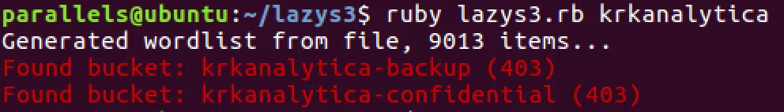
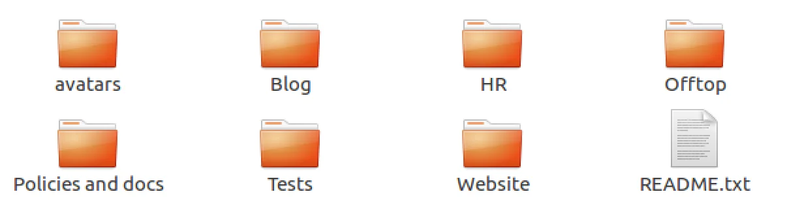
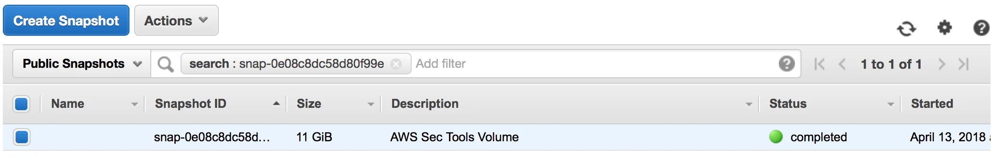
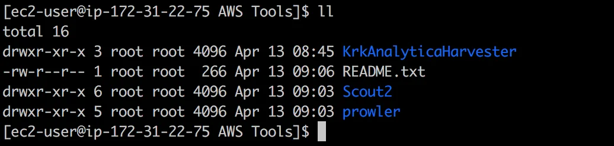
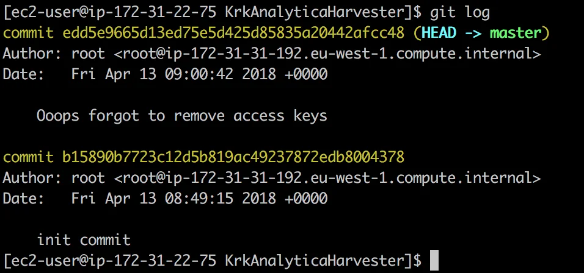
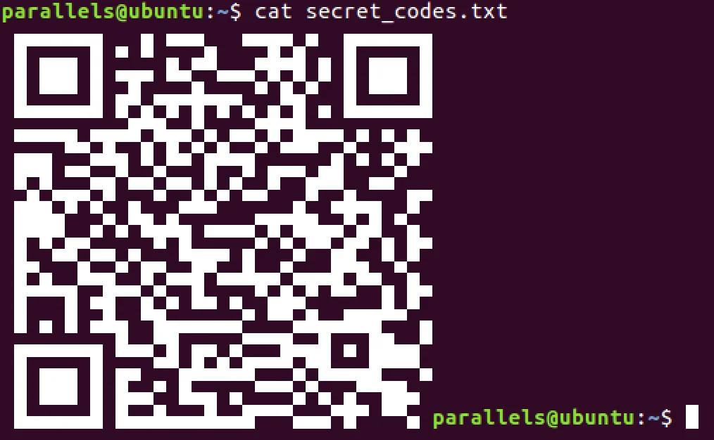

# Stop KrkAnalytica - solution

> NeverLeaks is in danger and your help is needed! An anonymous hacker reported that Krakow Analytica company had prepared some actions to sabotage a befriended producer of aircraft tanks - NeverLeaks. The sabotage campaign can be stopped only if you discover the secret codes, give an admin access to their systems. An anonymous whistleblower found out that Krakow Analytica stores the secret codes on one of their AWS S3 buckets named "krkanalytica-confidential". However, only their administrator Mike Schwarzberg has access to it. Please help us get it!

<https://confidence-conference.org/krkanalytica.html>

This is clearly a reference to the recent Cambridge Analytica scandal. Let's see this one.

**If you prefer watching then check out the video. If not, continue reading.**

[Watch on YouTube](https://www.youtube.com/watch?v=rh4nozu07QA)

# Recon

The first things I did was to do the acutal google search for the mentioned information - CEO Mike Schwarzberg and NeverLeaks. I don't know if that was pure coincidence or a deliberate choice but you can get some real hits on those. Examples [here](https://home.wellsfargoadvisors.com/michael.schwarzberg) and [here](http://neverleakcompany.com). I was expecting to find out some fake profile that might give some additional recon info. After some time I did drop this path as it was getting me nowhere. From the task description I know that I should focus on the AWS S3. Apart from that, I was pretty sure that the focus should be on some AWS vulnerabilities as one of the 5 ppl that were followed by @KrkAnalitica was [Rzepsky](https://twitter.com/Rzepsky) who writes about that topic.

# AWS Bucket

From the task description I knew that I should get into the mentioned bucket (krkanalytica-confidential) but when I tried to access it, I was getting an info that the access is denied. Still this message confirms that the bucket exists (only later I did found out that even public buckets will reply with the same error as I was not authenticated at all). At this point I did installed the [awscli](https://aws.amazon.com/cli/) to be able to operate with s3 from the CLI.

The next step was to try to use those tools that Mr. Rzepsky is [writing about](https://medium.com/securing/exploring-25k-aws-s3-buckets-f22ec87c3f2a) in his articles about AWS S3 vulnerabilities.

Firstly, I've tried to use Metasploit and it's Wayback Machine module to scan publicly available S3 buckets in the internet archive. I've waited a while, got a lot of publicly opened buckets (sth like 100k) but grepping them for something that is related with krkanalytica yielded nothing. Zero. There has to be the other way.

The othe tool that was mentioned in the article was [lazys3](https://github.com/nahamsec/lazys3) and I got a hit with it. Running it revelied that there's another `krkanalytica` bucket - `krkanalytica-backup`.

# Backup

Having this knowledge I can use the aws tool to browse the contents of it. Analysis could be done like that or they can be copied to the local disk. The easiest command to do it would be just to sync:

> aws s3 sync s3://krkanalytica-backup .

mind the (.) dot at the end

and after a moment the filed ended up on our local folder.

# Analysis

At this moment I could start analyzing the contents of this backuped data. For a moment I was thinking that I should focus on the Blog folder since there is a `users.sql` file that contains some password hashes (or something that looks like it). It didn't get me far as JtR coudn't correctly recognize them.

Rest of the files looks a bit uniteresting, just some images and excel files. But another ones are interesting. The ones in Tests folder looks promising. `Mails` and `Personal` seems something I should have a closer look.

`Personal` contains intersting ( ;-)) zip that can be extracted with the use of John the Ripper as it is password protected (pass: 123456).

But `Mails` is a real tressury. Essepcialy those ones in `Mike` folder. The first mail that got my attention was `Confidential email from alice1999.eml` that navigates to <https://tutanota.com> pointing out that there might be some encrypted mail, but clicking the link reveals that it is no longer valid. For a brief moment I've checked that maybe in the beforementioned `users.sql` there was a hash for Alice's password that could be guess and I could log into that account but I did not find any user that could be matched to her.

Another interesting conversation is the one where is this:

> I've just started to create an AWS Sec instance, where I put some tools to test our AWS resources. Soon I'll add more tools there. If you'd like to test it by yourself I made a snapshot with ID: snap-0e08c8dc58d80f99e. Please let me know how you'd like my idea :)

# Snapshots

At first I did not expect it possible but doing some browsering around (remember it's my first time with AWS) I found out that one can search for snapshots and actually there is one by that id. Something that's needs to be remembered is that it is important to correctly select the same region. By locating this snapshot it could be attached as a disk to our AWS EC2 instance.

# AWS Tools

Logging to this instance I could see that there are actual tools for AWS hardening

There are two known tools (prowler & Scout2) but the third one is unknown.

# KrkAnalyticaHarvester

Entering this folder it reveils that it is one of the tool is actualy sothing that was checked in one of the first steps of the recon. It's the [BucketScanner](https://github.com/securing/BucketScanner). A tool from Mr. Rzepsky himself.

At some point I've decided to list the files by including the '-a' option and I quickly noticed that there's a `.git` filder in in. And if you think git (but also other source control system) you think about potential information leakage in that hidden folder. If the only access would be via web then I could use tool like <https://github.com/kost/dvcs-ripper>. But since shell was provided, I've quickly run `git log` and this is what was immediately visible.

By issuing a `git log -p -2` command one can see the actual changes in each commit:

[View Gist](https://gist.github.com/pawlos/dc00cb77694feff41f216615899dfd5c)

and there are clearly visible credentials that are needed to access `krkanalytica-confidential`.

# Solution

At this point there's nothing more to be done than issuing a `aws configure` adding the credentials and then:

> aws s3 cp s3://krkanalytica-confidential/secret_codes.txt .
>  cat secret_codes.txt

QR code? Interesting. At first checking where the link goes - I was like FTW. But reading the task again it was the actual flag.

That's all - thanks @SecureRingPL. The task/competition was created by <https://www.securing.biz/en/index.html>
