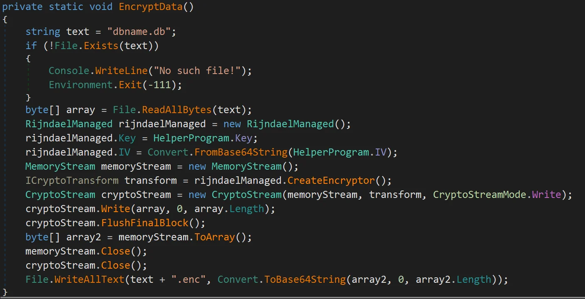
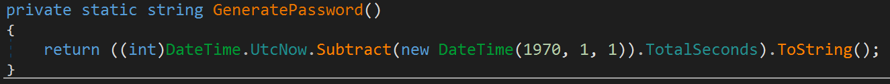
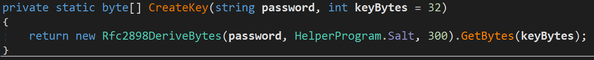
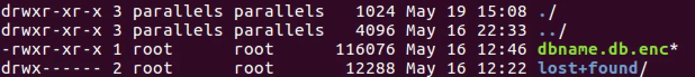
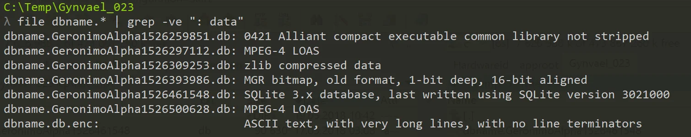
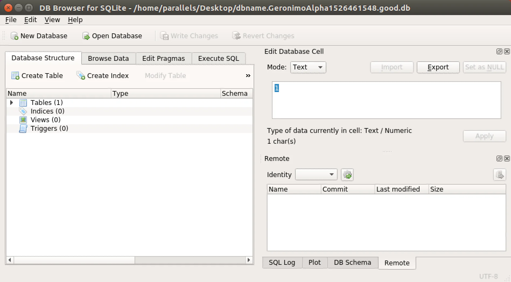
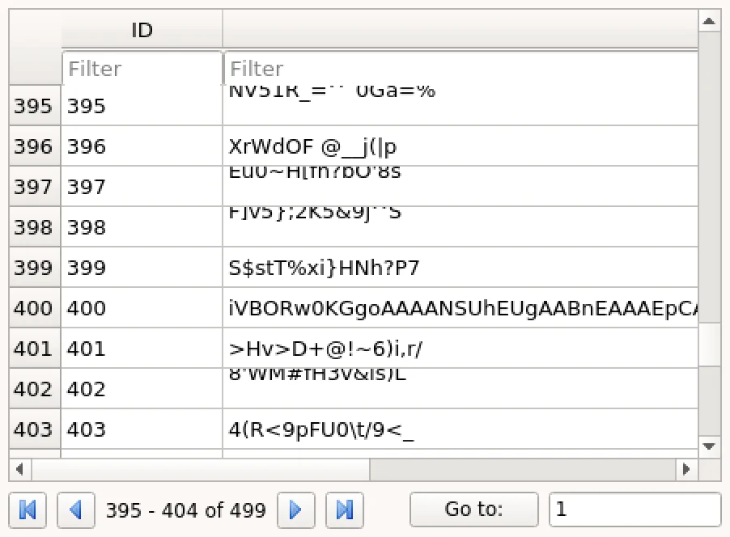
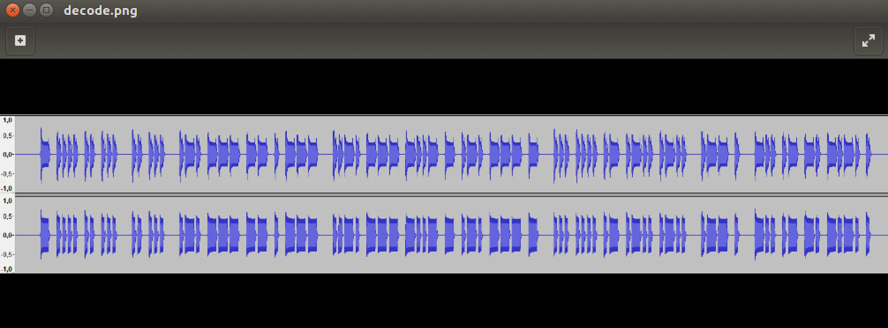

# GynvaelEN - Mission 023 - Solution

Prefere videos? You can also watch it - if not, continue reading.

[Watch on YouTube](https://www.youtube.com/watch?v=GErhZVcClv0)

Mission status: <http://gynvael.vexillium.org/ext/43bf753f/mission023.txt>

We are given the package that consists of one .exe file and `system.img`. The .exe looks like a .NET application (default name for Console project is `ConsoleApp1.exe`) but we should check that before we do any further analysis.
[code]
    ➜  23 rabin2 -I ConsoleApp1.exe
    Metadata Signature: 0x434 0x10001424a5342 12
    .NET Version: v4.0.30319
    Number of Metadata Streams: 5
    DirectoryAddress: 6c Size: 39c
    ...

[/code]

Now we can safely assume we have a .net assembly.

# ConsoleApp1.exe

I've started with a peek inside `ConsoleApp1.exe`. And since it is a .NET app there's no better tool than [dnSpy](https://github.com/0xd4d/dnSpy) for investigating its content.
After opening the app we can see that we have a simple application that encrypts a text and a `dbname.db` file.

The `EncryptData` method looks like this:

The other important parts are `GeneratePassword` and `CreateKey`.

The last parts of the puzzle are the `Salt` & `IV` that're defined as:
[code]
    HelperProgram.Salt = new byte[] { 10, 20, 30, 40, 50, 60, 70, 80};
    HelperProgram.IV = "GBVPmjy9FUDitUMeZmgUBA==";

[/code]

Ok, we're done here. Let's find the `dbname.db.enc`.

# system.img

Ok, so we now that this "malware" is encrypting the dbname.db file but where is the file? Let us see what's hiding in the second file that is delivered with the package - system.img. Running `file` on it gives us the following info:

> file system.img
>  system.img: Linux rev 1.0 ext4 filesystem data, UUID=8725a49a-a886-4a07-a360-0279942e827d (extents) (huge files)

So it looks like it's a file system that we could mount.

> mkdir /mnt/GynMission023
>  cd /mnt/GynMission023
>  mkdir /mnt/GynMIssion023/sys
>  sudo mount -t ext4 -o loop system.img sys/

Ok, so we've found our file.

# Decrypting the database

Ok, so from the analysis of `ConsoleApp1.exe`, we know that the file was encrypted. We also know that the algorithm was `Rijndael`. We have the knowledge how the key was generated and what `IV` & `Salt` were used. The only problem is that the key is derived using time and date of the infection. And that's a little bit of a problem.

But it's not something we cannot solve. Reading again the mission's status we can spot that there's a postscript note:

> P.S.2. Probably it's not important, but he has infected his computer this week.

Well, that's super important info. Knowing when the infection took place we can at least limit the range of the time & dates we need to check. It's time to do some coding - a simple program that will try to decode the file and if it doesn't fail it will store it for later, manual, investigation.

[View Gist](https://gist.github.com/pawlos/8273c8f4441d7563b60733bbd84eb1e8)

Leave it for running over a night... and inspecting the results in the morning.

# Database

After the script ended I was a bit shocked by the results it generated. ~1000 files were successfully decoded and stored to disk. That's a bit too much that I expected. I couldn't check that manually. We need a different approach.

Running `file` command reveals that most of the files are detected as `data` (false positives from decrypting). Let us just grep with an inverted match:

> file dbname.* | grep -ve ": data"

One of the results stands out. SQLite DB. From this, we also have an infection date & time: 16.05.2018 9:05:48 UTC. So my approach to go form the earliest (possible) date forward was not the optimal one ;).

To look into the DB we need a tool - I've used [SQLiteBrowser](http://sqlitebrowser.org).

Here I got so lucky. I was just browsing the data, scrolling the entries back and forth. And only by accident noticed the entry no 400. It was standing out from the rest.

A '=' at the end was a clear indication what encoding that was (or could be) - base64.

# decode.png

> echo "iVBORw0KGgoAAAA..." | base64 -d > decode.bin
>  file decode.bin
>  decode.bin: PNG image data, 1649 x 297, 8-bit/color RGBA, non-interlaced

Ok, so we rename the file and view it.

The first idea was 0, 1 encoded as long, short intervals. Converted back to ASCII codes. I discarded it quickly as there were too little entries to form enough bytes for something meaningful. The next idea was of course - The Morse code.

And it was the correct one.

# The grand finale

For a moment I was thinking if I should somehow automate this but judging from the number of items on that picture it was not so many letters. I've decided to use [Wiki's](https://en.wikipedia.org/wiki/Morse_code) entry for morse code and decode it manually and got the flag:

> THIS IS ROMEO CHARLIE SHALL WE DANCE

Awesome mission. Thanks [Foxtrot Charlie](https://twitter.com/foxtrot_0x4fult).

[Watch on YouTube](https://www.youtube.com/watch?v=rlHOy38tsIk)

Time: ~4h (not including running the script during the night)
