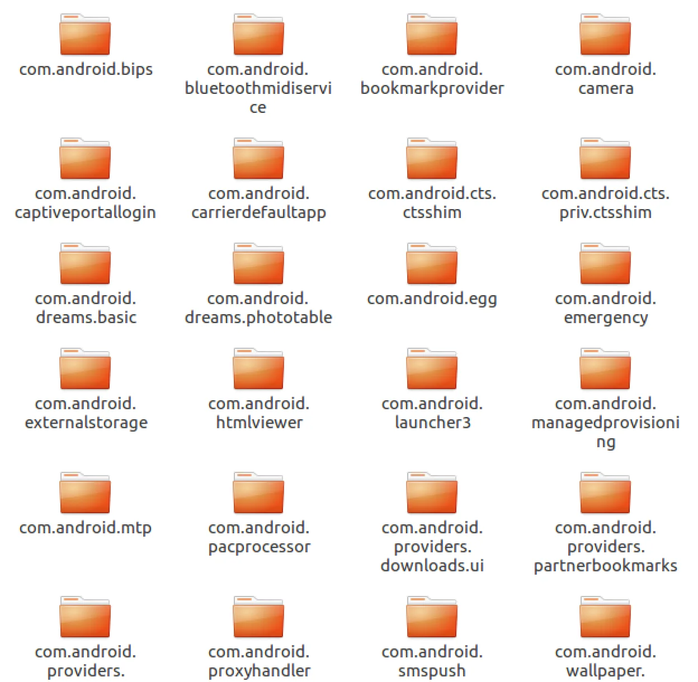
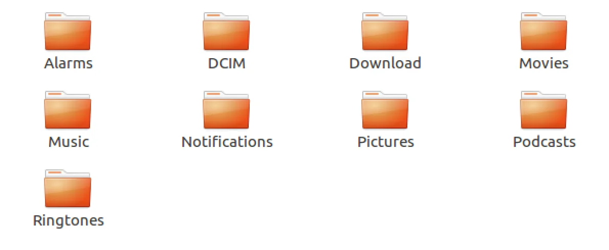

# Never ever be fooled to pay ransomware!

> — Has Your Android Phone Been Infected with Malware? — Yes! — It’s awful but we have a cure! #rev #forensics

Solved together with: [disconnect3d](https://disconnect3d.pl)

The challange was part of CTFZone 2018 Quals by BiZone. We are given a `phonedump.zip.e87a72e6edd605e73ce49dc926fc6c87` file that after unzipping produces two files: backup.android and imageinfo.txt. cat-ting the latter one gives some info about the device that was backed up.

> [Computed Hashes] Image
>  MD5 checksum: E60E8FA8C64C9FE136E1731F388CF7B0
>  SHA1 checksum: 687BCAB465DA1631B86A0EC64D92BE45EC7B96EE
>
> [Device Information]
>  Android version: 8.1.0
>  Android security patch level: July 1, 2018
>  Model: Mi A1
>  Wi-fi MAC: 04:b1:67:18:47:gg
>  Local time: 2018-07-19 15:48:54 UTC
>  Android time: 2018-01-01 07:15:37 EST
>  Shell permissions: shell
>  Serial Number: 4b26a8969905
>  IMEI 1: 867562039629283
>  IMEI 2: 867562039629291

The `file` tool on `backup.android` prints just data, but running `binwalk` correctly gives up information that this is an Android backup.

What I’ve tried first was to actually restore this backup on an emulator and this worked but did not yield any good results so I went to a manual inspection of the backup files.

# binwalk to the rescue

Since `binwalk` correctly identified this file as an Android backup let’s give it an additional flag `-e` to extract what’s inside it. After a while we got some additional files along with `META-INF` folder. Running `file` again on them helped identify the `tar` archive and after unpacking it we were presented with two folders from the Android device: `apps` and `shared`.

Apps folder

Shared folder

Here was a little bit of manual labour going through files and folders and trying to identify another interesting point of attack. And this work did payed off. In `shared/0/DCIM/Camera` were some interesting files:

  * IMG_20180101_071505.jpg.iv
  * IMG_20180101_071505.jpg.salt
  * IMG_20180101_071505.jpg.xxx

Looks like this file was encrypted (somehow) and we are give the IV, salt and the encrypted file itself. Now the job is to find out how it was encrypted.

# Looking for malware

Since the taks has malware in the name an assumption is that there was some kind of (real or fake) malware that was present on the device. I’ve started to look for evidence of those in the `~/Download` folder. There were four `.apk` that might be a potential malware. But since the phone got already infected the malware had to be present in the device already so it should be seen in the `apps` folder. Let’s try to grep the folder for any files that have ‘.xxx’ in them.

> find . -exec grep -sl xxx '{}' ;

> ./com.baileyz.aquarium/a/base.apk
>  ./com.dfwgxc.zimcdwpealgy/a/base.apk
>  ./com.dfwgxc.zimcdwpealgy/r/app_files/oat/arm64/muquieljmg.vdex
>  ./com.peacock.flashlight/a/base.apk

The two middle entries looks like something the might be our target. But the .vdex is an android bytecode. By using the [vdexExtractor](https://github.com/anestisb/vdexExtractor) we managed to get the Dalvik dex file version 035. From this one, we obtained a java source code by using dex2jar and decompiling the jar into Java with [jd-gui](http://jd.benow.ca/).

Full source code

[View Gist](https://gist.github.com/pawlos/7f71e8eb617b19d10c4241aac252c6f5)

Inspecting the code confirmed that it is the thing we are looking for as it uses ‘.xxx’,’.iv’ and ‘.salt’ strings and there are also encryption (`UIHiuhLIUHIHFiuhIUWEFHi8uh23l78ry78hfguisdh`) and decryption (`agaierughl8y3g98ersiugohserkihgoas8erg89`) obfuscated functions.
The goal now is to get the decryption one to a separate file, correct all the error and run it on the encrypted image.
The final problem was the the function `faweifunhiunfg2uylbh8734gh778ghinegkrGln18hi8123` and the result of `getDeviceId` used inside it as this is used to generate the key for the encryption routine. So in order to be able to decrypt, we need to find it. But a quick look at Android SDK documentation getDeviceId gives us the information we need - it’s IMEI and it was provided in the `deviceinfo.txt` file. We’ve got all the pieces of the puzzle we need.

# getting the flag

Afer fixing the bugs and all errors we were able to get the file decrypted.

> javac own.java
>  java own

The full script to decrypt the file is here:

[View Gist](https://gist.github.com/pawlos/0526837ee936ebbf66a5b878ee71383a)

And the flag:

