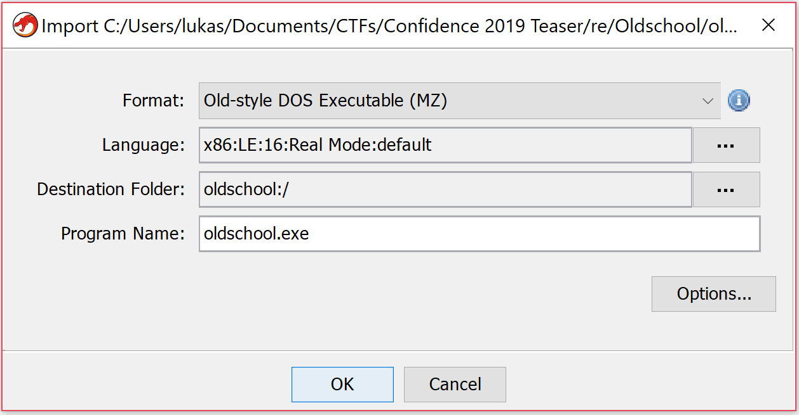

# Oldschool - CONFidence Teaser 2019

> Gynvael did a survey lately to see what kind of assembly is taught in Polish universities, and if any of them is still teaching the old 8086. Let us extend this question to the CTF scene!

This challenge is a clear reference to Gynvael's survey which is obvious from the description but it might be also a reference to a task that was part of Dragon Sector's CTF in 2018. There, the task was called Oldskul[1].

* * *

  1. I still need to post a solution from that task too ;) ↩︎

What we get is a small gz file (646 B) and this is what we get when extracting its content.
[code]
    ➜  Oldschool ll
    total 8.0K
    -rwxrwxrwx 1 ubuntu ubuntu  344 Mar 15 14:21 flag.txt
    -rwxrwxrwx 1 ubuntu ubuntu 1.1K Mar 13 23:55 oldschool.exe
    -rwxrwxrwx 1 ubuntu ubuntu  646 Mar 29 17:55 oldschool_235e68c1b24b17463a010e8ca0d0ac2df0c4514286e0e490aabd1b25b8ae1168.tar.gz

[/code]

Immediately visible `flag.txt` gives us something that it's not clearly understandable from the beginning.
[code]
    ➜  Oldschool cat flag.txt
                 4   { 4 p p
               p   { k 4 {   E
             p   4 4 p {   p
               4   p
                 S

     %

[/code]

Let's hope it will be more clear when we analyze the binary. Running `file` on the binary reveals that in fact this is an old school stuff - an `MS-DOS Executable`.
[code]
    ➜  Oldschool file oldschool.exe
    oldschool.exe: MS-DOS executable

[/code]

Let's try to run it an see what we get. We can't run it directly but for such situations we have [DosBox](https://www.dosbox.com/).

After running DosBox we `mount` the folder that contains our files and execute it.

Running oldschool.exe in DosBox. 8.3 names are back!

I would normally open this file in `r2`, but I've decided to give a [Ghidra](https://ghidra-sre.org/) a try with this one. I had some experience with the tool before the CTF but it was just playing around so nothing too difficult.

Upon loading the binary in the Ghidra identifies the file as 16-bit in Real-mode.

This is in fact old. But not so old for me as my initial experience with ASM was in fact 16-bit in real mode. So seeing the code was only bringing back old memories (back in the days I was coding some stuff in ASM - you can find some of the work on [my YT](https://www.youtube.com/watch?v=zoOPUa-0cqc&list=PL8bwawVZNV0wZm8JCbbICG2pvfL7qRVr2)). So let's in fact look at the code.

After the initial analysis only 4 functions were created and one of them was `entry` so we being our exploration from there.

Only 4 functions were identified after the analysis.
[code]
       entry                                           XREF[1]:     Entry Point (*)
       100f:0000 b8  24  10       MOV        AX,0x1024
             assume SS = <UNKNOWN>
             assume SP = <UNKNOWN>
       100f:0003 8e  d0           MOV        SS,AX
       100f:0005 b8  90  01       MOV        AX,0x190
       100f:0008 8b  e0           MOV        SP,AX
[/code]

The initial part sets up stack segment (`SS`) and pointer(`SP`). And after that prepars to display the string:
[code]
       100f:000a b8  00  10       MOV        AX,0x1000
       100f:000d 8e  d8           MOV        DS,AX
       100f:000f be  00  00       MOV        SI,0x0
       100f:0012 b4  09           MOV        AH,0x9
       100f:0014 ba  a2  00       MOV        DX,0xa2
       100f:0017 cd  21           INT        0x21

[/code]

If you are not familiar with DOS the it's worth to mention that application communicated with it with interrupts. The most useful one was (probably) `0x21`. The standard was that you had to prepare some registers and in `AH` the operation number was passed. In this case we are setting to be `AH=0x9` so we are going to display a string on screen.

Now it's a good time to find some resource on DOS interrupts. Back in the day the ultimate source was [Ralf's Brows Interrupt List](http://ctyme.com/rbrown.htm). You could find everything there. Of course you would have to have it downloaded first as internet access was not so common as nowadays. During this challenge there was only few method used so no comprehensive reference to DOS interrupts was needed. I've remember `0x9` (and few others) by heart.

So let's analyze the above part of code. In `0x9` command we need to pass the segment & offset to the string we want to display in `DS:DX` pair of registers. Segment registers cannot be set to literal value directly so we need to pass `0x1000` to DS indirectly via `AX`. `DX` points to the offset. So the string we want to display is located at: `0x1000:0xa2`. Let's go there in Ghidra and see if we are correct:
[code]
    1000:00a2 0a  47  69       ds         "
Give me a flag to draw!
$ p4{krule_ctf}
I
              76  65  20
              6d  65  20

[/code]

Clearly we can see some text "Give me a flag to draw!
", but it's looks like it's not terminated and Ghidra shows some more characters. This is in fact correct as the string that `0x9` command accept should be '$'-terminated. And we see the character there. So we get the first part of this CTF correctly. Next we have the call to `FUN_100f_0058`. Let's see what's there.

This method begins with something that looks like a preparation code and just after that we see another `int 0x21` being used.
[code]
      LAB_100f_0069                                   XREF[1]:     100f:0081 (j)
       100f:0069 b4  01           MOV        AH,0x1
       100f:006b cd  21           INT        0x21

[/code]

This time `0x1` is passed to `AH` and if we check any reference of this one we will get information that this is used to read character from STDIN. The character is returned in `AL`. We could now rename this method as `read_flag` (Ghidra uses `L` shortcut to open rename dialog box).

And this is consistent with the code we see next
[code]
       100f:006d 3c  3a           CMP        AL,0x3a
       1000:015f 72  37           JC         LAB_100f_00a8
       1000:0161 3c  47           CMP        AL,0x47
       1000:0163 72  45           JC         LAB_100f_00ba
       1000:0165 3c  67           CMP        AL,0x67
       1000:0167 72  37           JC         LAB_100f_00b0
       1000:0169 eb  49           JMP        LAB_100f_00c4

[/code]

This is clearly a bounds check code. We could right client on right side of `CMP`-s opcode and use a Convert sub-menu and then `Char` to actually instruct Ghirda to display it as a character instead of hexadecimal value. We will see the boundaries are set at: `:`, `g` or `G`. It might be not clear from the first sight but if we check ASCII table we get that ':' is right after digits and of course 'g' or 'G' is right after 'f' (and 'F') so it might be that this method accepts only hexadecimal digits as input. Let's verify that running the program again.

We can clearly see that going outside the valid range of hexadecimals stops the immediately but staying withing range allows us to go until the whole key is accepted.

Using a character from outside hexadecimals stops the programStaying withing range allows us to keep entering flag up to 18 chars and see something similar that we saw in flag.txt

This looks a bit familiar to the stuff we saw in `flag.txt`. Let's try to see if we can find in this method a place where we display the text "Invalid input, bye bye!". That would confirm that we in fact correctly identified that it does.
[code]
       100f:00c4 ba  ca  00       MOV        DX,0xca
       100f:00c7 b4  09           MOV        AH,0x9
       100f:00c9 cd  21           INT        0x21
       100f:00cb e9  62  ff       JMP        LAB_100f_0030
[/code]

Scrolling a bit further down we bump into already known operation - `0x9` with offset of the string set to be `0xca`. And if we check an address of `0x1000:0xca` we find our string. WooHoo!

Let's see if we can figure out what this function does with the characters it reads from the console.

If we look closer we notice there are too loops inside. The outer one that runs 9 times ( `mov cx,09 @ 100f:005e`) and the inner only 2 times ( `mov cx, 02 @ 100f:0062`). The inner part is rather easy to analyse and the core part is the following:
[code]
       100f:007b f6  e3           MUL        BL
       100f:007d 02  d0           ADD        DL,AL

[/code]

In `BL` we have `0x10`, `AL` contains the currently read character value (in hex) and `DL` previously calculated value. So this method just converts 2 read characters int a number in hex.
[code]
    value = first_read_hex_char * 0x10 + secondly_read_hex_char

[/code]

But that's not the end of this function. Right after we calculate the `value` there's another function that does some transformations. It's also a loop but this time we loop 4 times.

In those four iterations we can distinguish 3 phases.
[code]
     LAB_1000_0176                                   XREF[1]:     100f:00a2 (j)
       1000:0176 8a  c2           MOV        AL,DL
       100f:0088 24  01           AND        AL,0x1
       100f:008a 74  63           JZ         LAB_100f_00ef
       100f:008c eb  7a           JMP        LAB_100f_0108

[/code]

1st one is checking the lowest bit of the value from the user and jumping accordingly.
[code]
    LAB_100f_008e
       100f:008e 8a  c2           MOV        AL,DL
       100f:0090 24  02           AND        AL,0x2
       100f:0092 74  3a           JZ         LAB_100f_00ce
       100f:0094 eb  48           JMP        LAB_100f_00de

[/code]

2nd one is checking the bit no 1 and jumping to specific parts based if it's zero or not.

And the third part is shifting the value by 2 - that would correspond that we are done with the 2 bits and prepare for another two. Apart from that we see some array manipulation pointed by `SI`.
[code]
    LAB_100f_0096
           100f:0096 51               PUSH       CX
           100f:0097 b1  02           MOV        CL,0x2
           100f:0099 d2  ea           SHR        DL,CL
           100f:009b 59               POP        CX
           100f:009c 8a  1c           MOV        BL,byte ptr [SI]
           100f:009e fe  c3           INC        BL
           100f:00a0 88  1c           MOV        byte ptr [SI],BL

[/code]

We remember that what we get in `AL` is a byte of data and byte is 8x2bit so those manipulations are done on every 2bit element of provided byte. Ok, this is clear now what we are actually doing based on those bits and what is this thing pointed by `SI`.

If we check the address pointed by `SI` we can see there's a lot of empty space ( `0x00`). There are four cases that we execute.
Based on bit-`0`:
[code]
     bit_0_is_zero
       100f:00ef bf  00  00       MOV        DI,0x0
       100f:00f2 3b  f7           CMP        SI,DI
       100f:00f4 74  98           JZ         check_bit_1
       100f:00f6 8b  c6           MOV        AX,SI
       100f:00f8 b3  12           MOV        BL,0x12
       100f:00fa f6  f3           DIV        BL
       100f:00fc 80  fc  00       CMP        AH,0x0
       100f:00ff 74  8d           JZ         check_bit_1
       100f:0101 8b  de           MOV        BX,SI
       100f:0103 4b               DEC        BX
       100f:0104 8b  f3           MOV        SI,BX
       100f:0106 eb  86           JMP        check_bit_1

[/code]
[code]
    bit_0_is_one
       100f:0108 bf  00  00       MOV        DI,0x0
       100f:010b 3b  f7           CMP        SI,DI
       100f:010d 74  0e           JZ         LAB_100f_011d
       100f:010f 8b  c6           MOV        AX,SI
       100f:0111 b3  12           MOV        BL,0x12
       100f:0113 f6  f3           DIV        BL
       100f:0115 80  fc  10       CMP        AH,0x10
       100f:0118 75  03           JNZ        LAB_100f_011d
       100f:011a e9  71  ff       JMP        check_bit_1
       100f:011d 8b  de           MOV        BX,SI
       100f:011f 43               INC        BX
       100f:0120 8b  f3           MOV        SI,BX
[/code]

We do here some additional checks but what the main part is doing is to add `1` (when bit `0` is `1`) or subtract `1` (when bit `0` is `0`) from `SI`.

For the bit number 1:
[code]
    bit_1_is_zero
       100f:00ce 8b  de           MOV        BX,SI
       100f:00d0 83  fb  11       CMP        BX,0x11
       100f:00d3 77  02           JA         more_than_one_row
       100f:00d5 eb  05           JMP        LAB_100f_00dc
       100f:00d7 83  eb  12       SUB        BX,0x12
       100f:00da 8b  f3           MOV        SI,BX

[/code]
[code]
     bit_1_is_one
       100f:00de 8b  de           MOV        BX,SI
       100f:00e0 81  fb  8f  00   CMP        BX,0x8f
       100f:00e4 72  02           JC         not_the_last_row
       100f:00e6 eb  05           JMP        last_row
       100f:00e8 83  c3  12       ADD        BX,0x12
       100f:00eb 8b  f3           MOV        SI,BX

[/code]

Here we just add `0x12` or subtract `0x12` based on the bit value. If we look at those index changes we see that this is moving to adjacent cells diagonally - `00 - NW`, `01 - NE`, `10 - SW` and last `11 - SE`. Lastly we mark the new visited cell by increasing the value that is stored in there.

So to sum up, in this method we read 9 hexadecimal values from the user. We look at each value as 4 separate 2-bit entries and we use those to compute new index in the table. The rules of converting the 2-bit are as follows

bit 0/1 | 0 | 1
---|---|---
0 | NW | NE
1 | SW | SE

On entering the new field we add 1 to value stored there.

Just to confirm what we analyzed we can do a debugging session. I pulled some old Turbo Debugger (good old DOS times!) to see if it works as described above.

Debugging session after few rounds of valid input and a invalid one

After few single steps we can see that in fact it behaves as we expected.

Function `FUN_100f_0125` takes our array and a string `p4{krule_ctf}` (with a space at the front) and replaces entries in the array with a character located at the same position as the value in the cell. So if we walked certain cell once we will have character `p` (remember there's a space at the beginning of the string). If we visit it twice we will have `4` and so on. After the whole array checked we will end up with something like this (bottom part):

Right after generating our flag

This is again, something that does look familiar. Remember what we get after entering valid hexadecimal characters and also what's in `flag.txt`? Ok, so our task is to "walk" through the table so that we cross each cell as many times so that when replaced the index with characters from `p4{krule_ctf}` will produce the same flag as the one in `flag.txt`. Now is the time to write some script.

We know that the initial value should be `p4{` so we have our starting point.
[code]
    bit_len=16
    shifts=24

    solution=[0x7b3470]

[/code]

In my solution I've put that in a python script and include this in a main one. This way I was running script for next steps only and not run it once and got the final results. Easier to spot a problem (and I had few of those during coding).

String is converted into hex and reversed as this was it was easier to extract bits the same way as the original algorithm would do it.

The main script contains of the following:
1) The flag that we want to get at the end
[code]
    original = [0,0,0,0,0,0,0,0,2   ,0,3,2,1,1,0,   0,
                0,0,0,0,0,0,0,1,0   ,3,4,2,3,0,0xff,0,
                0,0,0,0,0,0,1,0,2   ,2,1,3,0,1,0   ,0,
                0,0,0,0,0,0,0,2,0   ,1,0,0,0,0,0   ,0,
                0,0,0,0,0,0,0,0,0xfe,0,0,0,0,0,0   ,0]

[/code]

Values in each cell indicates how many times we want to cross certain cell. `0xfe` indicates starting position and `0xff` is the cell where we should end.

After that we load the next solution from the file given as an input to this script:
[code]
    import importlib
    a=importlib.import_module(sys.argv[1])

[/code]

And the main method for solving
[code]
    def solve():
    	print('#'+str(len(a.solution)))
    	new_sol = []
    	sol_len = len(a.solution)
    	while sol_len > 0:
    		partial = a.solution[0]
    		if partial in a.solution:
    			a.solution.remove(partial)
    			sol_len = len(a.solution)
    		for c in xrange(0x30,0x7d+1):
    			if chr(c) not in string.digits and chr(c) not in string.ascii_lowercase and chr(c) != '}':
    				continue
    			idx = 72
    			if original[idx] != 0xfe:
    				break
    			flag = original[:]
    			correct = True
    			p = (c << a.shifts) + partial
    			clone = p
    			for k in range(a.bit_len):
    				b = p & 3
    				if b == 0:
    					idx -= 17
    				elif b == 1:
    					idx -= 15
    				elif b == 2:
    					idx += 15
    				elif b == 3:
    					idx += 17
    				if idx < 0:
    					idx += 16
    				if idx < 0 or idx > len(flag):
    					correct = False
    				if flag[idx] == 0 or flag[idx] == 0xfe:
    					correct = False
    					break #we can't step on zero's
    				flag[idx] -= 1

    				p >>= 2
    			if correct:# and idx==30:
    				#print("#[+] Potential successful num: {0:x}".format(clone))
    				new_sol.append(clone)
    	return new_sol
[/code]

The main idea is that we iterate through potential characters and add them to the list of potential solutions generated by the previous run. When we have what might be a solution we check if applying the algorithm over this input keeps us withing the boundaries - so that we do not cross any cell too many times. If so we add it to a lit of potential solutions but longer by one char. With such algorithm what we need to do is run the sequence of commands:

> python solv.py sol3 > sol4.py
> python solv.py sol4 > sol5.py
> python solv.py sol5 > sol6.py
> python solv.py sol6 > sol7.py
> python solv.py sol7 > sol8.py
> python solv.py sol8 > sol9.py

Each step runs gives us a new file with potential & partial solution that we feed into the script for next round. And after all, in `sol9.py` we have the list of potential flags. Since we started from `p4{` all of them will have that quality but not all of them will end up with `}`. So we pick one that has `0x7d` at the beginning (remember that they are reversed) and it was `0x7d31366269747b3470` and converting it to characters and reversing gave `p4{tib61}` and that was accepted as a flag.

The whole script can be found [here](https://gist.github.com/pawlos/f75a0b6d2f2ed7923de86d6ccb0d54cc). I hope you've enjoyed reading this - if you did share it. HF & GL
