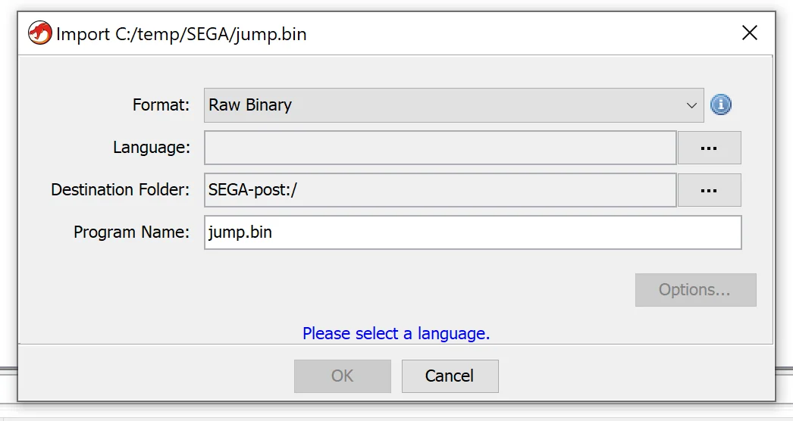
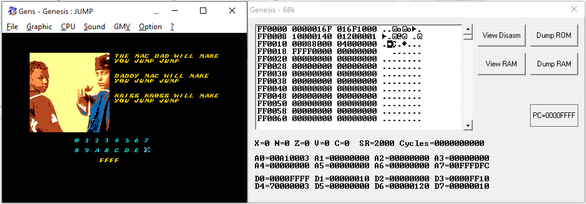

# Solving SEGA Genesis ROM CTF Challenge

File fot the challenge can be downloaded from [here](https://github.com/zznop/jump/tree/master/bin). In order to run the file we need an emulator. There are few available but I've used [gens](http://gens.me/). Probably a better one could be found but at least for my purpose this was enough. After running `gens` and loading the `jump.bin` we see this:

Main screen of the challenge

We can play with it a little bit to see what's possible (maybe some easy pass will get us somewhere) but in the end we need to do our analysis.

We will use GHIDRA here. Without some work, the ROM wont be recognized correctly by GHIDRA. We have to set the correct processor type to 68000 but ROM is not just the code.

GHIDRA needs our help here.

We can skip the auto analysis as that won't give us much. We do not get much more that what would simple hex editor would give.

Luckily the tool is highly scriptable and there are scripts available to do the work for us. For this purpose just download the GHIDRA scripts from CTF author's repository [here](https://github.com/zznop/ghidra_scripts). And put them into your `ghidra_scripts` folder (I've used the one in $HOME directory). After doing this, open the Script editor and pick the `Binary` category and from that choose `GenesisVectorTable.java`.

Our new scripts are ready to be used

And just run it. If everything wen find (and it should) you should see some more clear information in the disassembly now.

Some things starting to make sense now.

The most important thing, for now, is the `PtrProgramStart` which tells us where we should look for the code. Let's go there by double clicking it. If you're not familiar with 68000 assembly (I wasn't) it might be scary. GHIDRA will try to show decompiled code but with this processor type it's not so good (at least for me) but it is something. By brief look at the code we can identify something that looks to be the main loop of the challenge.

Is it the main loop?

What we "just" need to do is to analyze those few functions and we should be good to go ;).

Before we jump into analyzing the function let's see what other features our emulator has. Inside CPU -> Debug menu we have Plane explorer and another submenu with processors that allows us to see CPU registers, RAM and ROM. Those will come handy in a moment.

Plane explorer allows to inspect visual planes of the deviceThis gives an insight into CPU, RAM and ROM

Let's use `View RAM` button and play with the challenge a little bit. We can quickly identify some placed that being updated when we navigate through the letters or press `A`.

Playing with the challenge and checking RAM memory

From that easy exercise (it might not be easily seen from the above gif) we can list that:

  * A byte at `0xFF0006` holds the input button when it's being pressed (arrows, or `A`)
  * A word at `0xFF0018` holds what we entered as the flag

Having that we can jump back to our analysis.

With the above knowledge we can easily identify `0xFF0006` being used in the main loop. Our assumption is also that one of those methods needs to draw:

  * the image
  * the text on the right side of the image
  * the num pad
  * and finally our entered key/flag

I had not really much knowledge how the drawing is done, but inspecting the `Plane Explorer` view give some ideas that we might be dealing with some sprites that are preset and rendered using the index.

If we go the method `FUN_000008da` we can see something similar:
[code]
        000008ea 23 fc 60        move.l     #0x60a40003,(VDP_CONTROL).l
                 a4 00 03
                 00 c0 00 04
        000008f4 33 fc 00        move.w     #0x26,(VDP_DATA).l
                 26 00 c0
                 00 00
        000008fc 33 fc 00        move.w     #0x1a,(VDP_DATA).l
                 1a 00 c0
                 00 00
        00000904 33 fc 00        move.w     #0x17,(VDP_DATA).l
                 17 00 c0
                 00 00
        0000090c 33 fc 00        move.w     #0x0,(VDP_DATA).l
                 00 00 c0
                 00 00
        00000914 33 fc 00        move.w     #0x1f,(VDP_DATA).l
                 1f 00 c0
                 00 00
        0000091c 33 fc 00        move.w     #0x13,(VDP_DATA).l
                 13 00 c0
                 00 00
        00000924 33 fc 00        move.w     #0x15,(VDP_DATA).l
                 15 00 c0
                 00 00
        0000092c 33 fc 00        move.w     #0x0,(VDP_DATA).l
                 00 00 c0
                 00 00

[/code]

Inspecting few first instructions gives us clear indication that this method prints the text that's located to the right of the image, so we can name it like that.

If we do the same analysis of the `FUN_00000c60` we see similar pattern. This time
[code]
    undefined FUN_00000c60()
        0000028a(c)
        00000c60 72 02           moveq      #0x2,D1
        00000c62 74 07           moveq      #0x7,D2
        00000c64 23 fc 49        move.l     #0x49140003,(VDP_CONTROL).l
                 14 00 03
                 00 c0 00 04

[/code]

First two lines initialize two some variables. The `D2` one will later be used to execute loop body 8 times. This is exactly what we need to print one line of the num pad. The first item in this pad has id of `0x2002` and this is what we see in the following lines:
[code]
            00000c6e 36 01           move.w     D1w,D3w
            00000c70 00 43 20 00     ori.w      #0x2000,D3w
            00000c74 33 c3 00        move.w     D3w,(VDP_DATA).l
                     c0 00 00
            00000c7a 33 fc 00        move.w     #0x0,(VDP_DATA).l
                     00 00 c0
                     00 00
            00000c82 52 41           addq.w     #0x1,D1w
            00000c84 51 ca ff e8     dbf        D2w,LAB_00000c6e

[/code]

The two lines will result in `0x2002` in `D3w` and later we will add `0x1` by every loop iteration.

Few lines later we have similar code that does the same for the second line. Knowing that we can rename this function to `print_num_pad`.

The main function is a bit clearer now, but we still have some unclear references to unravel. One would be the memory location of `0xFF0008`. Inspecting RAM at that address does not reveal anything specific but by looking on how it is used it could be assumed that it's also a variable that contains an input. Seeing code that compares it with `0x40` (`A`) or `0x10` (`S`) is a strong indicator of that. We can take a guess and rename it to `probably_input`. Now the main loop is even more clear
[code]
    if ((probably_input & 0x10) != 0) {
      FUN_00000d28();
    }
    unaff_D7w = 0;
    if ((probably_input & 0x40) != 0) {
      FUN_00000414();
      FUN_000003a4();
    }
[/code]

If our assumption is right then `FUN_00000d28` is a function that contains code responsible for executing code when we press `S` (we haven't tested that yet) and `FUN_00000414` & `FUN_000003a4` are responsible for handling when user press `A`.

Before we jump into the analysis of those function let's first check what happens when we press `S` in the challenge.

In most cases we end up in `0xd60c` but sometimes we can end up in the same address that we've entered in the challenge.

FFFF as input and PC in the same place? Interesting.

That gives as information that we can somehow control the PC and direct it to any address in the ROM. We just need to find out where we need to be. Let's start analyzing those methods.

Let's start with `FUN_00000d28`. The code for this function is not long
[code]
    undefined FUN_00000d28()
        00000d28 30 39 00        move.w     (DAT_00ff0018).l,D0w
                 ff 00 18
        00000d2e 02 80 00        andi.l     #0xffff,D0
                 00 ff ff
        00000d34 61 00 00 02     bsr.w      FUN_00000d38

[/code]

We know from our initial analysis that `DAT_00ff0018` holds our password. So in the next line we are limiting the entry to 2 bytes and we call another function `FUN_00000d38` remembering that in `D0w` holds the password.
[code]
    FUN_00000d38
        00000d38 2e 80           move.l     D0,(SP)=>local_res0
        00000d3a 4e 75           rts

[/code]

This function is even shorter. Remembering that `D0` has our password (as a int) we can interpret this code as:

  * exchange return address with the value stored in `D0`
  * return, so basically jump do user specified position

This explain the fact that sometimes we can end up with PC equal to user specified input. Now the real question is where should we jump?

Looking at this `FUN_00000d38` we can spot some unrecognized bytes
[code]
        00000d3c 33              ??         33h    3
        00000d3d fc              ??         FCh
        00000d3e 45              ??         45h    E
        00000d3f 53              ??         53h    S
        00000d40 00              ??         00h
        00000d41 ff              ??         FFh
        00000d42 00              ??         00h
        00000d43 20              ??         20h
        00000d44 4e              ??         4Eh    N
        00000d45 75              ??         75h    u
        00000d46 4e 73           rte

[/code]

But this `rte` at the end looks oddly suspicious. Maybe we should try to decode is as opcodes? In Ghidra we can do this by using `D`. After that we get some additional code:
[code]
        00000d3c 33 fc 45        move.w     #0x4553,(DAT_00ff0020).l
                 53 00 ff
                 00 20
        00000d44 4e 75           rts
        00000d46 4e 73           rte

[/code]

Interesting. We set a value `0x4553` and store it in `0xFF0020` a new memory address.

So providing a password as `0d3c` and pressing `S` we should get `0x4545` in RAM memory `0xFF0020`. Let's see if our assumptions are correct:

Nice! We get `0x4553` where we expect it to be! But where the flag? Since we found one part that was hidden maybe there's more? This part is not really scientific one byt by scrolling through the code we see another one. At the address `0x034c` we see a similar bytes
[code]
        0000034c 30              ??         30h    0
        0000034d 39              ??         39h    9
        0000034e 00              ??         00h
        0000034f ff              ??         FFh
        00000350 00              ??         00h
        00000351 20              ??         20h
        00000352 41              ??         41h    A
        00000353 fa              ??         FAh

[/code]

that turns to the code after pressing `D`.
[code]
        0000034c 30 39 00        move.w     (DAT_00ff0020).l,D0w
                 ff 00 20
        00000352 41 fa 2a 3c     lea        (0x2a3c,PC)=>DAT_00002d90,A0                     = 5E4Eh
        00000356 34 18           move.w     (A0)+=>DAT_00002d90,D2w                          = 5E4Eh
        00000358 b1 42           eor.w      D0w,D2w
        0000035a b3 42           eor.w      D1w,D2w
        0000035c 0c 42 5a 5a     cmpi.w     #0x5a5a,D2w
        00000360 66 00 00 30     bne.w      LAB_00000392
        00000364 34 18           move.w     (A0)+=>DAT_00002d92,D2w                          = 4A44h
        00000366 b1 42           eor.w      D0w,D2w
        00000368 b3 42           eor.w      D1w,D2w
        0000036a 0c 42 4e 50     cmpi.w     #0x4e50,D2w
        0000036e 66 00 00 22     bne.w      LAB_00000392
        00000372 23 fc 4c        move.l     #0x4c060003,(VDP_CONTROL).l
                 06 00 03
                 00 c0 00 04

[/code]

This is interesting. We again see that memory location of `0xFF0020` is being referenced. Also we see some `XOR` with `0x5E4E` and `0x4A44` and with an unknown value that is passed in `D1w`. This one is better visible on the decompiled code here:
[code]
    if (((ushort)(in_D1w ^ _DAT_00ff0020 ^ DAT_00002d90) == 0x5a5a) &&((ushort)(in_D1w ^ _DAT_00ff0020 ^ DAT_00002d92) == 0x4e50)) {

[/code]

And when this condition is met we go to a function that looks like printing the flag. So we need to get this right `[0xff0020] ^ 0x5E4E == 0x5a5a` and `[0xff0020] ^ 0x4A44 == 0x4e50` we get the flag. So let's see what the value should be:

> python
> hex(0x5a5a ^ 0x5e4e)
> '0x414'
> hex(0x4a44 ^ 0x4e50)
> '0x414'

Ok. It should be `0x414` but for know we only know how to put `0x4553` in that field. We need to get some more hidden code. More scrolling technique and we locate the address of `0x2d86` with the following code:
[code]
        00002d86 32 3c 41 47     move.w     #0x4147,D1w
        00002d8a 61 00 d5 c0     bsr.w      FUN_0000034c                                     undefined FUN_0000034c()
        00002d8e 4e 75           rts

[/code]

This is the exactly missing part that we needed. So in order to solve this we would need to perform the following combination:

`0x0d3c` -> `S` -> `0x2d86` -> `S`

Let's check that.

Voilà!
