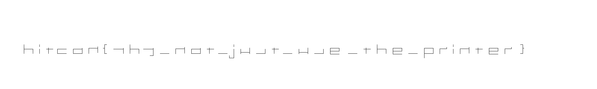

# Hitcon 2019 Qualification - EV3 Arm

It's one of those challenges that brings together two things that I like - this time it was reverse engineering nad lego bricks.

What was the input in this challenge was a picture that, supposedly depict how the robot was programmed and a `rbf` file that contains the aforementioned robot states.

* * *

We could spend some time analyzing the binary format of `rbf` file but during the CTF if you can get something done quicker it's usually a way to go. In this challenge it's possible to obtain the textual form. [<http://ev3treevis.azurewebsites.net/>](http://ev3treevis.azurewebsites.net/) can extract the meaningful data from binary file.

The data that's inside looks like the following:

data
├─ MediumMotor.Degrees brake: 0 | port_motor: B | rotations: 35 | speed: -15
├─ MediumMotor.Degrees brake: 0 | port_motor: A | rotations: 720 | speed: -75
├─ MediumMotor.Degrees brake: 0 | port_motor: B | rotations: 35 | speed: 15
├─ MediumMotor.Degrees brake: 0 | port_motor: A | rotations: 360 | speed: 75
├─ MediumMotor.Degrees brake: 0 | port_motor: B | rotations: 35 | speed: -15
├─ Motor.Rotations brake: 1 | port_motor: C | rotations: 2 | speed: 70

and so on. Each line represent a movement of one of the motors that the robot is equipped with. Motor: `B` is the one that controls the pen - if the speed is `-15` the pen is lowered down to touch the paper. If it's `15` it is being raised up. Motor: `A` is the one that controls the arm of the robot. The last one, motor `C` is controlling the movement of the robot. Equipped with this information we can try to write a python script that recovers the flag.

[View Gist](https://gist.github.com/pawlos/c36dd82f6e535ad92522e2f83d6327cd)

Not much to explain. We will just go line by line and draw the flag using [PIL](https://www.pythonware.com/products/pil/) library. After running the script this is what we get:

Some letter are not clearly readable but we can assume something. And this is due to the `FORK` entries in the text file. Apparently two, or more engines can move simultaneously to draw more complex lines than vertical and horizontal ones. To correctly draw those we would have to implement this in our simple script. But we don't have to.

We know that the flag starts with `hitcon` so we can match `n` to the first unreadable character. And the 3rd word in the curly braces could be `just`. With that it gives us the: `not_just_use_the_printer}`. So the flag might be `hitcon{why_not_just_use_the_printer}` which is correct flag. An educated guess.

[Watch on YouTube](https://www.youtube.com/watch?v=v4uJb8waCXc)
