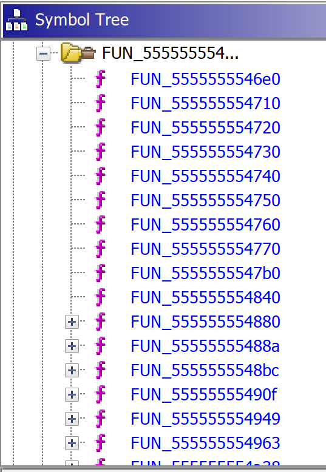

# Core Dumb - HitCon 2019

_Note: challenge was solved together with[Disconnected](https://twitter.com/disconnect3d_pl)._

> Damn it my flag checker is so buggy it destroyed the program itself 😱
> All I left is a core dump file :(
> Could you help me recover the flag ? Q_Q

Let's start by checking the file that we are given in this challenge:

> λ file core-3c5a47af728e9968fd7a6bb41fbf573cd52677bc
> core-3c5a47af728e9968fd7a6bb41fbf573cd52677bc: ELF 64-bit LSB core file, x86-64, version 1 (SYSV), SVR4-style, from '/home/ctf/flag_checker'

So we are sure that this is a core dump, but what I did not know that such file can be opened in Ida or Ghidra without any problems. I always had the impression that only `gdb` can handle those. Anyway, during the competition we did use Ida but I'll use Ghidra with the decompiler during the writeup.

[Watch on YouTube](https://www.youtube.com/watch?v=x5Eu2CDWfz4)

## Static analysis with Ghidra

After opening the file in Ghidra and analyzing it we can see a couple of function in the memory range of `0x55555555xxxx` but only one of them could be considered interesting - at least from the first look: `0x555555554c7e`.

The fact that it contains strings like "Please enter the flag:" and "Congratz! The flag is `hitcon{%s}`" :)
" was also a strong indicator that it's the right place to start. From the string usages we can quickly identify that `FUN_555555554730` is some kind of `printf` or `puts` and `FUN_555555554740` reads the flag - up to `0x37` characters and stores it in variable `local_d8`. Later we see the check that in fact limits the flag length to `0x34` characters.

[code]
    iVar1 = FUN_55555555488a(flag);
    if (iVar1 != 0x34) {
      FUN_555555554949();
    }
[/code]

After that we see a series of calls
[code]
    FUN_5555555548bc(&local_98,flag,10,flag);
    FUN_555555554a38(local_128,local_120,&local_98,10);
    FUN_55555555490f(&local_98,0x37);
    FUN_5555555548bc(&local_98,flag + 10,8,flag + 10);
    FUN_555555554b0c(local_118,local_110,&local_98,local_118);
    FUN_55555555490f(&local_98,0x37);
    FUN_5555555548bc(&local_98,flag + 0x12,0x12,flag + 0x12);
    FUN_555555554a38(local_108,local_100,&local_98,0x12);
    FUN_55555555490f(&local_98,0x37);
    FUN_5555555548bc(&local_98,flag + 0x24,0xc,flag + 0x24);
    FUN_555555554a38(local_f8,local_f0,&local_98,0xc);
    FUN_55555555490f(&local_98,0x37);
    FUN_5555555548bc(&local_98,flag + 0x30,4,flag + 0x30);
    FUN_555555554b0c(local_e8,local_e0,&local_98,local_e8);
[/code]

that is followed with printing the success message with the flag . We just need to analyze and understand what's going on in those functions. A bit closer inspection reveals that there are 5 groups by 3 calls.
Let's write them like that:
[code]
    FUN_5555555548bc(&local_98,flag,10,flag);
    FUN_555555554a38(local_128,local_120,&local_98,10);
    FUN_55555555490f(&local_98,0x37);

    FUN_5555555548bc(&local_98,flag + 10,8,flag + 10);
    FUN_555555554b0c(local_118,local_110,&local_98,local_118);
    FUN_55555555490f(&local_98,0x37);

    FUN_5555555548bc(&local_98,flag + 0x12,0x12,flag + 0x12);
    FUN_555555554a38(local_108,local_100,&local_98,0x12);
    FUN_55555555490f(&local_98,0x37);

    FUN_5555555548bc(&local_98,flag + 0x24,0xc,flag + 0x24);
    FUN_555555554a38(local_f8,local_f0,&local_98,0xc);
    FUN_55555555490f(&local_98,0x37);

    FUN_5555555548bc(&local_98,flag + 0x30,4,flag + 0x30);
    FUN_555555554b0c(local_e8,local_e0,&local_98,local_e8);
[/code]

Each group starts with a call to `FUN_555555555548bc` and closes with `FUN_55555555490f` (except for the last one). The call in the middle is not always the same but it alternating between `FUN_555555554a38` and `FUN_55555555b0c`.

The first one - `FUN_5555555548bc` \- after simple renaming looks like a `memncpy`
[code]
    ulong _memncpy(undefined *dst,undefined *src,int cnt)
    {
      undefined *_src;
      uint i;
      undefined *_dst;
      i = 0;
      _src = src;
      _dst = dst;
      while ((int)i < cnt)
      {
        *_dst = *_src;
        i = i + 1;
        _src = _src + 1;
        _dst = _dst + 1;
      }
      return (ulong)i;
    }
[/code]

Before we analyze the function in the middle let's look at the last one (in the group): `FUN_55555555490f`. Again with simple renaming we can we the purpose of this function is to clear the memory:
[code]
    void memset(undefined *mem,int cnt)
    {
      int i;
      i = 0;
      while (i < cnt)
      {
        mem[i] = 0;
        i = i + 1;
      }
      return;
    }
[/code]

Ok, so now is the time to tackle those functions in the middle.

Let's start with `FUN_555555554a38`. It's a bit more complex but the most interesting part is:
[code]
      FUN_555555554963(param_1,param_2,local_518,param_1);
      iVar1 = (*(code *)local_518)(param_3,(ulong)param_4,param_3,(ulong)param_4);
      if (iVar1 == 0) {
        FUN_555555554949();
      }
[/code]

What we can see here is that we execute one function and than after that we should be able to call content of the buffer `local_518` and treat is as a function that takes 4 arguments.

Now we need to find out from where those params are being passed from. To do that we need to get back to the main function where we began.

If w scroll a bit above the code from reading the flag we can spot the following code (after a bit of cleaning).
[code]
      data[0].data = &DAT_555555756020;
      data[1].data = &DAT_555555756140;
      data[2].data = &DAT_555555756300;
      data[3].data = &DAT_555555756600;
      data[4].data = &DAT_555555756a00;
      i = 1;
      while (i < 6) {
        data[i].header.key = (&xor_keys)[(long)(i + -1) * 4];
        data[i].header.size = (&sizes)[i + -1];
        i = i + 1;
      }
      data[0].key_size.key = DWORD_555555756af4;
      data[0].key_size.size = DAT_555555756b14;
[/code]

We can se the data for decrypt methods are being prepared. If we would inspect those `DAT_555555756xxx` addresses we would find arrays of bytes to be decoded and then later executed to verify the flag.

`decrypt_and_run(data[0].data,data[1].header,&buf,10);`

`Data` and `header` are being passed to `decode(data,header,(char *)&local_518);` and inside the `key` is used to xor bytes in the data.

`buf[i] = src[i] ^ *(byte *)((long)&local_24 + (long)(int)((i + uVar1 & 3) - uVar1));`

After the decrypting, the call is made with part of the `flag` and the `len`.

Ok, so we understand the first of the functions. The second one (`FUN_555555554b0c`) is quite similar with one difference in calling the decrypted code - in this case only with one argument.

So we need to decrypt those data and start looking what is inside. We can do that with the following script:
[code]
    keys = ['4a03b58e','44daffc6','e13fea85','f29ead42','5c53e277']

    keys = [x.decode('hex') for x in keys]

    data = ['1f4b3c6b028059ee028ac826c37611ea0288b1ab6203b58e028af0767bc372cb8a47c0c328c5f04a4a4b72cb9a03b58e4a4b72cb9203b58e4a4b72cbaa03b58e4ac4f0664a03b58e2cc4f0624a03fd360325c7bb3c32a68a028af04b2cc4f043045d73cb850372cbf203b58e4ac4f0324b03b58e8d460d8e4a03b5657388f036026065c6c1461dc64bd3ba384288f036d3c25f904bd3366e492a65c6d20c03ca4fc336664d3274078088f036029b3dda4fd336cbf2023ecbf238f02a36bc72cbf203b58e4ae896050fbbfd1645b5e18b9a88f036029bba380e0670b68877b2490fbfb58e4a0336cbf2023ecbf238f02a36d63ecbf64b3efbb267fdbd7e269d8e4a03c18ba2b74971b5ca7600',
            '119276230c5913b60c53825e209274c261f2ffc644927683bceb3f01017effc644da3883ecdaffc6441dba6a44daffc6839f4fc744daff01010a424b8f4f388390a333424b1dba1e3272667e839f2393ef87f501013a45fdcf403883a07dc774341dba2eb5e64ab4839f13cf46a62b010176ffc644da16d545daff4d0176b7a594927483dc92fe164b6cffc9fa1ada3944daff4f017e7483e892678ec98afb8ecf9f678e450af07044d541066125ffc64453ba6e839f4bc644daff010166521873c938838499ffc6441dba0274daffc6839f379444daff010116ccc644da3883fcdaffc6441dba7e44daffc6afbf7483ec1b1fc2cd187483ec1b17c375187483ec57f3c4cf9f4b45a4d97606cf8e7a06cf9f4bc794eb37c7017e7483f8dbba72cf9f5b07a4de7604cf9f5b07acdfce04cf9f5b4b48d87483f01b17cdc73afc4f8451ab438451ba72450ace0e459f57450162fe453962e0b8d151ba6a451ab75ecf9e7a167d9f5bb2431dba7644daffc6cf9f53c784593fc70c427482c10ac683ecaef801016affc644da7c83e8db7cbbe8d9f048a7240039cf9f4f8ecfaf07a20ce9cbe36cdaffc630df173bbe25000f87000000',
            'b4776360a9be0665e13feacd6882c27a1ec06330c5c0157a85776181c417ea85e17763c0190e2acd26ba9a7a1ec0ea85e13fa2426447157a1e3fea85e1772dc0613fea85e1772dc0693fea85e1772dc0713fea85e1772dc0793fea85e1592dc0413feacd591596a8a85984f4d37750b5c01fe0c4bb5bcecd687a5acd686a52cd594dd6dd8e63aeaa9a7750cea2418bb1b545ddcd687a2acd686a22cd5916b3dbdb478a8e9c7750d6920e93ca8c569ccd687a3acd686a32cd591ce7a0bc7fb1daaf7750ada955c6d3b04a8dcd687a0acd686a0243a4cfeacd590b8ad4c47eb5c4c27750d1db65cfc4ce7797cd68baba7a1ec0a20c7467157a1e7752fec452b9c4ba6ee1cd68ba8a7a1ec02c0089c0157ae1f86fb51ec01584e13fea0e641b157a1e778955a9b46fad1ec015cde0efa20c6477157a1e776100c9c0157aa9b66fc51ec015cd6cba9a7a1ec0a20c6407157a1ed61085e13fa20e647f157a1e305c8521d7e88a57ffa21dee89a68051776100d9c0157aa9b2ba84a9b67fbd1ec0150c2bb7facd6abaaa7a1ec0e533e1305c4520dfee06010f6347a9b46fc51ec015cd62ffeb8a573f2a6de5305c45e8efa21dee89a68051776100d9c0157aa9b2ba84a9b67fbd1ec0150c2bb7facd6abaaa7a1ec0a206213ee533e1305c4520dfe80601036347a9b46fc51ec015cd62ffe88a573f2a6de7305c45e8efa21dee89a68051776100d9c0157aa9b2ba84a9b67fbd1ec0150c2bb7facd6abaaa7a1ec0a206213de533e1305c4562dfd5cd79305cc9e48fa20e6407157a1e7767d5e0776310d9c0157a68f56295a9bc6fc51ec01586a9b47fcd1ec015cd6abaaa7a1ec0a2ac23776355a9bc1287eeb0027b1ec02d00d5c0157ae13fea8526bade7a1ec0ea85e13f01be6abade7a1ec0a21dee896e8091c0157aee893a0e640b157a1e77728a57bbefd51ec0158a5fffd34795352d00d1c0157ae13fea8562bade7a1ec0eb065c0b157a1e2894396abada7a1ec0a20e94c78ecdd20bcfade13feaf1e4d7f37d1ec02346',
            'a7d624a7ba1f41e2f69ead0a7b23c5b90d6124f7966552bd96d62646d7b6ad42f2d624070aaf6d0a7f0b3db90d611542f29eadfb8f9ead42ba177ab1ba35e5faa2f29e2381c1c972ba24c36586c1ce10c6abe5cbb70ee5cba706e5fa9ac19c2cadb5c563ba24de1d94cbc301d9afe5cbb73ee5cba736cb85b72e9d2c34db1f42ba59e882f29ead42ba59e88af29ead42ba59e892f29ead42ba59e89af29ead42ba59e8a2f29ead42ba59e8aaf29ead429459e8b2f29ee5fad9cbf0d152dd7056ba17e8c135db2601a0e34884b711ad85771e56bd0dbcad42f259283209615242f29ead8577ea56bd0d9ead42f259283a09615243f29ead8577ee56bd0d9ead42f275b1c977ee56bd0dd635c967ee56bd0d1739c7626552bd711bddb90d61acc34fee56bd0d6bad42f2e0758577ee56bd0d9ead42f2771e42f29e26c7826552bdba0626d6770e56bd0d152836096152cffe9c26c7826552bd6b6910c2096152cb22d6354d44daa8d2fd286d433324b840bfbf248a05746cb8f71765830a8184807b4e24c7866552bd791bd9b90d61c482049ead42db5f248a7b1bd9b90d6126c7826552bdba0626c6770e56bd0d1728ce096152c977ea56bd0dd635c9661b3db90d6126c7826552bdba0624d6770e56bd0d1528360961520a6a1538ce096152cb661b3db90d612ec7826552bdf31f1032096152b7f29ead4d7ca352bd0d59283e09615242f29ead8577ee56bd0d9ead42f259283609615242f29eadabbd9fad42791bddb90d61200af324b840bfbf248a05746cb8f71765830a8184807b4e24c7826552bd791bddb90d61c482049ead42db5f248a7b1bddb90d6126c7826552bdba0626d6770e56bd0d152836096152cffe9c1757f0d38ccb3a694783089b248a3366b26b30177dcb77ea56bd0d1528360961522b3268ad42f2b76ccb3a172836096152c977ee56bd0dd635c9761b3db90d6124c7766552bd791bd9b90d61e5da790a28d2096152c977ee56bd0dd635cb661b3db90d6126c7866552bdba0626d7766552bd7b0a28d2096152c977ee56bd0dd635c9661b3db90d6126c7866552bdba0626c6770e56bd0d13a140488baf0fd31765b5185f57477b566cbaedb76fcb22f76db4f29ead6b3317650a6a1529c7626552bd7b1b25b90d6126c77a6552bd7b5f26c78e6552bdbafd7d0a791bc5b90d61e54322911b42c3562480791bd1b90d61e5da7acaa882711bd1b90d61acc977e256bd0da528260961524d7e0153bd0d59283209615242f29eada9dd1528320961520a6a911b16f75e26c7826552bdba06a2f4b69b2e7a30eaa78577e656bd0d9ead42f21d283209615243791bddb90d6196c7966552bd8e5d26c78a6552bdba15d8ba96d69e76d7b6ad42f2eaa8aac16a52bd3b5d0000',
            '091b6b9214da9faf9b1606775c53e2b019bbe2775c532532a853e2775c94a79b5d53e2779b161a775c53e2b019a3e2775c532532a053e2775c94a787a3ac1d88b7076932b8deb276d506063f3f83aafc198baa768c5c547753ed22fe19ab6932a462a7879b160a705c53e29c7fd8a787dfb3e38084daa78bd71612a6b4da20fc19afc757dfeb0f468cdaa787df3e0a76df2e0a7725846932b81b81a714d8a7af14523278ea5366b729cb630aac7ae3ee7527e5b019bfe2775c536932b00e2100']

    data = [x.decode('hex') for x in data]
    for j in range(len(data)):
    	b = []
    	for i in range(len(data[j])):
    		b.append(chr(ord(keys[j][i % 4]) ^ ord(data[j][i])))
    	open('part{}.raw'.format(j),'wb').write(''.join(b))
[/code]

With that we got 5 files `part[0-4].raw` which we need to analyze. This is a good part during the CTF that could be done in parallel. We will see that in part 2.

[Watch on YouTube](https://www.youtube.com/watch?v=fPGcoo9d4kA)

## Part 0

This was a simple xor with a static key.
[code]
    data = "I&r5v1;\x13\x04N^"
    key = "DuMb"

    import itertools

    flag = [chr(ord(x) ^ (ord(y) - 7)) for x,y in zip(data, itertools.cycle(key))]

    print ''.join(flag)
[/code]

## Part 1

Modified [XTEA](https://en.wikipedia.org/wiki/XTEA).

[View Gist](https://gist.github.com/pawlos/dcb3909b584517c7d74cb461e491bf46)

## Part 2

Custom (or at least I don't know its name) algorithm.
[code]
    a = [0x2a,0x7c,0x2d,0x49,0x66,0x6e,0x71,0x32,
    	 0x30,0x21,0x20,0x0a,0x41,0x5a,0x64,0x24,
    	 0x72,0x3c,0x58,0x6f,0x5c,0x44,0x2f,0x7b,
    	 0x4b,0x43,0x7e,0x61,0x34,0x54,0x7a,0x37,
    	 0x29,0x59,0x5e,0x3a,0x78,0x60,0x0b,0x7d,
    	 0x53,0x73,0x31,0x79,0x4f,0x6d,0x69,0x76,
    	 0x23,0x0d,0x25,0x5d,0x40,0x5b,0x5f,0x4e,
    	 0x28,0x48,0x6a,0x2c,0x56,0x51,0x75,0x67]

    finals = [
    0x34,0x60,0x51,0x25,0x41,0x5f,0x41,0x23,
    0x54,0x3a,0x5a,0x25,0x41,0x2f,0x48,0x7d,
    0x7b,0x25,0x6d,0x53,0x41,0x5b,0x51,0xb,
    ]

    import string
    import itertools

    alphabet = string.ascii_lowercase + string.digits + '_+'

    def find_chars(finals):
    	#print(finals)
    	for x,y,z in itertools.product(string.printable, repeat=3):
    		if finals[0] != a[ord(x) >> 2]:
    			continue
    		second = (ord(y) >> 4) | ((ord(x) & 3) << 4)
    		if finals[1] != a[second]:
    			continue
    		third = (ord(z) >> 6) | ((ord(y) & 0xf) << 2)
    		if finals[2] != a[third]:
    			continue
    		if finals[3] != a[(ord(z) & 0x3f)]:
    			continue

    		return ''.join([x,y,z])
    flag = []
    for i in range(len(finals)/4):
    	flag.append(find_chars(finals[i*4:(i+1)*4]))

    print(''.join(flag))
[/code]

## Part 3

Modified [RC4](https://en.wikipedia.org/wiki/RC4).

[View Gist](https://gist.github.com/pawlos/41bf51a0c43293b718d20ac7363ae270)

## Part 4

Small, bruteforce-able checksum calculation algorithm that uses parts of 1-byte CRC calculation.
[code]
    '''  i = 0;
      sum = 0xffffffff;
      while (*(char *)(param_1 + i) != '\0') {
        iVar1 = i + 1;
        sum = sum ^ (int)*(char *)(param_1 + i);
        cnt = 7;
        while (i = iVar1, -1 < cnt) {
          sum = -(sum & 1) & 0xedb88320 ^ sum >> 1;
          cnt = cnt + -1;
        }
      }
      return (ulong)(sum == 0x29990129);'''

    import string
    import itertools
    def brute(data):
    	s = 0xffffffff
    	for i in range(len(data)):
    		if data[i] == 0x00:
    			break
    		#iVar1 = i + 1
    		s = s ^ ord(data[i])
    		s = s & 0xffffffff
    		cnt = 7
    		while (cnt > -1):
    			s = -(s & 1) & 0xedb88320 ^ (s >> 1)
    			s = s & 0xffffffff
    			cnt -= 1
    		#print s
    	return s

    alphabet = string.ascii_lowercase + string.ascii_uppercase + string.digits + '!@#$%^&*-_<>[]{}'
    for a in itertools.product(alphabet, repeat=4):
    	if brute(a) == 0x29990129:
    		print ''.join(a)
                    break

[/code]
