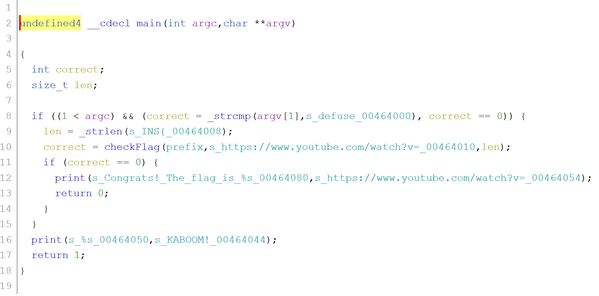
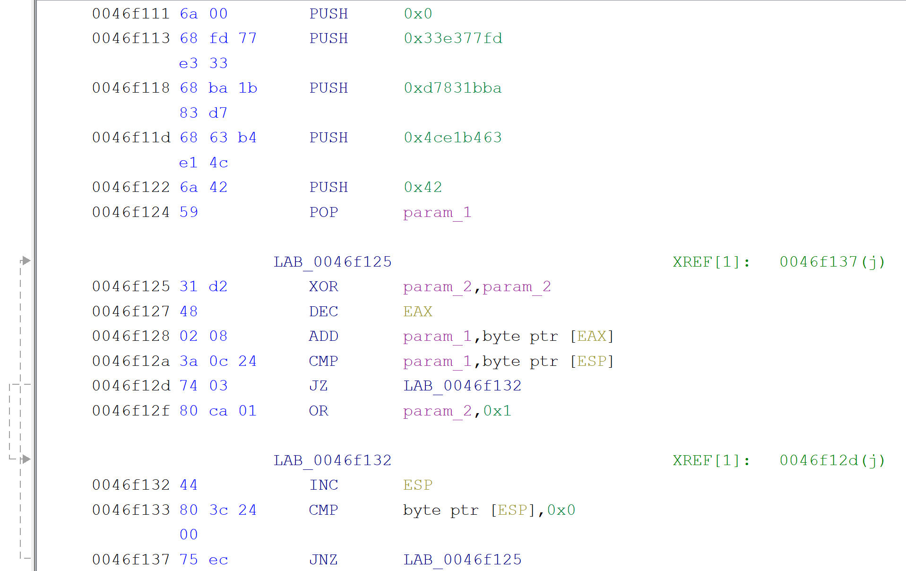
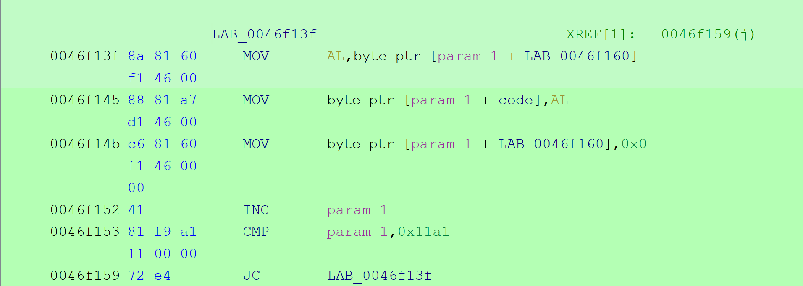

# Kaboom!

This wasn't a difficult task but it had one tricky trick that made it took way more time than it should be required.

We started with an exe file that when loaded in any disassembler tool (e.g. Ghidra) or do some preliminary checking to see that the file was packed with UPX. And what you do when you encounter such file? You decompress.

After successful decompression the file was much larger (duh!) and had clear CTF-like logic in it.

It's clear what is expected from us here. We should pass an argument that's `defuse` and if that the case we pass a `INS{` prefix and some YouTube link to `checkFlag` function, along with the length of the `INS` string. So the logic for the flag must be hidden in the `checkFlag` function. The function is long (~900 lines) but investigating it for extended period of time did not reveal any interesting part. It looked like it an over-engineered version of `strcmp`. And if we look at arguments passed to this function - one being `INS` and the other a YT-link that can never be equal - or can they? And if not where's the flag.

The answer is is the innocent, overlooked UPX. That sneaky little part was modified so it not only unpacks the compressed data and pass the execution to it. It does a little bit more.

Upon closer inspection there's some interesting code in the packer:

In addresses `0x46f111` through `0x46f122` some byte values are being pushed to the stack and later (`0x46f125` \- `0x46f137`) we iterate over them and some bytes that `EAX` points to with some basic modification (`add`) and checks if we have a match. But what those `EAX` bytes points too? Debugging (or closer/better analysis) would show us that those bytes are pointing to the command line arguments passed to the binary itself! And if we provide a special value packer will do some additional work as seen below

it will move some amount of bytes (`0x11a1`) around! And that my friends where the true flag will be reveled. As in this case after unpacking we will no longer have a YT link where we previous had it but a correct flag.

The video below shows the process.

[Watch on YouTube](https://www.youtube.com/watch?v=XXVRpxoJYJA)
