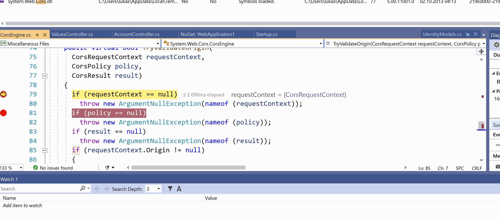
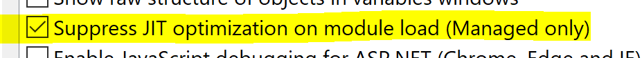
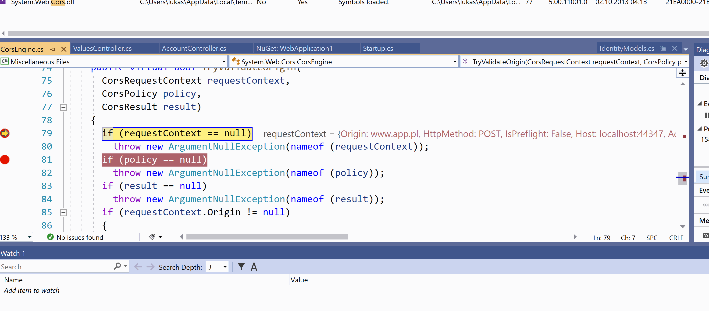

# Debugging .Net applications without source code with dotPeek Symbol Server

Few years ago I've made a video that demonstrates how one can debug (from Visual Studio) without having source code by using the dotPeek Symbol Server. You can see the video below:

[Watch on YouTube](https://www.youtube.com/watch?v=D7spm6C2j30)

[DotPeek](https://www.jetbrains.com/decompiler/) is one of many competed .NET decompiler (I ❤ [dnSpy](https://github.com/0xd4d/dnSpy)) but it has a great feature that allows it to act as a PDB symbole servers for the assemblies that are being loaded by our application when we debug it in Visual Studio.

I've recently got a mail with a related questions that was describing the similar use case but when we tried to step through such code some lines were available and some were instantaneously skipped. It would look like this:

What is missing in such case is that there's an additional setting that controls how managed assemblies are treated when loaded. Optimization can be done and when that happens code might be reorganized and there might be no longer a valid place to put a breakpoint and be correctly represented in the source code. Thus we are getting a 'Fail to bind' errors and inability to step through the code.

What you need to do in such situation is to go to `Debug->Options` and on the `General` tab check `Suppress JIT optimization on module load (Managed only)`.

This will disable the optimization part and should correctly allow setting the breakpoint and stepping through the code where previously it was not possible. Just remember to restart your application as the effect takes place on module load.

More info about this option can be found [here](https://docs.microsoft.com/en-us/visualstudio/debugger/jit-optimization-and-debugging?view=vs-2019). Happy debugging.
