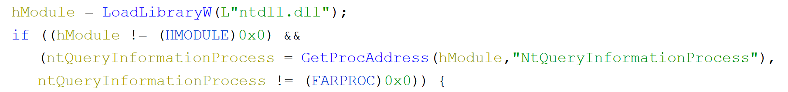
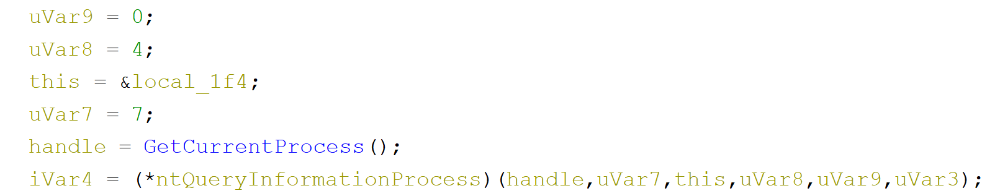
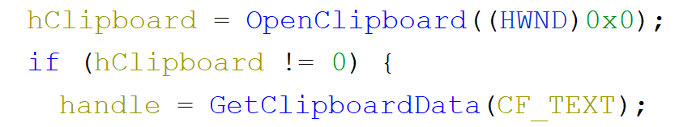
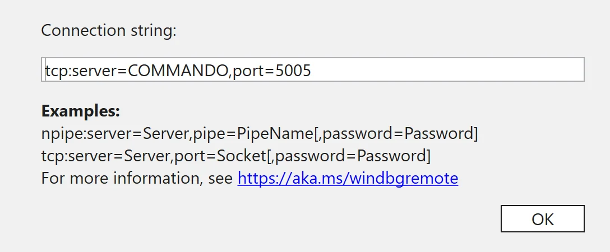
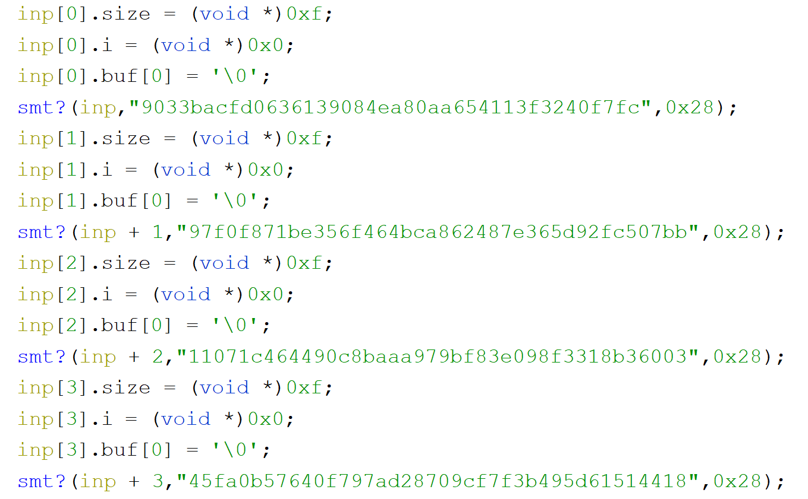
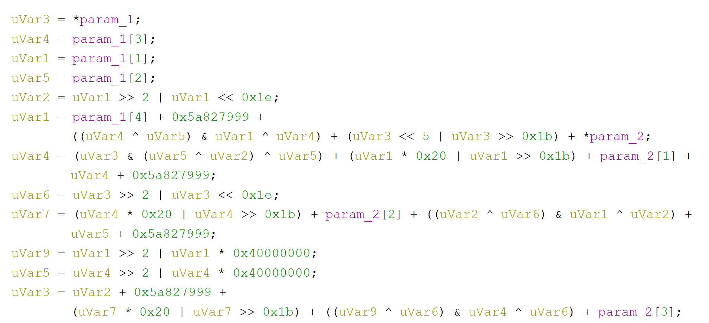
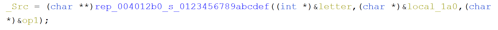
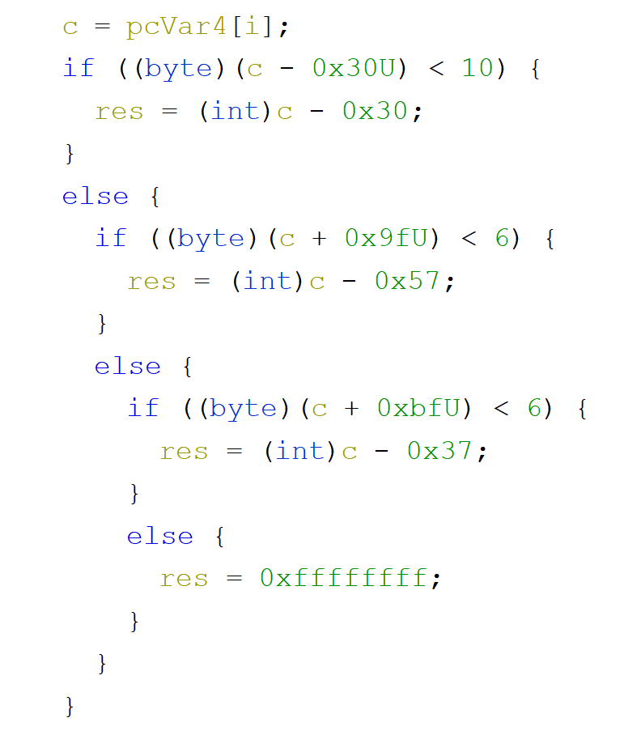
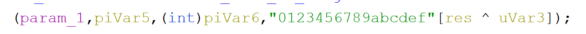
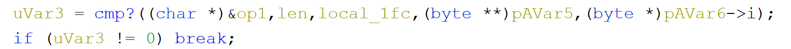

# TAMUCtf - leaning tower

There were [multiple things wrong](https://ctftime.org/event/1009) with this CTF but this one challenge was an interesting one. Windows binary, no noticeable entry point and no messages on screen. It's time to use our tools to dissect this one.

* * *

Prefer watching?

[Watch on YouTube](https://www.youtube.com/watch?v=MBRTx0Tn1dg)

As usually, if possible, starting this task from running the binary - we would be presented with no visible indication that something happen. As mentioned in the introduction - nothing gets printed on the screen. Also from the task description we can get that the way we need to input the flag is not as normal as we are used to it. We need to dig deeper.

Loading this binary into Ghidra gives us an interesting results almost immediately.

What's happening here is that we load `ntdll` and if that works we immediately get an address to `NtQueryInformationProcess`. If we follow the code later to see where it's being called we can see that few lines later where we see such construct:

To know what's happening here we need to check what is this function signature.
[code]
    __kernel_entry NTSTATUS NtQueryInformationProcess(
    IN HANDLE           ProcessHandle,
    IN PROCESSINFOCLASS ProcessInformationClass,
    OUT PVOID           ProcessInformation,
    IN ULONG            ProcessInformationLength,
    OUT PULONG          ReturnLength);

[/code]

In our code we can see the handle being passed as well as some additional parameters we need to decode what they mean. In our decompiled code we see value of `7` begin passed as `PROCESSINFOCLASS`. Let's see at the documentation to see that that means.

> ProcessDebugPort 7
>  Retrieves a DWORD_PTR value that is the port number of the debugger for the process. A nonzero value indicates that the process is being run under the control of a ring 3 debugger.
>  Use the CheckRemoteDebuggerPresent or IsDebuggerPresent function.

So this fragment of code is checking if we are debugging our code. Good to know for the future.

Scrolling few lines down two interesting calls can be spotted.

We are opening the clipboard, and again if that works we read it's text content. So this is how we should be passing our data to the binary. Sneaky. Let's see if that works so that if we have some text in our clipboard it will get copied to our buffer. Before we do that we need to get some debugging working. For this challenge I wanted to try remote debugging in WinDbg. Inside my VM I run 'old' WinDbg and on the host machine I'll be running WinDbg Preview.

To allow remote debugging in the VM one needs to start a server using the **`.server tcp:port=5005` **and on the host we select the 'Connect to remote debugger' and as the connection string we pass the following:

For the server, we need to change to our machine name

If everything works, after hitting ok, we should establish a connection (if not, [see here](https://docs.microsoft.com/en-us/windows-hardware/drivers/debugger/remode-debugging-using-windbg)). And we can start debugging.

As a first breakpoint we need to set one on the `NtQueryInformationProcess` so that we can intercept the call for our `DEBUG_PORT`. The second one could be for `OpenClipbord` so that we do not miss it.

After setting that we can observer that `NtQueryInformationProcess` is being called multiple times but on one of them we see our `Program.exe` in the call stack. This is our call. We can but a breakpoint on the check for debug port result and modify it so that the execution will continue.

Next call would be `OpenClipboard` and consequently a call to `GetClipboardData` after which we can see our data in the memory of the process. We verified that this is in fact how we can input something to the application. Nice.

Let's get back to Ghidra. Scrolling down we see some hashes appearing in the binary

The structure around them is also very structured so that we can create a custom type with 3 properties and apply the type to create an array of those. We have 14 of those structures one after another so it might be that they are linked to our flag (it supposed to be also 14 characters long).

Scrolling further we can see a `while` loop. And each letter of our entry buffer is passed to series of functions and if we dig deep into them we can find `SHA` code.

Part of the SHA1 calculation

We already know a lot, but trying to compute hashes of all the allowed letters and comparing them with those hashes that we saw in the binary will not give us anything.

If we scroll down further we would find out another method that takes two hashes (as 2nd and 3rd arguments). Let's dig into it.

Seeing this code we can conclude that for each of the letter from each hash, we convert them to a decimal value...

...and at the very bottom of this function we create a new hash letter by xoring them and obtaining the new letter from a string that contains all hexadecimal digits.

After we exit this function what is left is only a hash comparison

and base on the result we either break out of the loop or continue iterating.

Knowing that we can write a short python script to solve the flag for us:
[code]
    hashes =  ["9033bacfd0636139084ea80aa654113f3240f7fc",
    "97f0f871be356f464bca862487e365d92fc507bb",
    "11071c464490c8baaa979bf83e098f3318b36003",
    "45fa0b57640f797ad28709cf7f3b495d61514418",
    "2540407ace41adaaa279c9a9f8d900bd87a8aa5d",
    "f4c50cd4475f6a1833180506817b4bbd45dc17f7",
    "f0e8c88568fcb989f60f09f52b1aad1b7d2454b5",
    "744dde01735bc3d2b047d7d9fbc5662b97628f01",
    "2cab6da567fa23426f81d54326ca537e5bd89d7e",
    "7f0bc15fb2695af18fd1e6c8df386f824cf67af9",
    "2326181b6f80ba790e6f164190dfdda8106a31ff",
    "59a7b725369a7d6af671b7ae79e2129e0517b289",
    "b070a87bd15350073f989853d4f5aa234c563d11",
    "72c77719d0ae83311c01914cdedcff2ebf06667b",
    "5b8e4855bdc9d3bea82500fea95d4306d304dccb"]

    import hashlib
    import itertools

    previous = "da39a3ee5e6b4b0d3255bfef95601890afd80709"
    hexdigits = "0123456789abcdef"

    def value(c):
      return int(c,16)

    def xor(h1,h2):
      return ''.join([hexdigits[(value(x) ^ value(y))] for (x,y) in zip(h1,h2)])

    alphabet = "0123456789abcdefghijklmnopqrstuvwxyzABCDEFGHIJKLMNOPQRSTUVWXYZ!\"#$%&()*+,-./:;<=>?@[\\]^_{}~"

    result = ''
    for h in hashes:
      p = xor(h, previous)
      for c in alphabet:
        digest = hashlib.sha1(c).hexdigest()
        if digest == p:
          result += c
          print('Found: '+c)
          break
      else:
        print('Not found for: '+h)

      previous = h

    print(result)

[/code]

Running this script will give a proper flag: `flag{nice_flag}`.
