# Solving Space Fights CTF

Few months back I was solving a CTF challenge for the NES system. It was one of the [Flare-On challenges](20191121-flare-on-2019-solutions-notes.md) for 2019. This time we will solve another one for the same system. A challenge named Space Fights CTF could be found on [github](https://github.com/aedrax/space-fights-ctf) along with the source code but for the moment we will just take the binary file and load it into Ghidra for the analysis. Running this program in an emulator we can see the following

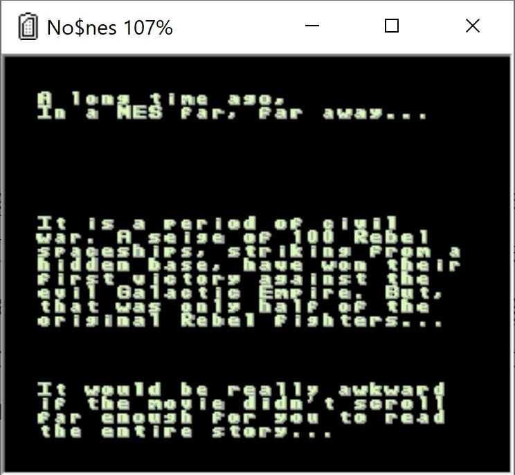

* * *

Upon loading this file into Ghidra we will need to pick up the 'language' for this file.

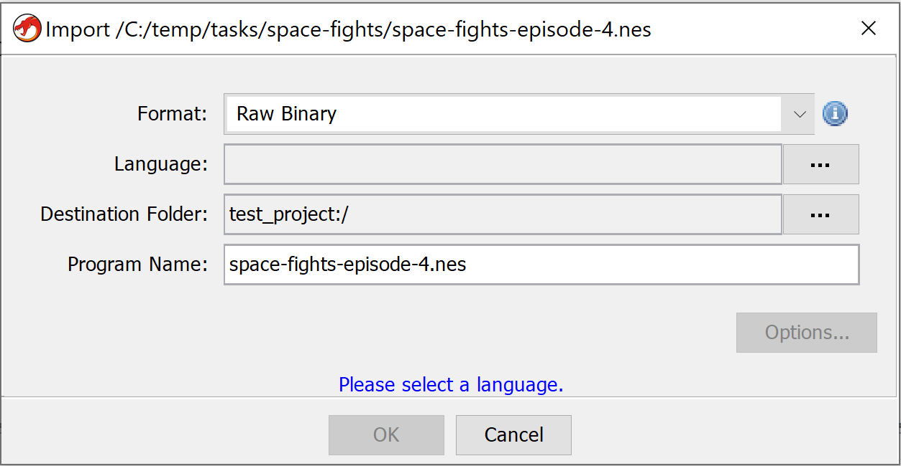

For this task we can consult with [NES Wiki](http://wiki.nesdev.com/) and pick 6502. After this we can continue.

Since the file is a complete ROM, Ghidra will not know how to parse this file correctly. We need to help here a little bit. We can skip the inital analysis as it won't do us any good and switch to Memory maps to redefine then.

The initial layout of maps is a below

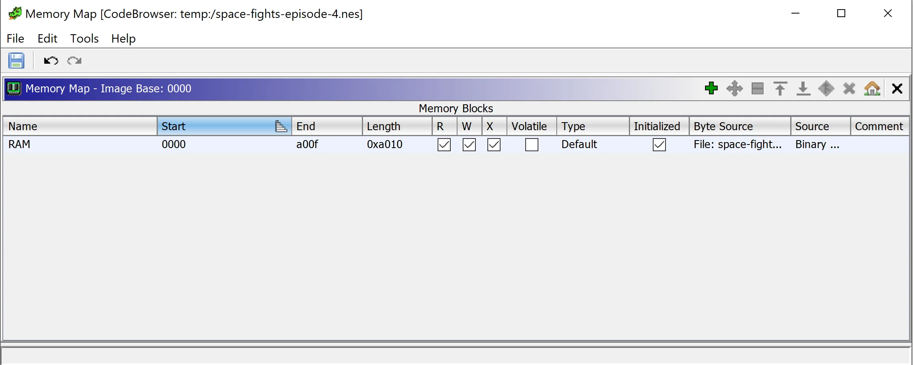

and it's not perfect (we could work if it if we must) so we will redefine it. But we need to know redefine to what.

Here where awesome documentation from [NesDEV](http://wiki.nesdev.com/w/index.php/Nesdev_Wiki) comes handy. There's not only a detailed description of the ROM file format ([iNES](http://wiki.nesdev.com/w/index.php/INES)) but also how the date is being [mapped in the memory](http://wiki.nesdev.com/w/index.php/CPU_memory_map). Let's use this knowledge to fix our maps in Ghidra.

First we will map the code for the correct address. Based on the wiki, the code in the iNES file starts at address `0x16` (we don't have trainer data) and it should be mapped at `0x8000`.

Firstly, we will split the RAM block into to. One being 16 bytes and the rest.

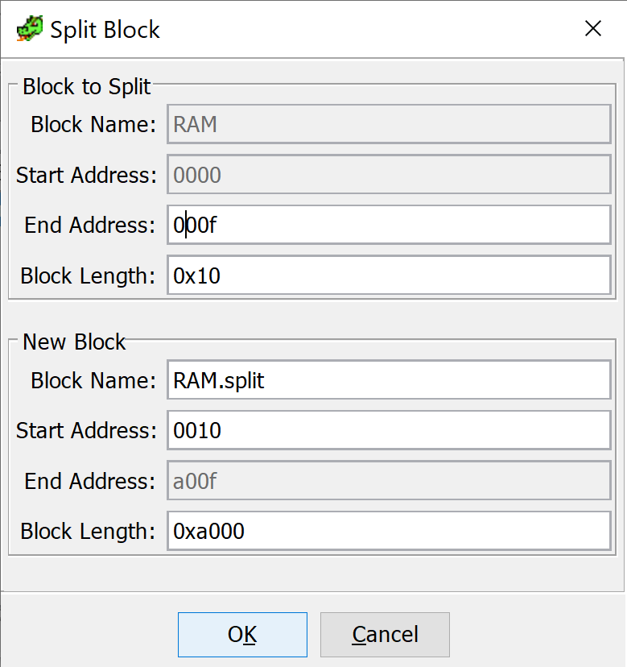

We can remove the first part as we won't need it. Now we specify a new end address for our new block

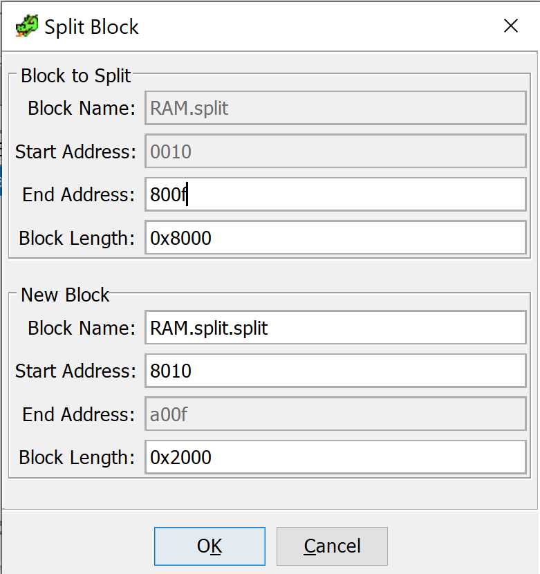

And again we can delete the remaining part as we won't need it. What's let if to set a new base address to `0x8000`.

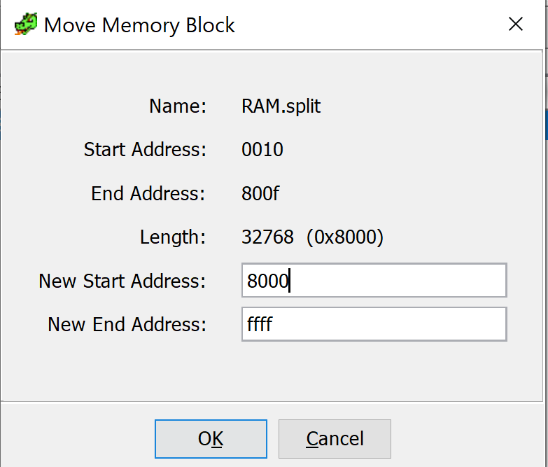

Now it's time to display the disassembly and press `D` and start the disassembly process. After few seconds we can see our code but Ghidra still complains (showing some information in red) that something is missing. We forgot to map some other sections.

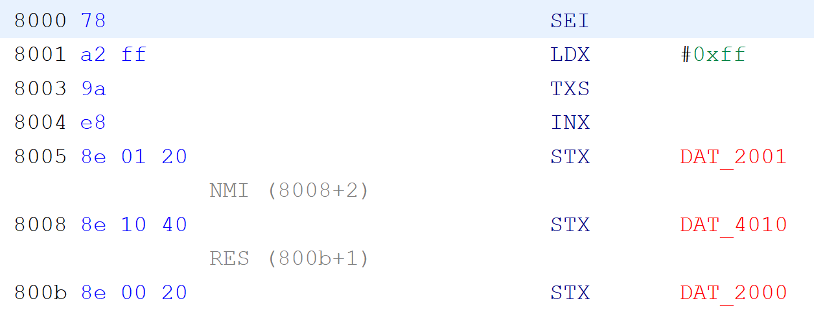

Let's do it now. We again jump to our Memory map and add a three sections. First from `$0000-$07FF` for internal RAM. Second starting from `0x2000` and of the size of 8 bytes - for PPU registers. And lastly from `0x4000` till `0x4017` \- for audio and I/O registers. We could probably be good without those additional sections but having them will allow us to rename the addresses to something custom.

We need to start our analysis somewhere. Let's go to the address `$8000` where the execution starts and define our `entry` function there (just press `F`). Scrolling through the code we can see some usages of addresses like `DATA_0320`, `DATA_0340` and similar.

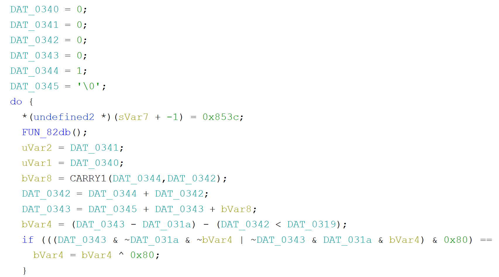

Now let's get back to our emulator again. Let's scroll down in WRAM section to similar addresses to observe how data add those addresses changes throughout the execution.

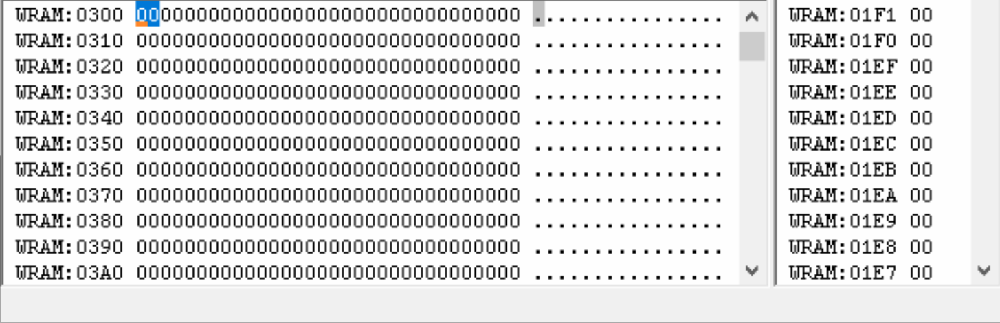

We can clearly see that the byte at address `$342` is being increased from `0` to `64` and then stops. Let's try to see this address now in Ghidra.

We could see this address in Ghidra being compared with a value at address `$319`. What's there in the debugger? Also `$64`. So let's change it a bit and see what will happen.

Restart the game and break quickly enough in the debugger. Modify the value at `$319` (set to `80`) and resume. The game continue to run and this time we can see that the text scrolled a little bit further up.

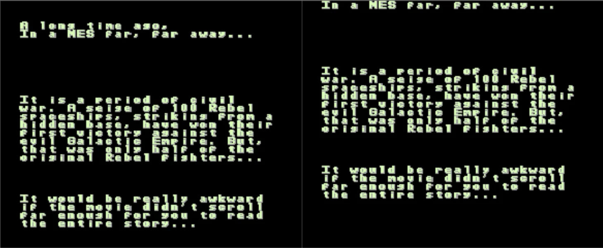Comparison: Before (left) modification and after (right).

Ok, let's go all the way. Doing the same and this time setting the value to the max `FF` uncovers some additional objects.

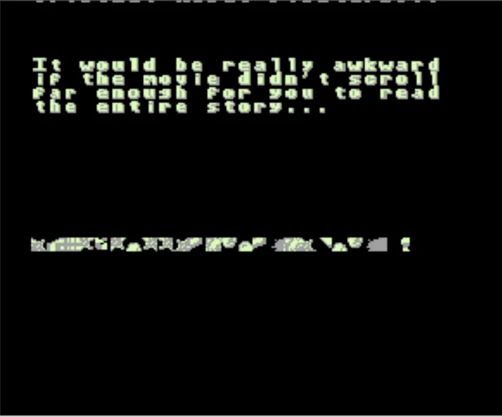

But it's not readable. We need to uncover the flag (assuming this is the flag).

Now let's try to see if we can identify the place where this data is being set. If we set our initial breakpoint very early in the function the memory in those addresses (around `$03xx`) are empty. It's only after we execute a function call to `0x86EC` that set's the data. Let's break just after this call and modify our line limit variable `0x319` so that it will contain the value `0xff` to display all the lines. After we do that, we accidentally get the flag:

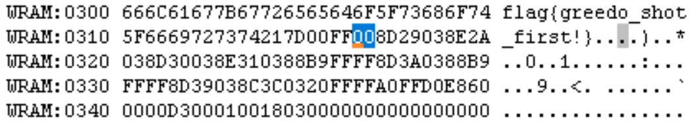
