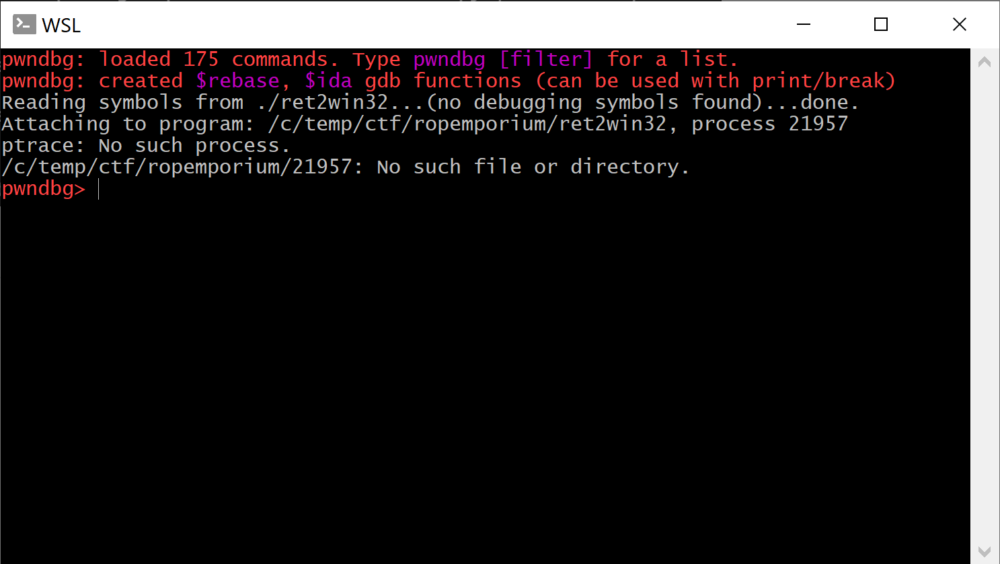

# Making pwnlib.gdb.attach work under WSL2

I'm doing my CTFing under Windows. I used to spawn a VirtualBox or Hyper-V with Ubuntu from time to time when needed or used Digital Ocean's droplet but since WSL is in town and especially with the speed-up improvements that WSL2 brings I rarely do that. I do "all" my Linux part of CTF using WSL.

* * *

For RE (which is my main area of interest) it mostly boils down to running a binary or jumping into `gdb` on occasion and for that I didn't need anything fancy. But, I've recently started to teach myself some pwn and for that the only logical choice is to use `pwntools`.

The usual starting script is to create a local context and attach gdb from `pwntools`.

Something along the lines:
[code]
    from pwn import *

    t = process('./ret2win32')

    gdb.attach(t)

    t.interactive()
[/code]

And I did that, but instead attaching to gdb I got unexpected error

Ok, no `context.terminal` set so we need to do that but what should it be in case of WSL?

My first idea was to pass `wsl.exe` to this property, with additional option `-e` to indicate that we want to execute the `gdb` command.
[code]
    context.terminal = ['wsl.exe','-e']

[/code]

That worked, well partially, kinda.

And the process hangs. Maybe it did execute `gdb` correctly but I did not get an extra window with the `gdb` in it so for me it was like a fail.

Let's resort to duckduckgo and search for [wsl terminal](https://duckduckgo.com/?q=wsl+terminal). The first link it gives was something that looks promising - [wsl-terminal](https://github.com/mskyaxl/wsl-terminal).

Installing the tool it gives a program - called `open-wsl` that supposed to work as a terminal emulation under wsl. Let's point our `context.terminal` to this new binary.
[code]
    context.terminal = ['<path-to>/open-wsl.exe','-e']

[/code]

Executing the script gives this

so still some kind of error, but this time we did get a new terminal window with `gdb` running:

So a little bit of progress. Let's focus on the error we do have at the moment:

> File "/home/ubuntu/.local/lib/python3.6/site-packages/pwnlib/util/proc.py", line 349, in wait_for_
> debugger
> l.error("debugger exited! (maybe check /proc/sys/kernel/yama/ptrace_scope)")
> AttributeError: 'Progress' object has no attribute 'error'

If we would inspect the object `l`, we wouldn't find a method `.error` but it does have something close enough - `.failure`. Maybe it is a bug and our `pwntools` aren't updated to the latest. Updating `pwntools` took few seconds but it didn't help.

Let's manually modify the file, so that in case of an exception it uses `.failure` instead of `.error`. Quick & dirty change so let's run it again.

And with that fix, our `.attach()` to gdb works!

There's still an error that states that debugger exited! but I don't mind that, if I can use it with its' full power.

Final starting script would be:
[code]
    from pwn import *

    t = process('./ret2win32')

    context.terminal = ['/c/tools/wsl-terminal/open-wsl.exe','-e']

    gdb.attach(t)

    t.interactive()
[/code]

Should we file an issue into `pwntools` repo? Apparently this was know as it is [fixed](https://github.com/Gallopsled/pwntools/blob/dev/pwnlib/util/proc.py#L349) in the `dev` branch but haven't been yet merged to stable.

Happy pwning!
