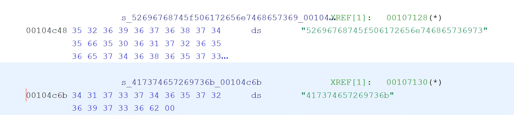
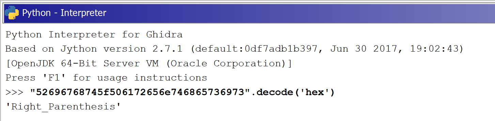
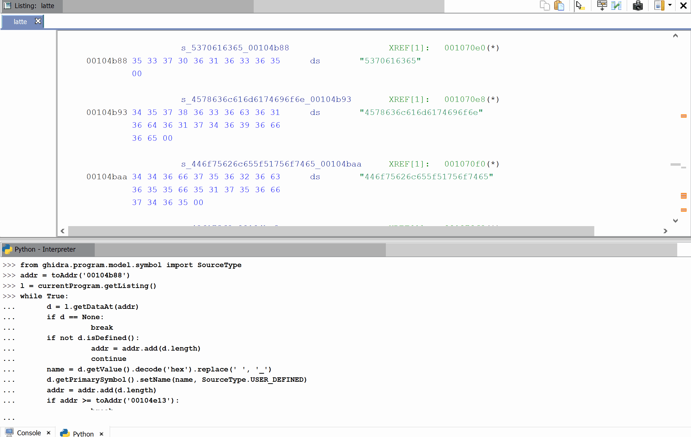

# Automating Ghidra - part 2

In the last [Automating Ghidra post](20200508-scripting-ghidra.md) we looked at how we can script Ghidra to do some mundane operations on the Memory Map of our binary. This time we will automate renaming labels for the data based on the values.

* * *

[Watch on YouTube](https://www.youtube.com/watch?v=udN0ziN1jq4)

During ASIS CTF 2020 a task was present that posses unique opportunities to show how we can automate the mundane part or reverse engineering process. Task called `latte` had a bunch of bytes in the data, that was clearly indicating some readable values, if we only parse the data correctly.

Even for an untrained eye, that data looks suspicious. And in fact it is, we only need to decode it using `hex` encoding.

We could now set the label for this data to be `Right_Parenthesis` but then we would miss the automate part and we would have to repeat the mundane job couple more times. So automation time...

Let's start with defining and address where we want to start - for that we will use the already know function `toAddr` that will convert a string to an `Address` type that Ghidra knows and understands.
[code]
    addr = toAddr('00104b88')

[/code]

Next, we need to get our data. For that, first we will need to get hold of `Listing` object. We can get it directly from `currentProgram` that represents our loaded binary.
[code]
    l = currentProgram.getListing()

[/code]

Now's the fun part. To get the data ad a given address, we can use function `getDataAt` passing an address. We can get nothing or we can get a data but it would be uninitialized so let's cover those cases. For the first one, we will simply finish our work, and for the second one, we will just skip those bytes and move to the next one.
[code]
    d = l.getDataAt(addr)
    if d == None:
        break
    if not d.isDefined():
        addr = addr.add(d.length)
        continue

[/code]

Ok. now - how we can get the value of the data. What we get from `getDataAt` is actually a `Data` object and it has a [rich API](https://ghidra.re/ghidra_docs/api/ghidra/program/model/listing/Data.html) and fortunately it has `getValue` function. We just need to convert those bytes to an ascii string.
[code]
    name = d.getValue().decode('hex').replace(' ', '_')

[/code]

Additionally, we convert spaces to underscores as labels, that we will like to set doesn't allow that, and one of the string has a space in it - yet I think that's a mistake as all the rest has underscores in case os spaces.

So now the last part. How to set a label for the data to be our string? Again, simple when we look at the API. There's a method for that.

We just need to obtain the primary symbol associated with our data (in this case it will be a label (it can be something else in other cases), and from that we set the name. In python it looks like this:
[code]
    d.getPrimarySymbol().setName(name, SourceType.USER_DEFINED)

[/code]

We just needed to provide the second parameter for the name stating from where the name is coming from - not sure why this is needed, but `USER_DEFINED` sounds about right. For the purpose of using this const we needed to import it `from ghidra.program.model.symbol import SourceType`.

Lastly, we move our `addr` to the next data by adjusting it by the data length. Simple.

Since we will be doing it in the loop, we need an exit condition. If we reach the address after the last such data, we exit.

The full script is as follows:
[code]
    from ghidra.program.model.symbol import SourceType

    addr = toAddr('00104b88')

    l = currentProgram.getListing()
    while True:
        d = l.getDataAt(addr)
        if d == None:
    	   break
        if not d.isDefined():
    	   addr = addr.add(d.length)
    	    continue
        name = d.getValue().decode('hex').replace(' ', '_')
        d.getPrimarySymbol().setName(name, SourceType.USER_DEFINED)
        addr = addr.add(d.length)

        if addr >= toAddr('00104e13'):
    	   break

[/code]

And this is how it works:

Enjoy!
