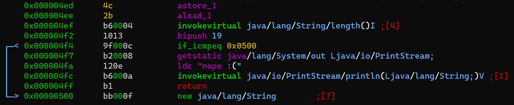

# radare2 can do java

I was once asked on my YT channel to do a Java crackme.

It only took 7* months to fulfill this request. So, wile waiting for Part 4, Professor this is for you.

* * *

[Watch on YouTube](https://www.youtube.com/watch?v=b8fGz-QL7DM)

We will do a Java crack-me, but an easy one created by me. This is as I want to focus not on crack-me today, but on something else. On the fact that r2 can do java.

Radare2 is a native disassembler, debugger but it is also a swiss-army knife that includes Thor only knows what inside. You never know what other blade is in your disposal.

Such hidden feature of radare2 might be that it can do java. Java is not native, java is compiled to p-code but radare2 can understand it. So let's see how we can start.

If we issue a simple command like we usually do

> r2 java-crackme.jar

what we will end up with is just a binary data for the ZIP file that a JAR is.

This is NOT what we want. We want to look inside. So we need to instruct r2 to do that.

Let's try again. This time let's inform r2 that this is a jar file that we are opening:

> r2 jar://java-crackme.jar

that gives us the following:

Nice. We peeked inside and listed all the files/folders that our jar contains. So now we need to instruct r2 that we want this `Crackme.class` to be loaded and this we can do by adding the `::<number>` after the `.jar` extension. Like so:

> r2 jar://java-crackme.jar::2

With such command we will correctly instruct r2 to load the `Crackme.class` and what we will end up having on screen are the Java's virtual machine opcodes.

Sweet. Now - we can focus on the crack-me. As mentioned, it's simple and the verification is two step.

After moving to the main method we can see them.

First, there's a check for the length of the input (`19` characters)

later some operations are performed on it and a comparison is made with the hard-coded password:

The operations we do on the input are calling `xorWithKey` with a hard-coded key "this is the key" and then converting the result to base-64.

Let's see if `xorWithKey` is actually doing what it says:

There's a lot for a simple xor but in fact this is what's being done (line: `0x47e`).

This is fully reversable - decode the `"BgkNElIMQQAXCQsADwpZHgkfEg=="` with base-64 and xor the result with "this is the key". A simple python script would suffice:
[code]
    import base64
    from itertools import cycle

    print(''.join([chr(ord(x) ^ ord(y)) for x,y in zip(base64.b64decode("BgkNElIMQQAXCQsADwpZHgkfEg=="), cycle("this is the key"))]))

[/code]

running it in ipython:

Entering this in our crack-me

we confirmed that, yes `r2 can do java`!

Happy reversing.
