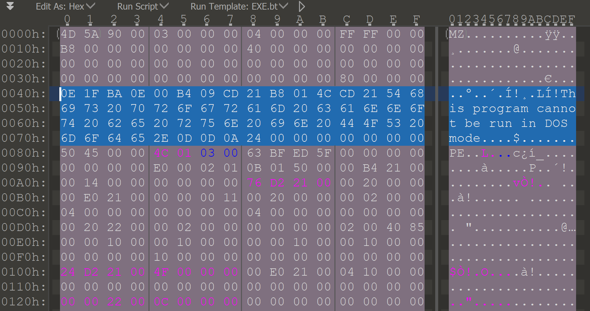
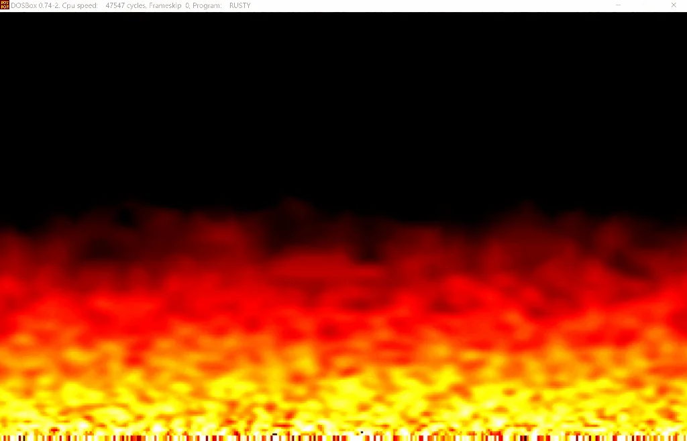

# Rusty

So I had my debut as an author of a task for a public CTF event. I've created a challenge called Rusty, and let's say it collected some mixed reactions. I've labeled it as an easy RE challenge, but only ten teams managed to solve it in the end - and for those, congrats.

* * *

Part 1 - This post - Solution
Part 2 - [Technical background](20210309-rusty-technical-background.md)

On the high level - the challenge is a simple Rust binary with a custom MS-DOS stub that contains the code for validating the flag. The Rust part had a fake flag validator that could be solved, but the idea was not to look at the Rust code at all - hence the description.

# Solution

Running Rusty under Windows gives us a standard `Give me the flag` message and wait for user input.

Rusty run from Windows console

Although the flag is fake, it could be found so that teams do not get stuck on an unsolvable algorithm in the Rust part.

Looking at Rust in Ghidra we can see the strings that indicates that we entered a wrong flag.

Looking at XREFs

we can find the method that checks it ( `main@0x1400023e0`).

In in we can see the code checking for the fake prefix:
[code]
    if ((((*(char *)flag == 'j') && (*(char *)((longlong)flag + 1) == 'c')) &&
            (*(char *)((longlong)flag + 2) == 't')) &&
           (((*(char *)((longlong)flag + 3) == 'f' && (*(char *)((longlong)flag + 4) == '{')) &&
            (*(char *)((longlong)flag + 0x36) == '}')))) {

[/code]

And the main loop performs the following check:
[code]
          __i = 7;
          do {
            flag = magic_consts;
            if (__i == 0x39) {
              local_70 = &PTR_s_Are_you_sure???_Try_somewhere_el_140020610;
              uStack104 = (char **)0x1;
              local_60 = 0;
              local_50 = "Are you sure??? Try somewhere else.
";
              local_48 = 0;
              FUN_140008690((undefined4 *)&local_70);
              goto LAB_140002784;
            }
            k = __i - 2;
            l = __i - 1;
            m = __i % 0x37;
            lVar1 = __i * 2;
            __i = __i + 1;
          } while ((ushort)((ushort)*(byte *)((longlong)_flag + m) +
                           (ushort)*(byte *)((longlong)_flag + l % 0x37) +
                           (ushort)*(byte *)((longlong)_flag + k % 0x37)) ==
                   *(short *)((longlong)magic_consts + lVar1 + -0xe));

[/code]

The `-0xe` in the compare is needed since `lVar1` will have value of `14` and the `magic_consts` is the list of values that we can see are being assigned a bit before this loop:
[code]
    *(undefined4 *)magic_consts = 0x1440145;
    *(undefined4 *)(magic_consts + 2) = 0x11b013b;
    *(undefined4 *)(magic_consts + 4) = 0xfb00fb;
    *(undefined4 *)(magic_consts + 6) = 0x13c0120;
    *(undefined4 *)(magic_consts + 8) = 0x1420151;
    *(undefined4 *)(magic_consts + 10) = 0x13b0147;
    *(undefined4 *)(magic_consts + 0xc) = 0x12c0141;
    *(undefined4 *)(magic_consts + 0xe) = 0x1190140;
    *(undefined4 *)(magic_consts + 0x10) = 0x1160119;
    *(undefined4 *)(magic_consts + 0x12) = 0x15d0147;
    *(undefined4 *)(magic_consts + 0x14) = 0x1350143;
    *(undefined4 *)(magic_consts + 0x16) = 0x1380132;
    *(undefined4 *)(magic_consts + 0x18) = 0x1300136;
    *(undefined4 *)(magic_consts + 0x1a) = 0x14a013a;
    *(undefined4 *)(magic_consts + 0x1c) = 0x1430149;
    *(undefined4 *)(magic_consts + 0x1e) = 0x13e0142;
    *(undefined4 *)(magic_consts + 0x20) = 0xfa0134;
    *(undefined4 *)(magic_consts + 0x22) = 0xd900f2;
    *(undefined4 *)(magic_consts + 0x24) = 0xd200e6;
    *(undefined4 *)(magic_consts + 0x26) = 0xd600d1;
    *(undefined4 *)(magic_consts + 0x28) = 0xd300d7;
    *(undefined4 *)(magic_consts + 0x2a) = 0xa900d4;
    *(undefined4 *)(magic_consts + 0x2c) = 0x630089;
    *(undefined4 *)(magic_consts + 0x2e) = 0xbf0063;
    *(undefined4 *)(magic_consts + 0x30) = 0x14a0108;

[/code]

And that's all there is to it. We need to recreate the algorithm to get the flag (need to reverse the order of bytes in `magic_consts` is an array of `short` values and Ghidra presented them to us as `int`). The `55` flag length comes from `__i == 0x39`.

One of the potential solutions was to use z3 to get the flag bytes:
[code]
    from z3 import *

    flag = [BitVec("c" + str(d),8) for d in range(55)]

    s = Solver()

    s.add(flag[0] == 106)
    s.add(flag[1] == 99)
    s.add(flag[2] == 116)
    s.add(flag[3] == 102)
    s.add(flag[4] == 123)
    s.add(flag[54] == 125)

    correct = [325,324,315,283,251,251,288,316,337,322, 327, 315, 321, 300, 320, 281, 281, 278, 327, 349, 323, 309, 306, 312, 310, 304, 314, 330, 329, 323, 322, 318, 308, 250, 242, 217, 230, 210, 209, 214, 215, 211, 212, 169, 137, 99, 99, 191, 264, 330]

    for i in range(50):
        k = (5 + i) % 55
        l = (6 + i) % 55
        m = (7 + i) % 55

        s.add(correct[i] == (flag[k] + flag[l] + flag[m]))

    print(s.check())

    r = s.model()

    flag_txt = z3.Concat(*flag)
    print(r.evaluate(flag_txt).as_long().to_bytes(55, 'big'))

[/code]

Running this will very quickly produce the fake flag:

Fake flag solved with z3

The flag itself indicates it is fake, but also had a wrong prefix (`jctf{}` instead of `justCTF{}`) to also give a clue that this is not correct (but that would require at least looking at Rust code - just to see the prefix check ;)).

But even without solving the Rust part (as that was the intent), we could find out that there's is some other potential place for the flag to be hidden.

I know that going straight to disassembler/decompiler is what people do (I would probably do the same), but if we would start from the reconnaissance we could get some indicators very early.

Few, that could trigger this:

1) No strings for the valid flag in the Rust binary. Of course it could be hidden but all the negative ones were clearly visible in the binary (running `strings`). It at least should trigger a though that the solution might not be an obvious one.

2) looking at the binary in the hex editor

Seeing enough PE binaries, it's almost obvious not to spot the non-standard DOS stub where it supposed to be:

Standard MS-DOS stub - in blue selectionRusty's modified MS-DOS stub - in blue selection

**📝Note:** originally the idea was to make those as close to each other as possible, at least keeping the "famous" - "This program cannot be run in DOS mode." message in the same spot.

3) Using some tools for inspecting PE files like [PE Studio](https://www.winitor.com/).

Opening Rusty there clearly indicates (red color in comparison to black and yellowish) there's something wrong in this area (and thus worth checking).

PE studio inspecting Rusty

Having this knowledge, we could actually run this in a DOSBox to see if the stub is in fact modified.

Doing this would give us a nice fire effect demo:

Rusty's fire effect

Hope, you didn't miss it while solving the challenge ;)

**📝Note:** In the original envision, the entered letters are displayed also as a fire effect but it was dropped as it wasn't looking that nice and provided some problems.

In order to use Ghidra to view the DOS stub as code (the bytes are clearly visible when the file is loaded normally), we could extract the DOS stub bytes and save them to a separate file (removing null bytes from the beginning).

Now when loading that file to the tool, we need to pick the proper language

Apart from the fire effect the code wait for user input using the [BIOS interrupt](https://en.wikipedia.org/wiki/INT_16H) call
[code]
    0000:0270 b4  01               MOV       AH, 0x1
    0000:0272 cd  16               INT       0x16
    ...
    0000:0276 b4  00               MOV       AH, 0x0
    0000:0278 cd  16               INT       0x16

[/code]

Next, it performs simple read input. If it was an Enter (`0xd`) go to validate the flag routine, if it was ESC (`0x1b`) exit the program and if it was a backspace (`0x8`) the last entered char from the buffer is removed.
[code]
    0000:027e 3c  1b               CMP       AL, 0x1b
    0000:0280 74  72               JZ        _exit
    0000:0282 3c  0d               CMP       AL, 0xd
    0000:0284 74  41               JZ        _validate
    0000:0286 3c  08               CMP       AL, 0x8
    0000:0288 74  24               JZ        _backspace

[/code]

The validate function is a simple double loop

that iterates over entered bytes (`input`) and some data (above called `encrypted_data`) doing the `xor` operation. The `i`-th byte of the `encrypted_data` is xor-ed with bytes from `0-ith` character of the input.

The encrypted data is as follows:
[code]
    encrypted_data                            XREF[2]:
       0000:0034 3e                  ??        3Eh    >
       0000:0035 49                  ??        49h    I
       0000:0036 26                  ??        26h    &
       0000:0037 52                  ??        52h    R
       0000:0038 45                  ??        45h    E
       0000:0039 22                  ??        22h    "
       0000:003a 42                  ??        42h    B
       0000:003b 10                  ??        10h
       0000:003c 66                  ??        66h    f
       0000:003d 0b                  ??        0Bh
       0000:003e 6c                  ??        6Ch    l
       0000:003f 06                  ??        06h
       0000:0040 0d                  ??        0Dh
       0000:0041 50                  ??        50h    P
       0000:0042 0f                  ??        0Fh
       0000:0043 4c                  ??        4Ch    L
       0000:0044 25                  ??        25h    %
       0000:0045 4c                  ??        4Ch    L
       0000:0046 3f                  ??        3Fh    ?
       0000:0047 12                  ??        12h
       0000:0048 56                  ??        56h    V
       0000:0049 03                  ??        03h
       0000:004a 20                  ??        20h
       0000:004b 5a                  ??        5Ah    Z
       0000:004c 14                  ??        14h
       0000:004d 61                  ??        61h    a
       0000:004e 4a                  ??        4Ah    J
       0000:004f 3f                  ??        3Fh    ?
       0000:0050 5d                  ??        5Dh    ]
       0000:0051 51                  ??        51h    Q
       0000:0052 12                  ??        12h
       0000:0053 5c                  ??        5Ch    \
       0000:0054 18                  ??        18h
       0000:0055 05                  ??        05h
       0000:0056 43                  ??        43h    C
       0000:0057 39                  ??        39h    9
       0000:0058 4f                  ??        4Fh    O
       0000:0059 32                  ??        32h    2
       0000:005a 0a                  ??        0Ah

[/code]

And from knowing how the `xor` is used & that the flag has `justCTF{}` format, we can start to extract extract 8 (first) characters of the phrase
[code]
    In [1]: chr(0x3E ^ ord('j'))
    Out[1]: 'T'
    In [2]: chr(0x49 ^ ord('u') ^ ord('T'))
    Out[2]: 'h'
    In [3]: chr(0x26 ^ ord('s') ^ ord('T') ^ ord('h'))
    Out[3]: 'i'
    In [4]: chr(0x52 ^ ord('t') ^ ord('T') ^ ord('h') ^ ord('i'))
    Out[4]: 's'
    In [5]: chr(0x45 ^ ord('C') ^ ord('T') ^ ord('h') ^ ord('i') ^ ord('s'))
    Out[5]: ' '
    In [6]: chr(0x22 ^ ord('T') ^ ord('T') ^ ord('h') ^ ord('i') ^ ord('s') ^ ord(' '))
    Out[6]: 'p'
    In [7]: chr(0x42 ^ ord('F') ^ ord('T') ^ ord('h') ^ ord('i') ^ ord('s') ^ ord(' ') ^ ord('p'))
    Out[7]: 'r'
    In [8]: chr(0x10 ^ ord('{') ^ ord('T') ^ ord('h') ^ ord('i') ^ ord('s') ^ ord(' ') ^ ord('p') ^ ord('r'))
    Out[8]: 'o'

[/code]

So we have `This pro...` and that could indicate the phrase to be `This program cannot be run in DOS mode.` which is the standard string printed when running Windows programs under DOS.

Let's see if that would give us the flag
[code]
    encoded = [0x3e, 0x49, 0x26, 0x52, 0x45, 0x22, 0x42, 0x10, 0x66, 0x0b, 0x6c, 0x06, 0x0d, 0x50, 0x0f, 0x4c, 0x25, 0x4c, 0x3f, 0x12, 0x56, 0x03, 0x20, 0x5a, 0x14, 0x61, 0x4a, 0x3f, 0x5d, 0x51, 0x12, 0x5c, 0x18, 0x05, 0x43, 0x39, 0x4f, 0x32, 0xa]

    stub = "This program cannot be run in DOS mode."

    for i in range(len(encoded)):
    	for j in range(i+1):
    		encoded[i] = ord(stub[j]) ^ encoded[i]

    print(''.join([chr(c) for c in encoded]))

[/code]

On closer inspection, in the DOS stub there were also two simple check that sums all the characters of the phrase and the decoded flag and compared those with the pre-caclulated values.

# In retrospect

It shouldn't probably be marked as `easy` but tbh, it's always hard to asses challenge's difficulty level. Perhaps it was too much of a guess work in few places :( Maybe the fake flag, could give more hints as where to look for the real one? Maybe...
