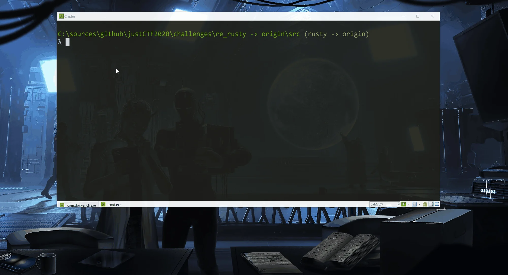

# Rusty - Technical background

This post a technical part to the challenge Rusty. If you haven't read the post you can do it [here](20210203-rusty.md).

# Technical background

I had few difficulties when creating it. So it might be interesting for some people to read how I've managed to overcome them.

The process was done in three steps:

1) Prepare linker
2) Prepare Dos Stub
3) Compile Rust and link with Dos Stub

Since I was dealing with some DOS code and DosBox, decided to make a build pipeline based on BAT files 😎.

The main one was:
[code]
    @echo off
    REM Build and link rusty

    set BUILD_TYPE=release

    :MyLinker
    call MyLinker\build.bat %BUILD_TYPE%

    :Fire
    call dos-stub\build.bat %BUILD_TYPE%

    :rusty
    call rusty\build.bat %BUILD_TYPE%

    del ..\bin\rusty.exe
    xcopy rusty\target\x86_64-pc-windows-msvc\%BUILD_TYPE%\rusty.exe ..\bin /Y

    @pause

[/code]

It makes more sens to analyze from the last one and go backwards.

## Rust

Rust program is just a simple class taking an input, validating it and outputting to the console:
[code]
    fn check_flag(flag: String)
    {
        let mem = flag.into_bytes();

        if mem[0] == 106 &&
           mem[1] == 99 &&
           mem[2] == 116 &&
           mem[3] == 102 &&
           mem[4] == 123 &&
           mem[54] == 125 {
               let correct:Vec<u16> = vec![325,324,315,283,251,251,288,316,337,322, 327, 315, 321, 300, 320, 281, 281, 278, 327, 349, 323, 309, 306, 312, 310, 304, 314, 330, 329, 323, 322, 318, 308, 250, 242, 217, 230, 210, 209, 214, 215, 211, 212, 169, 137, 99, 99, 191, 264, 330];
              let size:usize = mem.len();
              for i in 0..50 {
                  let k:usize = (5 + i) % size;
                  let l:usize = (6 + i) % size;
                  let m:usize = (7 + i) % size;
                  let s:u16 = u16::from(mem[k])+u16::from(mem[l]) + u16::from(mem[m]);
                  if s != correct[i] {
                    println!("lol. Not even close.");
                    return;
                  }
              }
              println!("Are you sure??? Try somewhere else.");
          } else {
              println!("lol. Not even close.");
          }
    }

    fn main() {
        println!("Give me the flag:");

        let mut line = String::new();
        std::io::stdin().read_line(&mut line).unwrap();
        line = line.trim().to_string();

        if line.len() == 55 {
            check_flag(line);
        } else {
            println!("lol. That's not even close.");
        }
    }

[/code]

Compiling this would of course give us correct program, but not with our custom STUB.

## DOS Stub

Dos part was hand-written assembly. But I didn't write it from scratch this time but used one of my old assembly for the fire effect - <https://github.com/pawlos/asm/tree/master/fire>. What had to be added was to take input, validate the flag.

Compiling this was done under DOSBos with some MASM assembler 😎
[code]
    set DOSBOX="c:\Program Files (x86)\DOSBox-0.74-2\DOSBox.exe"
    set MASM=c:\tools\MASM6.1\bin

    cd dos-stub
    wsl.exe python3 encode.py
    del DOSSTUB.exe
    cd ..

    %DOSBOX% ^
    -c "mount d: ." ^
    -c "mount c: %MASM%" ^
    -c "c:" ^
    -c "masm d:\dos-stub\DOSSTUB.asm" ^
    -c "link DOSSTUB.OBJ,DOSSTUB.EXE,,,," ^
    -c "copy DOSSTUB.EXE d:\dos-stub" ^
    -c "exit"

[/code]

The final output was the EXE file with the fire effect that would be linked with Rust binary.

## Linking it all together

Having Rust code and the DOS stub is great but how we can link those together to produce one binary that will contain both?

For Windows, Rust uses `link.exe` and there we can provide a path for `DOSSTUB`. But how to provide anything there.

Rust doesn't have (or at least I couldn't find) any official way to do it, but one can specify the linker for Cargo to be used while linking the final program.

It can be done in `.cargo\config.toml`.
[code]
    [build]
    target="x86_64-pc-windows-msvc"

    [target.x86_64-pc-windows-msvc]
    linker = <path to the linker>

[/code]

and as a linker we can specify our program. So I've wrote a simple C# program that will take the input passed to it, add an option for the DOS Stub and pass to `link.exe`.

Simplest program that achives that:
[code]
    var processStartInfo = new ProcessStartInfo
    {
        FileName = "c:\\Program Files (x86)\\Microsoft Visual Studio\\2019\\Professional\\SDK\\ScopeCppSDK\\vc15\\VC\\bin\\link.exe",
        UseShellExecute = false,
    };

    string fileName = args[0].Substring(1);
    string linker = @"/STUB:<path>\re_rusty\src\DOS-STUB\DOSSTUB.EXE";
    string pdb = @"/PDBSTRIPPED";
    if (File.Exists(fileName))
    {
        processStartInfo.Arguments = args[0];
        string options = File.ReadAllText(args[0].Substring(1));
        options = pdb + Environment.NewLine+linker + Environment.NewLine + options;
        File.WriteAllText(args[0].Substring(1), options);
    }
    else
    {
        processStartInfo.Arguments = pdb + " " + linker + " " + args.Aggregate((x, y) => x + " " + y);
        processStartInfo.Arguments = processStartInfo.Arguments.Replace("/DEBUG", "");
    }

    var process = Process.Start(processStartInfo);
    process.WaitForExit();

[/code]

It's interesting that `Rust` depending on the option, linker flags are passed either in the file or directly.

Adding the `build.bat` for this step
[code]
    set BUILD_TYPE=%1
    set MSBUILD="c:\Program Files (x86)\Microsoft Visual Studio\2019\Professional\MSBuild\Current\Bin\MSBuild.exe"
    %MSBUILD% "MyLinker\MyLinker.sln" -p:Configuration=%BUILD_TYPE%

[/code]

The final build process

Build in progress
