# net user /times

You probably know this but in case you don't, Windows has built in feature for setting up allowed login days and hours for a particular account. It can be done in the following way
[code]
    net user account_name /times:[{times | ALL}]

[/code]

but when I used it to restrict my kids account, I've encountered an interesting issue which resulted in reversing the binary & debugging. If that sounds interesting read further.

* * *

## Context

So I wanted to limit possible login days and times so that during week, it's only allowed for few hours and a bit more relaxing hours during weekend. The format of time times part for the command is the following
[code]
    StartDay[-EndDay],StartHour-EndHour

[/code]

So let's just do that, shall we?

**Note:** I've discovered this issue with Polish locale set on this particular computer so I'll use the Polish texts in this article with relevant translations. Later we will see why this issue doesn't appear on, English locale but might be in some others.

## No Sundays?

First issue with the command I've encountered pretty quickly as typing the following command
[code]
    net user Gość /times:Pn-Pt,13:00-15:00;So-Nd,9:00-17:00

[/code]

**Note:**`Gość` is the Guest account in polish. `Pn` \- is short for poniedziałek (Monday), `Pt` is short for piątek (Friday). `So` is sobota (Saturday), and `Nd` is for niedziela (Sunday).

But instead of getting the particular dates, I've got an error stating that the invalid date range was set.

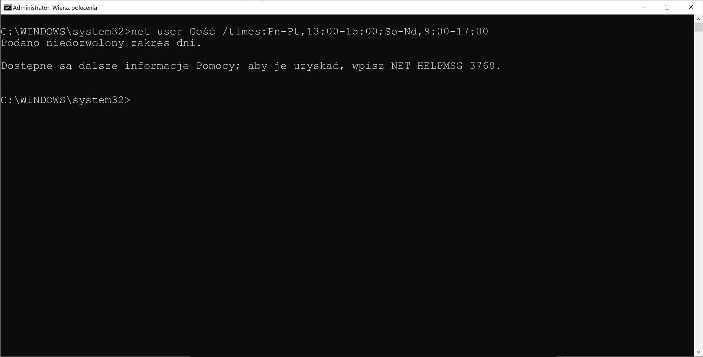Fail fast?

I've search for how to use this command and whatever I could find (at that time) on the internet was confirming me that this should be the valid syntax.

By running this command multiple times, with single days components, I've detected that the issue is with Sunday. So no option to specify login hours on Sundays?

## Debugging - take 1

At that time, it didn't occur to me to test different values and I went straight to disassembly and debugging, but my first task was to actually find out what is behind this `net` command.

So I run `Process Monitor` and executed the command again.

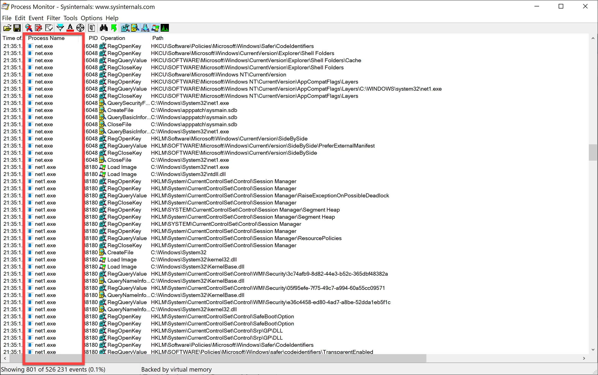Finding the net binary

After some filtering it was obvious that the binary is called (duh!) `net.exe` but also another one appeared with - not so obvious - name `net1.exe`. It was was started by the `net.exe` and it looked like the first one was just a proxy. So it looks like we should start there.

I've opened `net1.exe` in Ghidra to more or less locate the culprit code. It was not that difficult to find due to the `/TIMES` string being referenced.

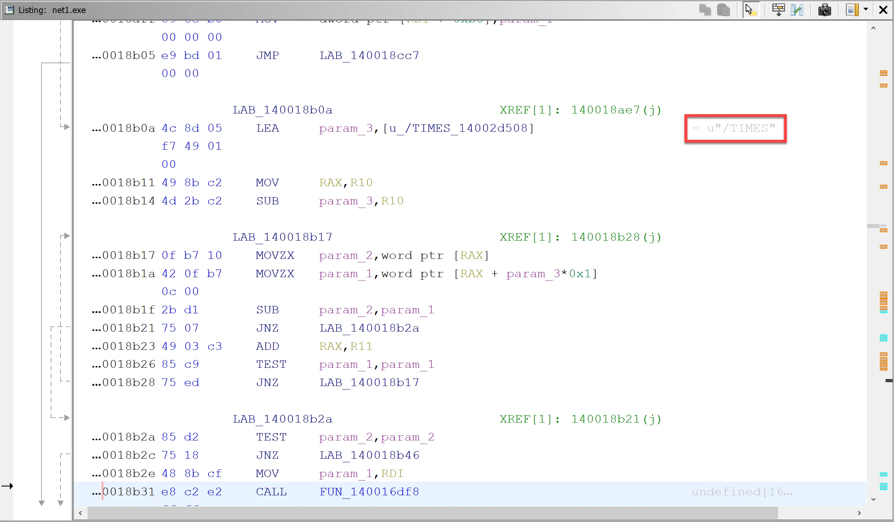Clearly visible string reference helps a lot.

And from that we can potentially assume that `FUN_140016df8` is responsible for handling this option, especially seeing inside a reference to yet another known string `/ALL`.

Looking at the code of `FUN_140016df8` it's not that hard to identify branches that handle `/ALL` cases and seeing usage of `";"` in another one we can safely assume this one is responsible for parsing our input ( `";"` is used to separate days components).

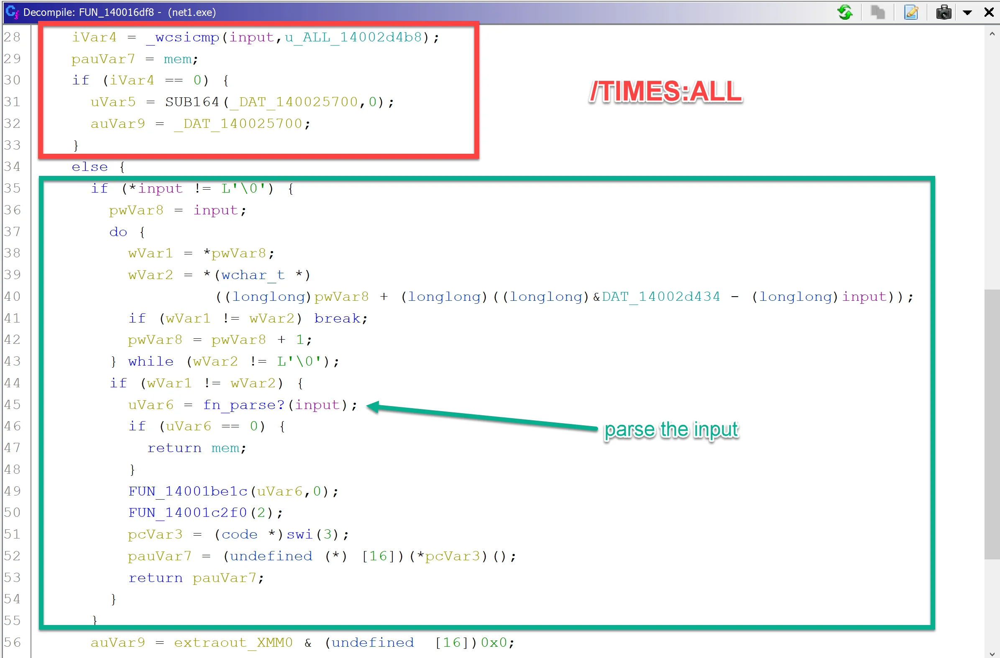

We could go deeper and notice more evidence (usage of more separators) that this is our function but instead lets switch to the debugger and see how our function looks when invoked.

It was a bit hard to located the code as mapping addresses from Ghidra to x64dbg yield some incorrect places but putting a HW breakpoint allowed to find the same code.

Stepping through the code we can notice that the names of the days are generated, firstly with full name

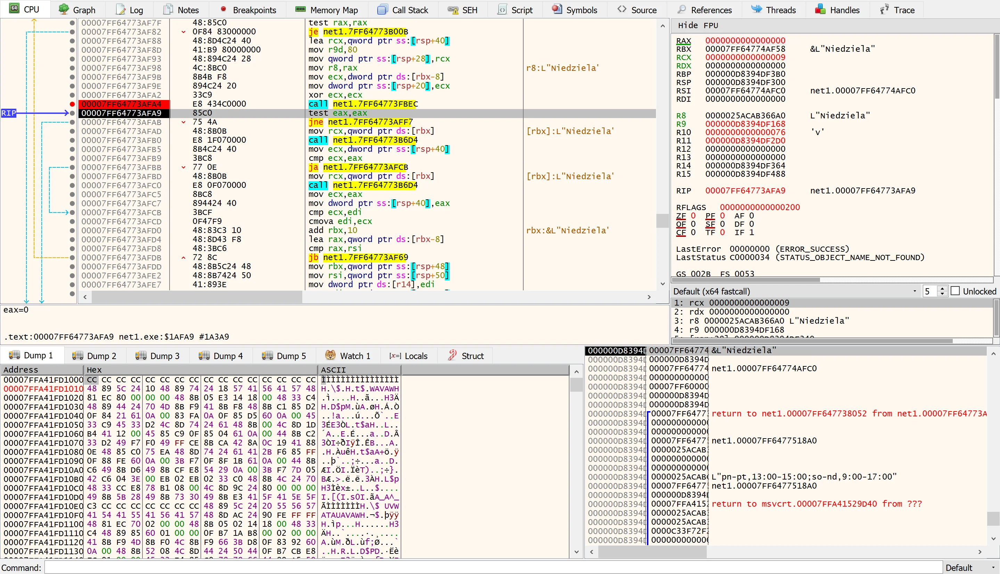

And secondly with abbreviations

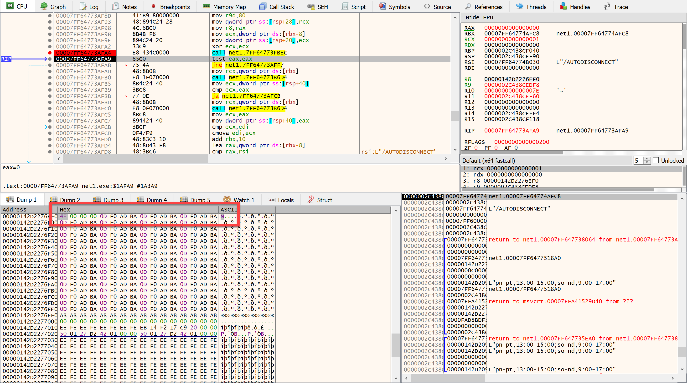

So, by observing the days in the debugger we confirm that the programs' short name for Niedziela is `N` (which I think is incorrect based on [Wiki](https://pl.wikipedia.org/wiki/Niedziela) as it should be `Nd`). So let's now use it, shall we?

## Still no Sundays?

Ok, so now when we know what's the correct short name is `N` let's finally set the allowed hours.
[code]
    net user Gość /times:Pn-Pt,13:00-15:00;So-N,9:00-17:00

[/code]

So now we are all set, right? Nope. Although running the command yield no errors when we look at hours we see the following

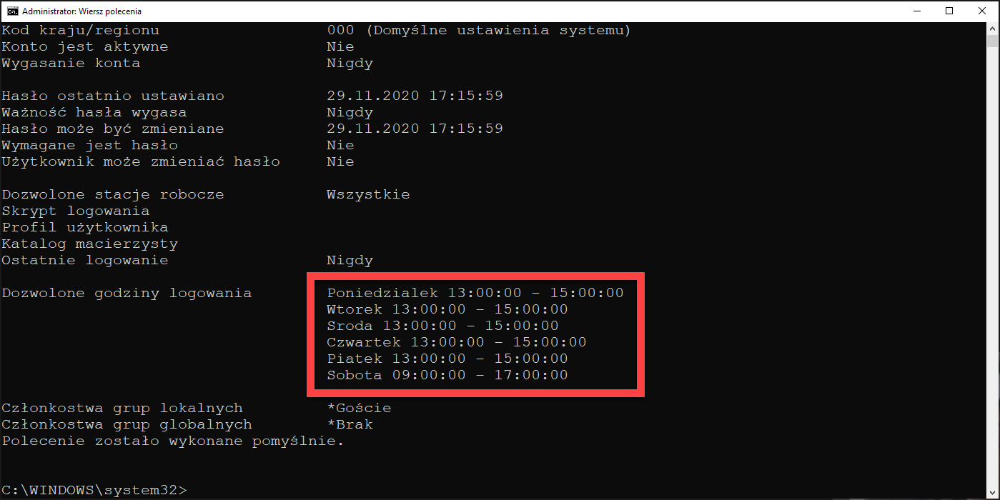Dear Windows, where's my Sunday?

I hope you already learned polish day names. If not, I will help you - There's no Niedziela on the list. So again we were not able to set hours for Sunday even though there were no error. Darn. Back to debugging.

## Debugging - take 2

Let's open the debugger again and see why we do not get values when parsed the input. Since we know only `N` is affected, let's limit our command line to it so we are taken to proper parts of the code w/o too many distractions along the way. So our new cmd line is: `net user Gość /times:N,9:00-17:00`.

After following the code we end up in a function that is responsible for - yet again - generating the names.

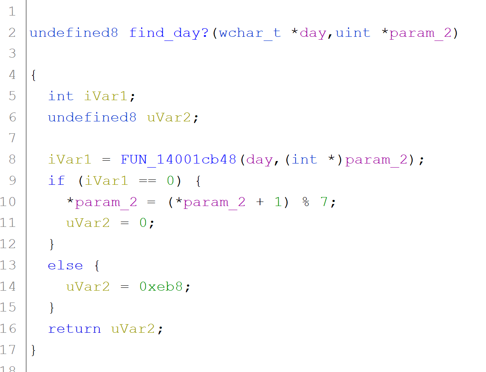

The modulo part looks like we might be on track - it looks like, the function `FUN_14001cb48` takes our input and in `param_2` is used as an output parameter. Modulo `7` looks interesting as we have 7 days so we might be protecting against if for some reason we get a value outside the valid range.

If we go deeper we will end up in a loop that will generate names of the days based on input array and after that we will try to find our day in the list of names of days or their abbreviations.

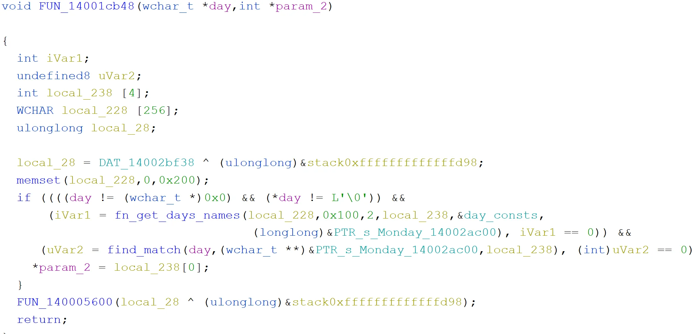

And the most important part of `fn_get_days_names` is the following loop.

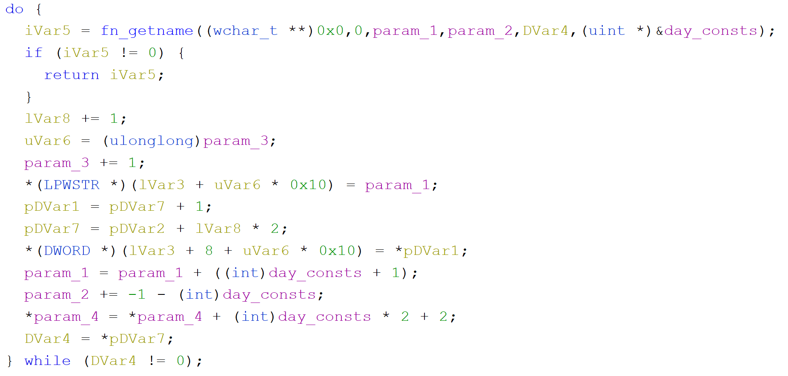

The `day_consts` is the following array:

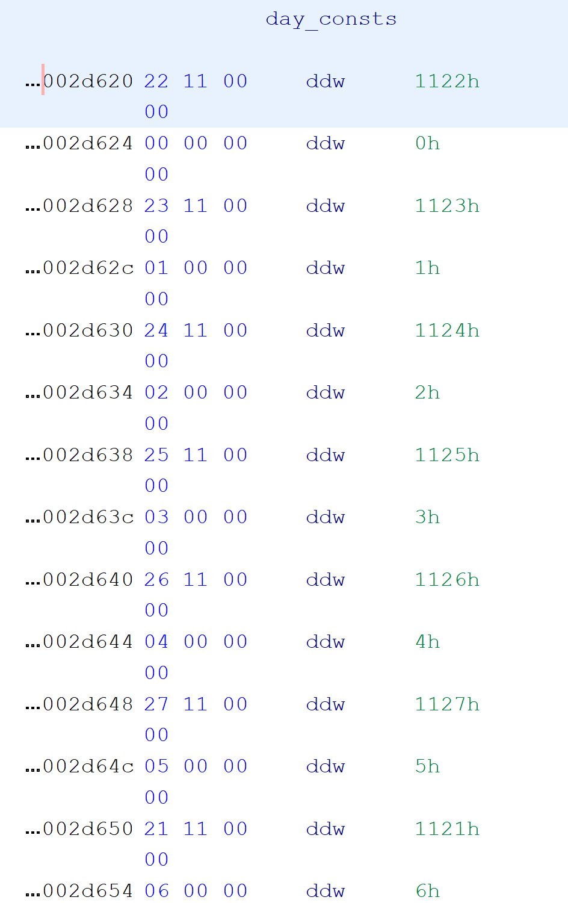Days IDs?

And running the above mentioned loop with IDs will give us the following:

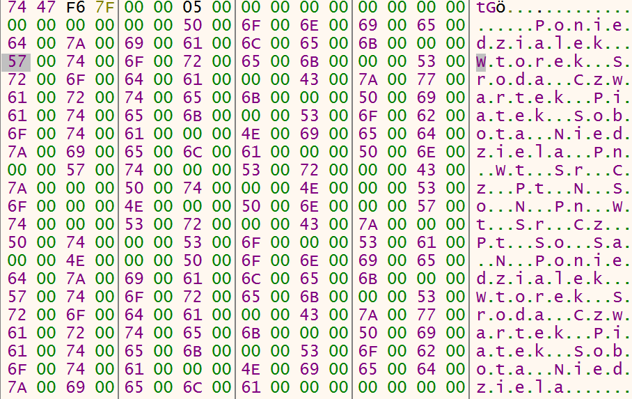Already here we can see the issue. Can you spot it?

So how do we go from IDs to name of the days? Let's back up a little bit.

Windows supports many, languages and displays translated strings when such language is used. It can be seen in error messages and different labels visible. Hardcoding them in the binaries would probably not be efficient and will bloat the binary if all the translations will be in one big file.

Instead resources are located in `.mui` \- Multilingual User Interface - and are loaded on demand. Those for `net1.exe` are located in `netmsg.dll.mui` file. Let's peek inside that one `netmsg.dll.mui` and the IDs we saw earlier are for the particular days names that we saw in the debugger.

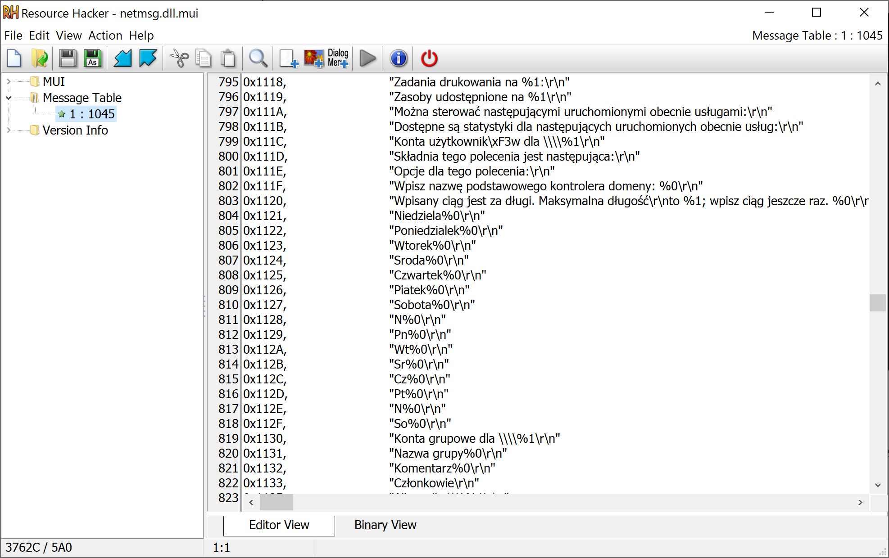Double Sunday?

Apart from a lot of translations, we can see the particular ones starting with IDs `0x1121`. Shortcut for Niedziela (N) is defined twice ( `0x1128` and `0x112E`) and those two offsets are used by the `net1.exe` program.

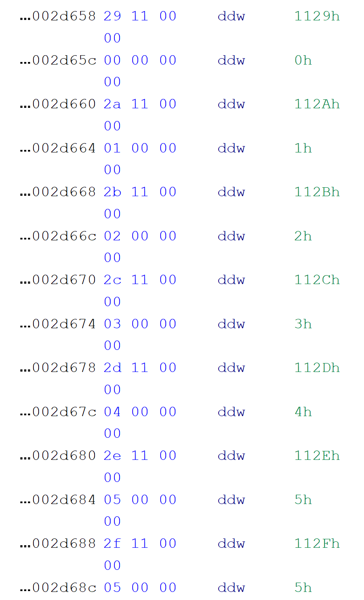

We still miss one piece of the puzzle - how does we match names with day number. This is done in `find_match` function. We the string is equal, we return the value located after the ID of the matched day. So If we match `Niedziela` with ID `0x1121` the function will return `0x00`.

Now it should be obvious where the mistake is, For Saturday we should return 5 - we start at zero, and remember the +1 - so we see two values before `5h` \- `0x112E` and `0x112F` but if we look into the resources those have values of `N` and `So` assigned which is wrong as it should be `Sb` and `So`. So entering `N` in our input string, will yield this function to set matched day as `5` which will be interpreted as Saturday and that would be set :/

And how does it look for English locale?

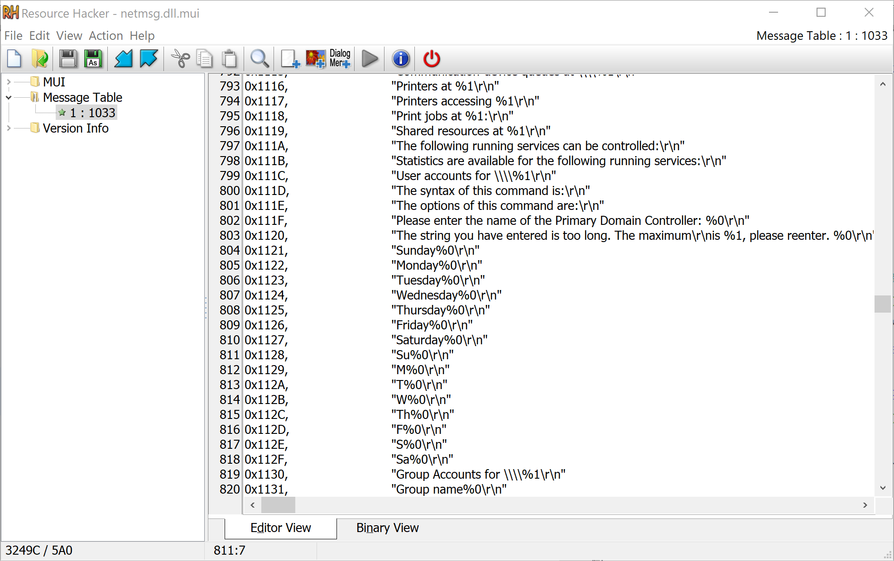

We can see that in English, we do have correct entries as `S` is correct short for Saturday in English. For Sunday we only have `Su` at index `0x1128`.

## Fixing it?

The mistake is in translations so there should be the proper fix. I'll report this issue to Microsoft to see if they can fix it (there might be some issues I'm not seeing here) in some future updates 🤞.

The problem with fixing manually the `.mui` file is that the [Resource Hacker](http://angusj.com/resourcehacker/) is unable to compile this file and failing on one of the longer entries (not related to this issue).

So at least for the moment we can't verify if this fix will work. But we will not end our journey here...tbc
