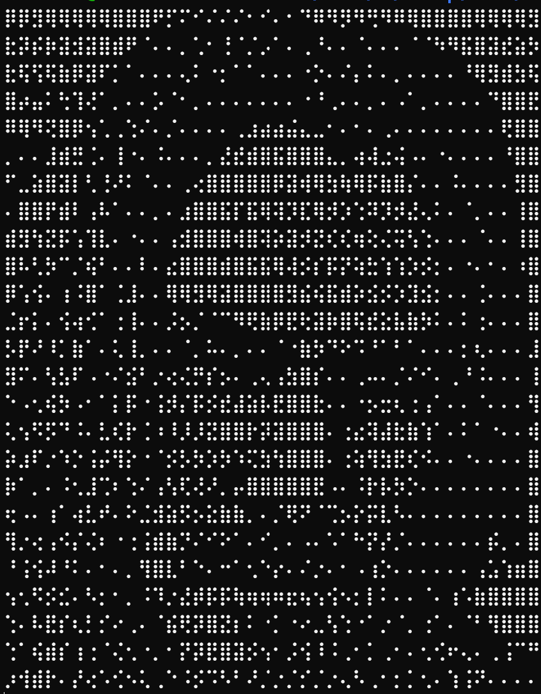

# Solving Geanu

Geanu was a simple RE challenge from MidnightsunCTF.

The task starts by print the following ASCII-art of Keanu and awaits our input.

Keanu from Geanu ;)

After getting user input it finishes.

Let's fire up Ghidra and load the binary. Since the binary is written in Go, we can apply 'golang_renamer.py` to demagle function names, but it's not really needed to solve this challenge.

We could start from main ( `main_main` in golang) and see an interesting comparison there

Right in the main, we see and interesting comparison.

Why this would be interesting? Constant that the comparison is done with is 1337 and that screams "important" in CTFs ;). Another clou would be that it guards a function call and after the call, binary just finishes. Similar behavior we could observe from running the binary.

Another approach could be to look at function list to see if we could spot anything interesting. Depending on the sort column (almost always it's good to sort by function size - the bigger function, more chance there's something interesting) we can spot some function that contains AES in the name. We can pick one (I've picked `crypto_aes_expandKeyAsm_482760`) and work our way back using XREFs.

After few steps up the call-chain we will end up in the function named `main_aamlojljmpmgmemeifmp_495010` and it contains quite an interesting code.

One, it does put series of bytes on the stack

Two, it does create AES cipher object ([GCM mode](https://en.wikipedia.org/wiki/Galois/Counter_Mode)) and does some printing. Assumption - this code decrypts the flag from the above data and prints it on screen.

Also, if you have been paying attention, we are in the same method that is guarded by the `if` statement from `main`. So if we add 2 from analysis of the `main`, and 2 from the analysis of what this metod does, for sure we should pay a bit more closer attention to it.

My approach to this task, during CTF was to break into the method that uses AES, extract all the necessary info for AES-GCM and then externally use it to extract the flag. But that was not even needed since we assumed that the binary prints the flag.

So to solve, it is enough to break in `gdb` at offset `0x94fedD` with the use of `breakrva 0x94fed`. After hitting the breakpoint, we can set the `rip` to a jump destination by issuing `set $rip = 0x4944ff9` and simply continuing.

Breaking on `JZ` will allow us to redirect the execution

Binary will print the flag for us - `midnight{r3v3rs1n9g0L4ng5uck5}`.
