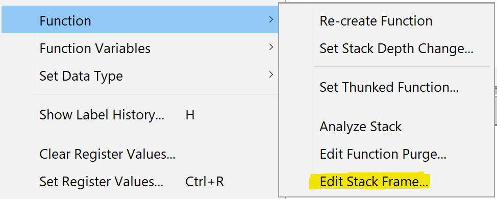
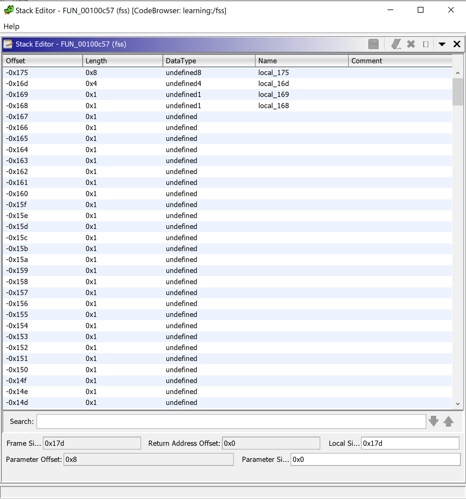
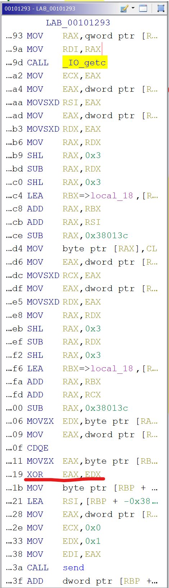

# Don't trust the decompilers

Decompilers can be your greatest ally or your greatest enemy. Basing the analysis only by the result of only one tool can fail you greatly. See for yourself.

* * *

Prefer to watch? Check out this video.

[Watch on YouTube](https://www.youtube.com/watch?v=At0pDgTfTsk)

Recently, I was solving one of the challenge from ångstromCTF 2021 and after opening the file in Ghidra, I've started the analysis. At first, everything looked ok, but the more I was looking at the pseudo-code generated by the tool, the more issues I had with it. Something was off, some stack variables were looking strange.
[code]
    iVar2 = socket(in_stack_ffffffffffc7fcc0->ai_family,in_stack_ffffffffffc7fcc0->ai_socktype,in_stack_ffffffffffc7fcc0->ai_protocol);

[/code]

This is not usually how Ghidra name stack variables in the current frame. Trying to rename those did not resulted in a regular dialog for a new name showing up. There were more examples of such weird naming along the method. Having no clue why the decompiler was acting strange had to resort to ultimate truth - disassembly.

Done so, almost immediately it was obvious what could be the problem. See for yourself:
[code]
    MOV    EDX,dword ptr [RAX + 0xc]
    MOV    RAX,qword ptr [RBP + -0x380338 ]

[/code]

`EBP` offset is huge! Just to be sure we are looking at it correctly, let's look how the stack frame is constructed.
[code]
    PUSH   RBP
    MOV    RBP,RSP
    PUSH   RBX
    SUB    RSP,0x380378

[/code]

And yes, stack frame for this method is huge. It's 3MB for the frame. This is not what regular stack frame size looks like.

So why is that, when we look at local variables for this method we only see couple of them? It might be a bug in Ghidra, or deliberate action to omit generating big stack frame for performance reasons. Anyway, if we want to see this method in the decompiler we need to fix it.

Fortunately Ghidra allow us to correct the stack frame for any given method. If we right click on the function's local variables we can go to `Function->Edit stack frame option`.

That will open up a window where we can analyze the stack frame in more details.

Stack frame in details

And in fact we can see that the size (bottom right `Local Si...`) is set to `0x17d` which is much smaller than `0x380378` substracted from `RSP`. Let's fix that.

In the stack editor a new size can be set, but if we do just that, Ghidra will happily revert our change. We need to define at least one of the new stack frame variables so that Ghidra will not revert them. Having new stack frame we can start to clean up the method.

We can start defining all those variables on the stack that previously were marked as `in_stack_ffffffffffc7fcc0`. Doing so we will be able to clean and have code like this:
[code]
    iVar2 = socket(_sock->ai_family,_sock->ai_socktype,_sock->ai_protocol);

[/code]

Cleaning up the stack had one more benefit. looking at the disassembly and the corresponding decompiled code something more was not right. See the following fragment:
[code]
    while (iVar13 < 0xd) {
        iVar6 = _IO_getc((_IO_FILE *)__fp);
        (&stack0xffffffffffc7feac)[(long)iVar13 + (long)iVar5 * 0x38] = (char)iVar6;
        send(iVar5,&stack0xffffffffffc7fc87,1,0);
        iVar13 += 1;
    }

[/code]

Looks like a small innocent code, with a clear meaning. Even considering the odd names for stack variables. But looking at the corresponding disassembly after a call to `_ID_getc` and following the execution (no `call` or `jump`) there was some `xor` operation that was not present anywhere in the decompilation.

It was odd as by analyzing the code I was pretty sure it supposed to be there. But it was not. But see how this fragment is different after cleaning up the stack frame
[code]
    while (iVar3 < 0xd) {
    iVar7 = _IO_getc((_IO_FILE *)__fp);
    *(char *)((long)local_3802c8 + (long)iVar3 + (long)(int)dVar5 * 0x38 + 0x174) =
                           (char)iVar7;
    local_38037c._3_1_ =   *(byte *)((long)&local_175 + (long)iVar3) ^ *(byte *((long)local_3802c8 + (long)iVar3 + (long)(int)dVar5 * 0x38 + 0x174);
    send(dVar5,(void *)((long)&local_38037c + 3),1,0);
                      iVar3 += 1;
    }

[/code]

See the `xor` operation now? Before it was never there. This is not yet the most cleaned-up code but already the additional line is visible, and it was a curcial one (for getting the flag).

The final, cleaned up disassembly looks like this:
[code]
    while ((int)i < 0xd) {
      res = _IO_getc((_IO_FILE *)__fp);
      (&current_frame)[(int)accept_c].buf[(int)i] = (char)res;
      _tosend = tosend[(int)i] ^ (&current_frame)[(int)accept_c].buf[(int)i];
      send(accept_c,&_tosend,1,0);
      i += 1;
    }

[/code]

Clean and we get to see the `xor` operation. Now we can solve it and get the flag.

What is the lesson learned here? Don't trust your decompiler blindly. If you see something odd - check the disassembly and fix the output of the decompilation.
