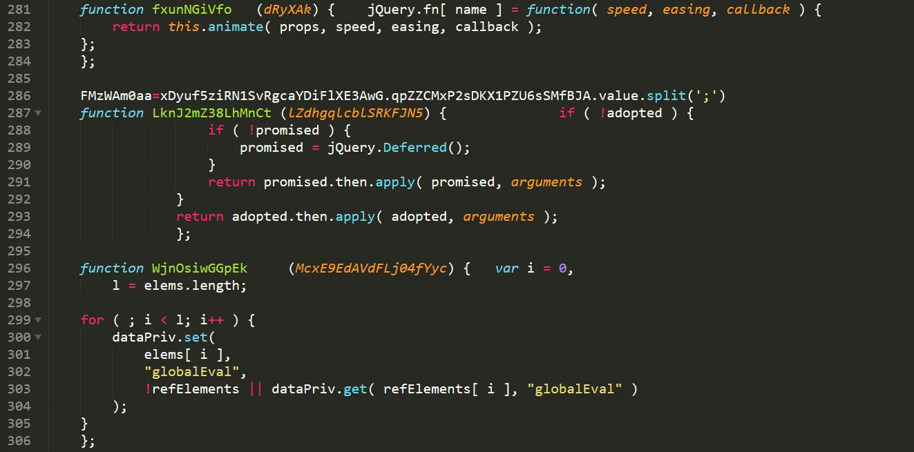
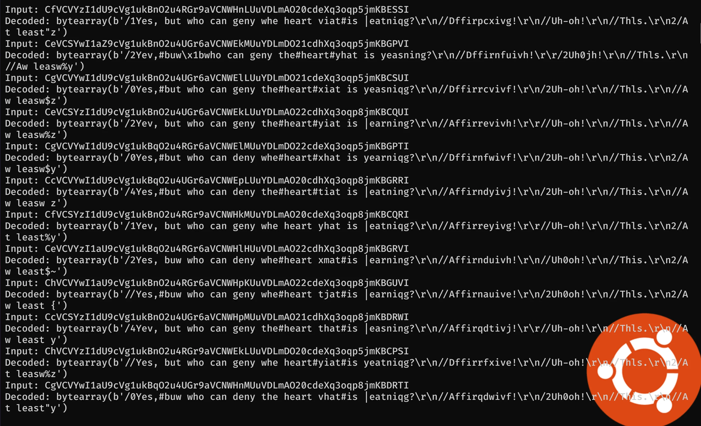

# Flare-On 8 - Beelogin

In this challenge we are given a huge, `3.10` MB html file. Opening it, we can see there's a HTML form, and a lot of JavaScript. A lot. It's obfuscated too.

Looking closer, it appears that it contains mostly the garbage and only some parts are relevant.

One valid line and a lot of garbage

From the above image, only the line 286 is important. The rest is noise (looks like jQuery tests?) and we can get rid of it. We can do that by running a simple script that will keep only the lines that contains one of the relevant variable names.
[code]
    lines = open('beelogin.html').readlines()

    output = lines[:33]

    whatToSave = ['LLfYTmPiahzA3WFXKcL5BczcG1s1','qpZZCMxP2sDKX1PZU6sSMfBJA','ZuAHehme2RWulqFbEWBW','ZJqLM97qEThEw2Tgkd8VM5OWlcFN6hx4y2','Xxb6fjAi1J1HqcZJIpFv16eS',
    			  'atob','=";','==";','Ljasr99E9HLv1BBnSfEHYw','bNT5lGtaxYHeyHFeEdImdD12Csa7MlR',"sEjdWWMFU4wObKZap4WeMBgdfgIfTHCvS"]

    import sys
    progress = 33
    for l in lines[33:]:
    	progress += 1
    	sys.stdout.write("Parsing line: %d   \r" % (progress) )
    	sys.stdout.flush()
    	for i in whatToSave:
    		if i in l:
    			output.append(l)
    			if '=' in l:
    				elems = l.split('=')
    				whatToSave.append(elems[0].strip())
    			break
    	else:
    		continue

    open('parsed.html','w').write(''.join(output))

[/code]

With that, we are left with much shorter file, which readability can be improved by using better names (sort of).
[code]
    	FMzWAm0aa=myForm.pass2.value.split(';')
    	if('rFzmLyTiZ6AHlL1Q4xV7G8pW32'>=FMzWAm0aa)eval(FMzWAm0aa)
    	jjEzfkkQKmNRjk=myForm.pass1.value.split(';')
    	if('rFzmLyTiZ6AHlL1Q4xV7G8pW32'>=jjEzfkkQKmNRjk)eval(jjEzfkkQKmNRjk)
    	s264DreiOxB=myForm.pass1.value.split(';')
    	if('rFzmLyTiZ6AHlL1Q4xV7G8pW32'>=s264DreiOxB)eval(s264DreiOxB)
    	bZVlSWZX7q3aWXGYsT8=myForm.pass2.value.split(';')
    	if('rFzmLyTiZ6AHlL1Q4xV7G8pW32'>=bZVlSWZX7q3aWXGYsT8)eval(bZVlSWZX7q3aWXGYsT8)
    	gOelRBKoKe3XNqNtb=myForm.pass2.value.split(';')
    	if('rFzmLyTiZ6AHlL1Q4xV7G8pW32'>=gOelRBKoKe3XNqNtb)eval(gOelRBKoKe3XNqNtb)

    	dataEncoded = "...5g=="; //cut for brevity

        BntQj9FBk=myForm.pass1.value.split(';')
    	if('rFzmLyTiZ6AHlL1Q4xV7G8pW32'>=BntQj9FBk)eval(BntQj9FBk)
    	vwXaWQUif35pQPp1HRk=myForm.pass1.value.split(';')
    	if('rFzmLyTiZ6AHlL1Q4xV7G8pW32'>=vwXaWQUif35pQPp1HRk)eval(vwXaWQUif35pQPp1HRk)
    	yWTwYnToP=myForm.pass2.value.split(';')
    	if('rFzmLyTiZ6AHlL1Q4xV7G8pW32'>=yWTwYnToP)eval(yWTwYnToP)
    	LWMHhv1A2II3KIw=myForm.pass3.value.split(';')
    	if('rFzmLyTiZ6AHlL1Q4xV7G8pW32'>=LWMHhv1A2II3KIw)eval(LWMHhv1A2II3KIw)
    	Qw4tT4mtYo9pJ6YHhvs48=myForm.pass5.value.split(';')
    	if('rFzmLyTiZ6AHlL1Q4xV7G8pW32'>=Qw4tT4mtYo9pJ6YHhvs48)eval(Qw4tT4mtYo9pJ6YHhvs48)

        keyEncoded = "...yOWs="; //cut for brevity

        mn373SYpa7uXZ7U9OxPo=myForm.pass2.value.split(';')
    	if('rFzmLyTiZ6AHlL1Q4xV7G8pW32'>=mn373SYpa7uXZ7U9OxPo)eval(mn373SYpa7uXZ7U9OxPo)
    	UStc3NsbGr2Si=myForm.pass1.value.split(';')
    	if('rFzmLyTiZ6AHlL1Q4xV7G8pW32'>=UStc3NsbGr2Si)eval(UStc3NsbGr2Si)
    	dEvF8C5Sk2YUxTW=myForm.pass2.value.split(';')
    	if('rFzmLyTiZ6AHlL1Q4xV7G8pW32'>=dEvF8C5Sk2YUxTW)eval(dEvF8C5Sk2YUxTW)
    	rxmBiIYoakOAshGAn=myForm.pass2.value.split(';')
    	if('rFzmLyTiZ6AHlL1Q4xV7G8pW32'>=rxmBiIYoakOAshGAn)eval(rxmBiIYoakOAshGAn)
    	oIQXvqmAYT0PIe=myForm.pass1.value.split(';')
    	if('rFzmLyTiZ6AHlL1Q4xV7G8pW32'>=oIQXvqmAYT0PIe)eval(oIQXvqmAYT0PIe)

    	_64 = 64

        SUxpGrODKM6sQiqj=myForm.pass3.value.split(';')
    	if('rFzmLyTiZ6AHlL1Q4xV7G8pW32'>=SUxpGrODKM6sQiqj)eval(SUxpGrODKM6sQiqj)
    	cel4b84FeQbiKT6=myForm.pass3.value.split(';')
    	if('rFzmLyTiZ6AHlL1Q4xV7G8pW32'>=cel4b84FeQbiKT6)eval(cel4b84FeQbiKT6)
    	MnakH=myForm.pass3.value.split(';')
    	if('rFzmLyTiZ6AHlL1Q4xV7G8pW32'>=MnakH)eval(MnakH)
    	jzCPjIhvzT9cRL=myForm.pass2.value.split(';')
    	if('rFzmLyTiZ6AHlL1Q4xV7G8pW32'>=jzCPjIhvzT9cRL)eval(jzCPjIhvzT9cRL)
    	JMToaM=myForm.pass3.value.split(';')
    	if('rFzmLyTiZ6AHlL1Q4xV7G8pW32'>=JMToaM)eval(JMToaM)
    	qguBomGfcTZ6L4lRxS0TWx1IwG=myForm.pass4.value.split(';')
    	UEypLKmaXbn7cJ=myForm.pass3.value.split(';')
    	if('rFzmLyTiZ6AHlL1Q4xV7G8pW32'>=UEypLKmaXbn7cJ)eval(UEypLKmaXbn7cJ)
    	a5jY5A2cYSj1PD41g=myForm.pass2.value.split(';')
    	if('rFzmLyTiZ6AHlL1Q4xV7G8pW32'>=a5jY5A2cYSj1PD41g)eval(a5jY5A2cYSj1PD41g)
    	qxsKRvkQ=myForm.pass5.value.split(';')
    	if('rFzmLyTiZ6AHlL1Q4xV7G8pW32'>=qxsKRvkQ)eval(qxsKRvkQ)
    	ibNppkEG1an=myForm.pass2.value.split(';')
    	if('rFzmLyTiZ6AHlL1Q4xV7G8pW32'>=ibNppkEG1an)eval(ibNppkEG1an)
    	pUuhsBf4uUcxLkn=myForm.pass5.value.split(';')
    	if('rFzmLyTiZ6AHlL1Q4xV7G8pW32'>=pUuhsBf4uUcxLkn)eval(pUuhsBf4uUcxLkn)

        dataDecoded = atob(dataEncoded).split('');

        GVDmw5eE70Cmpwi8=myForm.pass5.value.split(';')
    	if('rFzmLyTiZ6AHlL1Q4xV7G8pW32'>=GVDmw5eE70Cmpwi8)eval(GVDmw5eE70Cmpwi8)
    	XSyVA9kU=myForm.pass5.value.split(';')
    	if('rFzmLyTiZ6AHlL1Q4xV7G8pW32'>=XSyVA9kU)eval(XSyVA9kU)
    	QdpNBDNkBDhWaJHNNq8h=myForm.pass3.value.split(';')
    	if('rFzmLyTiZ6AHlL1Q4xV7G8pW32'>=QdpNBDNkBDhWaJHNNq8h)eval(QdpNBDNkBDhWaJHNNq8h)
    	ddGIRY1ekiaMsRWZ=myForm.pass2.value.split(';')
    	if('rFzmLyTiZ6AHlL1Q4xV7G8pW32'>=ddGIRY1ekiaMsRWZ)eval(ddGIRY1ekiaMsRWZ)
    	iBWBY2ijgq6WJ0G=myForm.pass1.value.split(';')
    	if('rFzmLyTiZ6AHlL1Q4xV7G8pW32'>=iBWBY2ijgq6WJ0G)eval(iBWBY2ijgq6WJ0G)

        dataDecodedLen = dataDecoded.length;

        HTkHo8Rh3ciUY54ZdOFq=myForm.pass2.value.split(';')
    	if('rFzmLyTiZ6AHlL1Q4xV7G8pW32'>=HTkHo8Rh3ciUY54ZdOFq)eval(HTkHo8Rh3ciUY54ZdOFq)
    	QjZWzQHRPBpZERXb=myForm.pass5.value.split(';')
    	if('rFzmLyTiZ6AHlL1Q4xV7G8pW32'>=QjZWzQHRPBpZERXb)eval(QjZWzQHRPBpZERXb)
    	yxHIrkVDUd=myForm.pass3.value.split(';')
    	if('rFzmLyTiZ6AHlL1Q4xV7G8pW32'>=yxHIrkVDUd)eval(yxHIrkVDUd)
    	lkhAbQfqat7=myForm.pass1.value.split(';')
    	if('rFzmLyTiZ6AHlL1Q4xV7G8pW32'>=lkhAbQfqat7)eval(lkhAbQfqat7)
    	oFwv2RSBcNh=myForm.pass1.value.split(';')
    	if('rFzmLyTiZ6AHlL1Q4xV7G8pW32'>=oFwv2RSBcNh)eval(oFwv2RSBcNh)

        keyDecoded = atob(keyEncoded).split('');

        gqCkbVLBW=myForm.pass5.value.split(';')
    	if('rFzmLyTiZ6AHlL1Q4xV7G8pW32'>=gqCkbVLBW)eval(gqCkbVLBW)
    	tRerlqItoWlKhcLzr4=myForm.pass2.value.split(';')
    	if('rFzmLyTiZ6AHlL1Q4xV7G8pW32'>=tRerlqItoWlKhcLzr4)eval(tRerlqItoWlKhcLzr4)
    	gixuNPGu2I=myForm.pass1.value.split(';')
    	if('rFzmLyTiZ6AHlL1Q4xV7G8pW32'>=gixuNPGu2I)eval(gixuNPGu2I)
    	dRcfHY9T8BXWbZURlm=myForm.pass5.value.split(';')
    	if('rFzmLyTiZ6AHlL1Q4xV7G8pW32'>=dRcfHY9T8BXWbZURlm)eval(dRcfHY9T8BXWbZURlm)
    	YEUFlyx5JoS4diMFe=myForm.pass1.value.split(';')
    	if('rFzmLyTiZ6AHlL1Q4xV7G8pW32'>=YEUFlyx5JoS4diMFe)eval(YEUFlyx5JoS4diMFe)

        letters='gflsdgfdjgflkdsfjg4980utjkfdskfglsldfgjJLmSDA49sdfgjlfdsjjqdgjfj'.split('');

        D9bhLIZHZQBkNvqg=myForm.pass1.value.split(';')
    	if('rFzmLyTiZ6AHlL1Q4xV7G8pW32'>=D9bhLIZHZQBkNvqg)eval(D9bhLIZHZQBkNvqg)
    	nyTBivplgdAKjZqZ5=myForm.pass3.value.split(';')
    	if('rFzmLyTiZ6AHlL1Q4xV7G8pW32'>=nyTBivplgdAKjZqZ5)eval(nyTBivplgdAKjZqZ5)
    	zxyHmFaJ0GAgNw2tlHEXl=myForm.pass5.value.split(';')
    	if('rFzmLyTiZ6AHlL1Q4xV7G8pW32'>=zxyHmFaJ0GAgNw2tlHEXl)eval(zxyHmFaJ0GAgNw2tlHEXl)
    	aD0tHY1fItv=myForm.pass5.value.split(';')
    	if('rFzmLyTiZ6AHlL1Q4xV7G8pW32'>=aD0tHY1fItv)eval(aD0tHY1fItv)
    	Ekr6Q7SEg0a9=myForm.pass5.value.split(';')
    	if('rFzmLyTiZ6AHlL1Q4xV7G8pW32'>=Ekr6Q7SEg0a9)eval(Ekr6Q7SEg0a9)

        if(qguBomGfcTZ6L4lRxS0TWx1IwG[0].length==_64)letters=qguBomGfcTZ6L4lRxS0TWx1IwG[0].split('');

        QUEpJuSauihs=myForm.pass1.value.split(';')
    	if('rFzmLyTiZ6AHlL1Q4xV7G8pW32'>=QUEpJuSauihs)eval(QUEpJuSauihs)
    	x5dhFZKBaBQLd1=myForm.pass5.value.split(';')
    	if('rFzmLyTiZ6AHlL1Q4xV7G8pW32'>=x5dhFZKBaBQLd1)eval(x5dhFZKBaBQLd1)
    	XxJI7G5w0=myForm.pass2.value.split(';')
    	if('rFzmLyTiZ6AHlL1Q4xV7G8pW32'>=XxJI7G5w0)eval(XxJI7G5w0)
    	CVhGshVo=myForm.pass5.value.split(';')
    	if('rFzmLyTiZ6AHlL1Q4xV7G8pW32'>=CVhGshVo)eval(CVhGshVo)
    	lGSlvM8XuY2mze=myForm.pass3.value.split(';')
    	if('rFzmLyTiZ6AHlL1Q4xV7G8pW32'>=lGSlvM8XuY2mze)eval(lGSlvM8XuY2mze)

    	for (i=0; i < keyDecoded.length; i++) { keyDecoded[i] = (keyDecoded[i].charCodeAt(0) + letters[i % _64].charCodeAt(0)) & 0xFF;	}

        UMdhHcXS4N1566r9N=myForm.pass1.value.split(';')
    	if('rFzmLyTiZ6AHlL1Q4xV7G8pW32'>=UMdhHcXS4N1566r9N)eval(UMdhHcXS4N1566r9N)
    	FYqCteXLbR=myForm.pass1.value.split(';')
    	if('rFzmLyTiZ6AHlL1Q4xV7G8pW32'>=FYqCteXLbR)eval(FYqCteXLbR)
    	JAQSUVr=myForm.pass1.value.split(';')
    	if('rFzmLyTiZ6AHlL1Q4xV7G8pW32'>=JAQSUVr)eval(JAQSUVr)
    	RGIzWHkhZ7qu5=myForm.pass2.value.split(';')
    	if('rFzmLyTiZ6AHlL1Q4xV7G8pW32'>=RGIzWHkhZ7qu5)eval(RGIzWHkhZ7qu5)
    	MWEyEI29Wo8QSyz4i6Xp=myForm.pass3.value.split(';')
    	if('rFzmLyTiZ6AHlL1Q4xV7G8pW32'>=MWEyEI29Wo8QSyz4i6Xp)eval(MWEyEI29Wo8QSyz4i6Xp)

        dataDecoded2 = dataDecoded

        jExvuGt7d06X=myForm.pass2.value.split(';')
    	if('rFzmLyTiZ6AHlL1Q4xV7G8pW32'>=jExvuGt7d06X)eval(jExvuGt7d06X)
    	BjoBetORu8D6Hk1ua=myForm.pass3.value.split(';')
    	if('rFzmLyTiZ6AHlL1Q4xV7G8pW32'>=BjoBetORu8D6Hk1ua)eval(BjoBetORu8D6Hk1ua)
    	QJL2DDhn=myForm.pass2.value.split(';')
    	if('rFzmLyTiZ6AHlL1Q4xV7G8pW32'>=QJL2DDhn)eval(QJL2DDhn)
    	k2W7K9hZ=myForm.pass3.value.split(';')
    	if('rFzmLyTiZ6AHlL1Q4xV7G8pW32'>=k2W7K9hZ)eval(k2W7K9hZ)
    	HcKmbMwEbNv4q2=myForm.pass3.value.split(';')
    	if('rFzmLyTiZ6AHlL1Q4xV7G8pW32'>=HcKmbMwEbNv4q2)eval(HcKmbMwEbNv4q2)

        for (i=0; i < dataDecodedLen; i++) { dataDecoded2[i] = (dataDecoded2[i].charCodeAt(0) - keyDecoded[i % keyDecoded.length]) & 0xFF;	}

        t62Ubly0dhxremjMyJZ=myForm.pass2.value.split(';')
    	if('rFzmLyTiZ6AHlL1Q4xV7G8pW32'>=t62Ubly0dhxremjMyJZ)eval(t62Ubly0dhxremjMyJZ)
    	GsRJjah0F=myForm.pass1.value.split(';')
    	if('rFzmLyTiZ6AHlL1Q4xV7G8pW32'>=GsRJjah0F)eval(GsRJjah0F)
    	OBnPLEzlQOdygps2=myForm.pass3.value.split(';')
    	if('rFzmLyTiZ6AHlL1Q4xV7G8pW32'>=OBnPLEzlQOdygps2)eval(OBnPLEzlQOdygps2)
    	UhTWgwC6uLBhtwwmh0Oy=myForm.pass3.value.split(';')
    	if('rFzmLyTiZ6AHlL1Q4xV7G8pW32'>=UhTWgwC6uLBhtwwmh0Oy)eval(UhTWgwC6uLBhtwwmh0Oy)
    	YJzlwG8m8sVOd5qgK=myForm.pass1.value.split(';')
    	if('rFzmLyTiZ6AHlL1Q4xV7G8pW32'>=YJzlwG8m8sVOd5qgK)eval(YJzlwG8m8sVOd5qgK)

        result="";

        bTY1Y6afA=myForm.pass3.value.split(';')
    	if('rFzmLyTiZ6AHlL1Q4xV7G8pW32'>=bTY1Y6afA)eval(bTY1Y6afA)
    	XaujiST1qfer4dyxTyMx=myForm.pass1.value.split(';')
    	if('rFzmLyTiZ6AHlL1Q4xV7G8pW32'>=XaujiST1qfer4dyxTyMx)eval(XaujiST1qfer4dyxTyMx)
    	NIq9uzZbOoQL9DVCiT=myForm.pass2.value.split(';')
    	if('rFzmLyTiZ6AHlL1Q4xV7G8pW32'>=NIq9uzZbOoQL9DVCiT)eval(NIq9uzZbOoQL9DVCiT)
    	ZkYxwYclIlwGs969KT8=myForm.pass5.value.split(';')
    	if('rFzmLyTiZ6AHlL1Q4xV7G8pW32'>=ZkYxwYclIlwGs969KT8)eval(ZkYxwYclIlwGs969KT8)
    	CY5ng=myForm.pass2.value.split(';')
    	if('rFzmLyTiZ6AHlL1Q4xV7G8pW32'>=CY5ng)eval(CY5ng)

        for (i=0; i < dataDecoded.length; i++) { result+=String.fromCharCode(dataDecoded2[i]);}

        Vx3aWn2=myForm.pass3.value.split(';')
    	if('rFzmLyTiZ6AHlL1Q4xV7G8pW32'>=Vx3aWn2)eval(Vx3aWn2)
    	NhuY71xe=myForm.pass5.value.split(';')
    	if('rFzmLyTiZ6AHlL1Q4xV7G8pW32'>=NhuY71xe)eval(NhuY71xe)
    	OObTpl4HxsZjRROdG1z=myForm.pass2.value.split(';')
    	if('rFzmLyTiZ6AHlL1Q4xV7G8pW32'>=OObTpl4HxsZjRROdG1z)eval(OObTpl4HxsZjRROdG1z)
    	BFcBmXN=myForm.pass3.value.split(';')
    	if('rFzmLyTiZ6AHlL1Q4xV7G8pW32'>=BFcBmXN)eval(BFcBmXN)
    	dflDGOZ=myForm.pass5.value.split(';')
    	if('rFzmLyTiZ6AHlL1Q4xV7G8pW32'>=dflDGOZ)eval(dflDGOZ)
    	if('rFzmLyTiZ6AHlL1Q4xV7G8pW32'>=result)eval(result)
    	ae2sRYPXhdDOcYV3wr3t=myForm.pass1.value.split(';')
    	if('rFzmLyTiZ6AHlL1Q4xV7G8pW32'>=ae2sRYPXhdDOcYV3wr3t)eval(ae2sRYPXhdDOcYV3wr3t)
    	GHD7BVnwg=myForm.pass1.value.split(';')
    	if('rFzmLyTiZ6AHlL1Q4xV7G8pW32'>=GHD7BVnwg)eval(GHD7BVnwg)
    	KJWAXTgA2L=myForm.pass3.value.split(';')
    	if('rFzmLyTiZ6AHlL1Q4xV7G8pW32'>=KJWAXTgA2L)eval(KJWAXTgA2L)
    	fAUBCltr0=myForm.pass2.value.split(';')
    	if('rFzmLyTiZ6AHlL1Q4xV7G8pW32'>=fAUBCltr0)eval(fAUBCltr0)
    	ZEKC6C35RAHD=myForm.pass1.value.split(';')
    	if('rFzmLyTiZ6AHlL1Q4xV7G8pW32'>=ZEKC6C35RAHD)eval(ZEKC6C35RAHD)

[/code]

We can strip it even further down by removing some unncessary assignments. What is the core is the following
[code]
    dataEncoded = "4fny3zLzDRY...=="
    keyEncoded = "b2JDN2...="
    _64 = 64

    dataDecoded = atob(dataEncoded).split('');
    dataDecodedLen = dataDecoded.length;
    keyDecoded = atob(keyEncoded).split('');
    letters='gflsdgfdjgflkdsfjg4980utjkfdskfglsldfgjJLmSDA49sdfgjlfdsjjqdgjfj'.split('');

    if(qguBomGfcTZ6L4lRxS0TWx1IwG[0].length==_64)letters=qguBomGfcTZ6L4lRxS0TWx1IwG[0].split('');

    for (i=0; i < keyDecoded.length; i++) { keyDecoded[i] = (keyDecoded[i].charCodeAt(0) + letters[i % _64].charCodeAt(0)) & 0xFF;	}
    dataDecoded2 = dataDecoded;

    for (i=0; i < dataDecodedLen; i++) { dataDecoded2[i] = (dataDecoded2[i].charCodeAt(0) - keyDecoded[i % keyDecoded.length]) & 0xFF;	}
    result="";

    for (i=0; i < dataDecoded.length; i++) { result+=String.fromCharCode(dataDecoded2[i]);}
    if('rFzmLyTiZ6AHlL1Q4xV7G8pW32'>=result)eval(result)

[/code]

So the core content is a big data chunk (`dataEncoded`), smaller one (`keyEncoded`) and an array of letters (`letters`) which can be overwritten by the user input. Firstly, we transform decoded key (initial form is `base64`) with the `letters`, by adding value of each letter to the key, and after that we subtract, the key letters from `dataDecoded`. Finally, we convert bytes to string and run `eval`.

From the first look at this task, it appears that everything needed to solve this challenge is in our hands, but of course the value for `letters` provided in the html file doesn't produce valid JS (and it should be valid since we are calling `eval` at the very end). We need to find correct value for `letters` which is 64 characters long.

Some brute forcing algorithm could be used here or, as I did, we could use z3 to find such values for `letters` that the output is something we can evaluate as JS.

The solver might look like this (without the data)
[code]
    from z3 import *
    import string
    import base64

    def atob(s):
    	return bytearray(base64.b64decode(s))

    s = Solver()

    data_clear = atob(b'4fny+...uC+2cX05g==')
    key_clear = atob(b'4fny+...uC+2cX05g==')

    inp  = [BitVec('x_'+str(i), 8) for i in range(64)]
    for c in inp:
    	s.add(Or(And(c >= 0x30, c <= 0x39),
    			 And(c >= 0x41, c <= 0x5A),
    			 And(c >= 0x61, c <= 0x7A)))

    key  = [BitVec('k_'+str(i), 8) for i in range(len(key_clear))]

    for c in key:
    	s.add(Or(And(c >= 0x30, c <= 0x39),
    			 And(c >= 0x41, c <= 0x5A),
    			 And( c > 0x61, c <= 0x7A)))

    for i in range(len(key)):
    	key[i] = (key_clear[i] + inp[i % len(inp)]) & 0xFF

    data = [BitVec('d_'+str(i), 8) for i in range(len(data_clear))]
    for i in range(len(data_clear)):
    	data[i] = (data_clear[i] - key[i % len(key)]) & 0xFF

    for c in data:
    	s.add(Or(And(c >= 0x20, c <= 0x7e),
    			 c == 0x09,
    			 c == 0x0a,
    			 c == 0x0d))

    def decode(inp):
    	data = atob(b'4fny+...uC+2cX05g==')
    	key = atob(b'4fny+...uC+2cX05g==')
    	for i in range(len(key)):
    		key[i] = (key[i] + inp[i % len(inp)]) & 0xFF

    	for i in range(len(data_clear)):
    		data[i] = (data[i] - key[i % len(key)]) & 0xFF
    	return data

    while True:
    	s.check()

    	m = s.model()

    	#print(m)
    	sol = ''
    	for c in inp:
    		sol += chr(m[c].as_long())

    	print(f'Input: {sol}')
    	print(f'Decoded: {decode(bytes(sol,"ascii"))[:100]}')

[/code]

We need to wait a while but after a moment we can see some decoded, readable strings appears.

Since it has to be a valid JS a promising one is the one starting with `//` as a comment. We can also see that after `\r
` there's another line starting with `//`. The results isn't prefect but we can see some text and figure out the rest. It looks like it's the Bee movie script. By limiting what each characters can be we can extract the correct value for letters. The valid input for this stage is `ChVCVYzI1dU9cVg1ukBqO2u4UGr9aVCNWHpMUuYDLmDO22cdhXq3oqp8jmKBHUWI`.

And by using it, we will get is the following
[code]
    //Yes, but who can deny the heart that is yearning?
    //Affirmative!
    //Uh-oh!
    //This.
    //At least you're out in the world. You must meet girls.
    //Why is yogurt night so difficult?!
    //I feel so fast and free!
    //Good idea! You can really see why he's considered one of the best lawyers...
    //One's bald, one's in a boat, they're both unconscious!
    //You know what a Cinnabon is?
    //Just one. I try not to use the competition.
    //Heads up! Here we go.
    //Whose side are you on?
    //Did you ever think, "I'm a kid from The Hive. I can't do this"?
    //Can I get help with the Sky Mall magazine? I'd like to order the talking inflatable nose and ear hair trimmer.
    //It's a close community.
    //Which one?
    //That's why I want to get bees back to working together. That's the bee way! We're not made of Jell-O.
    //Yeah. It doesn't last too long.
    //Not that flower! The other one!
    //Surf's up, dude!
    //My parents wanted me to be a lawyer or a doctor, but I wanted to be a florist.
    //Bees don't smoke!
    //Good idea! You can really see why he's considered one of the best lawyers...
    //Nah.
    //Like what? Give me one example.
    //Why not? Isn't John Travolta a pilot?
    //What were they like?
    //You know what your problem is, Barry?
    //This is a bit of a surprise to me. I mean, you're a bee!
    //Hey, you want rum cake?
    //You have no job. You're barely a bee!
    //My mosquito associate will help you.
    //Yes, I know.
    //I know.
    //Up on a float, surrounded by flowers, crowds cheering.
    //This is a total disaster, all my fault.
    //Black and yellow.
    //Oh, my.
    //I assume wherever this truck goes is where they're getting it. I mean, that honey's ours.
    //Yeah.
    //What's the difference?
    //My only interest is flowers.
    //Coming!
    //You did? Was she Bee-ish?
    //Oh, no. More humans. I don't need this.
    //What are you?
    //Yeah.
    //Maybe I'll pierce my thorax. Shave my antennae. Shack up with a grasshopper. Get a gold tooth and call everybody "dawg"!
    //But I have another idea, and it's greater than my previous ideas combined.
    //To the final Tournament of Roses parade in Pasadena.
    //Giant, scary humans!
    //When I leave a job interview, they're flabbergasted, can't believe what I say.
    //Oh, this is so hard!
    //You'll regret this.
    //You want a smoking gun? Here is your smoking gun.
    //You're in Sheep Meadow!
    //Mamma mia, that's a lot of pages.
    //My sweater is Ralph Lauren, and I have no pants.
    //Here's your change. Have a great afternoon! Can I help who's next?
    [][(![]+[])[+[]]+(![]+[])[!+[]+!+[]]+(![]+[])[+!+[]]+(!![]+[])[+[]]][([][(![]+[])[+[]]+(![]+[])[!+[]+!+[]]+(![]+[])....

[/code]

The last line contains over 780k characters. And it's valid JS. If you don't know this type of JS - it has a special name - JSFuck. Thankfully we don't have to decode it by hand - we can use an online decoder - <https://lelinhtinh.github.io/de4js/>.

What we will get, is the code similar to the one from stage 1, with different data, and without unneeded instructions.

For this stage, we can apply the same solver as for the stage 1, and get the correct input - `UQ8yjqwAkoVGm7VDdhLoDk0Q75eKKhTfXXke36UFdtKAi0etRZ3DoHPz7NxJPgHl`. And by using it, we will get the following
[code]
    //He's not bothering anybody.
    //Why would you question anything? We're bees.
    //But you've never been a police officer, have you?
    //Up on a float, surrounded by flowers, crowds cheering.
    //According to all known laws of aviation, there is no way a bee should be able to fly.
    //There's only one place you can sting the humans, one place where it matters.
    //I'm kidding. Yes, Your Honor, we're ready to proceed.
    //Can I get help with the Sky Mall magazine? I'd like to order the talking inflatable nose and ear hair trimmer.
    //Maybe I'll pierce my thorax. Shave my antennae. Shack up with a grasshopper. Get a gold tooth and call everybody "dawg"!
    //Did you bring your crazy straw?
    //How should I start it? "You like jazz?" No, that's no good.
    //That bee is living my life!
    //Why is this here?
    //You don't have that?
    //What are you?
    //We're starting work today!
    //Our new queen was just elected with that same campaign slogan.
    //Uh-oh!
    //Ma! I got a thing going here.
    //Sorry. I'm excited.
    //Yeah, but...
    //This is Blue Leader, We have roses visual.
    //This is Bob Bumble. We have some late-breaking news from JFK Airport, where a suspenseful scene is developing.
    //What in the name of Mighty Hercules is this?
    //Stinger, check.
    //Well, there's a lot of choices.
    //Wow!
    //That's a fat guy in a flowered shirt.
    //You do that! This whole parade is a fiasco!
    //Thank you. Thank you.
    //Well...
    //Bent stingers, pointless pollination.
    //You think I don't see what you're doing?
    //Where is the rest of your team?
    //Good. Good. Easy, now. That's it.
    //I'm not gonna take advantage of that?
    //Mooseblood's about to leave the building! So long, bee!
    //Deady. Deadified. Two more dead.
    //You did it, and I'm glad. You saw whatever you wanted to see.
    //Box kite!
    //I'm a Pollen Jock! And it's a perfect fit. All I gotta do are the sleeves.
    //Our top-secret formula is automatically color-corrected, scent-adjusted and bubble-contoured into this soothing sweet syrup with its distinctive golden glow you know as... Honey!
    //You hear something?
    //Adam, stay with me.
    //Barry Benson, fresh from his legal victory...
    //Ken, could you close the window please?
    //I never heard of him.
    //Yeah, but some don't come back.
    //Hey, Adam.
    //You're talking!
    //No, you haven't. And so here we have yet another example of bee culture casually stolen by a human for nothing more than a prance-about stage name.
    //Oh, I can't do it. Come on!
    //Have you got a moment?
    //That just kills you twice.
    //Now we won't have to work so hard all the time.
    //Adam, they check in, but they don't check out!
    //All the honey will finally belong to the bees.
    //This is insane, Barry!
    //Can I get help with the Sky Mall magazine? I'd like to order the talking inflatable nose and ear hair trimmer.
    //Listen, you better go 'cause we're really busy working.
    [][(![]+[])[+[]]+....

[/code]

And again, we use the `de4js` on the last line, we get the flag `alert("I_h4d_v1rtU411y_n0_r3h34rs4l_f0r_th4t@flare-on.com")`.
