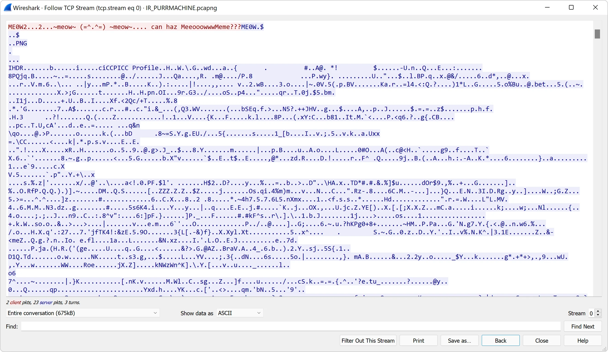
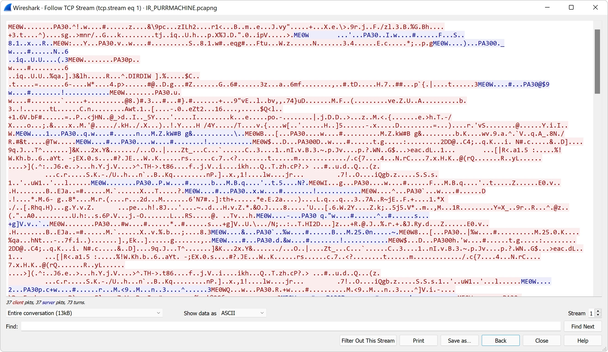
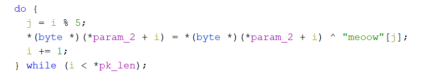
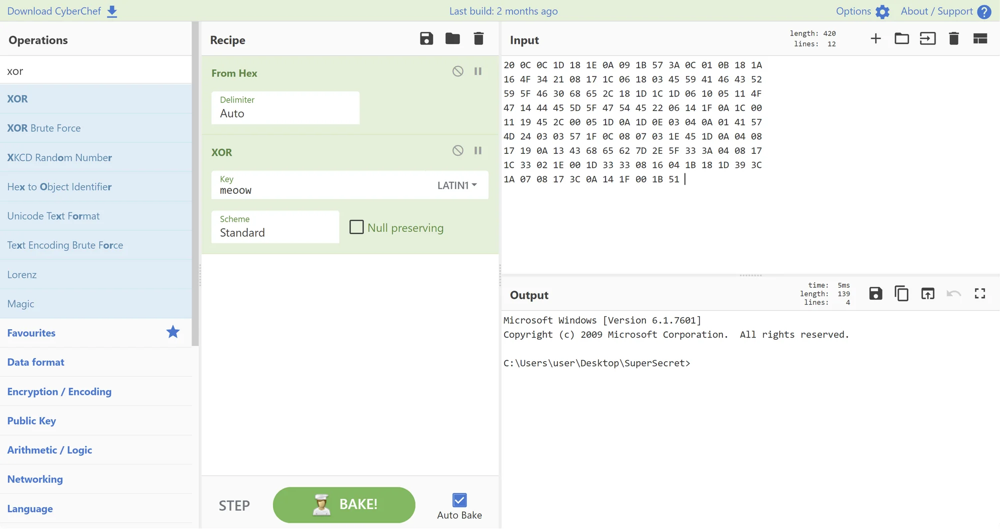

# Flare-On 8 - Pet the Kitty

> Hello,
>
> Recently we experienced an attack against our super secure MEOW-5000 network.
>
> Forensic analysis discovered evidence of the files PurrMachine.exe and PetTheKitty.jpg; however, these files were ultimately unrecoverable.
>
> We suspect PurrMachine.exe to be a downloader and do not know what role PetTheKitty.jpg plays (likely a second-stage payload).
>
> Our incident responders were able to recover malicious traffic from the infected machine.
>
> Please analyze the PCAP file and extract additional artifacts.
> Looking forward to your analysis,
>
> ~Meow

As part of this challenge we get a PCAP file `IR_PURRMACHINE.pcapng`. Opening it in Wireshark, we can see there's some kind of TCP communication.

Inspecting the communication closer (via `Analyze->Follow->Follow TCP stream`) we can see some interesting binary data.

There are two streams of data. In the first one we can see a short query (marked in red) and a long response (in blue) that can be clearly identified as PNG image (`PNG` , `IHDR` magics visible).

The second one, is more chatty and it it's not so obvious as the first one. There are some readable strings like `ME0W` and `PA30` but most of it is binary.

Upon closer inspection of the second stream, it can be recognized as a structured packed communication with the `ME0W` with some bytes followed by `PA30`. Upon even closer inspection, we can see that after `ME0W` is followed by some 4B value and then the size of the `PA30` package (value of `0x27` in this case).
[code]
    0000   4d 45 30 57 09 00 00 00 27 00 00 00 50 41 33 30   ME0W....'...PA30
    0010   d0 84 49 07 77 a0 d7 01 18 23 c0 b2 9f 0b 01 01   ..I.w....#......
    0020   46 00 94 13 53 1a cc 38 d1 31 a0 d7 78 07 00 00   F...S..8.1..x...
    0030   52 fd 0c                                          R..

[/code]

Those `ME0W`, `PA30` and in case of PNG (`\x89PNG`) are so called magic values and we can search by them and obtain some more info about the package, if this is a common protocol and not one invented by the author of this challenge. `ME0W` is probably a lost cause but `PA30` could lead to something. Checking this online, we can end up on a Wiki page - [List of file signatures](https://en.wikipedia.org/wiki/List_of_file_signatures), and there there's a row that looks familiar:

`44 43 4D 01 50 41 33 30`
`50 41 33 30`| `DCM␁PA30`
`PA30`| 0| | Windows Update [Binary Delta Compression](https://en.wikipedia.org/wiki/Binary_delta_compression "Binary delta compression") file[[45]](https://en.wikipedia.org/wiki/List_of_file_signatures#cite_note-45)
---|---|---|---|---

Ok. So it looks like, those `PA30` packages are mimicking Windows Update's communication. And the flag is probably somewhere inside.

To ease working with those files, let's save the raw streams and split them into separate `ME0W` messages.
[code]
    from struct import pack, unpack

    splitter = b'ME0W'

    idx = 1
    server = False
    def split_the_data(d):
    	global idx
    	global server
    	chunks = d.split(splitter)

    	for ch in chunks:
    		if ch == b'':
    			continue

    		size_1 = unpack("<I", ch[0:4])[0]
    		size_2 = unpack("<I", ch[4:8])[0]
    		msg = ch[8:8+size_2]
    		if not server:
    			name = f'PA_client_{idx:02}.bin'
    		if server:
    			name = f'PA_server_{idx:02}.bin'

    		server = not server
    		idx += 1
    		open(f'solution/{name}','wb').write(msg)

    data = open('chall/0.raw','rb').read()
    split_the_data(data)
    data = open('chall/1.raw','rb').read()
    split_the_data(data)

[/code]

After running the script, we have extracted the whole communication and nowe we can see the `PNG` file that was identified in the first stream.

Now, we need something that can work with Windows Updates compression. Deep understanding of the inner workings of this compression is not needed but it works by taking a binary file and applying the patches to get a new binary file. There's an API to work with those patches, but again, resorting to DuckDuckGo, gives us a [web page](https://wumb0.in/extracting-and-diffing-ms-patches-in-2020.html) and a working script `delta_patch.py`. We should use it with our patches (2nd stream) but what should be the initial binary that will be modified? You guessed it - our kitty. Let's try to run it:

> python3 delta_patch.py -i PA_server_02.bin -o output.bin PA_server_04.bin
>
> Applied 1 patch successfully
> Final hash: OsdAMg6SJ4EFnx69R5NJFq2ToD4utovfwrzBaVxmssk=

It worked and if we view the results (`output.bin`) we can see that the file is an PE32 executable. Let's fire up Ghidra.

By inspecting the binary, checking the strings and functions it looks like this was the binary that was used to produce the communication that we saw in the pcap file. Indications of that are the calls to `CreateDeltaB`, `ApplyDeltaB` from `MSDELTA.DLL` and string like `~me0w~`. The most important part from the binary is the `client` method that is responsible for receiving bytes. By inspecting the method we can spot, that the bytes we get needs to be decoded by xoring them with `meoow` to get the original bytes.

"meoow" key

Let's see if we can use that for the rest of the communication.

> python delta_patch.py -i solution\PA_server_02.bin -o output.bin solution\PA_client_05.bin
>
> Applied 1 patch successfully
> Final hash: Wgzbt+5elUyLw1b+QkGuJeX1qXGe8uu7HQRFwjRX+v8=

If we check the output this time, there's nothing we can recognize immediately but we have to remember from the binary that the content was xor'ed with `meoow`. If we apply the same operation to the output (using any tool - CyberChef for example) - text appears.

By continuing the process (applying the patch and decoding, or automating it in some way) we can extract the whole communication (including lyrics for `Never gonna give you up`) and hidden inside it, the flag: `1m_H3rE_Liv3_1m_n0t_a_C4t@flare-on.com`.

The full communication is here

[View Gist](https://gist.github.com/pawlos/f22679b77f90bd5a45347e1e1f79d7af)
