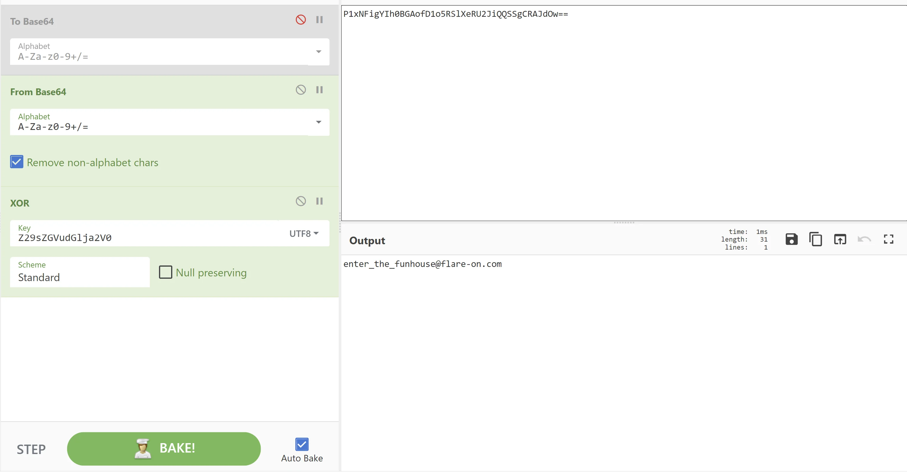

# Flare-On 8 - credchecker

The first task in this year competition. It is a single HTML file. Inside we can find a simple check for credentials.
[code]
    function checkCreds() {
    	if (username.value == "Admin" && atob(password.value) == "goldenticket")
    	{
    		var key = atob(encoded_key);
    		var flag = "";
    		for (let i = 0; i < key.length; i++)
    		{
    			flag += String.fromCharCode(key.charCodeAt(i) ^ password.value.charCodeAt(i % password.value.length))
    		}
    		document.getElementById("banner").style.display = "none";
    		document.getElementById("formdiv").style.display = "none";
    		document.getElementById("message").style.display = "none";
    		document.getElementById("final_flag").innerText = flag;
    		document.getElementById("winner").style.display = "block";
    	}
    	else
    	{
    		document.getElementById("message").style.display = "block";
    	}

[/code]

We can see that the function checks if the entered username is "Admin" and the password should be equal to "goldenticket", but first it should be decoded with base64 decode - so the correct input is `Z29sZGVudGlja2V0`. If we provide those, we take the value of `encoded_key` (which is `P1xNFigYIh0BGAofD1o5RSlXeRU2JiQQSSgCRAJdOw==`), decode it with base 64, and the result is xor-ed, char by char, with the password input (taken before base64 decode). We can use CyberChef to do the decoding for us

And we get the flag: `enter_the_funhousr@flare-on.com`.
