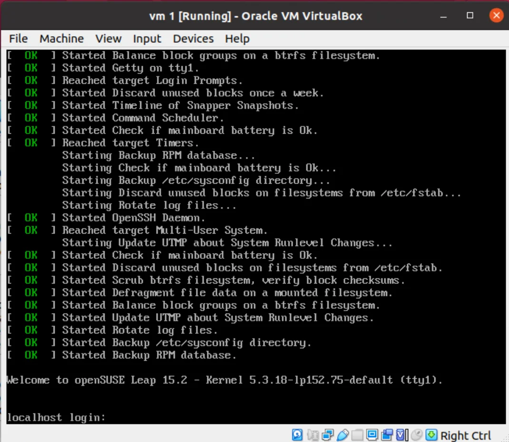
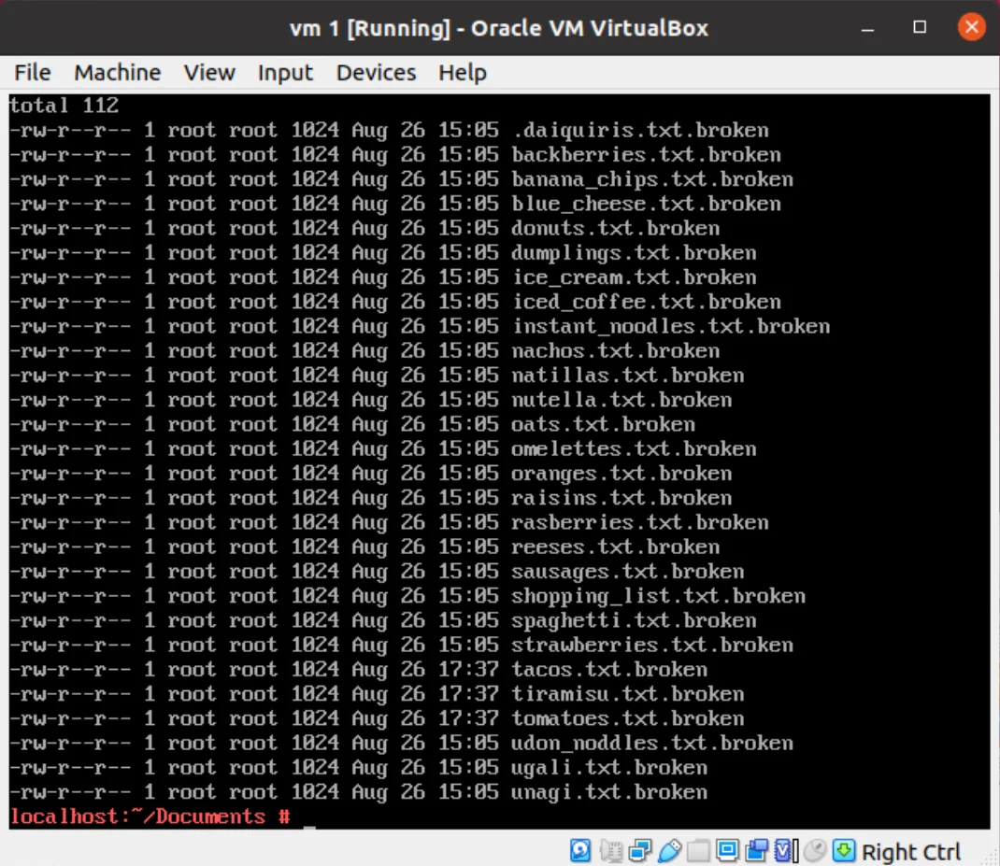
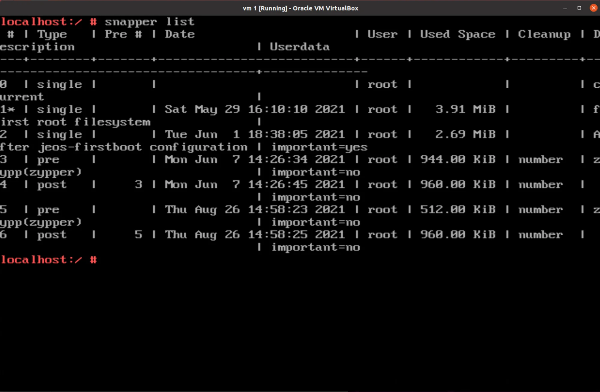
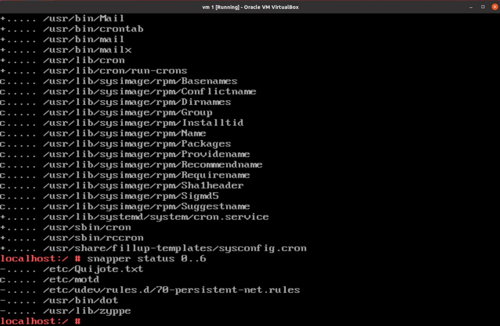
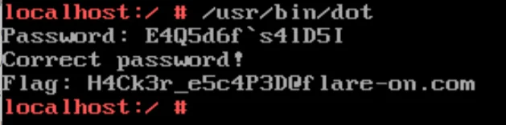

# Flare-On 8 - Flare VM

> Because of your superior performance throughout the FLARE-ON 8 Challenge, the FLARE team has invited you to their office to hand you a special prize! Ooh – a special prize from FLARE ? What could it be? You are led by a strong bald man with a strange sense of humor into a very nice conference room with very thick LED dimming glass. As you overhear him mumbling about a party and its shopping list you notice a sleek surveillance camera. The door locks shut!

> Excited, you are now waiting in a conference room with an old and odd looking computer on the table. The door is closed with a digital lock with a full keyboard on it
>
> Now you realise… The prize was a trap! They love escape rooms and have locked you up in the office to make you test out their latest and greatest escape room technology. The only way out is the door – but it locked and it appears you have to enter a special code to get out. You notice the glyph for U+2691 on it. You turn you attention to the Linux computer - it seems to have been infected by some sort of malware that has encrypted everything in the documents directory, including any potential clues.
>
> Escape the FLARE Linux VM to get the flag - hopefully it will be enough to find your way out.
>
> Hints:
> \- You can import "FLARE Linux VM.ovf" with both VMWare and VirtualBox.
> \- Log in as 'root' using the password 'flare'
> \- If you use VirtualBox and want to use ssh, you may need to enable port forwarding. The following link explains how to do it: <https://nsrc.org/workshops/2014/btnog/raw-attachment/wiki/Track2Agenda/ex-virtualbox-portforward-ssh.htm>

Apart from this lengthy description we do get our virtual machine. For booting it, I've used VirtualBox for importing the VM files. Upon running the machine we are presented with OpenSUSE linux.

We can login using the provided credentials. Inspecting the folder structure, we can see some files and, for the moment, the most interesting ones are those in the `~/Documents` folder.

In our `HOME` folder there are some dot files, but there's nothing readable in them (probably encrypted(?)). Inspecting `.bashrc` we can get the first clue about the password.

> alias FLARE="echo 'The 13th byte of the password is 0x35'"

Also in `.bash_profile` we can see something that might be interesting

> export NUMBER1=2
> export NUMBER2=3
> export NUMBER3=37

In the rest of the file structure, nothing really caught my attention, but `.snapshots` folder in the `/`.

Reading about snapshots feature in SUSE distro, we found out that it can be controller by the `snapper` tool ([[1]](https://en.opensuse.org/openSUSE:Snapper_Tutorial)).

Trying the commands, we can see that, there are multiple snapshots created.

We can get some information what files were changed between snapshots by issuing `snapper status id-1..id-2` and by running with snapshots `0` and `6` we can get some interesting results.

The `/etc/Quijote.txt`, `/usr/lib/zyppe` and `/usr/bin/dot` seems interesting. The first one is some text, which we don't know how to use (now) and the other two are ELF files, which we can load up in ghidra.

The `dot` one, expects a password
[code]
    std::operator<<((basic_ostream *)std::cout,"Password: ");
    std::operator>>((basic_istream *)std::cin,inp);

[/code]

calculates `SHA256` on it, and compares with a hash `b3c20caa9a1a82add9503e0eac43f741793d2031eb1c6e830274ed5ea36238bf`. We can also see appending `"@flare-on.com"` so it must be the binary, that will give us the flag, but we need a password.

Checking the other binary, we can see that it opens a `Documents` folder, gets all the files one by one and encrypts them, saving a new one with `.broken` extension. The `encrypt` itself is a `RC4` with hardcoded key.
[code]
    void encrypt(char *inp)
    {
      uint uVar1;
      int S [256];
      char key [52];
      int tmp2;
      int k;
      int l;
      int ii;
      int j;
      int jj;
      int i;
      int tmp;

      key._0_8_ = L'\x65732041';
      key._8_8_ = L'\x20736920';
      key._16_8_ = L'\x65676e6f';
      key._24_8_ = L'\x72636573';
      key._32_8_ = L'\x2065636e';
      key._40_8_ = L'\x20656e6f';
      key._48_4_ = L'\x74692073';
      for (i = 0; i < 0x100; i += 1) {
        S[i] = i;
      }
      ...

[/code]

Since, `RC4` is reversable with itself, we can use the binary to decrypt all the files in the `~/Documents` folder.

Doing that we can recover the original form of the files that were encrypted. Most of them are still not readable but `shopping_list.txt` and all the files starting with `u`. The `unagi` gives us: `The first byte of the password is 0x45`. The `udon_noddles.txt` `"ugali", "unagi" and "udon noodles" are delicious. What a coincidence that all of them start by "u"!` and `ugali.txt` \- `Ugali with Sausages or Spaghetti is tasty. It doesn’t matter if you rotate it left or right, it is still tasty! You should try to come up with a great recipe using CyberChef.`

The `shopping_list.txt`
[code]
    /
    [U]don noodles
    [S]trawberries
    [R]eese's
    /
    [B]anana chips
    [I]ce Cream
    [N]atillas
    /
    [D]onuts
    [O]melettes
    [T]acos

[/code]

And it points to the `/usr/bin/dot` binary that we have already found.

Looking at the rest they seems to be encrypted in some way. It seems that the files starting with the same letter were encrypted with the same algorithm. The message in `ugali` suggests that we should try CyberChef on the two files: `sausages.txt` and `spaghetti.txt`. If we do that on `sausages` we get `The 2st byte of the password is 0x34`. From `spaghetti` we get `In the FLARE language "spaghetti" is "c3BhZ2hldHRp".`. As we predicted, the files starting with the same letter are encrypted with the same algorithm so we can decode also the `strawberries.txt` (nothing interesting there).

In `raisins.txt` and `rasberries.txt` we can see strings ending with `=` so that could indicate `base64` encoding. Decoding them we get: `The 3rd byte of the password is.. it is a joke, we don't like raisins!` and `The 3rd byte of the password is: 0x51` and from the `reeses.txt` (following the principle that file with the same starting letter is using the same algo) we get `We LOVE "Reese's", they are great for everything! They are amazing in ice-cream and they even work as a key for XOR encoding.` and that gives as a hint for `ice-cream.txt`. Decoding that will give us a ingredient list, that cen be used to get the 5th char (from `instant_noodles.txt`): `The 5th byte of the password is: 0xMS` -> `0x64`. Continuing this scavenger hunt, we will reveal more characters of the password.

Most of the files, were in the similar manner (we will use `NUMBER`s found in `.bash_profile` and `Quijote.txt`.

A bit different were the o-files asking to follow some FLARE team people on twitter and extracting info from their conversation for the t-files which were using AES encryption.

Collecting all the clues found along the way, we have parts of the password E4Q5d__`s4lD5_. We are missing 3 characters.

I had trouble with getting the content from d-files, and correctly calculating 14th char which was ( `The 14th (and last byte) of the password is the sum of the number of participants from Spain, Singapore and Indonesia that finished the FLARE-ON 7, FLARE-ON 6 or FLARE-ON 5` \- the number I was getting was incorrect.

But if we remember, the `dot` binary, it was comparing our password with SHA256, and we have enough characters to brut force the rest which is what I did.
[code]
    import itertools
    import hashlib
    import string

    def calc_sha256(s):
    	return hashlib.sha256(s).hexdigest()

    letters = string.printable
    print('[+] start')
    for c in itertools.product(letters, repeat=3):
    	v = str.encode(''.join(c))
    	candidate = b'E4Q5d'+v[:2]+b'`s4lD5'+v[2:]
    	if calc_sha256(candidate) == 'b3c20caa9a1a82add9503e0eac43f741793d2031eb1c6e830274ed5ea36238bf':
    		print(f'candidate: {candidate}')
    		import sys
    		sys.exit(-1)

    print('done :(')

[/code]

Running the script, we can get the candidate: E4Q5d6f`s4lD5I. Passing this flag to the binary gives the flag

`H4Ck3r_e5c4p3D@flare-on.com`
