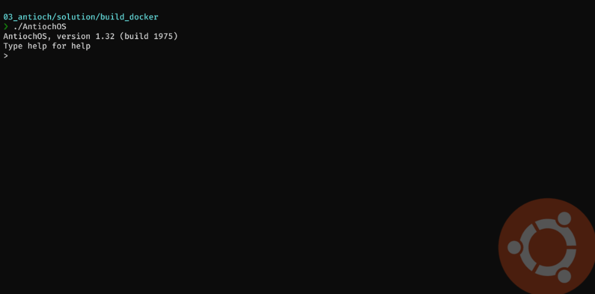
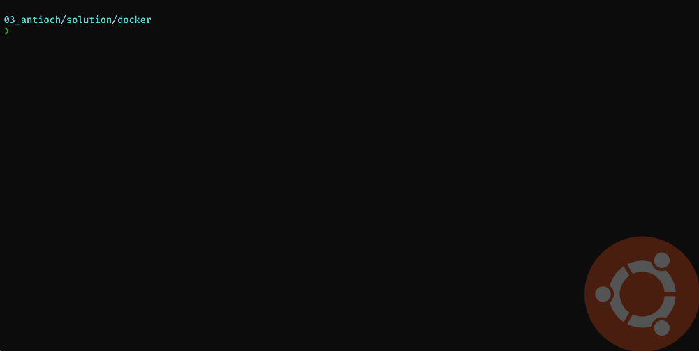

# Flare-On 8 - Antioch

> _To solve this challenge, you’ll need to …AAARGH_

This challenge was really AAARGH for me. In retrospect I wonder why I didn't see what I was supposed to see and due to that lost almost a week on this fairly easy challenge. But let's start from the beginning.

We are given a tar file, which contains, a lot of (possibly) randomly names folders, `a13ffcf46cf41480e7f15c7f3c6b862b799bbe61e7d5909150d8a43bd3b6c039.json`, `manifest.json` and `repositories` files. Each folder contains `json`, `layer.tar` and `VERSION`. Inspecting the files it become obvious that the whole `antioch.tar` is a docker archive which we can import.
[code]
    λ docker load --input chall\antioch.tar
    Loaded image: antioch:latest
[/code]

And then we can run it
[code]
    λ docker run -it antioch
    AntiochOS, version 1.32 (build 1975)
    Type help for help
    >
[/code]

typing help doesn't give us much and it looks like nothing much going on in the program. Let's get back to the tar archive. Inspecting the `layer.tar` in each folder reveals that they contain a pattern of files named with the lower letters from `a` to `z` (i.e. `a.dat`) but not all the files are in all the folders. One `layer.tar` was different, in the folder `7016b68f19aed3bb67ac4bf310defd3f7e0f7dd3ce544177c506d795f0b2acf3` there was a single file `AntiochOS` and it was an ELF. Time for Ghidra.

There's not that many methods and the `entry` is quite simple. It prints the header, reads the input and compares it with one of the 3 choices: `help`, `consult` or `approach`. Let's focus on the latter one. Going in the `approach`, we can see it prints the `approach the gorge`, ask for your name, calculated `crc32` of it, then check the table of valid `crc32` for names. If it doesn't find one, it prints `aaaargh`. If it does, asks for the quest and color. If the quest `crc32` matches the value for the quest associated with the name, it continues to operate. Otherwise, again we get an `aaaargh`.
[code]
      i = 0;
      new_line = 10;
      len = decode_approach_the_gorge();
      print(1,len,0x25);
      setuid(1);
      what_is_your_name(local_b8);
      print(1,local_b8,0x13);
      len = read_input(0,buf,0x80);
      decoded_name = crc32(buf,len);
      crc32val = 0xb59395a9;
      pos = &correct_vals;
      while (crc32val != decoded_name) {
        uVar2 = (int)i + 1;
        i = (ulong)uVar2;
        if (uVar2 == 0x1e) goto aaaargh;
        crc32val = *pos;
        pos = pos + 3;
      }
      what_is_your_quest(local_b8);
      print(1,local_b8,0x14);
      lVar3 = read_input(0,buf,0x80);
      if (1 < lVar3) {
        what_is_your_color(local_b8);
        print(1,local_b8,0x1d);
        len = read_input(0,buf,0x80);
        crc32val = crc32(buf,len);
        if (((&colors)[i * 3] == crc32val) && ('\x00' < *(char *)(&idx + i * 3))) {
          to_int((int)*(char *)(&idx + i * 3),buf);
          len = Right_off_you_go.();
          print(1,len,0x14);

[/code]

For the `consult` method, it prints the header (`consult the book of armaments!`), prepares the buffer, prepares the file name to be `a.dat` and opens the file. Next it reads the content and goes to the next file `b.dat`. This continues until we reach the end of the alphabet. Having that, there's a big buffer with `.` prepared and we use the data we read. The last steps are:

  * replace some characters in the buffer with characters like `\)(/|_`
  * print the resulting ascii art

So to get the flag, we need to: have the missing layers (those ones with files `a.dat` through `z.dat`) inside the docker, know the valid names and matching colors. Run everything and get the flag.

My initial approach was to bruteforce, the names and `crc32` to find valid ones and it kind worked. Colors were short and quite quickly appeared in the list. Names were difficult but soon enough got one and I could test the program.
[code]
    2021/03_antioch/solution via 🐍 v2.7.18
    ❯ python3 solve.py
    Color: Red - EF185643, idx: 13
    Color: Tan - 379549C9, idx: 21
    Color: Blue - 3F8468C8, idx: 1
    Color: Gold - EF3DE1E8, idx: 16
    Color: Gray - BAFA91E5, idx: 11
    Color: Mint - C9A060AA, idx: 4
    Color: Pink - 9C8A3D07, idx: 19
    Color: Teal - 67C1F585, idx: 29
    Name: Zoot - 3FC91ED3, idx: 21

[/code]

So the one matching pair would be `Zoot` and `Tan`, and as we seen from the code - the quest doesn't matter. Let's see this in action:

Checking the binary

Now we have some problems, we do not have the files from the other layers in the correct order and we don't know the order. The order could be give by the number with the message "Right. Off you go #8" but how to map that to layers?

That was my problem for a long time - too long. But there is a link, the names are in the `json` files. If we open one we can clearly see the name `Zoot` as an author.

> {"architecture":"amd64","author":"Zoot","config":{"AttachStderr":false,"AttachStdin":false,"AttachStdout":false,"Cmd":null,"Domainname":"","Entrypoint":null,"Env":["PATH=/usr/local/sbin:/usr/local/bin:/usr/sbin:/usr/bin:/sbin:/bin"],"Hostname":"","Image":"","Labels":null,"OnBuild":null,"OpenStdin":false,"StdinOnce":false,"Tty":false,"User":"","Volumes":null,"WorkingDir":""},"container_config":{"AttachStderr":false,"AttachStdin":false,"AttachStdout":false,"Cmd":["/bin/sh","-c","#(nop) ADD multi:6193592bdd67ab3993428a5b2167f66b47fdc0f62d83e0e0cbdb751d74642801 in / "],"Domainname":"","Entrypoint":null,"Env":["PATH=/usr/local/sbin:/usr/local/bin:/usr/sbin:/usr/bin:/sbin:/bin"],"Hostname":"","Image":"","Labels":null,"OnBuild":null,"OpenStdin":false,"StdinOnce":false,"Tty":false,"User":"","Volumes":null,"WorkingDir":""},"created":"1975-04-03T12:00:00.000000000Z","docker_version":"20.10.2","id":"b5f502d32c018d6b2ee6a61f30306f9b46dad823ba503eea5b403951209fd59b","os":"linux"}

so the layer, should be 8th. With that knowledge we could calculate the remaining `crc32` but also we don't need that. We only need to apply `dat` files on top of each other in correct order defined by the binary. The following script does that
[code]
    import binascii
    import string
    import itertools
    import json
    import os

    def crc32(inp):
    	return binascii.crc32(inp)

    names = ["Dragon of Angnor",
    "Roger the Shrubber",
    "Dinky",
    "Dennis the Peasant",
    "Sir Ector",
    "A Famous Historian",
    "Tim the Enchanter",
    "Sir Gawain",
    "Trojan Rabbit",
    "Sir Robin",
    "Green Knight",
    "Sir Bedevere",
    "Squire Concorde",
    "Sir Not-Appearing-in-this-Film",
    "Legendary Black Beast of Argh",
    "Sir Gallahad",
    "Lady of the Lake",
    "Zoot",
    "Miss Islington",
    "Chicken of Bristol",
    "Rabbit of Caerbannog",
    "Black Knight",
    "Prince Herbert",
    "Brother Maynard",
    "King Arthur",
    "Sir Bors",
    "Squire Patsy",
    "Bridge Keeper",
    "Inspector End Of Film",
    "Sir Lancelot"]

    valid_names =  [0xb59395a9, 0x5EFDD04B, 0xECED85D0, 0xD8549214, 0x2C2F024D, 0x18A5232, 0x72B88A33, 0x674404E2, 0x307A73B5, 0x13468704, 0x94F6471B, 0xEDA1CF75,
    				0xBBAC124D, 0xF707E4C3, 0xD702596F, 0x86A10848, 0xD640531C, 0x7B665DB3, 0xab1321cc, 0x4f6066d8, 0x256047ca, 0x3fc91ed3, 0xa424afe4, 0x550901da,
    				0x10a29e2d, 0x56cbc85f, 0x80dfe3a6, 0xe657d4e1, 0x2ba1e1d4, 0x7d33089b]

    nums = [14,18,2,29,12,13,20,11,28,21,5,24,25,7,10,1,19,3,4,17,9,8,27,16,22,15,30,23,26,6]

    for root,dirs,files in os.walk(".", topdown=False):
    	for f in files:
    		name = os.path.join(root,f)
    		if not 'json' in name:
    			continue

    		json_data = json.load(open(name,'rb'))
    		if "author" not in json_data:
    			continue

    		author = json_data["author"]
    		idx = valid_names.index(crc32(str.encode(author+'
')))
    		print(f'{author} - {nums[idx]}')
    		last_dir = os.path.basename(os.path.normpath(root))
    		print(f'renaming {root} to {root.replace(last_dir, str(nums[idx]))}')
    		os.rename(root, root.replace(last_dir, str(nums[idx])))

    import glob
    import shutil
    for i in range(1,31):
    	for file in glob.glob(f'./from_backup/{i}/*.dat'):
    		print(file)
    		shutil.copy(file, r'./docker')

[/code]

Running it, and having the extracted files from all the layers in separate folders (`1` \- `30`) will correctly apply them on top of each other. What is left is to run the binary providing one correct pair.

And we get flag: `Five-Is-Right-Out@flare-on.com`
