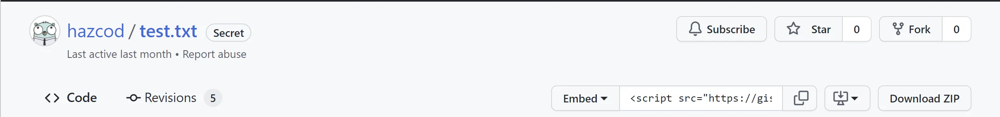
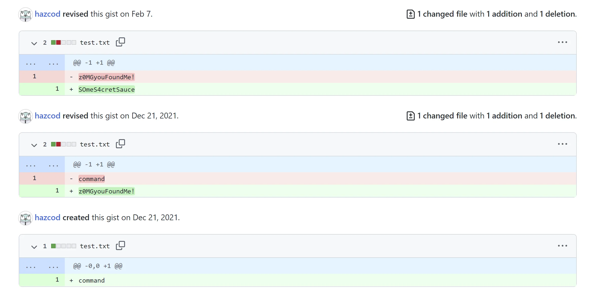

# Tinybit - 1337up CTF

> Just try a little bit harder! Brb, shouting `intigriti.rocks!`

> 🔗 Download link: [mw.linux](https://downloads.ctf.intigriti.io/1337UPLIVECTF2022-894ff411-aff8-453c-87b1-20ea939a7b6c/tinybits/2fdd9f50-0296-4caf-beaa-10826948f6d0/mw.linux)
> 🔗 Download link: [mw.darwin](https://downloads.ctf.intigriti.io/1337UPLIVECTF2022-894ff411-aff8-453c-87b1-20ea939a7b6c/tinybits/2fdd9f50-0296-4caf-beaa-10826948f6d0/mw.darwin)
> 🔗 Download link: [mw.windows](https://downloads.ctf.intigriti.io/1337UPLIVECTF2022-894ff411-aff8-453c-87b1-20ea939a7b6c/tinybits/2fdd9f50-0296-4caf-beaa-10826948f6d0/mw.windows)
> 🚩 No flag format. The flag starts with `z` and ends with `!`
> ✍️ Created by Hazcod

Note: The shouting part was only added in the middle of the CTF.

Three binaries, caused a bit of confusion for me. I was thinking I need to analyze all of them to get anything meaningful but in the end, only one was needed. I was missing something like 'choose you fighter'.

I was going to use `mw.windows` but it was `arm`, I've decided to go with `mw.linux`.

Before the analysis we can run it with `qemu`.

> $ qemu-aarch64 mw.linux
> What Intigriti out-of-scope domain do we shout every morning?

After loading the file into Ghidra we can continue our analysis. Analysis took a long time and after it finishes we are facing truth. This is a go binary.

Go binary are not the best to be reversed, fortunately for Ghidra with can run a [script](https://github.com/ghidraninja/ghidra_scripts/blob/master/golang_renamer.py) that can make our like a bit less tedious. Looking at the strings didn't revealed anything interesting. With that done, we can navigate ourselves to `main.main`.

It's still not super clear to look this binary but we can see some interesting calls `encoding/base64.(*Encoding).DecodeString();` and `main.DecryptMessage`.

The first one is used after the check wit a local variable with the value of `0` so we can assume that it checks the number or arguments. Let's check what is it decoding with base64

> "V2hhdCBJbnRpZ3JpdGkgb3V0LW9mLXNjb3BlIGRvbWFpbiBkbyB3ZSBzaG91dCBldmVyeSBtb3JuaW5nPw=="

> What Intigriti out-of-scope domain do we shout every morning?

So we know, where do we get the string and why it's not directly visible in strings. Let's analyze the binary further
[code]
    secret_str = s_6C7qzpkbNnQ6EmYQRcCoR6SgF1d0OlDy_0025ac50;
    local_118 = (dword **)&DAT_000000c0;
    main.DecryptMessage(0xc0,local_118._0_1_,(char)local_110,in_w3,in_w4);
[/code]

Digging into `DecryptMessage`. In it, there's one more call to `encoding/base64.(*Encoding).DecodeString();`, `crypto/aes.NewCipher()` and a `crypto/cipher.newCFB()`. And outside the `DecryptMessage` a call to `net/http.(*Client).Get();` and an another call to `main.DecryptMessage`.

Passing an argument to the binary, cases it not to print the message anymore but producing an 'invalid answer' response.

> $ qemu-aarch64 mw.linux aaaaa
> invalid answer

I was struggling to find and answer to the question that the binary is printing and was going with some domain names from their [twitter account](https://twitter.com/intigriti) like [blog.intigriti.com](blog.intigirty.com) or [ctf.intigriti.com](ctf.intigriti.com).

As I've mentioned in the beginning, the part about shouting in the description but with that information we can pass it to the binary and cause a change in the output. With that argument, we are getting `invalid response`, instead of `invalid answer`. Time to do some dynamic analysis.

Since, we are running via `qemu-aarch64` we can add a `-g port` part and run it with a debugger. On the other end we can use `gdb-multiarch` and use `target remote 127.0.0.1:port` and attach.

> qemu-aarch64 -g 1234 mw.linux intigriti.rocks!

> pwndbg> file mw.linux
> Reading symbols from mw.linux...(no debugging symbols found)...done.
> pwndbg> target remote 127.0.0.1:1234
> Remote debugging using 127.0.0.1:1234
> ERROR: Could not find ELF base!

Let's put a breakpoint after the first call to `DecryptMessage` function.
[code]
      001efc04 0b ff ff 97    bl            main.DecryptMessage
      001efc08 e0 1b 40 f9    ldr           x0,[sp, #local_110 ]
      001efc0c e1 1f 40 f9    ldr           cnt,[sp, #local_108 ]

[/code]

When the breakpoint is hit on the stack (which is displayed by default by pwndbg) we can see an interesting url.
[code]
    00:0000│ sp  0x14000047e30 —▸ 0x476b4 ◂— adrp   x0, #0x452000 /* '@ ' */
    01:0008│     0x14000047e38 —▸ 0x14000047eb8 ◂— 'intigriti.rocks!'
    02:0010│     0x14000047e40 ◂— 0x10
    03:0018│     0x14000047e48 ◂— 0x20 /* ' ' */
    04:0020│     0x14000047e50 —▸ 0x25ac50 ◂— subs   w22, w25, #0xdd0
    05:0028│     0x14000047e58 ◂— 0xc0
    06:0030│     0x14000047e60 —▸ 0x14000096100 ◂— 'https://gist.githubusercontent.com/hazcod/405b49acd8f8ae1fc26fbda695c4b427/raw/0ad8cb8549e611a4e43ae7c0711c5070866f1475/test.txt'
    07:0038│     0x14000047e68 ◂— 0x80

[/code]

Visiting it on the browser gives us the a single `command` word. This link is pointing to the raw content of the file hosted on the github's gist and we can delete the part from `raw` and get a regular view of the hosted file.

Opening revisions tab reviles the flag.

Flag visible in on of the revisions.
