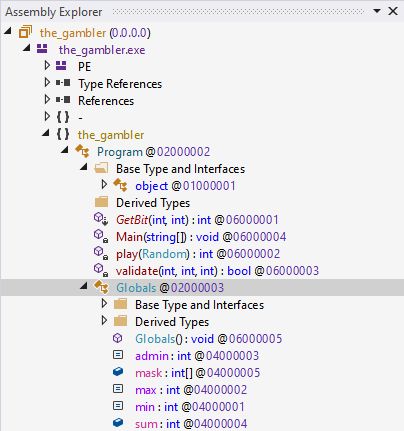
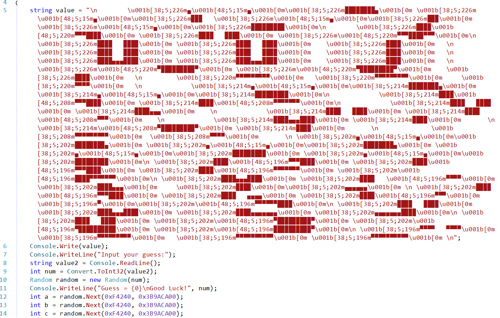
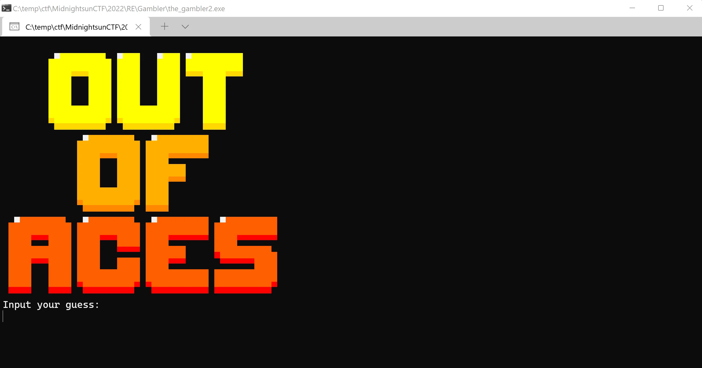
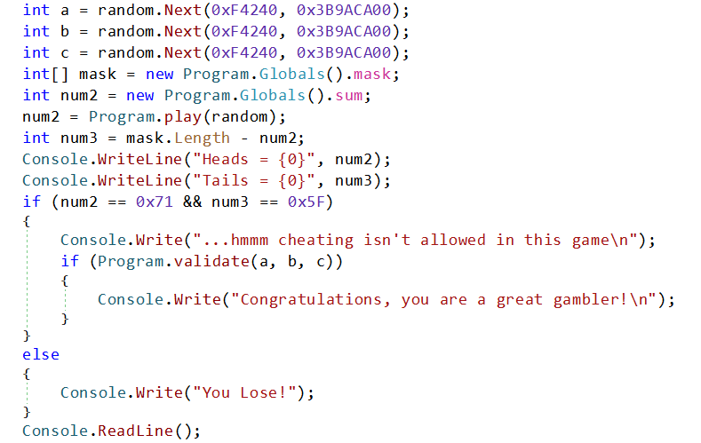
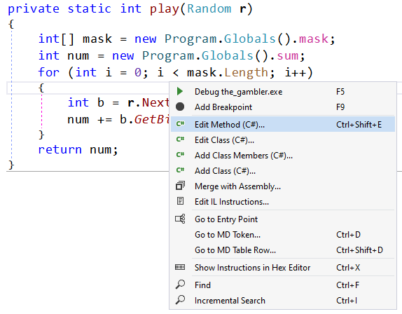
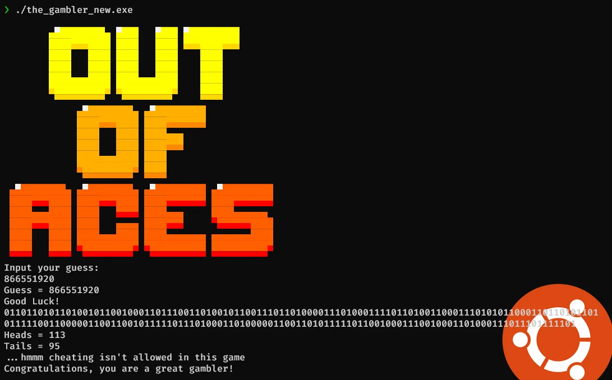

# The Gambler - Midnight Sun CTF 2022

> The secret is 'Knowin' what the cards were'.

Apart from the message we are give the file, with the instruction to run it with `mono the_gambler.exe`. This alone gives away the fact that, this is a .NET assembly and we can skip any initial analysis and go straight to dnSpy.

* * *

Upon loading we can see that we are dealing with very simple program, with one class `Program` and an extra one with some constants.

The Gambler loaded to dnSpy

As usually, we can start with `Main`.

Messy in code looks good on the console

There's a bit of mess at the beginning but right after that we can see a standard code asking for input, reading it and passing it to a `Random` class. After printing what our value was, there values `a`, `b` and `c` are being generated from the `random` class. We will get to them later but for now let's admire this beautiful logo for this challenge.

Continuing with the program, generated random is passed to `Program.play` (we will check that in a moment) an the result of this function is considered as numbers of heads in a coin toss.

To win, we need to get correct number of heads (`0x71`) and tails (`0x5f`) if we pass that check we get to know that we are cheating, but if we can go pass `Program.validate` with values of `a`, `b` and `c` we will be a great gambler.

Before digging into `play` lets check `validate`.
[code]
    private static bool validate(int a, int b, int c)
    {
        if (c != 0x3A03FDFB)
        {
            return false;
        }
        if (b + 0x43243246 != 0x524F4F54)
        {
            return false;
        }
        int num = a >> 0x18 & 0xFF;
        int num2 = a >> 0x10 & 0xFF;
        int num3 = a >> 8 & 0xFF;
        int num4 = a >> 0 & 0xFF;
        return (num & 0xE5) == 0x25 && (num & 3) == 3 && (num & 0xBF) == 0x2F &&
               (num2 & 0xD0) == 0x40 && (num2 & 0xC9) == 0x48 && (num2 & 0x2D) ==
               0xC && (num2 & 0x93) == 2 && num3 == 0x14 && (num4 & 0xA5) == 0x20 &&
               (num4 & 0x92) == 0x10 && (num4 & 0xED) == 0x68;
    }

[/code]

The method is fairly simple, and a slight problem might be only with finding out the value of `a`. Each condition gives us few bits of the overall byte and after getting those we can construct the whole byte and from those - the value. The final one would be `0x2f4e1478`. For `b` and `c` that would be `0x0F2B1D0E` & `0x3A03FDFB`.

Let's get back to `play`. It's also fairly simple
[code]
    private static int play(Random r)
    {
    	int[] mask = new Program.Globals().mask;
    	int num = new Program.Globals().sum;
    	for (int i = 0; i < mask.Length; i++)
    	{
    		int b = r.Next(0xF4240, 0x3B9ACA00);
    		num += b.GetBit(mask[i]);
    	}
    	return num;
    }

[/code]

The passed random is used to pick a value, and based on that we calculate how many heads or tails we get.

The whole program is based on random and it is based on our input. So if we get the correct value of `seed` we should pass all the checks and get the flag, right? But where's the flag...

Initial analysis suggests there's no flag in the binary. There's no additional code after the final print that could give us the flag. Nothing is being accessed in the binary. So where is it?

One idea was, that the flag is encoded as `1`s and `0`s that indicate heads and tails of the throws. But the binary never stores that value. We would need to update it ot retrieve the bits. But first the `seed`.

This is where those `a`, `b` and `c` values come into play. They are first 3 values generated by our random class with the correct seed. So we can use those to check if the seed was correct or not.

A simple program that brutes all possible seed could be like this
[code]
    public static void Main()
    {
        var sequence = new int[3] { 0x2f4e1478, 0x0F2B1D0E, 0x3A03FDFB };

        Console.WriteLine("Found seed: {0}", FindSeed(sequence));
        Console.ReadLine();
    }

    public static int FindSeed(int[] sequence)
    {
        var seed = 0;

        bool invalid = true;
        while (invalid && seed >= 0)
        {
            var rnd = new Random(seed++);

            invalid = false;
            for (int i = 0; i < sequence.Length; i++)
            {
                if (sequence[i] != rnd.Next(0xF4240, 0x3B9ACA00))
                {
                    invalid = true;
                    break;
                }
            }
        }

        return seed;
    }

[/code]

It's not the fastest way, but after some time, we can find the correct value being `866551920`.

Now we only need to modify the play method. Fortunately dnSpy allows to modify code directly from the tool.

We will add an extra variable that will store all the bits and at the end of the method, print it to the console. We could write the code to convert form binary to ascii, but for simplicity that we will deal later.
[code]
    private static int play(Random r)
    {
    	int[] mask = new Program.Globals().mask;
    	int num = new Program.Globals().sum;
    	string flag = "";
    	for (int i = 0; i < mask.Length; i++)
    	{
    		int b = r.Next(0xF4240, 0x3B9ACA00);
    		num += b.GetBit(mask[i]);
    		flag += b.GetBit(mask[i]);
    	}
    	Console.WriteLine(flag);
    	return num;
    }

[/code]

With such change we have to remember to save the binary. Running now will print the bits of the flag.

> echo 0110110101101001011001000110111001101001011001110110100001110100011110110100110001110101011000110110101101011111001100000110011001011111011101000110100000110011010111110110010001110010001101000111011101111101 | perl -lpe '$_=pack"B*",$_ '
> midnight{Luck_0f_th3_dr4w}
