# Flare-on 2022 - in a tweet + images

Flare-on is a yearly competition that focuses on reverse engineering. In 2022 we could compete in the 9th edition solving 11 challenges. Here's a really, really short version how we could approach and solve them.

## 01 - Flaredle

Wordle + 21 letters words? JS Wordle app and the flag is among the allowed entries.
Use `RegEx` to find matching words, grep for `flare` to win or check the code to find the winning entry...

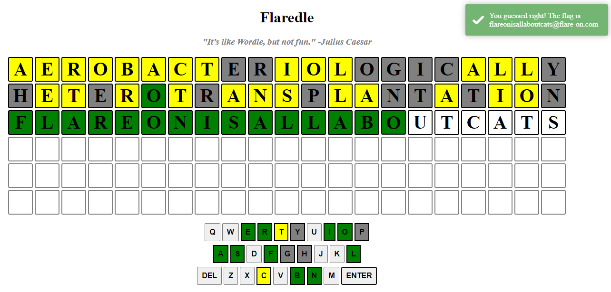

## 02 - Pixel Poker

Decompile the binary and find an interesting function (`0x4012c0` \- WinProc).

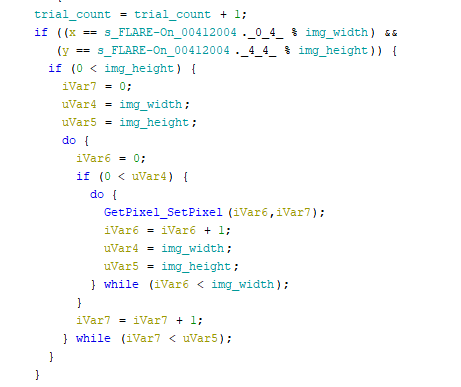hecking the right pixel to be clicked

`X = int(FLAR) % 741, Y = int(E-On) % 641`

Correct point: (95,313). Click that pixel to get the flag. #flareon9

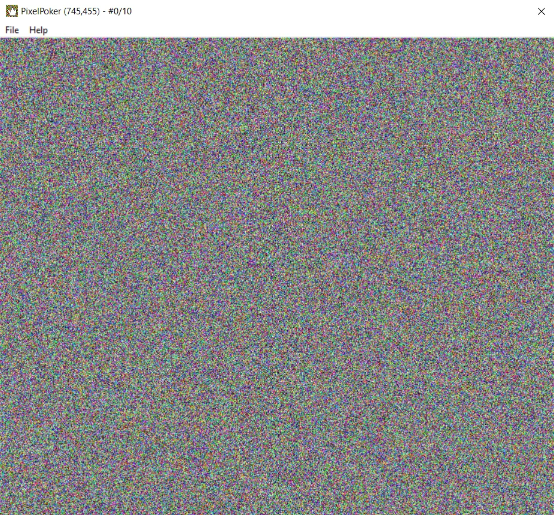

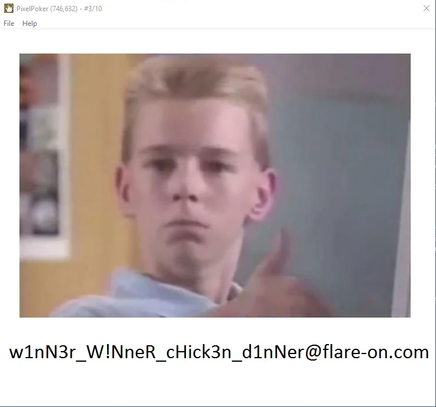

## 03 - Magic 8 Ball

Shake in the following order "LLURULDUL" (`FUN_004024e0`) and type 'gimme flag pls?' (`FUN_00401e50`). Get the flag.

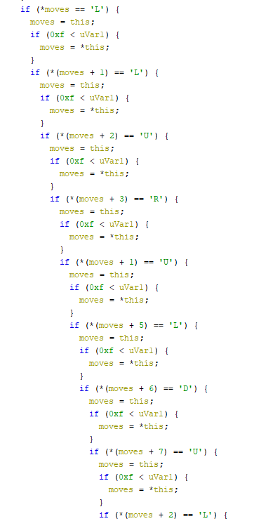Checking the moves...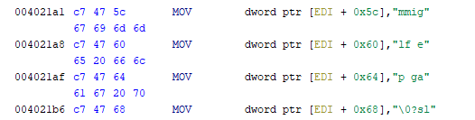gimme flag pls? sure thing...

## 04 - darn_mice

Locate interesting values inside `FUN_401000`. That input and your input is added byte by byte to produce valid code and executed.

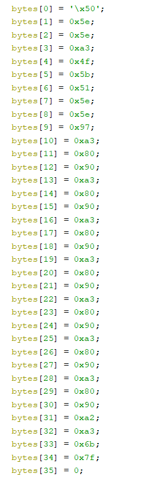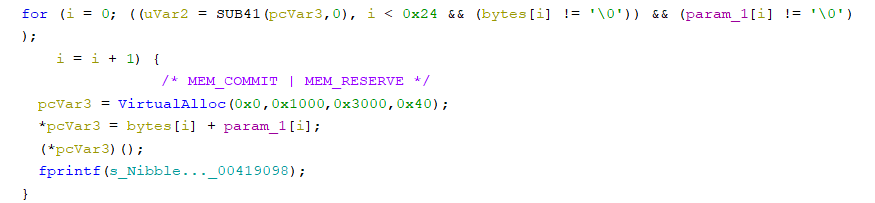

Try the simplest code there is to get correctly executed and return -> `ret (0xC3)`,
get the valid input -> "see three, C3 C3 C3 C3 C3 C3 C3! XD".

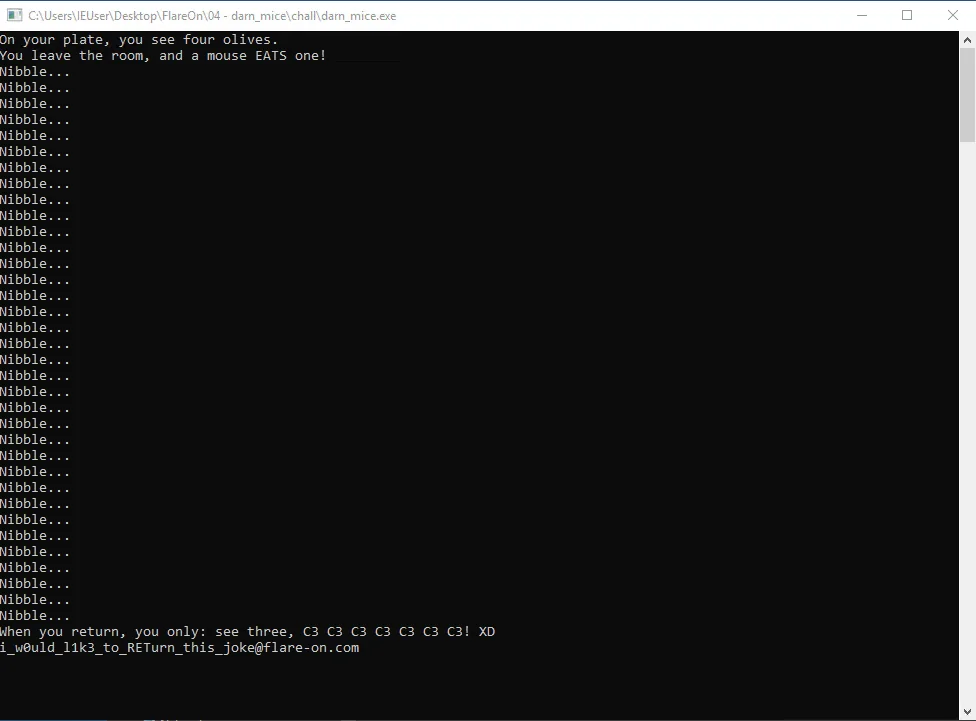

Use it and get the flag.

## 05 - T8

C++ binary with vtables? No problem. We are also given PCAP file where we can see requests being made.

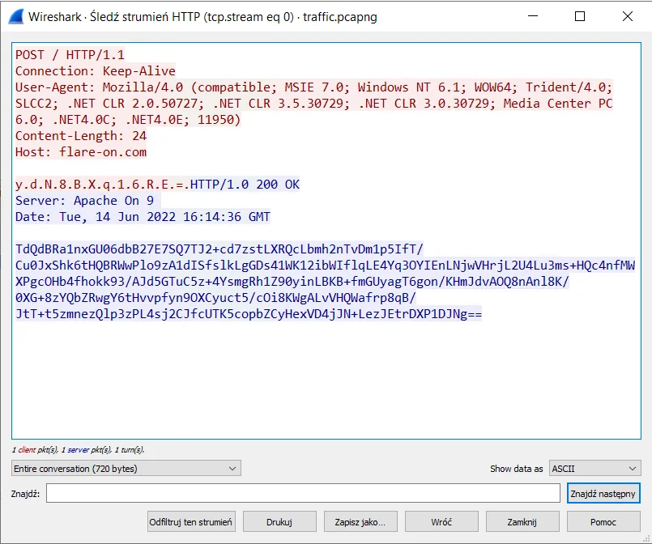

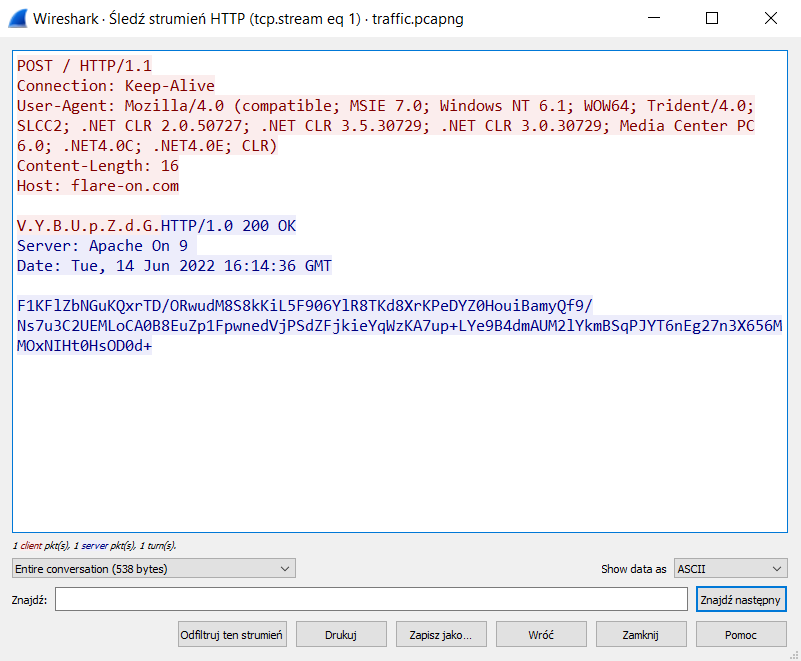

Requests with payloads and correct replys

Patch the `Sleep`, function that makes the request is `FUN_403D70`.

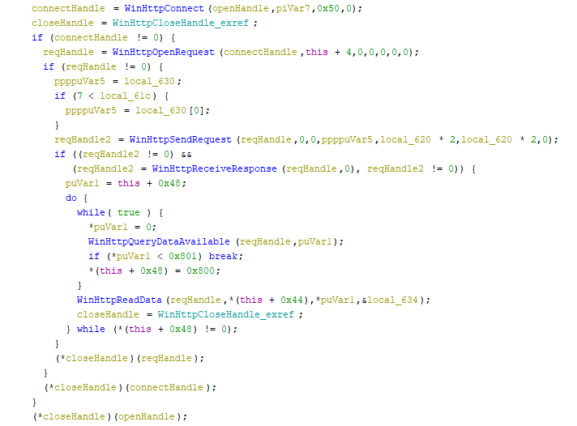

The first data is F09 with a number, is hashed with `MD5` and used as a key for `RC4` to encrypt `ahoy`. And since we know the correct output from PCAP we can find the correct number by checking full range (`110950` \- `0x2eae`).

We can write our server that replay the answers from the PCAP file and follow the code and following the code.

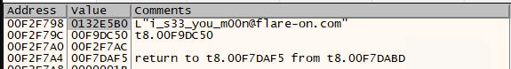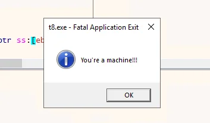Are you?

## 06 - à la mode

Is it .NET binary? Is it native? How about both! Opening in dnSpy shows some code, but Ghidra looks also interesting. It decodes string, finds functions and use them to connect to pipe in a new thread.
Write native binary that load the dll, follow the code and at `FUN_10001000`

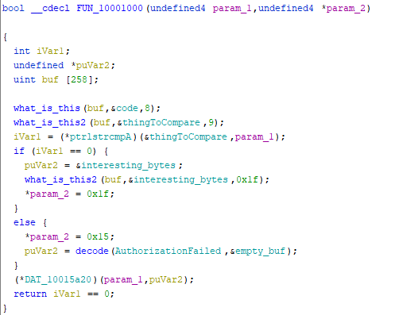

decrypts the phrase "MyV0ice!" and later at `FUN_10001187` decrypts the flag.

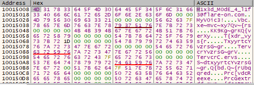Flag in the memory...

## 07 - anode

Modified Node.JS binary that runs the embedded script. Script can be extracted from the process memory.
It has obfuscated flow and heavy use of calls to Random. Binary has fixed random values and modified boolean logic. The place where
SEED for random is set inside `FUN_140832ee0`, dump the results for if's (couldn't find where that change is done in code).

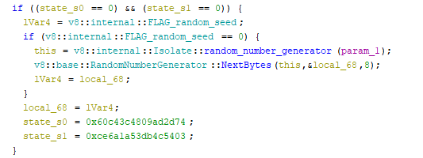

Follow control flow and generate operations via python script, reverse, execute them -> flag

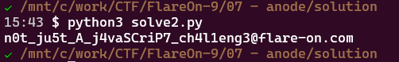

## 08 - backdoor

Heavily obfuscated .NET binary. dnSpy can't decompile certain methods.
Deobfuscate binary with use of the code from the binary, Mono.Cecil and extract Flared_XX methods.

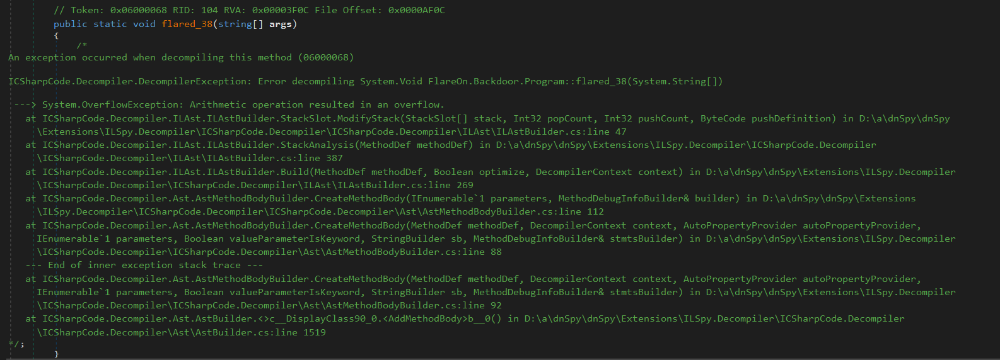

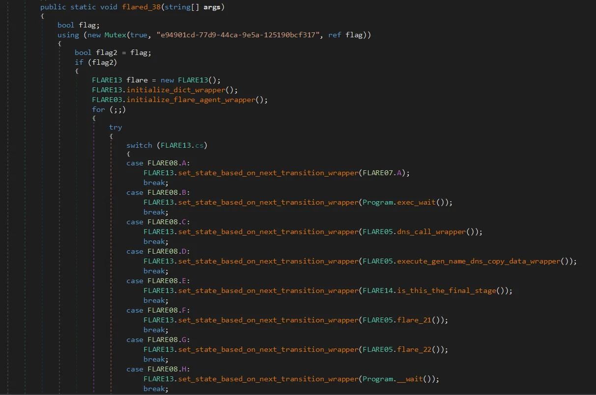

Flared_38 - before and after

Understand that binary gets commands via DNS name resolution. Cook your own DNS server and feed data in correct order. Decrypts the image with the flag from one of the sections in the binary.

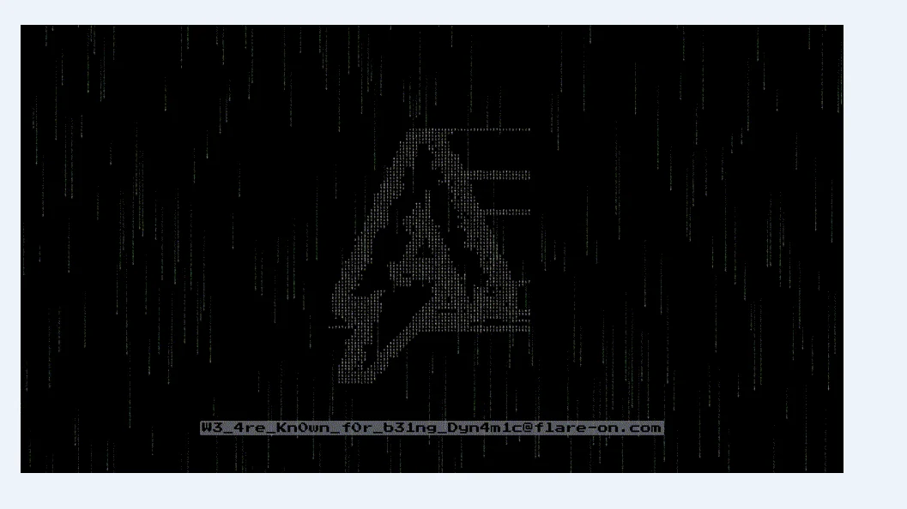

## 09 - encryptor

ChaCha20 + RSA with `e = 65537^-1 mod ϕ(n)`. n & c - given. Since we encrypt with `65537^-1`, our `d` is `65537`. It was so obvious yet hidden in plain sight.
Decrypt RSA and get the key and nonce for ChaCha20, decrypt ChaCha20, grab the flag.

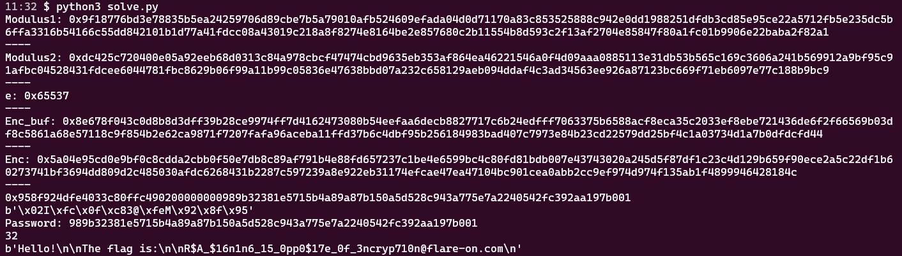

## 10 - Nur geträumt

Setup the tooling.

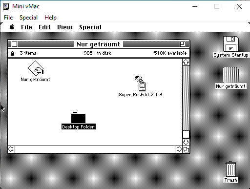

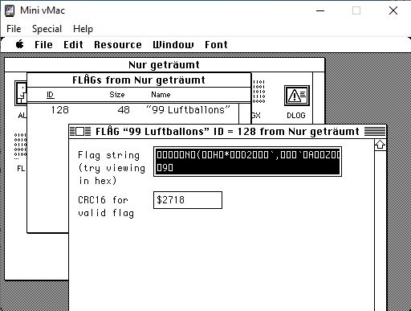

Use pre-installed tools to find resource with the flag also the `decodeFlag` function (`FUN_000E964C`).

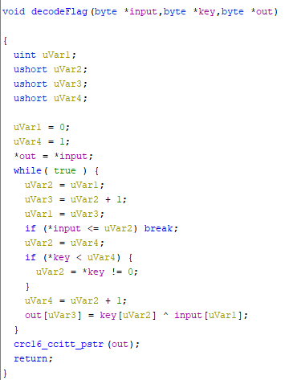

Use known part of the flag `@flare-on.com` to find part of the key.
Know all Nena songs and find the rest of the key. Spent 15 minutes wondering about umlaut. Find the message in the resources to drop it.

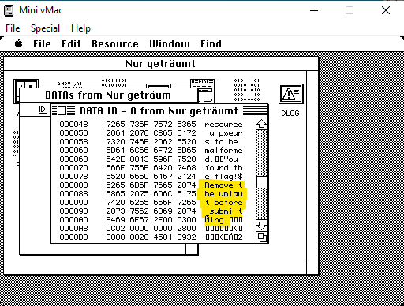The important piece of information

Solve the challenge.

## 11 - The challenge that shall not be named.

Extract files from exe using `pyinstextractor`(<https://github.com/extremecoders-re/pyinstxtractor>) -> `uncompyle6` \- stumble on `pyarmor`. Nothing seems to work.
Binary quickly closes when run so can't really play with it. Run wireshark - see the evil domain.

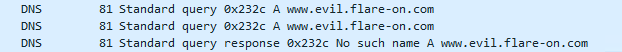

Set it up with DNS from chall 8. Now the binary works for a bit longer. Inject python with `pyinjector`(<https://github.com/call-042PE/PyInjector>). Dump the `_pyi_main_co`

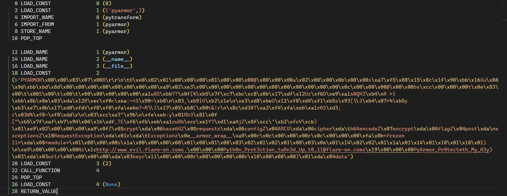

## Summary

8th the hardest, as there was a lot of code to process. 11 was a bit of a bummer. 10 was fun but the most difficult part was to setup the tooling ;). Need more crypto knowledge as it took me way too much time on 9th.

See you next year.
