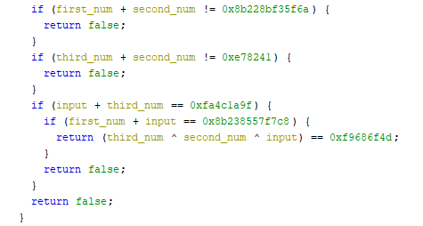

# SECCON 2022 - eguite

We are give an ELF and EXE file (the same challenge - you can pick your enemy) with the simple task to crack it license.

Not sure if it's on purpose (or due to using sandbox/VM) but running it fails so we can't get any more information from running it.

We can load it into Ghidra and start our analysis. By checking the `main`, we can learn that it uses `eframe`. Any by searching for it, we can find out that's a Rust's package for GUI (desktop) applications.

We can find the interesting function going from `Successfully validated!` string to xref and then into the `click` handler.

First the function checks if our input starts with `SECCON{` and if it's 42 characters long. If we pass that we can proceed with more thorough validation.

SECCON{ has to be at the beginning and we need 42 characters...

The next part is a bit fuzzy how it looks, but we can see the following section a couple of times

so we can assume that some sections in the flag are connected with the char `-` between them. It will be clear after the next part.

And next, our input is split into parts with the following calls

Slicing the string into subsections...

In the above excerpt, we start from character 7 taking 12 characters and we after that it's being parsed as a number in base-16. We store it in `first_num` variable.

We do similar starting from character 20 and taking 6 -> `second_num`, starting from 27 and taking 6 -> `third_num` and fopr the last group from 34th character spanning for 8 characters -> `fourth_num`.

Having those values we need to make sure that they fulfill the following relation between them

We can employ `z3` here to find us the correct numbers:
[code]
    from z3 import *
    s = Solver()
    first_num = BitVec('first_num', 64)
    second_num = BitVec('second_num', 64)
    third_num = BitVec('third_num', 64)
    fourth_num = BitVec('fourth_num', 64)

    s.add(first_num + second_num == 0x8b228bf35f6a)
    s.add(third_num + second_num == 0xe78241)
    s.add(fourth_num + third_num == 0xfa4c1a9f)
    s.add(first_num + fourth_num == 0x8b238557f7c8)
    s.add(third_num ^ second_num ^ fourth_num == 0xf9686f4d)
    s.check()
    print(s.model())

[/code]

and they will be quickly obtained as
[code]
    [second_num = 5929746,
     fourth_num = 4190049136,
     third_num = 9242415,
     first_num = 152980487201880]

[/code]

Converting them to hex, and putting `-` between them gives us the flag `SECCON{8b228b98e458-5a7b12-8d072f-f9bf1370}`.
