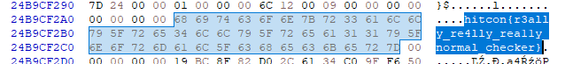

# HITCON 2022 - Checker

> just a deep and normal checker

We have two files in this task: a Windows executable named `checker.exe` and a .sys file—a driver file named `checker_drv.sys`.

Loading the first one into Ghidra, does not show much code that we can work with. There's a line that opens the file `_driver = CreateFileW(L"\\.\hitcon_checker",0xc0000000,0,0x0,3,4,0x0);` and sends the `IOCTL` `DeviceIoControl(_driver,0x222080,0x0,0,result,1,&local_14,0x0);`. We need to check the driver that will receive this command.

Driver has much more interesting code. From the function at `0x1400011b0` we can see that more commands are supported. From `0x222000` to `0x222080` in increase of `0x10`. Each calls the same function with a different value and sets some flags to `1`.

The method that is being called, does some `magic` on the bytes in the driver's memory where some driver's code was located as well as an encrypted flag object.

The call that we saw in the exe, with an id of `0x222080` is also interesting. It's different from the other ones. It checks the `flags` set by the other functions and returns `0` if the first byte in specific memory location starts with `hitcon`. This is undoubtedly our flag checker.
[code]
    if (uVar2 != 0) {
      valid = true;
      i = 0;
      do {
        if (flags[i] == 0) {
          valid = false;
          break;
        }
        i = i + 1;
      } while (i < 8);
      if (valid) {
        ok = _flag + -0x63746968;
        if (ok == 0) {
          ok = _flag_4 - 0x6e6f;
        }
        **(param_2 + 0x18) = ok == 0;
        break;
      }
    }

[/code]

At the time, it wasn't clear what needed to be done, but the team decided to give it a shot and just run those other functions from the driver.

Simple C++ code was written. Driver signing had been disabled, and the driver had been loaded. Then we could execute our code, and it resulted in... a crash. The VM has crashed because the code execution in the kernel failed.

After a few more looks into the driver and thinking about how this could work, we've figured out that we need to call those methods in the right order and then, after that, call `0x222080` and if we get `true` in return, we've found the flag.

I've taken a manual approach in this part. Assuming there's only one valid order of chunks, we would need to check only around 30. Not a small number, but also not something that cannot be completed in a reasonable amount of time.

So in this part, see doing the following: Load the driver, run the application with the next IOCTL ID, and if it crash, rinse and repeat. If not, note down the message and move on to the next level.

Doing those checks in the VM, I've managed to reconstruct the order to be: `72601435`. Complete program:
[code]
    #include <stdio.h>
    #include <Windows.h>

    int main(int argc, char** argv)
    {
    	char local18[4] = { 0 };
    	DWORD local14;
    	HANDLE _driver = CreateFileW(L"\\\\.\\hitcon_checker", 0xc0000000, 0, 0x0, 3, 4, 0x0);
    	if (_driver == INVALID_HANDLE_VALUE) {
    		printf("Failed...");
    		return -1;
    	}
    	bool ok = DeviceIoControl(_driver, 0x222070, 0x0, 0, 0x0, 0, &local14, 0x0);
    	printf("%d %x %d
", ok, GetLastError(), local18[0]);
    	// Second: 2
    	ok = DeviceIoControl(_driver, 0x222020, 0x0, 0, 0x0, 0, &local14, 0x0);
    	printf("%d %x %d
", ok, GetLastError(), local18[0]);
    	// Third: 6
    	ok = DeviceIoControl(_driver, 0x222060, 0x0, 0, 0x0, 0, &local14, 0x0);
    	printf("%d %x %d
", ok, GetLastError(), local18[0]);
    	// Fourth: 0
    	ok = DeviceIoControl(_driver, 0x222000, 0x0, 0, 0x0, 0, &local14, 0x0);
    	printf("%d %x %d
", ok, GetLastError(), local18[0]);
    	// Fifth: 1
    	ok = DeviceIoControl(_driver, 0x222010, 0x0, 0, 0x0, 0, &local14, 0x0);
    	printf("%d %x %d
", ok, GetLastError(), local18[0]);
    	// Sixth: 4
    	ok = DeviceIoControl(_driver, 0x222040, 0x0, 0, 0x0, 0, &local14, 0x0);
    	printf("%d %x %d
", ok, GetLastError(), local18[0]);
    	// Seventh: 3
    	ok = DeviceIoControl(_driver, 0x222030, 0x0, 0, 0x0, 0, &local14, 0x0);
    	printf("%d %x %d
", ok, GetLastError(), local18[0]);
    	// Eight: 5
    	ok = DeviceIoControl(_driver, 0x222050, 0x0, 0, 0x0, 0, &local14, 0x0);
    	printf("%d %x %d
", ok, GetLastError(), local18[0]);

    	ok = DeviceIoControl(_driver, 0x222080, 0x0, 0, local18, 1, &local14, 0x0);

    	printf("%d %x %d
", ok, GetLastError(), local18[0]);
    	system("pause");

    	return 0;
    }

[/code]

The final program is that the flag, is never returned by the driver. It sits in the memory. Since we are running in the VM, we could dump the VMs memory and search for `hitcon`. This is (more or less what I did) and the flag was there:

Flag in the dump
