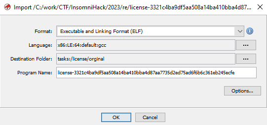

# Insomni'Hack Teaser 2023

This weekend, Insomni'hack 2023 teaser took place. During the contest, I solved the two RE challenges.

## rev1

The challenge was, an iOS application written in Swift. The .ipa file is in fact a zip archive which we can unpack and get access to the actual binary plus some extra metadata information. Let's focus on the binary and start by loading it into Ghidra

Initial analysis of functions and strings, did not reveal anything obvious, but we could see (filtering by "INS") a string "Insert password:". At least that's one hook point.

Navigating to it, did not show any XREF's, but next to it, were more interesting strings: "Password is empty" and "Entered password: ". The first one, had XREF from what it appeared to be UI control structure.

UI Control structure?

Following XREF, we can get to a function, that appears to be creating our control (`FUN_100007328`) but still, it's not giving us any clue of where the flag could be.

At this moment, I've taken a step back, and checked binary's functions. `FUN_100006938` & `FUN_100005b00` stood out as the biggest one and, without better idea - started to look at those.

The initial look at the first one, was already promising. It was big & complex, but some characteristic values stood out almost immediately.

Similar pattern was repeated

Those values were for sure ASCII, and what's more, `0x53` is `S` which could be the last char of the flag prefix. A couple more checks confirmed that initial characters do in fact give `INS{`. Time to get the flag.

As mentioned, the method was long and complex, and it could work with automating the extraction process but I took the laziest approach possible. Manual one.

Copied the decompiled source code from Ghidra and started to remove unneeded lines. What was left was the characters, but I needed to construct the flag from that as some characters were used in multiple places.

'A' is uses in 4 different spots in the final flag

Again, lazy approach won.
[code]
    flag = {
        0x0: 'I', 0x1: 'N', 0x15: 'N', 2: 'S', 3: '{', 4: 'A',
        9: 'A', 0xc: 'A', 0x33: 'A', 5: 'u', 6: 'T', 0x12: 'T',
        0x1f: 'T', 7: '0', 8: 'M', 10: 't', 0xf: 't', 0x26: 't',
        0xb: 'E', 0x21: 'E', 0x2e: 'E', 0xd: 'L', 0xe: 'L', 0x1a: 'L',
        0x10: 'h', 0x13: 'h', 0x11: '3', 0x24:'3', 0x25:'3', 0x29:'3',
        0x2b:'3', 0x14: '1', 0x1b: '1', 0x16: chr(0x47), 0x17: chr(0x47),
        0x18: 'Z', 0x19: '_', 0x1e:'_', 0x22:'_', 0x27:'_', 0x30:'_',
        0x1c: 'k', 0x1d: chr(0x33), 0x20: 'H', 0x23: 'l', 0x28: 'R',
        0x2f: 'R', 0x2a: 'V', 0x2c: 'r', 0x34: 'r', 0x2d: 'S',
        0x31: chr(0x55), 0x32: chr(0x5f), 0x35: chr(0x65),
        0x36: '}'
    }
    s = ''
    for i in range(0x37):
        s += flag[i]
    print(s)

[/code]

This will give the flag: `INS{AuT0MAtEALLth3Th1NGGZ_L1k3_THE_l33t_R3V3rSER_U_Are}`.

Without the automation, but we get the flag anyway.

## License

This was an 64-bit ELF binary, written in C++.

We could easily navigate to the `main` method, where we could immediately see some interesting strings: "Enter license", "You can activate your license with the following code: ".

Casually checking the functions in `main` we can spot, what appears to be a hash (and many more later)
[code]
      FUN_00107234(local_88,local_68);
      cVar1 = FUN_001078ac(local_88,"7951276d108732f685ad39766351430a193de32d");

[/code]

`FUN_00107234` is a probably a function calculating the hash and by going inside (few levels) we can spot SHA-1 initial values

SHA-1 initial values

Having enough initial recon of the binary, let's focus back to the `main` function.

We can spot, a check for `:` inside the input. Since this is challenge is called `License` and very often this is the case for those, let's focus on that part of the branch.

The first things done, are some copy operations. The original input is split into two: part before the ':', and after. Later we have a call to `FUN_00106a3c` (passing both, before- and after-colon value) followed by another call to `FUN_00106ac0` and yet another check of the latter call result.

The first, function is small, but it does fill a structure, passed in the first argument, with three function pointers and our inputs. That looks really, really interesting.

The first one of those function (`FUN_00104f54`) has some ASCII strings and a xor operation (one level lower) - an obvious candidate for further inspection.

ASCII and a xor (inside `FUN_00103559`) are obvious candidates

The second one (`FUN_00105052`) has also very distinct patter of operations that are common in RE challenges.

Bunch of logical operators based on different characters of an array - big 🚩

The last one, is bigger and more complex, but 16 SHA-1 hashes being used within also put it this function on our radar.

Hashes, hashes...everywhere

Now, let's get back to the second function - `FUN_00106ac0` that takes our interesting structure (with function pointers and inputs) as an input.

The main part of this function is to take, the part before `:`, calculate SHA-1 and compare with `7951276d108732f685ad39766351430a193de32d`

Logic is obvious when code was annotated

How we can get that hash?

Assuming, we don't need to find some SHA-1 collisions, we can assume input could be short, so we can check all, or know and we could use rainbow tables. Since, we don't need to code anything for the first approach - we start with that. Using (probably) anyone available would give us the input - `anakin`.

So, if the first part of our license would be `anakin:` we would pass those checks, and we could end up in the part, where another check is done.

More C++ code, more fun.

The `check2` function gets more complex, but we can see at least the parts of the logic.

First, the `after` part is cat in three, 15-chars long parts.

And each of the inputs, are passed to each of the function pointers, spawn in a new thread - just for fun, with some anti-debugging methods. But we don't need to debug - we've got all we need.

The first 15-char long part of the input shall be equal to the `xor` result from function 1. The second, 15-char long part of the input, shall satisfy the "complex" logical expression from function 2. The last 15-char long part of the input, shall satisfy the hashes.

Starting from part 1:
[code]
    ''.join([chr(x ^ y) for x,y in zip(b'rev_insomnihack',b";+%$/\x1c@\\2,]\x0b*'[")])

[/code]

= `INS{Fr33_B4cKD0`

For the second part, z3 will help us:
[code]
    import z3

    input = [z3.BitVec('a'+str(i), 32) for i in range(15)]

    s = z3.Solver()

    s.add(input[7] - input[8] == -2)
    s.add(input[10] + input[0] + input[8] == 0x108)
    s.add(input[5] == input[4] + input[0xd] + -0x59)
    s.add(input[0xc] == ord('_'))
    s.add(input[0xc] - input[0] == 0x2f)
    s.add(input[4] == input[1] + -0x13)
    s.add((input[0xe] - input[0xd]) - input[2] == -0x1c)
    s.add(input[8] + input[7] + input[0] == 0xf8)
    s.add(input[0] + (input[8] - input[0xb]) == 0x30)
    s.add(input[3] - input[0xe] == -0xb)
    s.add((input[6] + input[0xc]) - input[8] == 99)
    s.add(input[9] - input[4] == 0xf)
    s.add((input[0xc] - input[0]) + input[6] == input[1] + 0x26)
    s.add(input[2] == (input[9] + 0x36) - input[4])
    s.add(input[2] == input[9] + -0x29)
    s.add(input[5] + input[0] + input[0] + input[9] == input[10] + 0xa7)

    s.check()
    m = s.model()
    print(''.join([chr(m[c].as_long()) for c in input]))

[/code]

= `0rEd_License_Fo`

Lastly, part 3:
[code]
    import hashlib
    import itertools
    import string

    hasesh = ['a948b24c8ba4ae4f14b529b599601fd53a155994',
    'a048299abe57311eacc14f1f3b4cdbfaf481f688',
    'dfbf2d46353217af0a8a9031f974e9e29a4bfc56',
    '25321fea120a49aca98d9ebc835cc5247b1ffed3',
    '908da3be8224819759a1397a309fc581fd806a0a',
    '728e22de533a58061655153156913c2d85c274d8',
    '31c39beef6fa5a85ea07f89cfec704d947fcca48',
    '7b52c1a1d67b94c7b4ad50b7227a8e67b66ed9e3',
    '4a5e95179649555542ce2bc16b8c93ad84928afa',
    'c1e2c5e19ad30a96baad6e2bb388923b430ad2cc',
    '4b3e25f59ed48b0c3330f0c3dbf740681c2c5010',
    'e54a31693bcb9bf00ca2a26e0801404d14e68ddd',
    '9c1e321a441214916556ad0cafa8953d786cb751',
    '06576556d1ad802f247cad11ae748be47b70cd9c',
    'b03da51041b519b7c12da6cc968bf1bc26de307c']

    s = ''
    alphabeth = string.printable
    for i in range(15):
        for c in alphabeth:
            temp = s + c
            m = hashlib.sha1()
            m.update(temp.encode('ascii'))
            digest = m.hexdigest()
            if digest in hasesh:
                s = temp
                print(f'Decoded: {s} at {hasesh.index(digest)}')
                break

[/code]

= `R_3vEry0ne_FFS}`

Full license info `anakin:INS{Fr33_B4cKD00rEd_License_FoR_3vEry0ne_FFS}`

And the flag is the part after `:`.
